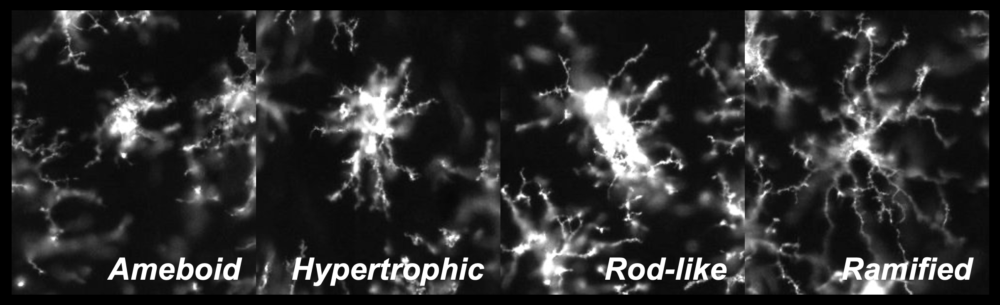

```{r setup, include=FALSE}
knitr::opts_chunk$set(echo = TRUE)
```

**Created**: 26 June, 2023  
**Last updated**: `r format(Sys.time(), '%d %B, %Y')`

## Welcome to MicrogliaMorphologyR!
MicrogliaMorphologyR is an R package for microglia morphology analysis, that is complimentary to ImageJ macro [MicrogliaMorphology](https://github.com/ciernialab/MicrogliaMorphology). Using MicrogliaMorphologyR, you can perform exploratory data analysis and visualization of 27 different morphology features, characterize morphological cluster identities, quantify shifts in morphological populations, generate heatmap and boxplot visualizations of data in flexible ways including at the single-cell level, animal-level, and experimental condition-level, and perform statistical analysis of your data.

You can read more about any of the MicrogliaMorphologyR functions covered in this tutorial by calling to their respective help pages by running ?function_name in the console. 

### If you are using this tool, please cite the following publications:
- [Development of a high-throughput pipeline to characterize microglia morphological states at a single-cell resolution](https://www.eneuro.org/content/11/7/ENEURO.0014-24.2024)

Kim J, Pavlidis P, Ciernia AV. Development of a High-Throughput Pipeline to Characterize Microglia Morphological States at a Single-Cell Resolution. eNeuro. 2024 Jul 30;11(7):ENEURO.0014-24.2024. doi: 10.1523/ENEURO.0014-24.2024. PMID: 39029952; PMCID: PMC11289588.

### Microglia morphology
Microglia exhibit a dynamic range of morphologies that are context-specific and often rapidly changing in response to environmental cues. While microglia more realistically exist along a continuous spectrum of morphology, we can categorize them by their most commonly observed forms to study microglia morphology. Here, we highlight the four most commonly studied morphological classes, but others have also been characterized including hyper-ramified, dystrophic, satellite, etc. MicrogliaMorphologyR can also be used to characterize additional morphologies beyond these four.

  
* **Ameboid** = round, few processes
* **Hypertrophic** = thicker, shorter processes with larger soma
* **Rod-like** = elongated soma with bipolar processes
* **Ramified** = smaller soma with long, highly branched processes

Here are some recent and relevant reviews that you can read to gain more background on microglia morphology and this project:

* [Microglial morphometric analysis: so many options, so little consistency (Reddaway et al., 2023)](https://www.frontiersin.org/articles/10.3389/fninf.2023.1211188/full)
* [Microglia states and nomenclature: A field at its crossroads (Paolicelli et al., 2022)](https://www.ncbi.nlm.nih.gov/pmc/articles/PMC9999291/)
* [Morphology of Microglia Across Contexts of Health and Disease (Savage et al., 2019)](https://link.springer.com/protocol/10.1007/978-1-4939-9658-2_2)


# Instructions on how to use MicrogliaMorphologyR

### Install, load packages, and set seed for reproducibility of results shown
```{r, eval=FALSE}
devtools::install_github('ciernialab/MicrogliaMorphologyR')
```

```{r, message=FALSE, warning=FALSE}
library(MicrogliaMorphologyR)
library(factoextra)
library(ppclust)
```

```{r}
set.seed(1)
```

We will start by loading in your MicrogliaMorphology output (FracLac and SkeletonAnalysis files) and formatting the data using the `metadata_columns` function so that you have a final dataframe which contains your cell-level data, with every row as a single cell and every column as either a metadata descriptor or morphology measure. The `metadata_columns` function relies on each piece of metadata to be separated by a common deliminator such as "_" or "-" in the "Name" column. You can read more about the function by calling to its help page using ?metadata_columns

### Load in your fraclac and skeleton data, tidy, and merge into final data frame
```{r, eval=FALSE}
fraclac.dir <- "insert path to fraclac directory"
skeleton.dir <- "insert path to skeleton analysis directory"

# these steps may be very time-intensive, depending on how many cells you are analyzing (i.e., on the order of 1000s of cells). 
fraclac <- fraclac_tidying(fraclac.dir) 
skeleton <- skeleton_tidying(skeleton.dir)

data <- merge_data(fraclac, skeleton)
finaldata <- metadata_columns(data, c("Antibody","Paper","Cohort","MouseID","Sex","Treatment","BrainRegion","Subregion"), sep="_")
```

For demonstration purposes, we will use one of the datasets that comes packaged with MicrogliaMorphologyR. 'data_2xLPS_mouse' contains morphology data collected from female and male 8 week-old Cx3cr1-eGFP mice, which were given 2 i.p. injections of either PBS vehicle solution or 0.5mg/kg lipopolysaccharides (LPS), spaced 24 hours apart. In this genetic mouse line, Cx3cr1-expressing cells including microglia have an endogenous reporter which makes them green when immunofluorescently imaged. Brains were collected 3 hours after the final injections, and brain sections were immunofluorescently stained and imaged for 2 additional, commonly used microglia markers: P2ry12, and Iba1.

### Load in example dataset
```{r}
data_2xLPS <- MicrogliaMorphologyR::data_2xLPS_mouse
```

### Generate heatmap of correlations across features

We start by exploring the morphology features measured by MicrogliaMorphology and how they relate to each other by generating a heatmap of spearman's correlations across the 27 different morphology features. As expected, the features which describe similar aspects of morphology are more highly correlated to each other than to other features which do not. For example, the numbers of end point voxels, junction voxels, triple points, branches, and junctions all explain cell branching complexity and are highly correlated to each other.

```{r, fig.width=10.5, fig.height=10}
featurecorrelations(data_2xLPS,
                    featurestart=9, featureend=35,
                    rthresh=0.8, pthresh=0.05,
                    title="Correlations across features")

# to get the underlying stats depicted in the heatmap above
correlationstats <- featurecorrelations_stats(data_2xLPS,
                                             featurestart=9, featureend=35,
                                             rthresh=0.8, pthresh=0.05)
correlationstats %>% head()
```

MicrogliaMorphologyR comes with a number of functions which allow you to explore which features have extreme outliers and how normalizing in various ways changes your feature distributions. This allows you to explore and transform your data in a dataset-appropriate manner for downstream analyses. In later steps, we will be running Principal Components Analysis (PCA) on our transformed data. PCA is a statistical technique which identifies the most significant variables and relationships in your data, and can be used as a pre-processing step to reduce noise and remove irrelevant features to improve the efficiency and accuracy of downstream analysis. PCA assumes that the variables in your dataset follow a normal distribution, and violations of normality can affect the accuracy of PCA results. Thus, it is important to transform your data so that the distributions of the values for each individual morphology measure approximate normality as much as possible. 

The morphology features measured using MicrogliaMorphology are often suitable for PCA after log transformation. Because many of the measures contain zero values (e.g., numbers of junctions, numbers of branches, etc.), we need to add a constant to our data prior to log transforming.

### Exploratory data visualization and data transformation for downstream analyses
```{r, fig.width=10, fig.height=7, warning=FALSE}
# gather your numerical morphology data into one column ('measure') which contains the feature name, and another column ('value') which contains measured values
data_2xLPS_gathered <- data_2xLPS %>% gather(measure, value, 9:ncol(data_2xLPS))

# check for outliers
outliers_boxplots(data_2xLPS_gathered)
outliers_distributions(data_2xLPS_gathered)

# checking different normalization features
normalize_logplots(data_2xLPS_gathered,1)
normalize_minmax(data_2xLPS_gathered)
normalize_scaled(data_2xLPS_gathered)

# transform your data in appropriate manner for downstream analyses
# we will use the logtransformed data as our PCA input
data_2xLPS_logtransformed <- transform_log(data_2xLPS, 1, start=9, end=35) 
data_2xLPS_minmaxtransformed <- transform_minmax(data_2xLPS, start=9, end=35)
data_2xLPS_scaled <- transform_scale(data_2xLPS, start=9, end=35)

# get sample size of data based on factors of interest
samplesize(data_2xLPS, MouseID, Antibody)
samplesize(data_2xLPS, Sex, Treatment, Antibody)
```

### Obtain density measures for each image (using Areas.csv file output from MicrogliaMorphology)
```{r}
# list out all variables of interest present in the original image names to obtain numbers of microglia per image
microglianumbers <- samplesize(data_2xLPS, Antibody, MouseID, Sex, Treatment, BrainRegion, Subregion) 
head(microglianumbers, 3)

# add Name column back in -- make sure that the resulting strings in the Name column match the names of your original input .tiff files that you used for MicrogliaMorphology !!
microglianumbers <- microglianumbers %>% unite("Name", Antibody:Subregion, sep="_", remove=FALSE) 
head(microglianumbers, 3)

# path to Areas.csv file
AreasPath <- "./README_files/files/Areas.csv" 

# use celldensity function to calculate density at image-level: values are under the "Density" column
Density <- celldensity(AreasPath, microglianumbers)
Density %>% print(n=5, width=Inf) # to be able to see all the columns in this document

# if you want to group on another variable, and then calculate density
# e.g., calculating density at the brain region-level rather than the subregion level (which are what the image rois capture in our example dataset)
Density %>% 
  group_by(Antibody, MouseID, Sex, Treatment, BrainRegion) %>%
  summarise(num=sum(num), Area=sum(Area)) %>% # calculate new cell numbers and new areas at the brain region level
  mutate(Density=num/Area) # calculate new density at the brain region level
```

Now, since we have gotten a better feel for our data and how to transform it, we can proceed with PCA for dimensionality reduction and downstream clustering. We can see here that the first 3 PCs describe around ~85% of our data. We can also explore how each PC correlates to the 27 different morphology features to get a better understanding of how each PC describes the variability present in the data. This is useful to inform which to include for downstream clustering steps. 

## Dimensionality reduction using PCA
```{r}
pcadata_elbow(data_2xLPS_logtransformed, featurestart=9, featureend=35)
pca_data <- pcadata(data_2xLPS_logtransformed, featurestart=9, featureend=35,
                    pc.start=1, pc.end=10)
head(pca_data,3)
```

### Generate heatmap of correlations between PCs and features

Using the `pcfeaturecorrelations` function, we can investigate the relationships of our 27 individual morphology measures to the principle components to examine how each PC is differentially correlated to and described by different sets of morphology features. For example, we can see that PC1 is highly positively correlated to features describing branching complexity and territory span, meaning that individual cells with greater branching complexity or area have higher PC1 scores in our dataset. Similarly, the variability in our dataset represented in PC2 is described by cell shape: 1) *circularity* (circularity, max/min radii from center, span ratio of hull) and 2) *branching homogeneity* (relative variation (CV) from center of mass), and PC3 is described by branch length-related measures. Generally, you will see the same types of features describing the first four PCs after dimensionality reduction, although the directionality of the correlations could be inversed, which is normal as long as the sets of features that are highly correlated (e.g., circularity and branching homogeneity for PC2) are still maintained. 

```{r, fig.width=9, fig.height=7}
pcfeaturecorrelations(pca_data, pc.start=1, pc.end=3, 
                      feature.start=19, feature.end=45, 
                      rthresh=0.75, pthresh=0.05, 
                      title="Correlation between PCs and features")
```

### Visually explore different sources of variability in dataset
```{r, fig.width=13, fig.height=12.5}
# gather your data by experimental variables (e.g., Treatment, Sex, MouseID, etc.)
gathered_expvariables <- pca_data %>% gather(variable, value, 11:16) 

plots_expvariable(gathered_expvariables, "PC1", "PC2")
```

## K-means clustering on PCs

After performing dimensionality reduction, we can use our PCs as input for downstream clustering methods. In this tutorial, we cluster our cells into morphological classes using k-means clustering, which partitions data points within a given dataset into defined numbers of clusters based on their proximity to the nearest cluster’s centroid. We provide an example at the end of the Github to depict a use case for fuzzy k-means clustering, a soft clustering approach and another option which allows for extended analyses such as characterization of the 'most' ameboid, hypertrophic, rod-like, or ramified cells or characterization of cells with more ambiguous identities that lie between these morphological states - see ['Fuzzy K-means clustering' section](https://github.com/ciernialab/MicrogliaMorphologyR#fuzzy-k-means-clustering) at the end of Github for more details about the method. Because our toolset is highly flexible, it can also be integrated with other clustering approaches such as hierarchical clustering or gaussian mixture models.

When running kmeans clustering, from the number of clusters (K) that you specify to create, the algorithm will randomly select K initial cluster centers. Each other data point's euclidean distance will be calculated from these initial centers so that they are assigned as belonging to the cluster that they are closest to. The centroids for each of the clusters will be updated by calculating the new means of all the points assigned to each cluster. The process of randomly setting initial centers, assigning data points to the clusters, and updating the cluster centroids is iterated until the maximum number of iterations is reached. 

Thus, 2 main dataset-specific parameters that you should specify and troubleshoot for your dataset are:

- **iter.max**, the maximum number of iterations allowed, and the number of times kmeans algorithm is run before results are returned. An iter.max between 10-20 is recommended
- **nstart**, how many random sets should be chosen. An nstart of atleast 25 initial configurations is recommended.

You can read more about kmeans clustering and optimizing these parameters at the following links:

- [K-means Cluster Analysis](https://uc-r.github.io/kmeans_clustering)
- [K Means parameters and results (in R Studio) explained](https://andrea-grianti.medium.com/kmeans-parameters-in-rstudio-explained-c493ec5a05df)

### Prepare data for clustering
```{r}
## for k-means clustering: scale PCs 1-3, which together describe ~85% of variability
pca_data_scale <- transform_scale(pca_data, start=1, end=3) # scale pca data as input for k-means clustering
kmeans_input <- pca_data_scale[1:3]
```

### Cluster optimization prior to running fuzzy k-means
```{r}
# check for optimal number of clusters using wss and silhouette methods
sampling <- kmeans_input[sample(nrow(kmeans_input), 5000),] #sample 5000 random rows for cluster optimization

fviz_nbclust(sampling, kmeans, method = 'wss', nstart=25, iter.max=50) # 4 clusters
fviz_nbclust(sampling, kmeans, method = 'silhouette', nstart=25, iter.max=50) # 4 clusters
```

From using the wss and silhouette methods to check the optimal numbers of clusters for our dataset, it appears that our data would be optimally clustered using k=4. There are many more [cluster optimization methods](http://www.sthda.com/english/articles/29-cluster-validation-essentials/96-determiningthe-optimal-number-of-clusters-3-must-know-methods/) that you can try out to explore your data. 

Next, we proceed with the actual clustering. You can cluster using fuzzy k-means or regular k-means at this step. After clustering, we will use some built-in functions within MicrogliaMorphologyR to assess how a parameter of k=4 influences how the clusters are defined by morphology features (and if they make sense according to what we know about microglia morphology). As this step may require some troubleshooting and updating of clustering parameters, you may need to run your k-means function multiple times. If you are planning to use fuzzy k-means, keep in mind that the **soft clustering approach is more time-intensive and computationally expensive** as it also calculates membership scores to each cluster for every single cell. It might help to use regular k-means as a first pass, verify that your clusters make sense using the functions that follow, and run your fuzzy k-means function using the final parameters that you determine to generate your final dataset for downstream analysis. 

For the analysis proceeding, we are working with the regular k-means clustering output. We provide an example of a use case for fuzzy k-means clustering and further description of this approach at the [end of the Github](https://github.com/ciernialab/MicrogliaMorphologyR#fuzzy-k-means-clustering) if you are interested.

### Fuzzy k-means (soft clustering)
```{r, eval=FALSE}
# cluster and combine with original data
data_kmeans <- fcm(kmeans_input, centers=4, nstart=25)
pca_kmeans <- cbind(pca_data[1:5], data_kmeans)
```

### Regular k-means (hard clustering)
```{r}
# cluster and combine with original data
data_kmeans <- kmeans(kmeans_input, centers=4)

# Here, we are creating a new data frame that contains the first 2 PCs and original dataset, then renaming the data_kmeans$cluster column to simply say "Cluster". You can bind together as many of the PCs as you want. Binding the original, untransformed data is useful if you want to plot the raw values of any individual morphology measures downstream. 
pca_kmeans <- cbind(pca_data[1:2], data_2xLPS, as.data.frame(data_kmeans$cluster)) %>%
  rename(Cluster=`data_kmeans$cluster`) 
head(pca_kmeans,3)
```

### Plot k-means clusters in PC space
```{r}
plot <- clusterplots(pca_kmeans, "PC1", "PC2")
plot
plot + scale_colour_viridis_d() # customizeable example: add color scheme of choice 
```

### Cluster-specific measures on average for each morphology feature, relative to other clusters
```{r}
clusterfeatures(pca_kmeans, featurestart=11, featureend=37)
```

After comparing the individual features across clusters, we can characterize the clusters as follows:

* Cluster 1 = rod-like (greatest oblongness, lowest circularity)
* Cluster 2 = ameboid (lowest territory span, high circularity, smallest branch lengths)
* Cluster 3 = ramified (largest territory span and branching complexity)
* Cluster 4 = hypertrophic (average territory span, high branch thickness as explained by pixel density in hull)

### ColorByCluster

Using the cluster classes assigned from our analyses using MicrogliaMorphologyR, we can color each cell in the original image by cluster using the MicrogliaMorphology ImageJ macro. In the following example, we are isolating out the Cluster assignments for each microglia in the Cx3cr1-stained ACC subregion image for Mouse 1. You can do this for all of the images you are interested in applying ColorByCluster to. This offers an additional method by which to visually assess and verify your suspected cluster identities before deeming them ramifed, hyper-ramified, rod-like, ameboid, or any other morphological form for downstream analysis and interpretation.

Make sure to filter for *only* the cells belonging to the image you want to run ColorByCluster on.

#### Formatting data for ColorByCluster input (Color coding in ImageJ)
```{r}
# isolate out all the cells for your specific image of interest
colorbycluster <- pca_kmeans %>% 
  filter(Antibody=="Cx3cr1",MouseID=="1", BrainRegion=="FC", Subregion=="ACC") %>% select(c(Cluster, ID))
head(colorbycluster)
```

#### Save .csv file to feed into ColorByCluster function in MicrogliaMorphology ImageJ macro
```{r, eval=FALSE}
write.csv(colorbycluster, "filepath/Cxc3cr_Mouse1_FC_ACC_data.csv")
```

### Cluster characterization

```{r, fig.width=11, fig.height=7}
# calculate cluster percentages across variables of interest
cp <- clusterpercentage(pca_kmeans, "Cluster", MouseID, Antibody, Treatment, Sex, BrainRegion)
cp$Treatment <- factor(cp$Treatment, levels=c("PBS","2xLPS"))

# update cluster labels
cp <- cp %>% mutate(Cluster = 
                      case_when(Cluster=="1" ~ "Rod-like",
                                Cluster=="2" ~ "Ameboid",
                                Cluster=="3" ~ "Ramified",
                                Cluster=="4" ~ "Hypertrophic"))

# Quick check of cluster proportions when considering experimental variables of interest
cp %>% 
  filter(BrainRegion=="STR") %>% # in this example, we filter for our brain region of interest
  clusterpercentage_boxplots(Antibody, Treatment) # grouping variables
```

```{r, fig.width=11, fig.height=4}
# example graph of data given variables of interest
cp %>% 
  filter(Antibody=="Iba1") %>%
  ggplot(aes(x=Cluster, y=percentage, group=interaction(Cluster, Treatment))) +
  facet_wrap(~BrainRegion) +
  geom_boxplot(aes(group=interaction(Cluster, Treatment), fill=Treatment)) +
  scale_fill_manual(values=c("#fde725","#482878")) +
  geom_point(position=position_dodge(width=0.8), size=0.75, aes(group=interaction(Cluster,Treatment), color=Sex)) +
  ggtitle("2xLPS mouse dataset: K-means clusters") +
  labs(fill="Treatment") +
  theme_bw(base_size=14) +
  theme(axis.text.x=element_text(angle=45, vjust=1, hjust=1))
```

## Statistical analysis

MicrogliaMorphologyR includes a few functions to run stats on cluster percentages as well as on individual morphology measures. 

### Cluster percentage changes at animal level, in response to experimental variables
#### e.g., Across clusters - How does cluster membership change with LPS?

The stats_cluster.animal function fits a generalized linear mixed model on your dataset to a beta distribution, which is suitable for values like percentages or probabilities that are constrained to a range of 0-1, using the `glmmTMB` package. Part of the output includes a check of the model fit using the `DHARMa` package, which "uses a simulation-based approach to create readily interpretable scaled (quantile) residuals for fitted (generalized) linear mixed models." The function creates two `DHARMa` plots, contained in output[[4]]. You can read more about how to interpret model fit using `DHARMa` by reading the package [vignette](https://cran.r-project.org/web/packages/DHARMa/vignettes/DHARMa.html). 

In this example, we are fitting the generalized linear mixed model to our Iba1-stained dataset to model the percentage of cluster membership as a factor of Cluster identity, Treatment, and BrainRegion interactions with MouseID as a repeated measure since the outcome variable (cluster percentages) is represented multiple times per animal. In the first posthoc correction, we are correcting for multiple tests between treatments (PBS vs. 2xLPS) across Clusters and BrainRegions using the Bonferroni method - since there are 4 clusters and 3 brain regions, we should be correcting across 12 tests. In the second posthoc correction, we are correcting for multiple tests between treatments (PBS vs. 2xLPS) across Clusters using the Bonferroni method - since there are 4 clusters, we should be correcting across 4 tests.

```{r}
# prepare percentages dataset for downstream analysis
stats.input <- cp 
stats.input$MouseID <- factor(stats.input$MouseID)
stats.input$Cluster <- factor(stats.input$Cluster)
stats.input$Treatment <- factor(stats.input$Treatment)

# run stats analysis for changes in cluster percentages, at the animal level
# you can specify up to two posthoc comparisons (posthoc1 and posthoc2 arguments) - if you only have one set of posthocs to run, specify the same comparison twice for both arguments. you will just get the same results in output[[2]] and output[[3]].
stats.testing <- stats_cluster.animal(stats.input %>% filter(Antibody=="Iba1"), 
                                      "percentage ~ Cluster*Treatment*BrainRegion + (1|MouseID)", 
                                      "~Treatment|Cluster|BrainRegion", "~Treatment|Cluster", "bonferroni")

stats.testing[[1]] # anova
stats.testing[[2]] # posthoc 1
stats.testing[[3]] # posthoc 2
stats.testing[[4]] # DHARMa model check
stats.testing[[5]] # summary of model
```

### Individual morphology measures, at the animal level (averaged across cells for each animal)
#### e.g., How does each individual morphology measure change with LPS treatment?

The stats_morphologymeasures.animal function fits a linear model using the `lm` function for each morphology measure individually within your dataset.

In this example, we are fitting the linear model to our Iba1-stained dataset to model the values of each morphology measure as a factor of Treatment and BrainRegion interactions. In the first posthoc correction, we are correcting for multiple comparisons between treatments (PBS vs. 2xLPS) across BrainRegions using the Bonferroni method - since there are 3 brain regions, we should be correcting across 3 tests for each morphology measure. In the second posthoc correction, we are correcting for multiple comparisons between every individual interaction of treatment (PBS or 2xLPS) and brain region (FC, HC, STR) against the others (e.g., 2xLPS FC vs. PBS STR) and should be correcting across 15 tests for each morphology measure. In the second example, we are testing all possible comparisons given the experimental variables in our model, and are thus considering many tests that aren't biologically relevant or useful in our experiment. 

```{r, fig.width=13, fig.height=14}
# prepare data for downstream analysis
data <- data_2xLPS %>% 
  group_by(MouseID, Sex, Treatment, BrainRegion, Antibody) %>% 
  summarise(across("Foreground pixels":"Maximum branch length", ~mean(.x))) %>% 
  gather(Measure, Value, "Foreground pixels":"Maximum branch length")

# filter out data you want to run stats on and make sure to make any variables included in model into factors
stats.input <- data 
stats.input$Treatment <- factor(stats.input$Treatment)

# run stats analysis for changes in individual morphology measures
# you can specify up to two posthoc comparisons (posthoc1 and posthoc2 arguments) - if you only have one set of posthocs to run, specify the same comparison twice for both arguments. you will just get the same results in output[[2]] and output[[3]].
stats.testing <- stats_morphologymeasures.animal(stats.input %>% filter(Antibody=="Iba1"), "Value ~ Treatment*BrainRegion", 
                                                 "~Treatment|BrainRegion", "~Treatment*BrainRegion", "bonferroni")

# anova
stats.testing[[1]] %>% head(8)
# posthoc 1
stats.testing[[2]] %>% head(6)
# posthoc 2
stats.testing[[3]] %>% head(6)
# qqplots to check normality assumptions
do.call("grid.arrange", c(stats.testing[[4]], ncol=4))
# levene test
stats.testing[[5]] %>% head(6)
# shapiro test
stats.testing[[6]] %>% head(6)
# summary of model
stats.testing[[7]]
```

If you are not interested in running stats for all 27 morphology measures, you can also filter for those that you are interested in (or filter out those that you're not interested in) prior to running the `stats_morphologymeasures.animal` function. In this example, we filter out 4 morphology measures so that we only run this function on the other 23 measures.
```{r, fig.width=13, fig.height=14}
# run stats analysis for changes in individual morphology measures
# you can specify up to two posthoc comparisons (posthoc1 and posthoc2 arguments) - if you only have one set of posthocs to run, specify the same comparison twice for both arguments. you will just get the same results in output[[2]] and output[[3]].
stats.testing <- stats_morphologymeasures.animal(stats.input %>% 
                                                   filter(Antibody=="Iba1") %>%
                                                   filter(!Measure %in% c("Foreground pixels",
                                                                          "Average branch length",
                                                                          "# of quadruple points",
                                                                          "Height of bounding rectangle")), 
                                                 "Value ~ Treatment*BrainRegion", 
                                                 "~Treatment|BrainRegion", "~Treatment*BrainRegion", "bonferroni")


# anova
stats.testing[[1]] %>% head(8)
# posthoc 1
stats.testing[[2]] %>% head(6)
# posthoc 2
stats.testing[[3]] %>% head(6)
# qqplots to check normality assumptions
do.call("grid.arrange", c(stats.testing[[4]], ncol=4))
# levene test
stats.testing[[5]] %>% head(6)
# shapiro test
stats.testing[[6]] %>% head(6)
# summary of model
stats.testing[[7]]
```

If you find that any individual morphology measures violate assumptions of normality after checking the qqplots contained in stats.input[[4]], you can filter your data for those measures, transform your data in the suitable manner (i.e., using MicrogliaMorphologyR functions like `transform_minmax` or `transform_scale` or other data transformations), and rerun the stats for those morphology features using the code above.

## Fuzzy K-means Clustering

To cluster your cells into morphological classes, you can use regular k-means or fuzzy k-means clustering. We provide an example of using fuzzy k-means, a 'soft' clustering method that is similar in concept and algorithm to k-means clustering, which partitions data points within a given dataset into defined numbers of clusters based on their proximity to the nearest cluster’s centroid. In fuzzy k-means, data points are not exclusively assigned to just one cluster, but rather given membership scores to all clusters. This allows for additional characterization of high-scoring cells within each cluster (i.e., quintessential 'rod-like', 'ameboid', 'hypertrophic', or 'ramified' cells), cells with more ambiguous identities (e.g., a cell that is 5% rod-like, 5% ameboid, 45% hypertrophic, and 45% ramified), and other cases that the user might be interested in which might be informative for their specific dataset. Fuzzy k-means also assigns a final hard cluster assignment based on the class with the highest membership score, which can be used as input for analysis as well. Here, we include an example of one use case of the membership scores provided by fuzzy k-means. 

### Example of additional analyses possible with fuzzy k-means (soft clustering) membership scores
Here, we will use a fuzzy k-means dataset that comes pre-loaded with the package for demonstration purposes, as running the actual fuzzy clustering step using the `fcm` function in the `ppclust` [package](https://cran.r-project.org/web/packages/ppclust/vignettes/fcm.html) is time-intensive and computationally-expensive. 

Load in example dataset:
```{r}
data_fuzzykmeans <- MicrogliaMorphologyR::data_2xLPS_mouse_fuzzykmeans
colnames(data_fuzzykmeans)

# check cluster features to determine cluster labels
clusterfeatures(data_fuzzykmeans, featurestart=9, featureend=35)

# update cluster labels
data_fuzzykmeans <- data_fuzzykmeans %>% mutate(Cluster = 
                      case_when(Cluster=="1" ~ "Ameboid",
                                Cluster=="2" ~ "Rod-like",
                                Cluster=="3" ~ "Hypertrophic",
                                Cluster=="4" ~ "Ramified"))
```

Example: Characterization of just the high-scoring cells within each cluster (i.e., quintessential 'rod-like', 'ameboid', 'hypertrophic', or 'ramified' cells)
```{r, fig.width=12, fig.height=5}
nrow(data_fuzzykmeans) # number of cells prior to filtering

# filter for high-scoring cells, defined as >70% membership score in one of the clusters
data <- data_fuzzykmeans %>% 
  filter(`Cluster 1` > 0.70|
         `Cluster 2` > 0.70|
         `Cluster 3` > 0.70|
         `Cluster 4` > 0.70)

nrow(data) # number of cells after filtering for just the high-scoring cells

# calculate cluster percentages across variables of interest
cp <- clusterpercentage(data, "Cluster", MouseID, Antibody, Treatment, Sex, BrainRegion)
cp$Treatment <- factor(cp$Treatment, levels=c("PBS","2xLPS"))

# example graph of data given variables of interest
cp %>% 
  filter(Antibody=="Iba1") %>%
  ggplot(aes(x=Cluster, y=percentage, group=interaction(Cluster, Treatment))) +
  facet_wrap(~BrainRegion) +
  geom_boxplot(aes(group=interaction(Cluster, Treatment), fill=Treatment)) +
  scale_fill_manual(values=c("#fde725","#482878")) +
  geom_point(position=position_dodge(width=0.8), size=0.75, aes(group=interaction(Cluster,Treatment), color=Sex)) +
  ggtitle("2xLPS mouse dataset: K-means clusters") +
  labs(fill="Treatment") +
  theme_bw(base_size=14) +
  theme(axis.text.x=element_text(angle=45, vjust=1, hjust=1))
```
