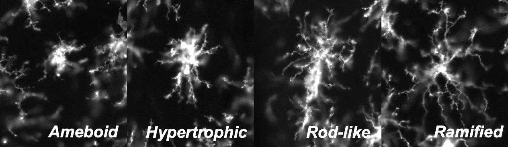

```{r setup, include=FALSE}
knitr::opts_chunk$set(echo = TRUE)
```
**Created**: 26 June, 2023  
**Last updated**: `r format(Sys.time(), '%d %B, %Y')`

## Welcome to MicrogliaMorphologyR!
MicrogliaMorphologyR is an R package for microglia morphology analysis, that is complimentary to ImageJ macro [MicrogliaMorphology](https://github.com/ciernialab/MicrogliaMorphology). Using MicrogliaMorphologyR, you can perform exploratory data analysis and visualization of 27 different morphology features, characterize morphological cluster identities, quantify shifts in morphological populations, generate heatmap and boxplot visualizations of data in flexible ways including at the single-cell level, animal-level, and experimental condition-level, and perform statistical analysis of your data.

### If you are using this tool, please cite the following publication:
- [Development of a high-throughput pipeline to characterize microglia morphological states at a single-cell resolution](https://www.eneuro.org/content/11/7/ENEURO.0014-24.2024)

> Kim J, Pavlidis P, Ciernia AV. Development of a High-Throughput Pipeline to Characterize Microglia Morphological States at a Single-Cell Resolution. eNeuro. 2024 Jul 30;11(7):ENEURO.0014-24.2024. doi: 10.1523/ENEURO.0014-24.2024. PMID: 39029952; PMCID: PMC11289588.

## How to install MicrogliaMorphologyR
```{r, eval=FALSE}
# install devtools package if you don't have it already
install.packages("devtools")

# install MicrogliaMorphologyR using devtools
devtools::install_github('ciernialab/MicrogliaMorphologyR')
```

## How to use MicrogliaMorphologyR
Visit the [package website](https://ciernialab.github.io/MicrogliaMorphologyR/articles/MicrogliaMorphologyR.html) for a tutorial on how to use MicrogliaMorphologyR using an example dataset that comes with the package.

## Microglia morphology
Microglia exhibit a dynamic range of morphologies that are context-specific and often rapidly changing in response to environmental cues. While microglia more realistically exist along a continuous spectrum of morphology, we can categorize them by their most commonly observed forms to study microglia morphology. Here, we highlight the four most commonly studied morphological classes, but others have also been characterized including hyper-ramified, dystrophic, satellite, etc. MicrogliaMorphologyR can also be used to characterize additional morphologies beyond these four.

  
* **Ameboid** = round, few processes
* **Hypertrophic** = thicker, shorter processes with larger soma
* **Rod-like** = elongated soma with bipolar processes
* **Ramified** = smaller soma with long, highly branched processes

Here are some recent and relevant reviews that you can read to gain more background on microglia morphology and this project:

* [Microglial morphometric analysis: so many options, so little consistency (Reddaway et al., 2023)](https://www.frontiersin.org/articles/10.3389/fninf.2023.1211188/full)
* [Microglia states and nomenclature: A field at its crossroads (Paolicelli et al., 2022)](https://www.ncbi.nlm.nih.gov/pmc/articles/PMC9999291/)
* [Morphology of Microglia Across Contexts of Health and Disease (Savage et al., 2019)](https://link.springer.com/protocol/10.1007/978-1-4939-9658-2_2)