MicrogliaMorphologyR
================

**Created**: 26 June, 2023 by Jenn Kim  
**Last updated**: 24 July, 2023

## Welcome to MicrogliaMorphologyR!

MicrogliaMorphologyR is an R package for microglia morphology analysis,
that is complimentary to ImageJ macro
[MicrogliaMorphology](https://github.com/ciernialab/MicrogliaMorphology).
Using MicrogliaMorphologyR, you can perform exploratory data analysis
and visualization of 27 different morphology features and perform
dimensionality reduction, clustering, and statistical analysis of your
data.

#### If you are using this tool, please cite the following publications:

- Insert manuscript link

## Instructions on how to use MicrogliaMorphologyR

### install and load package

``` r
BiocManager::install('ciernialab/MicrogliaMorphologyR')
library(MicrogliaMorphologyR)
```

### load other packages used in this tutorial – UPDATE TO INCLUDE AS DEPENDENCIES

``` r
library(MicrogliaMorphologyR)
library(tidyverse)
library(Hmisc)
library(pheatmap)
library(factoextra)
```

We will start by loading in your MicrogliaMorphology output (FracLac and
SkeletonAnalysis files) and formatting the data so that you have a final
dataframe which contains your cell-level data, with every row as a
single cell and every column as either a metadata descriptor or
morphology measure.

### load in your fraclac and skeleton data, tidy, and merge into final data frame

``` r
fraclac.dir <- "insert path to fraclac directory"
skeleton.dir <- "insert path to skeleton analysis directory"

fraclac <- fraclac_tidying(fraclac.dir)
skeleton <- skeleton_tidying(skeleton.dir)

data <- merge_data(fraclac, skeleton)
finaldata <- metadata_columns(data, c("Antibody","Paper","Cohort","MouseID","Sex","Treatment","BrainRegion","Subregion"),"_")
```

For demonstration purposes, MicrogliaMorphologyR comes with a dataset
called ‘data_2xLPS’, which is one of the datasets described in the
manuscript. Female or male 8 week-old Cx3cr1-eGFP mice were given 2 i.p.
injections of either PBS vehicle solution or 0.5mg/kg
lipopolysaccharides (LPS), spaced 24 hours apart. Brains were collected
24 hours after the final injection, and brain sections were
immunofluorescently stained and imaged for 3 different, commonly used
microglia markers: Cx3cr1, P2ry12, and Iba1.

### load in example dataset

``` r
data_2xLPS <- MicrogliaMorphologyR::data_2xLPS
str(data_2xLPS)
```

    ## 'data.frame':    46104 obs. of  35 variables:
    ##  $ Antibody                                                     : chr  "Cx3cr1" "Cx3cr1" "Cx3cr1" "Cx3cr1" ...
    ##  $ MouseID                                                      : chr  "1" "1" "1" "1" ...
    ##  $ Sex                                                          : chr  "F" "F" "F" "F" ...
    ##  $ Treatment                                                    : chr  "2xLPS" "2xLPS" "2xLPS" "2xLPS" ...
    ##  $ BrainRegion                                                  : chr  "FC" "FC" "FC" "FC" ...
    ##  $ Subregion                                                    : chr  "ACC" "ACC" "ACC" "ACC" ...
    ##  $ ID                                                           : chr  "00002-01053" "00009-01153" "00015-01224" "00016-01229" ...
    ##  $ UniqueID                                                     : chr  "Cx3cr1_Paper1_2Hit_1_F_2xLPS_FC_ACC_00002-01053" "Cx3cr1_Paper1_2Hit_1_F_2xLPS_FC_ACC_00009-01153" "Cx3cr1_Paper1_2Hit_1_F_2xLPS_FC_ACC_00015-01224" "Cx3cr1_Paper1_2Hit_1_F_2xLPS_FC_ACC_00016-01229" ...
    ##  $ Foreground pixels                                            : int  2535 2533 4996 2646 3713 2786 2518 3129 6119 3572 ...
    ##  $ Density of foreground pixels in hull area                    : num  0.604 0.694 0.653 0.438 0.553 ...
    ##  $ Span ratio of hull (major/minor axis)                        : num  1.27 1.49 1.43 1.06 1.31 ...
    ##  $ Maximum span across hull                                     : num  90.5 90.1 129 106.3 119.9 ...
    ##  $ Area                                                         : int  4200 3650 7648 6045 6709 6040 3675 5870 13061 7601 ...
    ##  $ Perimeter                                                    : num  264 234 351 301 326 ...
    ##  $ Circularity                                                  : num  0.758 0.839 0.781 0.839 0.794 ...
    ##  $ Width of bounding rectangle                                  : int  81 67 107 92 90 137 60 66 217 131 ...
    ##  $ Height of bounding rectangle                                 : int  88 92 118 91 121 74 99 127 97 113 ...
    ##  $ Maximum radius from hull's center of mass                    : num  50.7 49.8 66.6 64.2 64.3 ...
    ##  $ Max/min radii from hull's center of mass                     : num  1.77 1.96 1.84 1.79 1.65 ...
    ##  $ Relative variation (CV) in radii from hull's center of mass  : num  0.109 0.188 0.135 0.187 0.152 ...
    ##  $ Mean radius                                                  : num  45.2 38.1 59.3 51.3 55.7 ...
    ##  $ Diameter of bounding circle                                  : num  98.5 90.1 131.3 107.5 123.5 ...
    ##  $ Maximum radius from circle's center of mass                  : num  49.3 45.1 65.6 53.7 61.7 ...
    ##  $ Max/min radii from circle's center of mass                   : num  1.69 1.61 1.71 1.16 1.85 ...
    ##  $ Relative variation (CV) in radii from circle's center of mass: num  0.1061 0.1704 0.1361 0.0559 0.1672 ...
    ##  $ Mean radius from circle's center of mass                     : num  45 37.5 59.4 51.6 55 ...
    ##  $ # of branches                                                : int  12 14 22 11 12 13 13 11 26 9 ...
    ##  $ # of junctions                                               : int  6 6 11 5 6 6 7 5 12 4 ...
    ##  $ # of end point voxels                                        : int  6 9 10 7 6 8 5 6 13 6 ...
    ##  $ # of junction voxels                                         : int  12 14 22 7 14 10 13 14 30 8 ...
    ##  $ # of slab voxels                                             : int  240 208 345 197 255 244 189 224 538 183 ...
    ##  $ Average branch length                                        : num  8.73 6.72 7.17 7.92 9.11 ...
    ##  $ # of triple points                                           : int  6 5 10 5 6 6 7 4 10 4 ...
    ##  $ # of quadruple points                                        : int  0 1 1 0 0 0 0 1 1 0 ...
    ##  $ Maximum branch length                                        : num  29.2 15.1 21.3 16.2 23.8 ...

MicrogliaMorphologyR comes with a number of functions which allow you to
explore which features have extreme outliers and how normalizing in
various ways changes your feature distributions. This allows you to
explore and transform your data in a dataset-appropriate manner for
downstream analyses.

### exploratory data visualization and data transformation for downstream analyses

``` r
data_2xLPS_gathered <- data_2xLPS %>% gather(measure, value, 9:ncol(data_2xLPS))

# check for outliers
outliers_boxplots(data_2xLPS_gathered)
```

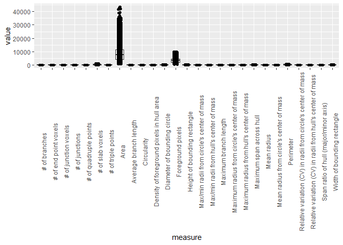<!-- -->

``` r
outliers_distributions(data_2xLPS_gathered)
```

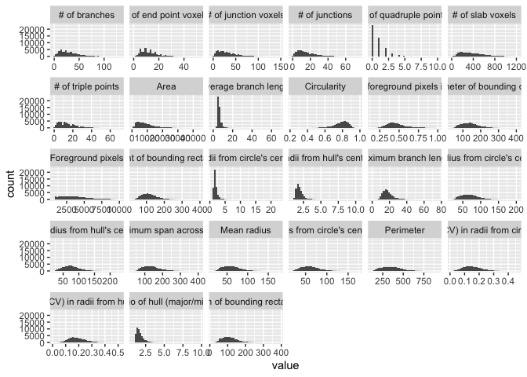<!-- -->

``` r
# checking different normalization features
normalize_logplots(data_2xLPS_gathered,1)
```

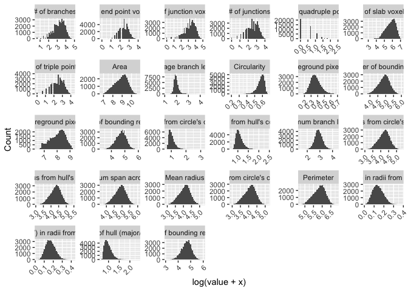<!-- -->

``` r
normalize_minmax(data_2xLPS_gathered)
```

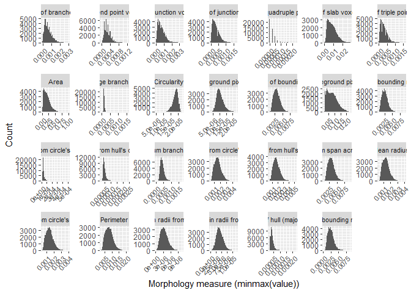<!-- -->

``` r
normalize_scaled(data_2xLPS_gathered)
```

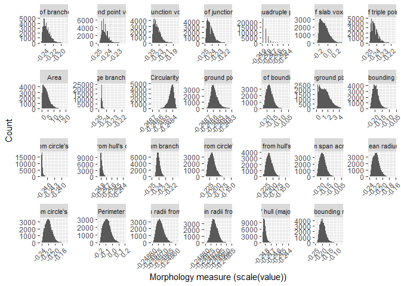<!-- -->

``` r
# transform your data in appropriate manner for downstream analyses
data_2xLPS_logtransformed <- transform_log(data_2xLPS, 1, start=9, end=35)
```

    ## Warning: `funs()` was deprecated in dplyr 0.8.0.
    ## ℹ Please use a list of either functions or lambdas:
    ## 
    ## # Simple named list: list(mean = mean, median = median)
    ## 
    ## # Auto named with `tibble::lst()`: tibble::lst(mean, median)
    ## 
    ## # Using lambdas list(~ mean(., trim = .2), ~ median(., na.rm = TRUE))
    ## ℹ The deprecated feature was likely used in the MicrogliaMorphologyR package.
    ##   Please report the issue to the authors.
    ## This warning is displayed once every 8 hours.
    ## Call `lifecycle::last_lifecycle_warnings()` to see where this warning was
    ## generated.

``` r
data_2xLPS_minmaxtransformed <- transform_minmax(data_2xLPS, start=9, end=35)
data_2xLPS_scaled <- transform_scale(data_2xLPS, start=9, end=35)

# get sample size of data based on factors of interest
samplesize(data_2xLPS, MouseID, Antibody)
```

    ## # A tibble: 18 × 3
    ## # Groups:   MouseID [6]
    ##    MouseID Antibody   num
    ##    <chr>   <chr>    <int>
    ##  1 1       Cx3cr1    1703
    ##  2 1       Iba1      1737
    ##  3 1       P2ry12    2105
    ##  4 2       Cx3cr1    2496
    ##  5 2       Iba1      2927
    ##  6 2       P2ry12    4341
    ##  7 3       Cx3cr1    1968
    ##  8 3       Iba1      2118
    ##  9 3       P2ry12    3119
    ## 10 4       Cx3cr1    1775
    ## 11 4       Iba1      2044
    ## 12 4       P2ry12    2372
    ## 13 5       Cx3cr1    2053
    ## 14 5       Iba1      2302
    ## 15 5       P2ry12    3513
    ## 16 6       Cx3cr1    2771
    ## 17 6       Iba1      3095
    ## 18 6       P2ry12    3665

``` r
samplesize(data_2xLPS, Sex, Treatment, Antibody)
```

    ## # A tibble: 12 × 4
    ## # Groups:   Sex, Treatment [4]
    ##    Sex   Treatment Antibody   num
    ##    <chr> <chr>     <chr>    <int>
    ##  1 F     2xLPS     Cx3cr1    3478
    ##  2 F     2xLPS     Iba1      3781
    ##  3 F     2xLPS     P2ry12    4477
    ##  4 F     PBS       Cx3cr1    4464
    ##  5 F     PBS       Iba1      5045
    ##  6 F     PBS       P2ry12    7460
    ##  7 M     2xLPS     Cx3cr1    2771
    ##  8 M     2xLPS     Iba1      3095
    ##  9 M     2xLPS     P2ry12    3665
    ## 10 M     PBS       Cx3cr1    2053
    ## 11 M     PBS       Iba1      2302
    ## 12 M     PBS       P2ry12    3513

### generate heatmap of correlations across features

``` r
featurecorrelations(data_2xLPS, start=9, end=35, rthresh=0.8, pthresh=0.05, title="Correlations across features")
```

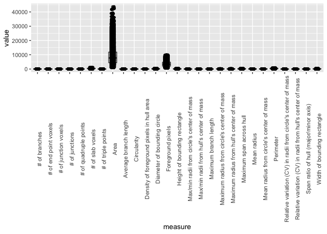<!-- -->

Now, since we have gotten a better feel for our data and how to
transform it if needed, we can proceed with PCA for dimensionality
reduction and downstream clustering. We can see here that the first 4
PCs describe around ~90% of our data.

## Dimensionality reduction using PCA

``` r
set.seed(1)
pcadata_elbow(data_2xLPS_logtransformed, start=9, end=35)
```

<!-- -->

``` r
pca_data <- pcadata(data_2xLPS_logtransformed, start=9, end=35,
                    pc.start=1, pc.end=10)
str(pca_data)
```

    ## 'data.frame':    46104 obs. of  45 variables:
    ##  $ PC1                                                          : num  -3.195 -3.738 0.129 -2.498 -1.472 ...
    ##  $ PC2                                                          : num  0.705 0.667 0.53 1.433 -0.101 ...
    ##  $ PC3                                                          : num  2.298 -0.144 1.175 2.139 2.372 ...
    ##  $ PC4                                                          : num  -0.253 -1.562 -1.429 0.888 -0.761 ...
    ##  $ PC5                                                          : num  0.279 -0.469 -0.103 0.27 0.771 ...
    ##  $ PC6                                                          : num  0.4783 -0.2311 -0.6197 0.0147 0.4442 ...
    ##  $ PC7                                                          : num  0.178 0.505 0.166 -0.196 0.537 ...
    ##  $ PC8                                                          : num  -0.047 -0.642 -0.148 -0.654 0.36 ...
    ##  $ PC9                                                          : num  1.471 -0.0422 0.7785 -1.3843 0.2157 ...
    ##  $ PC10                                                         : num  0.743 -0.278 0.372 0.484 -0.05 ...
    ##  $ Antibody                                                     : chr  "Cx3cr1" "Cx3cr1" "Cx3cr1" "Cx3cr1" ...
    ##  $ MouseID                                                      : chr  "1" "1" "1" "1" ...
    ##  $ Sex                                                          : chr  "F" "F" "F" "F" ...
    ##  $ Treatment                                                    : chr  "2xLPS" "2xLPS" "2xLPS" "2xLPS" ...
    ##  $ BrainRegion                                                  : chr  "FC" "FC" "FC" "FC" ...
    ##  $ Subregion                                                    : chr  "ACC" "ACC" "ACC" "ACC" ...
    ##  $ ID                                                           : chr  "00002-01053" "00009-01153" "00015-01224" "00016-01229" ...
    ##  $ UniqueID                                                     : chr  "Cx3cr1_Paper1_2Hit_1_F_2xLPS_FC_ACC_00002-01053" "Cx3cr1_Paper1_2Hit_1_F_2xLPS_FC_ACC_00009-01153" "Cx3cr1_Paper1_2Hit_1_F_2xLPS_FC_ACC_00015-01224" "Cx3cr1_Paper1_2Hit_1_F_2xLPS_FC_ACC_00016-01229" ...
    ##  $ Foreground pixels                                            : num  7.84 7.84 8.52 7.88 8.22 ...
    ##  $ Density of foreground pixels in hull area                    : num  0.472 0.527 0.503 0.363 0.44 ...
    ##  $ Span ratio of hull (major/minor axis)                        : num  0.819 0.912 0.889 0.725 0.838 ...
    ##  $ Maximum span across hull                                     : num  4.52 4.51 4.87 4.68 4.8 ...
    ##  $ Area                                                         : num  8.34 8.2 8.94 8.71 8.81 ...
    ##  $ Perimeter                                                    : num  5.58 5.46 5.86 5.71 5.79 ...
    ##  $ Circularity                                                  : num  0.564 0.609 0.577 0.609 0.584 ...
    ##  $ Width of bounding rectangle                                  : num  4.41 4.22 4.68 4.53 4.51 ...
    ##  $ Height of bounding rectangle                                 : num  4.49 4.53 4.78 4.52 4.8 ...
    ##  $ Maximum radius from hull's center of mass                    : num  3.95 3.93 4.21 4.18 4.18 ...
    ##  $ Max/min radii from hull's center of mass                     : num  1.018 1.085 1.045 1.027 0.974 ...
    ##  $ Relative variation (CV) in radii from hull's center of mass  : num  0.103 0.172 0.126 0.172 0.142 ...
    ##  $ Mean radius                                                  : num  3.83 3.67 4.1 3.96 4.04 ...
    ##  $ Diameter of bounding circle                                  : num  4.6 4.51 4.88 4.69 4.82 ...
    ##  $ Maximum radius from circle's center of mass                  : num  3.92 3.83 4.2 4 4.14 ...
    ##  $ Max/min radii from circle's center of mass                   : num  0.99 0.96 0.998 0.77 1.048 ...
    ##  $ Relative variation (CV) in radii from circle's center of mass: num  0.1008 0.1573 0.1276 0.0544 0.1546 ...
    ##  $ Mean radius from circle's center of mass                     : num  3.83 3.65 4.1 3.96 4.03 ...
    ##  $ # of branches                                                : num  2.56 2.71 3.14 2.48 2.56 ...
    ##  $ # of junctions                                               : num  1.95 1.95 2.48 1.79 1.95 ...
    ##  $ # of end point voxels                                        : num  1.95 2.3 2.4 2.08 1.95 ...
    ##  $ # of junction voxels                                         : num  2.56 2.71 3.14 2.08 2.71 ...
    ##  $ # of slab voxels                                             : num  5.48 5.34 5.85 5.29 5.55 ...
    ##  $ Average branch length                                        : num  2.28 2.04 2.1 2.19 2.31 ...
    ##  $ # of triple points                                           : num  1.95 1.79 2.4 1.79 1.95 ...
    ##  $ # of quadruple points                                        : num  0 0.693 0.693 0 0 ...
    ##  $ Maximum branch length                                        : num  3.41 2.78 3.1 2.84 3.21 ...

### generate heatmap of correlations between PCs and features

``` r
pcfeaturecorrelations(pca_data, pc.start=1, pc.end=5, 
                      feature.start=19, feature.end=45, 
                      rthresh=0.75, pthresh=0.05, 
                      title="Correlation between PCs and features")
```

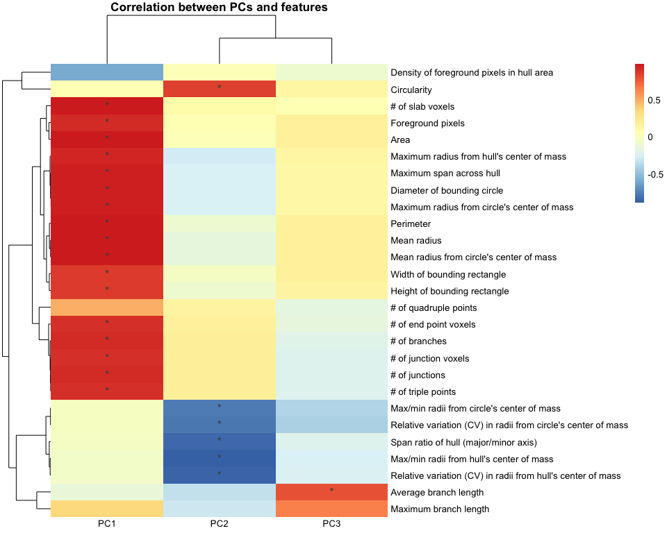<!-- -->

## Soft clustering using Fuzzy K-means

### prepare data for clustering

``` r
## for k-means clustering: scale PCs 1-3, which together describe ~85% of variability
pca_data_scale <- transform_scale(pca_data, start=1, end=3)
kmeans_input <- pca_data_scale[1:3]
```

### Cluster optimization prior to running fuzzy k-means

``` r
# check for optimal number of clusters using wss and silhouette methods
set.seed(2)
sampling <- kmeans_input[sample(nrow(kmeans_input), 5000),] #sample 5000 random rows for cluster optimization

fviz_nbclust(sampling, kmeans, method = 'wss', nstart=25, iter.max=50) # 4 clusters
```

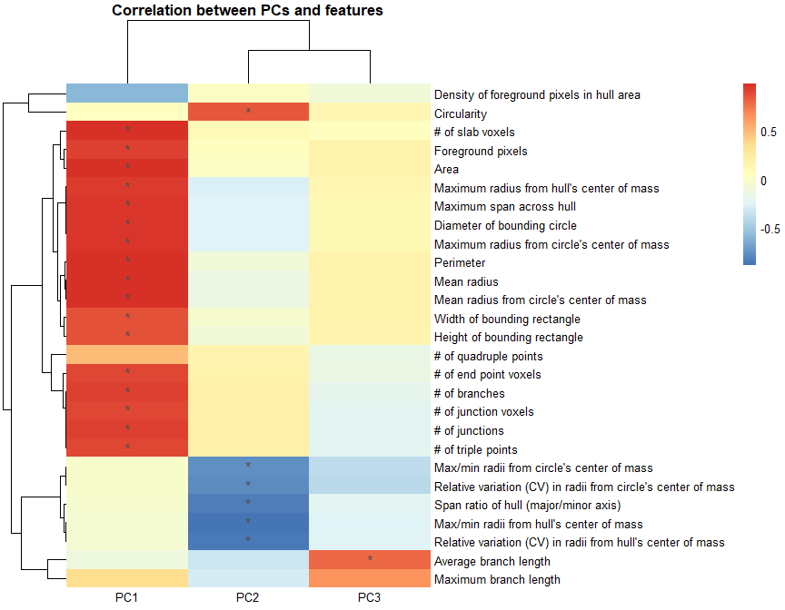<!-- -->

``` r
fviz_nbclust(sampling, kmeans, method = 'silhouette', nstart=25, iter.max=50) # 4 clusters
```

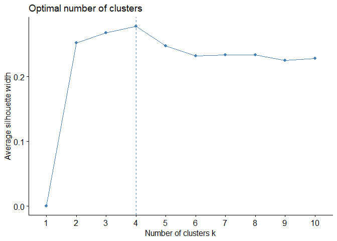<!-- -->

From using wss, silhouette, and gapstat methods to check the optimal
numbers of clusters for our dataset, it appears that our data would be
optimally clustered using k=4. There are many more cluster optimization
methods that you can try to explore optimal numbers of clusters (insert
link). Next, we use the clusterfeatures function within
MicrogliaMorphologyR to assess how clustering at k = 4 influences how
the clusters are defined by morphology features (and if they make sense
according to what we know about microglia morphology).

``` r
# cluster and combine with original data
k2 <- kmeans(kmeans_input, centers=4)
pca_kmeans <- cbind(pca_data[1:2], data_2xLPS, as.data.frame(k2$cluster))
str(pca_kmeans)
```

    ## 'data.frame':    46104 obs. of  38 variables:
    ##  $ PC1                                                          : num  -3.195 -3.738 0.129 -2.498 -1.472 ...
    ##  $ PC2                                                          : num  0.705 0.667 0.53 1.433 -0.101 ...
    ##  $ Antibody                                                     : chr  "Cx3cr1" "Cx3cr1" "Cx3cr1" "Cx3cr1" ...
    ##  $ MouseID                                                      : chr  "1" "1" "1" "1" ...
    ##  $ Sex                                                          : chr  "F" "F" "F" "F" ...
    ##  $ Treatment                                                    : chr  "2xLPS" "2xLPS" "2xLPS" "2xLPS" ...
    ##  $ BrainRegion                                                  : chr  "FC" "FC" "FC" "FC" ...
    ##  $ Subregion                                                    : chr  "ACC" "ACC" "ACC" "ACC" ...
    ##  $ ID                                                           : chr  "00002-01053" "00009-01153" "00015-01224" "00016-01229" ...
    ##  $ UniqueID                                                     : chr  "Cx3cr1_Paper1_2Hit_1_F_2xLPS_FC_ACC_00002-01053" "Cx3cr1_Paper1_2Hit_1_F_2xLPS_FC_ACC_00009-01153" "Cx3cr1_Paper1_2Hit_1_F_2xLPS_FC_ACC_00015-01224" "Cx3cr1_Paper1_2Hit_1_F_2xLPS_FC_ACC_00016-01229" ...
    ##  $ Foreground pixels                                            : int  2535 2533 4996 2646 3713 2786 2518 3129 6119 3572 ...
    ##  $ Density of foreground pixels in hull area                    : num  0.604 0.694 0.653 0.438 0.553 ...
    ##  $ Span ratio of hull (major/minor axis)                        : num  1.27 1.49 1.43 1.06 1.31 ...
    ##  $ Maximum span across hull                                     : num  90.5 90.1 129 106.3 119.9 ...
    ##  $ Area                                                         : int  4200 3650 7648 6045 6709 6040 3675 5870 13061 7601 ...
    ##  $ Perimeter                                                    : num  264 234 351 301 326 ...
    ##  $ Circularity                                                  : num  0.758 0.839 0.781 0.839 0.794 ...
    ##  $ Width of bounding rectangle                                  : int  81 67 107 92 90 137 60 66 217 131 ...
    ##  $ Height of bounding rectangle                                 : int  88 92 118 91 121 74 99 127 97 113 ...
    ##  $ Maximum radius from hull's center of mass                    : num  50.7 49.8 66.6 64.2 64.3 ...
    ##  $ Max/min radii from hull's center of mass                     : num  1.77 1.96 1.84 1.79 1.65 ...
    ##  $ Relative variation (CV) in radii from hull's center of mass  : num  0.109 0.188 0.135 0.187 0.152 ...
    ##  $ Mean radius                                                  : num  45.2 38.1 59.3 51.3 55.7 ...
    ##  $ Diameter of bounding circle                                  : num  98.5 90.1 131.3 107.5 123.5 ...
    ##  $ Maximum radius from circle's center of mass                  : num  49.3 45.1 65.6 53.7 61.7 ...
    ##  $ Max/min radii from circle's center of mass                   : num  1.69 1.61 1.71 1.16 1.85 ...
    ##  $ Relative variation (CV) in radii from circle's center of mass: num  0.1061 0.1704 0.1361 0.0559 0.1672 ...
    ##  $ Mean radius from circle's center of mass                     : num  45 37.5 59.4 51.6 55 ...
    ##  $ # of branches                                                : int  12 14 22 11 12 13 13 11 26 9 ...
    ##  $ # of junctions                                               : int  6 6 11 5 6 6 7 5 12 4 ...
    ##  $ # of end point voxels                                        : int  6 9 10 7 6 8 5 6 13 6 ...
    ##  $ # of junction voxels                                         : int  12 14 22 7 14 10 13 14 30 8 ...
    ##  $ # of slab voxels                                             : int  240 208 345 197 255 244 189 224 538 183 ...
    ##  $ Average branch length                                        : num  8.73 6.72 7.17 7.92 9.11 ...
    ##  $ # of triple points                                           : int  6 5 10 5 6 6 7 4 10 4 ...
    ##  $ # of quadruple points                                        : int  0 1 1 0 0 0 0 1 1 0 ...
    ##  $ Maximum branch length                                        : num  29.2 15.1 21.3 16.2 23.8 ...
    ##  $ k2$cluster                                                   : int  2 1 3 2 2 2 4 2 4 2 ...

``` r
# cluster-specific measures on average for each morphology feature, relative to other clusters
clusterfeatures(pca_kmeans, start=11, end=37)
```

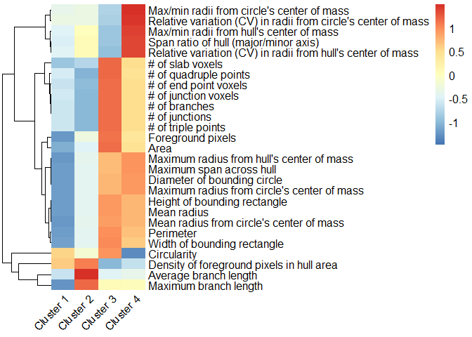<!-- -->

``` r
# plot k-means clusters in PC space
clusterplots(pca_kmeans, "PC1", "PC2")
```

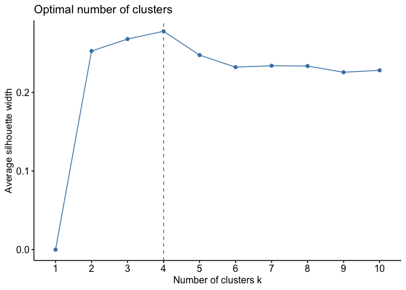<!-- -->

``` r
# customizeable example
plot <- clusterplots(pca_kmeans, "PC1", "PC2")
plot + scale_colour_viridis_d() # add color scheme of choice
```

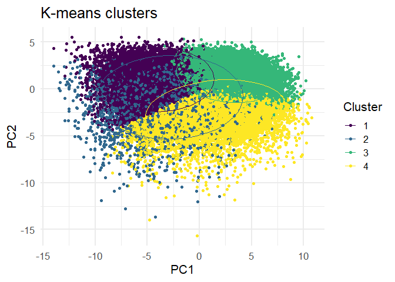<!-- -->

### Cluster characterization

``` r
# cluster percentages across variables of interest
cp <- clusterpercentage(pca_kmeans, Antibody, Treatment, Sex)
cp$Treatment <- factor(cp$Treatment, levels=c("PBS","2xLPS"))
clusterpercentage_boxplots(cp, Antibody, Treatment, Sex)
```

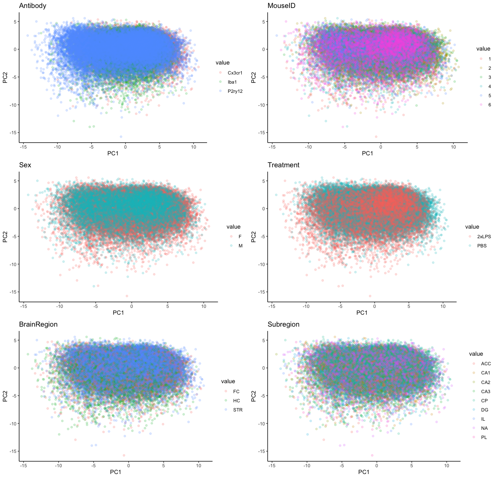<!-- -->

### Cluster fuzzy k-means

``` r
library(ppclust)
set.seed(3)
data_fuzzykmeans <- fcm(kmeans_input, centers=4) # start time = 10:36
data_pca_fuzzykmeans <- cbind(pca_data[1:2], data_2xLPS, as.data.frame(data_fuzzykmeans$u), 
                              as.data.frame(data_fuzzykmeans$cluster) %>% rename(Cluster=`data_fuzzykmeans$cluster`))
```

## Statistical analysis

## Individual morphology measures

``` r
DF2 <- test %>% group_by(Species, hello) %>% gather(Measure, Value, 4:7)
hellohi <- stats_morphologymeasures(DF2, "Value ~ Species*hello + (1|`k2$cluster`)", "~Species|hello", "~Species", "holm")
hellohi[[1]]
hellohi[[2]]
hellohi[[3]]
do.call("grid.arrange", c(hellohi[[4]], ncol=4))
hellohi[[5]]

hellohi[[1]] %>% DT::datatable(., options=list(autoWidth=TRUE, scrollX=TRUE, scrollCollapse=TRUE))
hellohi[[2]] %>% DT::datatable(., options=list(autoWidth=TRUE, scrollX=TRUE, scrollCollapse=TRUE))
hellohi[[3]] %>% DT::datatable(., options=list(autoWidth=TRUE, scrollX=TRUE, scrollCollapse=TRUE))
```
