MicrogliaMorphologyR
================

**Created**: 26 June, 2023  
**Last updated**: 06 August, 2024

## Welcome to MicrogliaMorphologyR!

MicrogliaMorphologyR is an R package for microglia morphology analysis,
that is complimentary to ImageJ macro
[MicrogliaMorphology](https://github.com/ciernialab/MicrogliaMorphology).
Using MicrogliaMorphologyR, you can perform exploratory data analysis
and visualization of 27 different morphology features, characterize
morphological cluster identities, quantify shifts in morphological
populations, generate heatmap and boxplot visualizations of data in
flexible ways including at the single-cell level, animal-level, and
experimental condition-level, and perform statistical analysis of your
data.

You can read more about any of the MicrogliaMorphologyR functions
covered in this tutorial by calling to their respective help pages by
running ?function_name in the console.

### If you are using this tool, please cite the following publications:

-   [Development of a high-throughput pipeline to characterize microglia
    morphological states at a single-cell
    resolution](https://www.eneuro.org/content/11/7/ENEURO.0014-24.2024)

Kim J, Pavlidis P, Ciernia AV. Development of a High-Throughput Pipeline
to Characterize Microglia Morphological States at a Single-Cell
Resolution. eNeuro. 2024 Jul 30;11(7):ENEURO.0014-24.2024. doi:
10.1523/ENEURO.0014-24.2024. PMID: 39029952; PMCID: PMC11289588.

### Microglia morphology

Microglia exhibit a dynamic range of morphologies that are
context-specific and often rapidly changing in response to environmental
cues. While microglia more realistically exist along a continuous
spectrum of morphology, we can categorize them by their most commonly
observed forms to study microglia morphology. Here, we highlight the
four most commonly studied morphological classes, but others have also
been characterized including hyper-ramified, dystrophic, satellite, etc.
MicrogliaMorphologyR can also be used to characterize additional
morphologies beyond these four.


-   **Ameboid** = round, few processes
-   **Hypertrophic** = thicker, shorter processes with larger soma
-   **Rod-like** = elongated soma with bipolar processes
-   **Ramified** = smaller soma with long, highly branched processes

Here are some recent and relevant reviews that you can read to gain more
background on microglia morphology and this project:

-   [Microglial morphometric analysis: so many options, so little
    consistency (Reddaway et
    al., 2023)](https://www.frontiersin.org/articles/10.3389/fninf.2023.1211188/full)
-   [Microglia states and nomenclature: A field at its crossroads
    (Paolicelli et
    al., 2022)](https://www.ncbi.nlm.nih.gov/pmc/articles/PMC9999291/)
-   [Morphology of Microglia Across Contexts of Health and Disease
    (Savage et
    al., 2019)](https://link.springer.com/protocol/10.1007/978-1-4939-9658-2_2)

# Instructions on how to use MicrogliaMorphologyR

### Install, load packages, and set seed for reproducibility of results shown

``` r
devtools::install_github('ciernialab/MicrogliaMorphologyR')
```

``` r
library(MicrogliaMorphologyR)
library(factoextra)
library(ppclust)
```

``` r
set.seed(1)
```

We will start by loading in your MicrogliaMorphology output (FracLac and
SkeletonAnalysis files) and formatting the data using the
`metadata_columns` function so that you have a final dataframe which
contains your cell-level data, with every row as a single cell and every
column as either a metadata descriptor or morphology measure. The
`metadata_columns` function relies on each piece of metadata to be
separated by a common deliminator such as “\_” or “-” in the “Name”
column. You can read more about the function by calling to its help page
using ?metadata_columns

### Load in your fraclac and skeleton data, tidy, and merge into final data frame

``` r
fraclac.dir <- "insert path to fraclac directory"
skeleton.dir <- "insert path to skeleton analysis directory"

# these steps may be very time-intensive, depending on how many cells you are analyzing (i.e., on the order of 1000s of cells). 
fraclac <- fraclac_tidying(fraclac.dir) 
skeleton <- skeleton_tidying(skeleton.dir)

data <- merge_data(fraclac, skeleton)
finaldata <- metadata_columns(data, c("Antibody","Paper","Cohort","MouseID","Sex","Treatment","BrainRegion","Subregion"), sep="_")
```

For demonstration purposes, we will use one of the datasets that comes
packaged with MicrogliaMorphologyR. ‘data_2xLPS_mouse’ contains
morphology data collected from female and male 8 week-old Cx3cr1-eGFP
mice, which were given 2 i.p. injections of either PBS vehicle solution
or 0.5mg/kg lipopolysaccharides (LPS), spaced 24 hours apart. In this
genetic mouse line, Cx3cr1-expressing cells including microglia have an
endogenous reporter which makes them green when immunofluorescently
imaged. Brains were collected 3 hours after the final injections, and
brain sections were immunofluorescently stained and imaged for 2
additional, commonly used microglia markers: P2ry12, and Iba1.

### Load in example dataset

``` r
data_2xLPS <- MicrogliaMorphologyR::data_2xLPS_mouse
```

### Generate heatmap of correlations across features

We start by exploring the morphology features measured by
MicrogliaMorphology and how they relate to each other by generating a
heatmap of spearman’s correlations across the 27 different morphology
features. As expected, the features which describe similar aspects of
morphology are more highly correlated to each other than to other
features which do not. For example, the numbers of end point voxels,
junction voxels, triple points, branches, and junctions all explain cell
branching complexity and are highly correlated to each other.

``` r
featurecorrelations(data_2xLPS,
                    featurestart=9, featureend=35,
                    rthresh=0.8, pthresh=0.05,
                    title="Correlations across features")
```

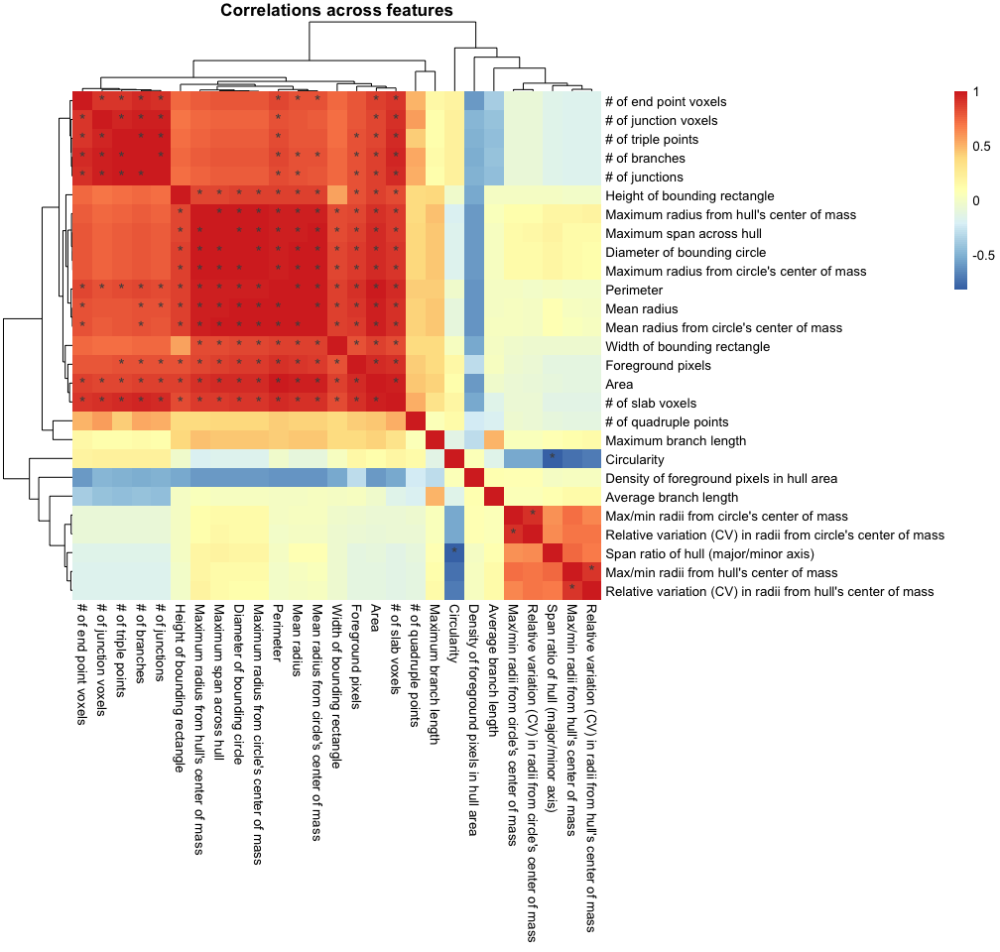<!-- -->

``` r
# to get the underlying stats depicted in the heatmap above
correlationstats <- featurecorrelations_stats(data_2xLPS,
                                             featurestart=9, featureend=35,
                                             rthresh=0.8, pthresh=0.05)
correlationstats %>% head()
```

    ##       measure_a             measure_b correlation pvalues Significant
    ## 1 # of branches         # of branches   1.0000000      NA        <NA>
    ## 2 # of branches # of end point voxels   0.9425514       0 significant
    ## 3 # of branches  # of junction voxels   0.9757485       0 significant
    ## 4 # of branches        # of junctions   0.9970174       0 significant
    ## 5 # of branches # of quadruple points   0.5349538       0          ns
    ## 6 # of branches      # of slab voxels   0.9464104       0 significant

MicrogliaMorphologyR comes with a number of functions which allow you to
explore which features have extreme outliers and how normalizing in
various ways changes your feature distributions. This allows you to
explore and transform your data in a dataset-appropriate manner for
downstream analyses. In later steps, we will be running Principal
Components Analysis (PCA) on our transformed data. PCA is a statistical
technique which identifies the most significant variables and
relationships in your data, and can be used as a pre-processing step to
reduce noise and remove irrelevant features to improve the efficiency
and accuracy of downstream analysis. PCA assumes that the variables in
your dataset follow a normal distribution, and violations of normality
can affect the accuracy of PCA results. Thus, it is important to
transform your data so that the distributions of the values for each
individual morphology measure approximate normality as much as possible.

The morphology features measured using MicrogliaMorphology are often
suitable for PCA after log transformation. Because many of the measures
contain zero values (e.g., numbers of junctions, numbers of branches,
etc.), we need to add a constant to our data prior to log transforming.

### Exploratory data visualization and data transformation for downstream analyses

``` r
# gather your numerical morphology data into one column ('measure') which contains the feature name, and another column ('value') which contains measured values
data_2xLPS_gathered <- data_2xLPS %>% gather(measure, value, 9:ncol(data_2xLPS))

# check for outliers
outliers_boxplots(data_2xLPS_gathered)
```

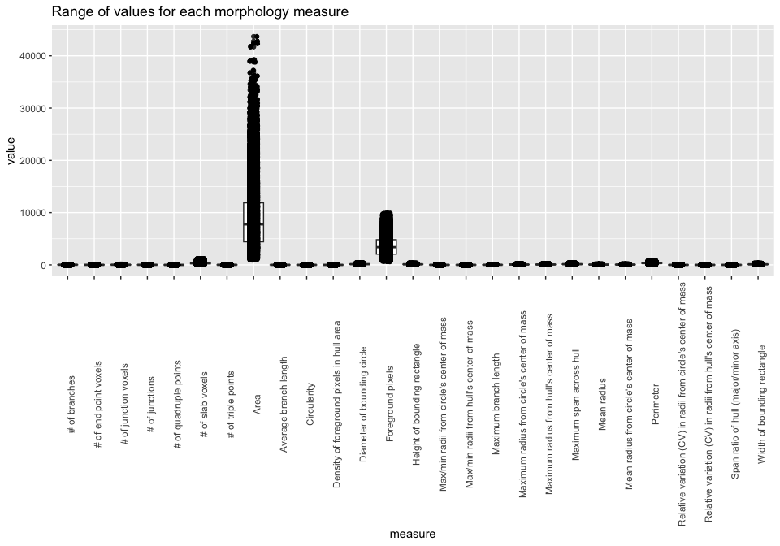<!-- -->

``` r
outliers_distributions(data_2xLPS_gathered)
```

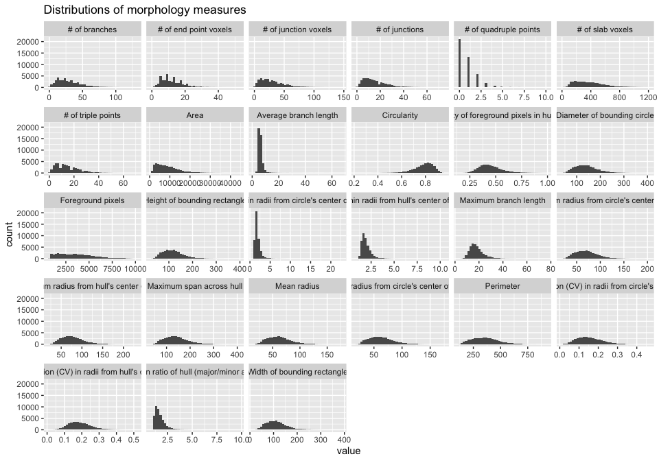<!-- -->

``` r
# checking different normalization features
normalize_logplots(data_2xLPS_gathered,1)
```

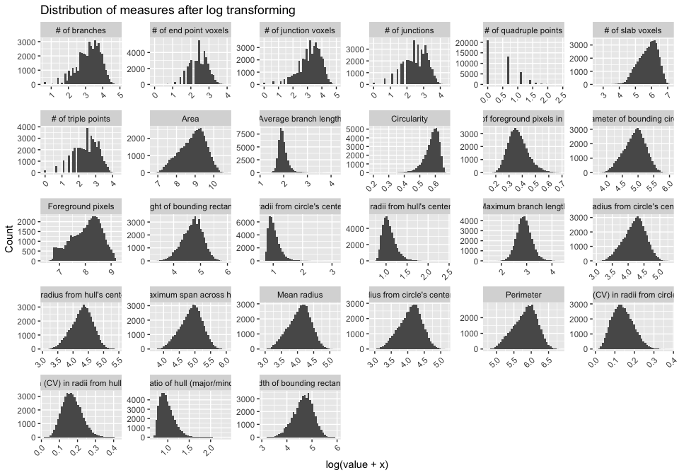<!-- -->

``` r
normalize_minmax(data_2xLPS_gathered)
```

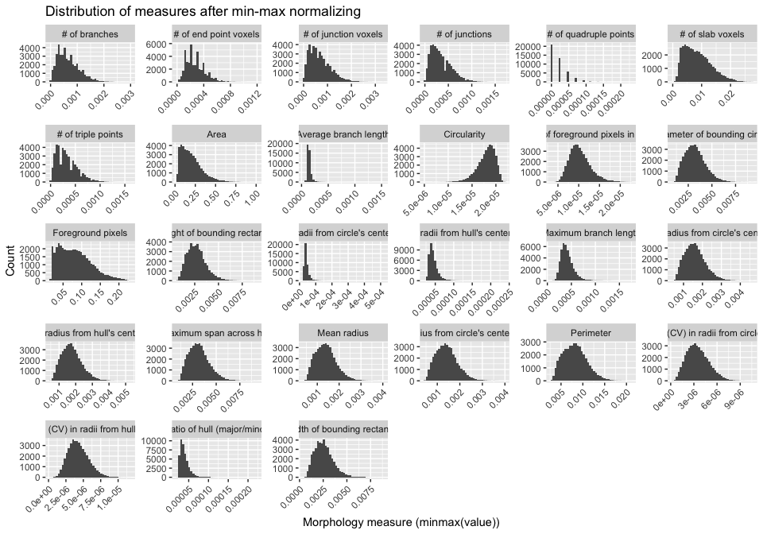<!-- -->

``` r
normalize_scaled(data_2xLPS_gathered)
```

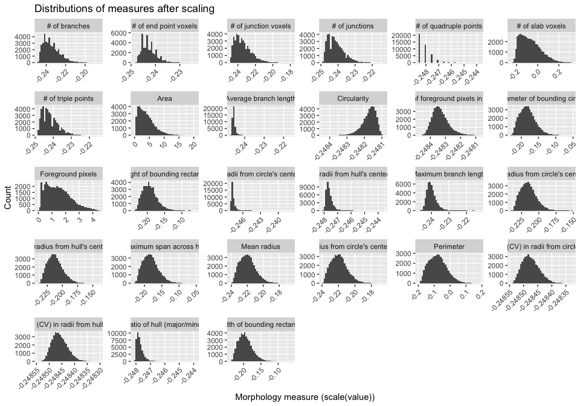<!-- -->

``` r
# transform your data in appropriate manner for downstream analyses
# we will use the logtransformed data as our PCA input
data_2xLPS_logtransformed <- transform_log(data_2xLPS, 1, start=9, end=35) 
data_2xLPS_minmaxtransformed <- transform_minmax(data_2xLPS, start=9, end=35)
data_2xLPS_scaled <- transform_scale(data_2xLPS, start=9, end=35)

# get sample size of data based on factors of interest
samplesize(data_2xLPS, MouseID, Antibody)
```

    ## # A tibble: 18 × 3
    ## # Groups:   MouseID [6]
    ##    MouseID Antibody   num
    ##    <chr>   <chr>    <int>
    ##  1 1       Cx3cr1    1703
    ##  2 1       Iba1      1737
    ##  3 1       P2ry12    2105
    ##  4 2       Cx3cr1    2496
    ##  5 2       Iba1      2927
    ##  6 2       P2ry12    4341
    ##  7 3       Cx3cr1    1145
    ##  8 3       Iba1      1310
    ##  9 3       P2ry12    1978
    ## 10 4       Cx3cr1    1775
    ## 11 4       Iba1      2044
    ## 12 4       P2ry12    2372
    ## 13 5       Cx3cr1    2053
    ## 14 5       Iba1      2302
    ## 15 5       P2ry12    3513
    ## 16 6       Cx3cr1    2771
    ## 17 6       Iba1      3095
    ## 18 6       P2ry12    3665

``` r
samplesize(data_2xLPS, Sex, Treatment, Antibody)
```

    ## # A tibble: 12 × 4
    ## # Groups:   Sex, Treatment [4]
    ##    Sex   Treatment Antibody   num
    ##    <chr> <chr>     <chr>    <int>
    ##  1 F     2xLPS     Cx3cr1    3478
    ##  2 F     2xLPS     Iba1      3781
    ##  3 F     2xLPS     P2ry12    4477
    ##  4 F     PBS       Cx3cr1    3641
    ##  5 F     PBS       Iba1      4237
    ##  6 F     PBS       P2ry12    6319
    ##  7 M     2xLPS     Cx3cr1    2771
    ##  8 M     2xLPS     Iba1      3095
    ##  9 M     2xLPS     P2ry12    3665
    ## 10 M     PBS       Cx3cr1    2053
    ## 11 M     PBS       Iba1      2302
    ## 12 M     PBS       P2ry12    3513

### Obtain density measures for each image (using Areas.csv file output from MicrogliaMorphology)

Note: The areas obtained in this file are dataset-specific and will be
in the units of your original input images

``` r
# list out all variables of interest present in the original image names to obtain numbers of microglia per image
microglianumbers <- samplesize(data_2xLPS, Antibody, MouseID, Sex, Treatment, BrainRegion, Subregion) 
microglianumbers %>% print(n=3, width=Inf)
```

    ## # A tibble: 148 × 7
    ## # Groups:   Antibody, MouseID, Sex, Treatment, BrainRegion [51]
    ##   Antibody MouseID Sex   Treatment BrainRegion Subregion   num
    ##   <chr>    <chr>   <chr> <chr>     <chr>       <chr>     <int>
    ## 1 Cx3cr1   1       F     2xLPS     FC          ACC          93
    ## 2 Cx3cr1   1       F     2xLPS     FC          IL          161
    ## 3 Cx3cr1   1       F     2xLPS     FC          PL          112
    ## # ℹ 145 more rows

``` r
# add Name column back in -- make sure that the resulting strings in the Name column match the names of your original input .tiff files that you used for MicrogliaMorphology !!
microglianumbers <- microglianumbers %>% unite("Name", Antibody:Subregion, sep="_", remove=FALSE) 
microglianumbers %>% print(n=3, width=Inf)
```

    ## # A tibble: 148 × 8
    ## # Groups:   Antibody, MouseID, Sex, Treatment, BrainRegion [51]
    ##   Name                    Antibody MouseID Sex   Treatment BrainRegion Subregion
    ##   <chr>                   <chr>    <chr>   <chr> <chr>     <chr>       <chr>    
    ## 1 Cx3cr1_1_F_2xLPS_FC_ACC Cx3cr1   1       F     2xLPS     FC          ACC      
    ## 2 Cx3cr1_1_F_2xLPS_FC_IL  Cx3cr1   1       F     2xLPS     FC          IL       
    ## 3 Cx3cr1_1_F_2xLPS_FC_PL  Cx3cr1   1       F     2xLPS     FC          PL       
    ##     num
    ##   <int>
    ## 1    93
    ## 2   161
    ## 3   112
    ## # ℹ 145 more rows

``` r
# path to Areas.csv file
AreasPath <- "./README_files/files/Areas.csv" 

# use celldensity function to calculate density at image-level: values are under the "Density" column
Density <- celldensity(AreasPath, microglianumbers)
Density %>% print(n=5, width=Inf)
```

    ## # A tibble: 148 × 10
    ## # Groups:   Antibody, MouseID, Sex, Treatment, BrainRegion [51]
    ##   Name                    Antibody MouseID Sex   Treatment BrainRegion Subregion
    ##   <chr>                   <chr>    <chr>   <chr> <chr>     <chr>       <chr>    
    ## 1 Cx3cr1_1_F_2xLPS_FC_ACC Cx3cr1   1       F     2xLPS     FC          ACC      
    ## 2 Cx3cr1_1_F_2xLPS_FC_IL  Cx3cr1   1       F     2xLPS     FC          IL       
    ## 3 Cx3cr1_1_F_2xLPS_FC_PL  Cx3cr1   1       F     2xLPS     FC          PL       
    ## 4 Cx3cr1_1_F_2xLPS_HC_CA1 Cx3cr1   1       F     2xLPS     HC          CA1      
    ## 5 Cx3cr1_1_F_2xLPS_HC_CA2 Cx3cr1   1       F     2xLPS     HC          CA2      
    ##     num     Area  Density
    ##   <int>    <dbl>    <dbl>
    ## 1    93  333722. 0.000279
    ## 2   161  589983. 0.000273
    ## 3   112  423038. 0.000265
    ## 4   263 1018060. 0.000258
    ## 5    43  172581. 0.000249
    ## # ℹ 143 more rows

##### if you want to group on another variable, and then recalculate calculate density

e.g., calculating density at the brain region-level rather than the
subregion level (which are what the image rois capture in our example
dataset)

``` r
Density %>% 
  group_by(Antibody, MouseID, Sex, Treatment, BrainRegion) %>%
  summarise(num=sum(num), Area=sum(Area)) %>% # calculate new cell numbers and new areas at the brain region level
  mutate(Density=num/Area) # calculate new density at the brain region level
```

    ## `summarise()` has grouped output by 'Antibody', 'MouseID', 'Sex', 'Treatment'.
    ## You can override using the `.groups` argument.

    ## # A tibble: 51 × 8
    ## # Groups:   Antibody, MouseID, Sex, Treatment [18]
    ##    Antibody MouseID Sex   Treatment BrainRegion   num     Area  Density
    ##    <chr>    <chr>   <chr> <chr>     <chr>       <int>    <dbl>    <dbl>
    ##  1 Cx3cr1   1       F     2xLPS     FC            366 1346743. 0.000272
    ##  2 Cx3cr1   1       F     2xLPS     HC            723 2705033. 0.000267
    ##  3 Cx3cr1   1       F     2xLPS     STR           614 2229707. 0.000275
    ##  4 Cx3cr1   2       F     PBS       FC            523 1758434. 0.000297
    ##  5 Cx3cr1   2       F     PBS       HC            667 2448885. 0.000272
    ##  6 Cx3cr1   2       F     PBS       STR          1306 4608609. 0.000283
    ##  7 Cx3cr1   3       F     PBS       FC            412 1496417. 0.000275
    ##  8 Cx3cr1   3       F     PBS       STR           733 2624917. 0.000279
    ##  9 Cx3cr1   4       F     2xLPS     FC            375 1762321. 0.000213
    ## 10 Cx3cr1   4       F     2xLPS     HC            503 2154789. 0.000233
    ## # ℹ 41 more rows

Now, since we have gotten a better feel for our data and how to
transform it, we can proceed with PCA for dimensionality reduction and
downstream clustering. We can see here that the first 3 PCs describe
around \~85% of our data. We can also explore how each PC correlates to
the 27 different morphology features to get a better understanding of
how each PC describes the variability present in the data. This is
useful to inform which to include for downstream clustering steps.

## Dimensionality reduction using PCA

``` r
pcadata_elbow(data_2xLPS_logtransformed, featurestart=9, featureend=35)
```

<!-- -->

``` r
pca_data <- pcadata(data_2xLPS_logtransformed, featurestart=9, featureend=35,
                    pc.start=1, pc.end=10)
head(pca_data,3)
```

    ##           PC1       PC2        PC3        PC4         PC5         PC6
    ## 1 -3.40837468 0.6764322  2.4544974 -0.7011076  0.51923399  0.09841964
    ## 2 -3.97236479 0.6876435 -0.1588262 -1.7816133 -0.29998161 -0.39435933
    ## 3 -0.05205818 0.4984643  1.1106371 -1.7095791  0.05149981 -0.88502415
    ##          PC7        PC8        PC9       PC10 Antibody MouseID Sex Treatment
    ## 1 -0.1887577 -0.2217257 -1.4166585  0.7370713   Cx3cr1       1   F     2xLPS
    ## 2 -0.4914042 -0.5946128  0.1761947 -0.2787745   Cx3cr1       1   F     2xLPS
    ## 3 -0.1504321 -0.1952254 -0.6739042  0.3673300   Cx3cr1       1   F     2xLPS
    ##   BrainRegion Subregion          ID
    ## 1          FC       ACC 00002-01053
    ## 2          FC       ACC 00009-01153
    ## 3          FC       ACC 00015-01224
    ##                                          UniqueID Foreground pixels
    ## 1 Cx3cr1_Paper1_2Hit_1_F_2xLPS_FC_ACC_00002-01053          7.838343
    ## 2 Cx3cr1_Paper1_2Hit_1_F_2xLPS_FC_ACC_00009-01153          7.837554
    ## 3 Cx3cr1_Paper1_2Hit_1_F_2xLPS_FC_ACC_00015-01224          8.516593
    ##   Density of foreground pixels in hull area
    ## 1                                 0.4722511
    ## 2                                 0.5270926
    ## 3                                 0.5027128
    ##   Span ratio of hull (major/minor axis) Maximum span across hull     Area
    ## 1                             0.8187220                 4.516565 8.343078
    ## 2                             0.9121221                 4.512384 8.202756
    ## 3                             0.8887962                 4.867296 8.942330
    ##   Perimeter Circularity Width of bounding rectangle
    ## 1  5.579191   0.5642337                    4.406719
    ## 2  5.458799   0.6092219                    4.219508
    ## 3  5.863106   0.5771189                    4.682131
    ##   Height of bounding rectangle Maximum radius from hull's center of mass
    ## 1                     4.488636                                  3.945005
    ## 2                     4.532599                                  3.927930
    ## 3                     4.779123                                  4.213828
    ##   Max/min radii from hull's center of mass
    ## 1                                 1.017764
    ## 2                                 1.085460
    ## 3                                 1.044754
    ##   Relative variation (CV) in radii from hull's center of mass Mean radius
    ## 1                                                   0.1031882    3.833051
    ## 2                                                   0.1719345    3.666266
    ## 3                                                   0.1264564    4.100085
    ##   Diameter of bounding circle Maximum radius from circle's center of mass
    ## 1                    4.600622                                    3.917470
    ## 2                    4.512384                                    3.830149
    ## 3                    4.884708                                    4.199093
    ##   Max/min radii from circle's center of mass
    ## 1                                  0.9896899
    ## 2                                  0.9603076
    ## 3                                  0.9981288
    ##   Relative variation (CV) in radii from circle's center of mass
    ## 1                                                     0.1008403
    ## 2                                                     0.1573456
    ## 3                                                     0.1276013
    ##   Mean radius from circle's center of mass # of branches # of junctions
    ## 1                                 3.828354      2.564949       1.945910
    ## 2                                 3.649437      2.708050       1.945910
    ## 3                                 4.100996      3.135494       2.484907
    ##   # of end point voxels # of junction voxels # of slab voxels
    ## 1              1.945910             2.564949         5.484797
    ## 2              2.302585             2.708050         5.342334
    ## 3              2.397895             3.135494         5.846439
    ##   Average branch length # of triple points # of quadruple points
    ## 1              2.275111           1.945910             0.0000000
    ## 2              2.044073           1.791759             0.6931472
    ## 3              2.100836           2.397895             0.6931472
    ##   Maximum branch length
    ## 1              3.409033
    ## 2              2.778384
    ## 3              3.102836

### Generate heatmap of correlations between PCs and features

Using the `pcfeaturecorrelations` function, we can investigate the
relationships of our 27 individual morphology measures to the principle
components to examine how each PC is differentially correlated to and
described by different sets of morphology features. For example, we can
see that PC1 is highly positively correlated to features describing
branching complexity and territory span, meaning that individual cells
with greater branching complexity or area have higher PC1 scores in our
dataset. Similarly, the variability in our dataset represented in PC2 is
described by cell shape: 1) *circularity* (circularity, max/min radii
from center, span ratio of hull) and 2) *branching homogeneity*
(relative variation (CV) from center of mass), and PC3 is described by
branch length-related measures. Generally, you will see the same types
of features describing the first four PCs after dimensionality
reduction, although the directionality of the correlations could be
inversed, which is normal as long as the sets of features that are
highly correlated (e.g., circularity and branching homogeneity for PC2)
are still maintained.

``` r
pcfeaturecorrelations(pca_data, pc.start=1, pc.end=3, 
                      feature.start=19, feature.end=45, 
                      rthresh=0.75, pthresh=0.05, 
                      title="Correlation between PCs and features")
```

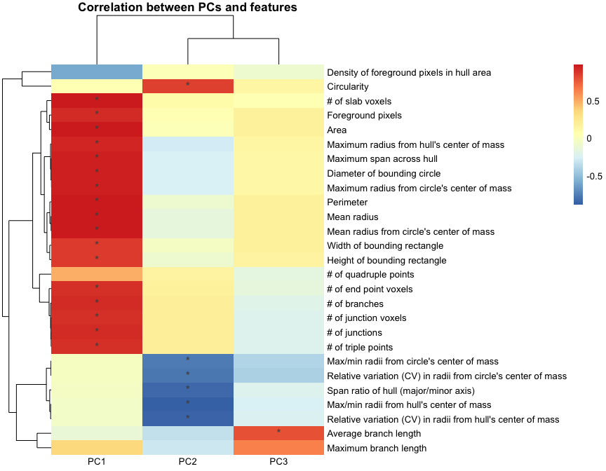<!-- -->

``` r
# to get the underlying stats depicted in the heatmap above
correlationstats <- pcfeaturecorrelations_stats(pca_data, pc.start=1, pc.end=3,
                                                feature.start=19, feature.end=45,
                                                rthresh=0.75, pthresh=0.05)
correlationstats %>% head()
```

    ##               measure_a measure_b correlation pvalues Significant
    ## 1         # of branches       PC1   0.9202371       0 significant
    ## 2         # of branches       PC2   0.1922737       0          ns
    ## 3         # of branches       PC3  -0.2115683       0          ns
    ## 4 # of end point voxels       PC1   0.9063301       0 significant
    ## 5 # of end point voxels       PC2   0.1644570       0          ns
    ## 6 # of end point voxels       PC3  -0.1465995       0          ns

### Visually explore different sources of variability in dataset

``` r
# gather your data by experimental variables (e.g., Treatment, Sex, MouseID, etc.)
gathered_expvariables <- pca_data %>% gather(variable, value, 11:16) 

plots_expvariable(gathered_expvariables, "PC1", "PC2")
```

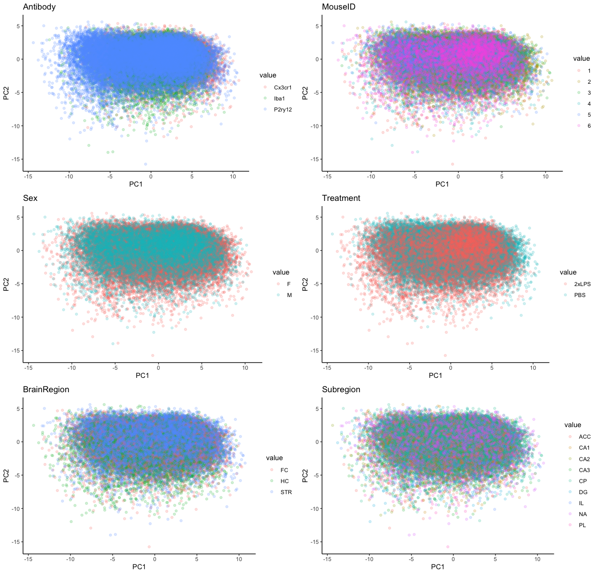<!-- -->

## K-means clustering on PCs

After performing dimensionality reduction, we can use our PCs as input
for downstream clustering methods. In this tutorial, we cluster our
cells into morphological classes using k-means clustering, which
partitions data points within a given dataset into defined numbers of
clusters based on their proximity to the nearest cluster’s centroid. We
provide an example at the end of the Github to depict a use case for
fuzzy k-means clustering, a soft clustering approach and another option
which allows for extended analyses such as characterization of the
‘most’ ameboid, hypertrophic, rod-like, or ramified cells or
characterization of cells with more ambiguous identities that lie
between these morphological states - see [‘Fuzzy K-means clustering’
section](https://github.com/ciernialab/MicrogliaMorphologyR#fuzzy-k-means-clustering)
at the end of Github for more details about the method. Because our
toolset is highly flexible, it can also be integrated with other
clustering approaches such as hierarchical clustering or gaussian
mixture models.

When running kmeans clustering, from the number of clusters (K) that you
specify to create, the algorithm will randomly select K initial cluster
centers. Each other data point’s euclidean distance will be calculated
from these initial centers so that they are assigned as belonging to the
cluster that they are closest to. The centroids for each of the clusters
will be updated by calculating the new means of all the points assigned
to each cluster. The process of randomly setting initial centers,
assigning data points to the clusters, and updating the cluster
centroids is iterated until the maximum number of iterations is reached.

Thus, 2 main dataset-specific parameters that you should specify and
troubleshoot for your dataset are:

-   **iter.max**, the maximum number of iterations allowed, and the
    number of times kmeans algorithm is run before results are returned.
    An iter.max between 10-20 is recommended
-   **nstart**, how many random sets should be chosen. An nstart of
    atleast 25 initial configurations is recommended.

You can read more about kmeans clustering and optimizing these
parameters at the following links:

-   [K-means Cluster Analysis](https://uc-r.github.io/kmeans_clustering)
-   [K Means parameters and results (in R Studio)
    explained](https://andrea-grianti.medium.com/kmeans-parameters-in-rstudio-explained-c493ec5a05df)

### Prepare data for clustering

``` r
## for k-means clustering: scale PCs 1-3, which together describe ~85% of variability
pca_data_scale <- transform_scale(pca_data, start=1, end=3) # scale pca data as input for k-means clustering
kmeans_input <- pca_data_scale[1:3]
```

### Cluster optimization prior to running fuzzy k-means

``` r
# check for optimal number of clusters using wss and silhouette methods
sampling <- kmeans_input[sample(nrow(kmeans_input), 5000),] #sample 5000 random rows for cluster optimization

fviz_nbclust(sampling, kmeans, method = 'wss', nstart=25, iter.max=50) # 4 clusters
```

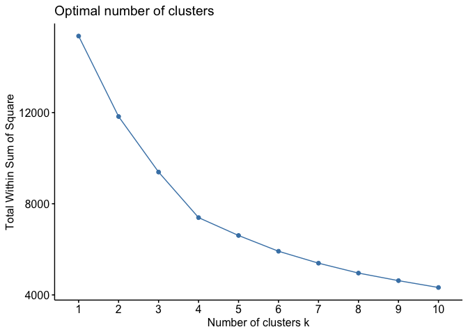<!-- -->

``` r
fviz_nbclust(sampling, kmeans, method = 'silhouette', nstart=25, iter.max=50) # 4 clusters
```

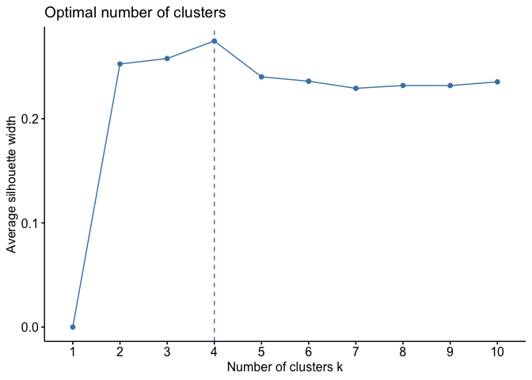<!-- -->

From using the wss and silhouette methods to check the optimal numbers
of clusters for our dataset, it appears that our data would be optimally
clustered using k=4. There are many more [cluster optimization
methods](http://www.sthda.com/english/articles/29-cluster-validation-essentials/96-determiningthe-optimal-number-of-clusters-3-must-know-methods/)
that you can try out to explore your data.

Next, we proceed with the actual clustering. You can cluster using fuzzy
k-means or regular k-means at this step. After clustering, we will use
some built-in functions within MicrogliaMorphologyR to assess how a
parameter of k=4 influences how the clusters are defined by morphology
features (and if they make sense according to what we know about
microglia morphology). As this step may require some troubleshooting and
updating of clustering parameters, you may need to run your k-means
function multiple times. If you are planning to use fuzzy k-means, keep
in mind that the **soft clustering approach is more time-intensive and
computationally expensive** as it also calculates membership scores to
each cluster for every single cell. It might help to use regular k-means
as a first pass, verify that your clusters make sense using the
functions that follow, and run your fuzzy k-means function using the
final parameters that you determine to generate your final dataset for
downstream analysis.

For the analysis proceeding, we are working with the regular k-means
clustering output. We provide an example of a use case for fuzzy k-means
clustering and further description of this approach at the [end of the
Github](https://github.com/ciernialab/MicrogliaMorphologyR#fuzzy-k-means-clustering)
if you are interested.

### Fuzzy k-means (soft clustering)

``` r
# cluster and combine with original data
data_kmeans <- fcm(kmeans_input, centers=4, nstart=25)
pca_kmeans <- cbind(pca_data[1:5], data_kmeans)
```

### Regular k-means (hard clustering)

``` r
# cluster and combine with original data
data_kmeans <- kmeans(kmeans_input, centers=4)

# Here, we are creating a new data frame that contains the first 2 PCs and original dataset, then renaming the data_kmeans$cluster column to simply say "Cluster". You can bind together as many of the PCs as you want. Binding the original, untransformed data is useful if you want to plot the raw values of any individual morphology measures downstream. 
pca_kmeans <- cbind(pca_data[1:2], data_2xLPS, as.data.frame(data_kmeans$cluster)) %>%
  rename(Cluster=`data_kmeans$cluster`) 
head(pca_kmeans,3)
```

    ##           PC1       PC2 Antibody MouseID Sex Treatment BrainRegion Subregion
    ## 1 -3.40837468 0.6764322   Cx3cr1       1   F     2xLPS          FC       ACC
    ## 2 -3.97236479 0.6876435   Cx3cr1       1   F     2xLPS          FC       ACC
    ## 3 -0.05205818 0.4984643   Cx3cr1       1   F     2xLPS          FC       ACC
    ##            ID                                        UniqueID Foreground pixels
    ## 1 00002-01053 Cx3cr1_Paper1_2Hit_1_F_2xLPS_FC_ACC_00002-01053              2535
    ## 2 00009-01153 Cx3cr1_Paper1_2Hit_1_F_2xLPS_FC_ACC_00009-01153              2533
    ## 3 00015-01224 Cx3cr1_Paper1_2Hit_1_F_2xLPS_FC_ACC_00015-01224              4996
    ##   Density of foreground pixels in hull area
    ## 1                                    0.6036
    ## 2                                    0.6940
    ## 3                                    0.6532
    ##   Span ratio of hull (major/minor axis) Maximum span across hull Area Perimeter
    ## 1                                1.2676                  90.5207 4200  263.8573
    ## 2                                1.4896                  90.1388 3650  233.8153
    ## 3                                1.4322                 128.9690 7648  350.8153
    ##   Circularity Width of bounding rectangle Height of bounding rectangle
    ## 1      0.7581                          81                           88
    ## 2      0.8390                          67                           92
    ## 3      0.7809                         107                          118
    ##   Maximum radius from hull's center of mass
    ## 1                                   50.6766
    ## 2                                   49.8017
    ## 3                                   66.6149
    ##   Max/min radii from hull's center of mass
    ## 1                                   1.7670
    ## 2                                   1.9608
    ## 3                                   1.8427
    ##   Relative variation (CV) in radii from hull's center of mass Mean radius
    ## 1                                                      0.1087     45.2033
    ## 2                                                      0.1876     38.1056
    ## 3                                                      0.1348     59.3454
    ##   Diameter of bounding circle Maximum radius from circle's center of mass
    ## 1                     98.5462                                     49.2731
    ## 2                     90.1388                                     45.0694
    ## 3                    131.2519                                     65.6259
    ##   Max/min radii from circle's center of mass
    ## 1                                     1.6904
    ## 2                                     1.6125
    ## 3                                     1.7132
    ##   Relative variation (CV) in radii from circle's center of mass
    ## 1                                                        0.1061
    ## 2                                                        0.1704
    ## 3                                                        0.1361
    ##   Mean radius from circle's center of mass # of branches # of junctions
    ## 1                                  44.9868            12              6
    ## 2                                  37.4530            14              6
    ## 3                                  59.4004            22             11
    ##   # of end point voxels # of junction voxels # of slab voxels
    ## 1                     6                   12              240
    ## 2                     9                   14              208
    ## 3                    10                   22              345
    ##   Average branch length # of triple points # of quadruple points
    ## 1                 8.729                  6                     0
    ## 2                 6.722                  5                     1
    ## 3                 7.173                 10                     1
    ##   Maximum branch length Cluster
    ## 1                29.236       4
    ## 2                15.093       2
    ## 3                21.261       3

### Plot k-means clusters in PC space

``` r
plot <- clusterplots(pca_kmeans, "PC1", "PC2")
plot
```

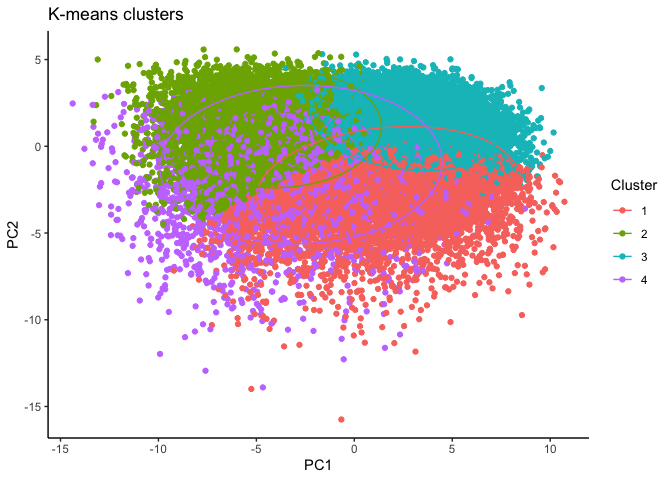<!-- -->

``` r
plot + scale_colour_viridis_d() # customizeable example: add color scheme of choice 
```

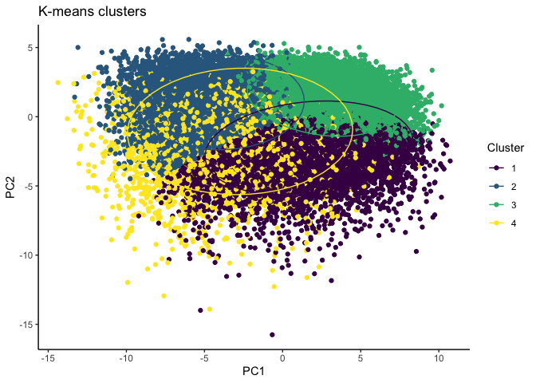<!-- -->

### Cluster-specific measures on average for each morphology feature, relative to other clusters

``` r
clusterfeatures(pca_kmeans, featurestart=11, featureend=37)
```

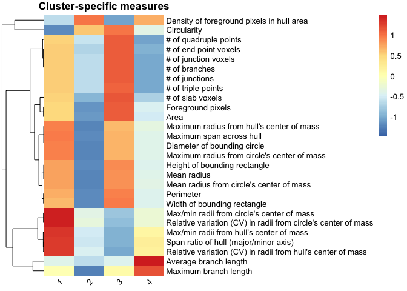<!-- -->

After comparing the individual features across clusters, we can
characterize the clusters as follows:

-   Cluster 1 = rod-like (greatest oblongness, lowest circularity)
-   Cluster 2 = ameboid (lowest territory span, high circularity,
    smallest branch lengths)
-   Cluster 3 = ramified (largest territory span and branching
    complexity)
-   Cluster 4 = hypertrophic (average territory span, high branch
    thickness as explained by pixel density in hull)

### ColorByCluster

Using the cluster classes assigned from our analyses using
MicrogliaMorphologyR, we can color each cell in the original image by
cluster using the MicrogliaMorphology ImageJ macro. In the following
example, we are isolating out the Cluster assignments for each microglia
in the Cx3cr1-stained ACC subregion image for Mouse 1. You can do this
for all of the images you are interested in applying ColorByCluster to.
This offers an additional method by which to visually assess and verify
your suspected cluster identities before deeming them ramifed,
hyper-ramified, rod-like, ameboid, or any other morphological form for
downstream analysis and interpretation.

Make sure to filter for *only* the cells belonging to the image you want
to run ColorByCluster on.

#### Formatting data for ColorByCluster input (Color coding in ImageJ)

``` r
# isolate out all the cells for your specific image of interest
colorbycluster <- pca_kmeans %>% 
  filter(Antibody=="Cx3cr1",MouseID=="1", BrainRegion=="FC", Subregion=="ACC") %>% select(c(Cluster, ID))
head(colorbycluster)
```

    ##   Cluster          ID
    ## 1       4 00002-01053
    ## 2       2 00009-01153
    ## 3       3 00015-01224
    ## 4       4 00016-01229
    ## 5       4 00039-01394
    ## 6       4 00044-01397

#### Save .csv file to feed into ColorByCluster function in MicrogliaMorphology ImageJ macro

``` r
write.csv(colorbycluster, "filepath/Cxc3cr_Mouse1_FC_ACC_data.csv")
```

### Cluster characterization

``` r
# calculate cluster percentages across variables of interest
cp <- clusterpercentage(pca_kmeans, "Cluster", MouseID, Antibody, Treatment, Sex, BrainRegion)
cp$Treatment <- factor(cp$Treatment, levels=c("PBS","2xLPS"))

# update cluster labels
cp <- cp %>% mutate(Cluster = 
                      case_when(Cluster=="1" ~ "Rod-like",
                                Cluster=="2" ~ "Ameboid",
                                Cluster=="3" ~ "Ramified",
                                Cluster=="4" ~ "Hypertrophic"))

# Quick check of cluster proportions when considering experimental variables of interest
cp %>% 
  filter(BrainRegion=="STR") %>% # in this example, we filter for our brain region of interest
  clusterpercentage_boxplots(Antibody, Treatment) # grouping variables
```

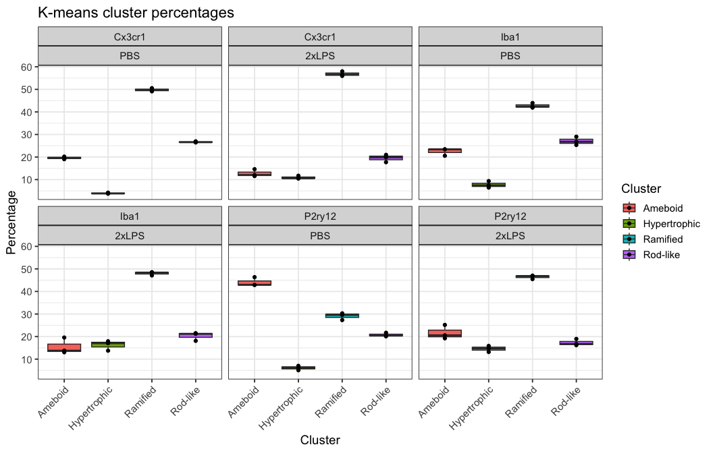<!-- -->

``` r
# example graph of data given variables of interest
cp %>% 
  filter(Antibody=="Iba1") %>%
  ggplot(aes(x=Cluster, y=percentage, group=interaction(Cluster, Treatment))) +
  facet_wrap(~BrainRegion) +
  geom_boxplot(aes(group=interaction(Cluster, Treatment), fill=Treatment)) +
  scale_fill_manual(values=c("#fde725","#482878")) +
  geom_point(position=position_dodge(width=0.8), size=0.75, aes(group=interaction(Cluster,Treatment), color=Sex)) +
  ggtitle("2xLPS mouse dataset: K-means clusters") +
  labs(fill="Treatment") +
  theme_bw(base_size=14) +
  theme(axis.text.x=element_text(angle=45, vjust=1, hjust=1))
```

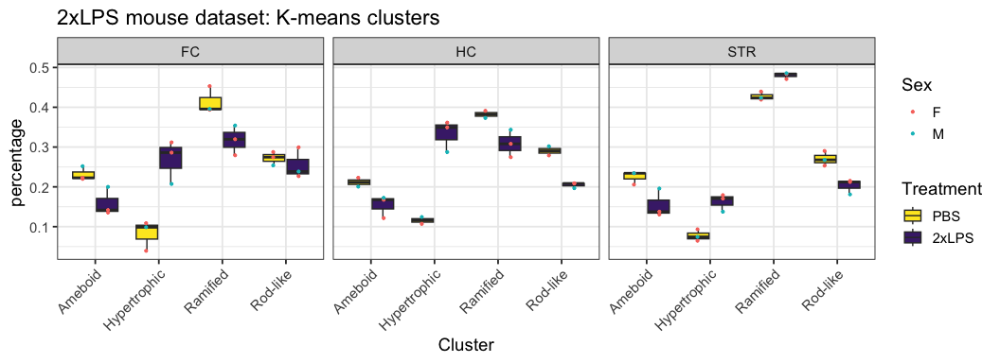<!-- -->

## Statistical analysis

MicrogliaMorphologyR includes a few functions to run stats on cluster
percentages as well as on individual morphology measures.

### Cluster percentage changes at animal level, in response to experimental variables

#### e.g., Across clusters - How does cluster membership change with LPS?

The stats_cluster.animal function fits a generalized linear mixed model
on your dataset to a beta distribution, which is suitable for values
like percentages or probabilities that are constrained to a range of
0-1, using the `glmmTMB` package. Part of the output includes a check of
the model fit using the `DHARMa` package, which “uses a simulation-based
approach to create readily interpretable scaled (quantile) residuals for
fitted (generalized) linear mixed models.” The function creates two
`DHARMa` plots, contained in output\[\[4\]\]. You can read more about
how to interpret model fit using `DHARMa` by reading the package
[vignette](https://cran.r-project.org/web/packages/DHARMa/vignettes/DHARMa.html).

In this example, we are fitting the generalized linear mixed model to
our Iba1-stained dataset to model the percentage of cluster membership
as a factor of Cluster identity, Treatment, and BrainRegion interactions
with MouseID as a repeated measure since the outcome variable (cluster
percentages) is represented multiple times per animal. In the first
posthoc correction, we are correcting for multiple tests between
treatments (PBS vs. 2xLPS) across Clusters and BrainRegions using the
Bonferroni method - since there are 4 clusters and 3 brain regions, we
should be correcting across 12 tests. In the second posthoc correction,
we are correcting for multiple tests between treatments (PBS vs. 2xLPS)
across Clusters using the Bonferroni method - since there are 4
clusters, we should be correcting across 4 tests.

``` r
# prepare percentages dataset for downstream analysis
stats.input <- cp
stats.input$MouseID <- factor(stats.input$MouseID)
stats.input$Cluster <- factor(stats.input$Cluster)
stats.input$Treatment <- factor(stats.input$Treatment)

# run stats analysis for changes in cluster percentages, at the animal level
# you can specify up to two posthoc comparisons (posthoc1 and posthoc2 arguments) - if you only have one set of posthocs to run, specify the same comparison twice for both arguments. you will just get the same results in output[[2]] and output[[3]].
stats.testing <- stats_cluster.animal(data = stats.input %>% filter(Antibody=="Iba1"), 
                                      model = "percentage ~ Cluster*Treatment*BrainRegion + (1|MouseID)", 
                                      posthoc1 = "~Treatment|Cluster|BrainRegion", 
                                      posthoc2 = "~Treatment|Cluster", adjust = "bonferroni")
```

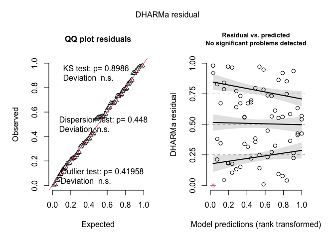<!-- -->

    ## NOTE: Results may be misleading due to involvement in interactions

    ## Formula:          
    ## percentage ~ Cluster * Treatment * BrainRegion + (1 | MouseID)
    ## Data: data
    ##       AIC       BIC    logLik  df.resid 
    ## -264.2217 -206.5145  158.1109        42 
    ## Random-effects (co)variances:
    ## 
    ## Conditional model:
    ##  Groups  Name        Std.Dev. 
    ##  MouseID (Intercept) 2.874e-06
    ## 
    ## Number of obs: 68 / Conditional model: MouseID, 6
    ## 
    ## Dispersion parameter for beta family ():  296 
    ## 
    ## Fixed Effects:
    ## 
    ## Conditional model:
    ##                      (Intercept)                          Cluster1  
    ##                        -1.190535                         -0.280517  
    ##                         Cluster2                          Cluster3  
    ##                        -0.530336                          0.729137  
    ##                       Treatment1                      BrainRegion1  
    ##                        -0.034300                         -0.001085  
    ##                     BrainRegion2               Cluster1:Treatment1  
    ##                         0.032280                          0.258393  
    ##              Cluster2:Treatment1               Cluster3:Treatment1  
    ##                        -0.571028                          0.123271  
    ##            Cluster1:BrainRegion1             Cluster2:BrainRegion1  
    ##                         0.038133                         -0.026514  
    ##            Cluster3:BrainRegion1             Cluster1:BrainRegion2  
    ##                        -0.093337                         -0.070106  
    ##            Cluster2:BrainRegion2             Cluster3:BrainRegion2  
    ##                         0.327990                         -0.213648  
    ##          Treatment1:BrainRegion1           Treatment1:BrainRegion2  
    ##                        -0.026359                          0.016676  
    ## Cluster1:Treatment1:BrainRegion1  Cluster2:Treatment1:BrainRegion1  
    ##                         0.040356                         -0.105077  
    ## Cluster3:Treatment1:BrainRegion1  Cluster1:Treatment1:BrainRegion2  
    ##                         0.146770                         -0.041974  
    ## Cluster2:Treatment1:BrainRegion2  Cluster3:Treatment1:BrainRegion2  
    ##                        -0.074843                          0.057942

``` r
stats.testing[[1]] # anova
```

    ## Analysis of Deviance Table (Type II Wald chisquare tests)
    ## 
    ## Response: percentage
    ##                                  Chisq Df Pr(>Chisq)    
    ## Cluster                       632.4489  3  < 2.2e-16 ***
    ## Treatment                       1.2604  1     0.2616    
    ## BrainRegion                     0.2084  2     0.9010    
    ## Cluster:Treatment             271.0010  3  < 2.2e-16 ***
    ## Cluster:BrainRegion           120.9206  6  < 2.2e-16 ***
    ## Treatment:BrainRegion           2.0685  2     0.3555    
    ## Cluster:Treatment:BrainRegion  38.4144  6  9.321e-07 ***
    ## ---
    ## Signif. codes:  0 '***' 0.001 '**' 0.01 '*' 0.05 '.' 0.1 ' ' 1

``` r
stats.testing[[2]] # posthoc 1
```

    ##  contrast    Cluster      BrainRegion   estimate         SE  df z.ratio p.value
    ##  PBS - 2xLPS Ameboid      FC           0.4761810 0.12097423 Inf   3.936  0.0010
    ##  PBS - 2xLPS Hypertrophic FC          -1.4735270 0.14575418 Inf -10.110  <.0001
    ##  PBS - 2xLPS Ramified     FC           0.4187652 0.09890623 Inf   4.234  0.0003
    ##  PBS - 2xLPS Rod-like     FC           0.0933096 0.10739883 Inf   0.869  1.0000
    ##  PBS - 2xLPS Ameboid      HC           0.3975890 0.13631864 Inf   2.917  0.0425
    ##  PBS - 2xLPS Hypertrophic HC          -1.3269896 0.14559103 Inf  -9.115  <.0001
    ##  PBS - 2xLPS Ramified     HC           0.3271790 0.11116900 Inf   2.943  0.0390
    ##  PBS - 2xLPS Rod-like     HC           0.4612288 0.12234620 Inf   3.770  0.0020
    ##  PBS - 2xLPS Ameboid      STR          0.4707876 0.12231266 Inf   3.849  0.0014
    ##  PBS - 2xLPS Hypertrophic STR         -0.8314491 0.15327901 Inf  -5.424  <.0001
    ##  PBS - 2xLPS Ramified     STR         -0.2121170 0.09521815 Inf  -2.228  0.3108
    ##  PBS - 2xLPS Rod-like     STR          0.3758423 0.11203993 Inf   3.355  0.0095
    ##  Significant
    ##  significant
    ##  significant
    ##  significant
    ##  ns         
    ##  significant
    ##  significant
    ##  significant
    ##  significant
    ##  significant
    ##  significant
    ##  ns         
    ##  significant
    ## 
    ## Results are given on the log odds ratio (not the response) scale. 
    ## P value adjustment: bonferroni method for 12 tests

``` r
stats.testing[[3]] # posthoc 2
```

    ##  contrast    Cluster        estimate         SE  df z.ratio p.value Significant
    ##  PBS - 2xLPS Ameboid       0.4481859 0.07316652 Inf   6.126  <.0001 significant
    ##  PBS - 2xLPS Hypertrophic -1.2106552 0.08561031 Inf -14.141  <.0001 significant
    ##  PBS - 2xLPS Ramified      0.1779424 0.05888547 Inf   3.022  0.0100 significant
    ##  PBS - 2xLPS Rod-like      0.3101269 0.06587576 Inf   4.708  <.0001 significant
    ## 
    ## Results are averaged over the levels of: BrainRegion 
    ## Results are given on the log odds ratio (not the response) scale. 
    ## P value adjustment: bonferroni method for 4 tests

``` r
stats.testing[[4]] # DHARMa model check
```

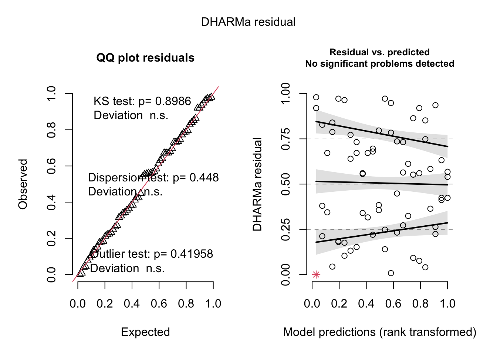<!-- -->

``` r
stats.testing[[5]] # summary of model
```

    ## Formula:          
    ## percentage ~ Cluster * Treatment * BrainRegion + (1 | MouseID)
    ## Data: data
    ##       AIC       BIC    logLik  df.resid 
    ## -264.2217 -206.5145  158.1109        42 
    ## Random-effects (co)variances:
    ## 
    ## Conditional model:
    ##  Groups  Name        Std.Dev. 
    ##  MouseID (Intercept) 2.874e-06
    ## 
    ## Number of obs: 68 / Conditional model: MouseID, 6
    ## 
    ## Dispersion parameter for beta family ():  296 
    ## 
    ## Fixed Effects:
    ## 
    ## Conditional model:
    ##                      (Intercept)                          Cluster1  
    ##                        -1.190535                         -0.280517  
    ##                         Cluster2                          Cluster3  
    ##                        -0.530336                          0.729137  
    ##                       Treatment1                      BrainRegion1  
    ##                        -0.034300                         -0.001085  
    ##                     BrainRegion2               Cluster1:Treatment1  
    ##                         0.032280                          0.258393  
    ##              Cluster2:Treatment1               Cluster3:Treatment1  
    ##                        -0.571028                          0.123271  
    ##            Cluster1:BrainRegion1             Cluster2:BrainRegion1  
    ##                         0.038133                         -0.026514  
    ##            Cluster3:BrainRegion1             Cluster1:BrainRegion2  
    ##                        -0.093337                         -0.070106  
    ##            Cluster2:BrainRegion2             Cluster3:BrainRegion2  
    ##                         0.327990                         -0.213648  
    ##          Treatment1:BrainRegion1           Treatment1:BrainRegion2  
    ##                        -0.026359                          0.016676  
    ## Cluster1:Treatment1:BrainRegion1  Cluster2:Treatment1:BrainRegion1  
    ##                         0.040356                         -0.105077  
    ## Cluster3:Treatment1:BrainRegion1  Cluster1:Treatment1:BrainRegion2  
    ##                         0.146770                         -0.041974  
    ## Cluster2:Treatment1:BrainRegion2  Cluster3:Treatment1:BrainRegion2  
    ##                        -0.074843                          0.057942

### Individual morphology measures, at the animal level (averaged across cells for each animal)

#### e.g., How does each individual morphology measure change with LPS treatment?

The stats_morphologymeasures.animal function fits a linear model using
the `lm` function for each morphology measure individually within your
dataset.

In this example, we are fitting the linear model to our Iba1-stained
dataset to model the values of each morphology measure as a factor of
Treatment and BrainRegion interactions. In the first posthoc correction,
we are correcting for multiple comparisons between treatments (PBS
vs. 2xLPS) across BrainRegions using the Bonferroni method - since there
are 3 brain regions, we should be correcting across 3 tests for each
morphology measure. In the second posthoc correction, we are correcting
for multiple comparisons between every individual interaction of
treatment (PBS or 2xLPS) and brain region (FC, HC, STR) against the
others (e.g., 2xLPS FC vs. PBS STR) and should be correcting across 15
tests for each morphology measure. In the second example, we are testing
all possible comparisons given the experimental variables in our model,
and are thus considering many tests that aren’t biologically relevant or
useful in our experiment.

``` r
# prepare data for downstream analysis
data <- data_2xLPS %>% 
  group_by(MouseID, Sex, Treatment, BrainRegion, Antibody) %>% 
  summarise(across("Foreground pixels":"Maximum branch length", ~mean(.x))) %>% 
  gather(Measure, Value, "Foreground pixels":"Maximum branch length")
```

    ## `summarise()` has grouped output by 'MouseID', 'Sex', 'Treatment',
    ## 'BrainRegion'. You can override using the `.groups` argument.

``` r
# filter out data you want to run stats on and make sure to make any variables included in model into factors
stats.input <- data 
stats.input$Treatment <- factor(stats.input$Treatment)

# run stats analysis for changes in individual morphology measures
# you can specify up to two posthoc comparisons (posthoc1 and posthoc2 arguments) - if you only have one set of posthocs to run, specify the same comparison twice for both arguments. you will just get the same results in output[[2]] and output[[3]].
stats.testing <- stats_morphologymeasures.animal(data = stats.input %>% filter(Antibody=="Iba1"), 
                                                 model = "Value ~ Treatment*BrainRegion", type="lm",
                                                 posthoc1 = "~Treatment|BrainRegion", 
                                                 posthoc2 = "~Treatment*BrainRegion", adjust = "bonferroni")
```

    ## [1] "Foreground pixels"
    ## [1] "Density of foreground pixels in hull area"
    ## [1] "Span ratio of hull (major/minor axis)"
    ## [1] "Maximum span across hull"
    ## [1] "Area"
    ## [1] "Perimeter"
    ## [1] "Circularity"
    ## [1] "Width of bounding rectangle"
    ## [1] "Height of bounding rectangle"
    ## [1] "Maximum radius from hull's center of mass"
    ## [1] "Max/min radii from hull's center of mass"
    ## [1] "Relative variation (CV) in radii from hull's center of mass"
    ## [1] "Mean radius"
    ## [1] "Diameter of bounding circle"
    ## [1] "Maximum radius from circle's center of mass"
    ## [1] "Max/min radii from circle's center of mass"
    ## [1] "Relative variation (CV) in radii from circle's center of mass"
    ## [1] "Mean radius from circle's center of mass"
    ## [1] "# of branches"
    ## [1] "# of junctions"
    ## [1] "# of end point voxels"
    ## [1] "# of junction voxels"
    ## [1] "# of slab voxels"
    ## [1] "Average branch length"
    ## [1] "# of triple points"
    ## [1] "# of quadruple points"
    ## [1] "Maximum branch length"

``` r
# anova
stats.testing[[1]] %>% head(8)
```

    ##                              Sum Sq Df   F value       Pr(>F)
    ## Treatment              6.875349e+05  1 65.060279 6.040851e-06
    ## BrainRegion            6.273589e+04  2  2.968296 9.313579e-02
    ## Treatment:BrainRegion  6.182606e+04  2  2.925248 9.578334e-02
    ## Residuals              1.162443e+05 11        NA           NA
    ## Treatment1             2.318244e-02  1 61.707786 7.765694e-06
    ## BrainRegion1           5.230256e-03  2  6.961034 1.112878e-02
    ## Treatment:BrainRegion1 1.396941e-03  2  1.859211 2.015685e-01
    ## Residuals1             4.132491e-03 11        NA           NA
    ##                                                          measure Significant
    ## Treatment                                      Foreground pixels significant
    ## BrainRegion                                    Foreground pixels          ns
    ## Treatment:BrainRegion                          Foreground pixels          ns
    ## Residuals                                      Foreground pixels        <NA>
    ## Treatment1             Density of foreground pixels in hull area significant
    ## BrainRegion1           Density of foreground pixels in hull area significant
    ## Treatment:BrainRegion1 Density of foreground pixels in hull area          ns
    ## Residuals1             Density of foreground pixels in hull area        <NA>

``` r
# posthoc 1
stats.testing[[2]] %>% head(6)
```

    ##  contrast    BrainRegion estimate       SE df t.ratio p.value
    ##  2xLPS - PBS FC          244.1962 83.93513 11   2.909  0.0426
    ##  2xLPS - PBS HC          464.8970 93.84233 11   4.954  0.0013
    ##  2xLPS - PBS STR         516.7580 83.93513 11   6.157  0.0002
    ##  2xLPS - PBS FC            0.0730  0.01583 11   4.613  0.0022
    ##  2xLPS - PBS HC            0.1004  0.01769 11   5.675  0.0004
    ##  2xLPS - PBS STR           0.0547  0.01583 11   3.456  0.0161
    ##  measure                                   Significant
    ##  Foreground pixels                         significant
    ##  Foreground pixels                         significant
    ##  Foreground pixels                         significant
    ##  Density of foreground pixels in hull area significant
    ##  Density of foreground pixels in hull area significant
    ##  Density of foreground pixels in hull area significant
    ## 
    ## P value adjustment: bonferroni method for 3 tests

``` r
# posthoc 2
stats.testing[[3]] %>% head(6)
```

    ##  contrast              estimate       SE df t.ratio p.value measure          
    ##  2xLPS FC - PBS FC     244.1962 83.93513 11   2.909  0.2131 Foreground pixels
    ##  2xLPS FC - 2xLPS HC    37.2602 83.93513 11   0.444  1.0000 Foreground pixels
    ##  2xLPS FC - PBS HC     502.1572 93.84233 11   5.351  0.0035 Foreground pixels
    ##  2xLPS FC - 2xLPS STR  -25.7262 83.93513 11  -0.307  1.0000 Foreground pixels
    ##  2xLPS FC - PBS STR    491.0318 83.93513 11   5.850  0.0017 Foreground pixels
    ##  PBS FC - 2xLPS HC    -206.9360 83.93513 11  -2.465  0.4706 Foreground pixels
    ##  Significant
    ##  ns         
    ##  ns         
    ##  significant
    ##  ns         
    ##  significant
    ##  ns         
    ## 
    ## P value adjustment: bonferroni method for 15 tests

``` r
# qqplots to check normality assumptions
do.call("grid.arrange", c(stats.testing[[4]], ncol=4))
```

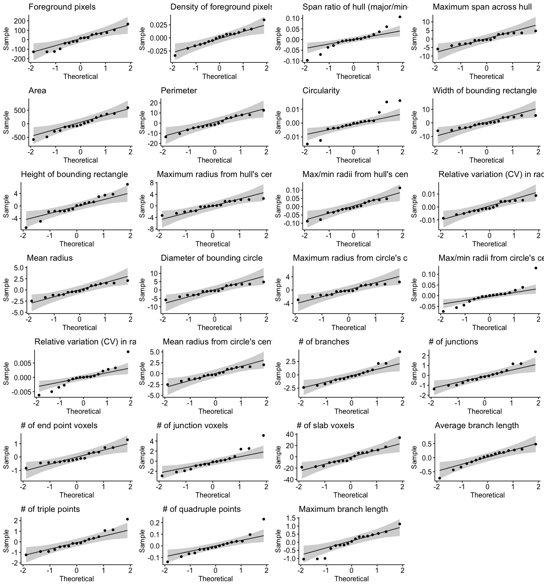<!-- -->

``` r
# shapiro test
stats.testing[[5]] %>% head(6)
```

    ##           variable statistic   p.value pass
    ## 1 residuals(model) 0.9541450 0.5252634 pass
    ## 2 residuals(model) 0.9874225 0.9958905 pass
    ## 3 residuals(model) 0.9518543 0.4865020 pass
    ## 4 residuals(model) 0.9481459 0.4278652 pass
    ## 5 residuals(model) 0.9832680 0.9809502 pass
    ## 6 residuals(model) 0.9770036 0.9250129 pass
    ##                                     measure
    ## 1                         Foreground pixels
    ## 2 Density of foreground pixels in hull area
    ## 3     Span ratio of hull (major/minor axis)
    ## 4                  Maximum span across hull
    ## 5                                      Area
    ## 6                                 Perimeter

If you are not interested in running stats for all 27 morphology
measures, you can also filter for those that you are interested in (or
filter out those that you’re not interested in) prior to running the
`stats_morphologymeasures.animal` function. In this example, we filter
out 4 morphology measures so that we only run this function on the other
23 measures.

``` r
# run stats analysis for changes in individual morphology measures
# you can specify up to two posthoc comparisons (posthoc1 and posthoc2 arguments) - if you only have one set of posthocs to run, specify the same comparison twice for both arguments. you will just get the same results in output[[2]] and output[[3]].
stats.testing <- stats_morphologymeasures.animal(data = stats.input %>% 
                                                   filter(Antibody=="Iba1") %>%
                                                   filter(!Measure %in% c("Foreground pixels",
                                                                          "Average branch length",
                                                                          "# of quadruple points",
                                                                          "Height of bounding rectangle")), 
                                                 model = "Value ~ Treatment*BrainRegion", type = "lm",
                                                 posthoc1 = "~Treatment|BrainRegion", 
                                                 posthoc2 = "~Treatment*BrainRegion", adjust ="bonferroni")
```

    ## [1] "Density of foreground pixels in hull area"
    ## [1] "Span ratio of hull (major/minor axis)"
    ## [1] "Maximum span across hull"
    ## [1] "Area"
    ## [1] "Perimeter"
    ## [1] "Circularity"
    ## [1] "Width of bounding rectangle"
    ## [1] "Maximum radius from hull's center of mass"
    ## [1] "Max/min radii from hull's center of mass"
    ## [1] "Relative variation (CV) in radii from hull's center of mass"
    ## [1] "Mean radius"
    ## [1] "Diameter of bounding circle"
    ## [1] "Maximum radius from circle's center of mass"
    ## [1] "Max/min radii from circle's center of mass"
    ## [1] "Relative variation (CV) in radii from circle's center of mass"
    ## [1] "Mean radius from circle's center of mass"
    ## [1] "# of branches"
    ## [1] "# of junctions"
    ## [1] "# of end point voxels"
    ## [1] "# of junction voxels"
    ## [1] "# of slab voxels"
    ## [1] "# of triple points"
    ## [1] "Maximum branch length"

``` r
# anova
stats.testing[[1]] %>% head(8)
```

    ##                              Sum Sq Df    F value       Pr(>F)
    ## Treatment              0.0231824401  1 61.7077864 7.765694e-06
    ## BrainRegion            0.0052302556  2  6.9610338 1.112878e-02
    ## Treatment:BrainRegion  0.0013969407  2  1.8592115 2.015685e-01
    ## Residuals              0.0041324905 11         NA           NA
    ## Treatment1             0.0008300607  1  0.2688058 6.144032e-01
    ## BrainRegion1           0.0437404668  2  7.0824290 1.055091e-02
    ## Treatment:BrainRegion1 0.0223637009  2  3.6211164 6.190572e-02
    ## Residuals1             0.0339675228 11         NA           NA
    ##                                                          measure Significant
    ## Treatment              Density of foreground pixels in hull area significant
    ## BrainRegion            Density of foreground pixels in hull area significant
    ## Treatment:BrainRegion  Density of foreground pixels in hull area          ns
    ## Residuals              Density of foreground pixels in hull area        <NA>
    ## Treatment1                 Span ratio of hull (major/minor axis)          ns
    ## BrainRegion1               Span ratio of hull (major/minor axis) significant
    ## Treatment:BrainRegion1     Span ratio of hull (major/minor axis)          ns
    ## Residuals1                 Span ratio of hull (major/minor axis)        <NA>

``` r
# posthoc 1
stats.testing[[2]] %>% head(6)
```

    ##  contrast    BrainRegion    estimate         SE df t.ratio p.value
    ##  2xLPS - PBS FC           0.07300851 0.01582574 11   4.613  0.0022
    ##  2xLPS - PBS HC           0.10040427 0.01769371 11   5.675  0.0004
    ##  2xLPS - PBS STR          0.05469185 0.01582574 11   3.456  0.0161
    ##  2xLPS - PBS FC           0.09192749 0.04537221 11   2.026  0.2031
    ##  2xLPS - PBS HC           0.03246885 0.05072768 11   0.640  1.0000
    ##  2xLPS - PBS STR         -0.07853956 0.04537221 11  -1.731  0.3341
    ##  measure                                   Significant
    ##  Density of foreground pixels in hull area significant
    ##  Density of foreground pixels in hull area significant
    ##  Density of foreground pixels in hull area significant
    ##  Span ratio of hull (major/minor axis)     ns         
    ##  Span ratio of hull (major/minor axis)     ns         
    ##  Span ratio of hull (major/minor axis)     ns         
    ## 
    ## P value adjustment: bonferroni method for 3 tests

``` r
# posthoc 2
stats.testing[[3]] %>% head(6)
```

    ##  contrast                estimate         SE df t.ratio p.value
    ##  2xLPS FC - PBS FC     0.07300851 0.01582574 11   4.613  0.0112
    ##  2xLPS FC - 2xLPS HC  -0.00476249 0.01582574 11  -0.301  1.0000
    ##  2xLPS FC - PBS HC     0.09564178 0.01769371 11   5.405  0.0032
    ##  2xLPS FC - 2xLPS STR  0.04837071 0.01582574 11   3.056  0.1638
    ##  2xLPS FC - PBS STR    0.10306256 0.01582574 11   6.512  0.0007
    ##  PBS FC - 2xLPS HC    -0.07777099 0.01582574 11  -4.914  0.0069
    ##  measure                                   Significant
    ##  Density of foreground pixels in hull area significant
    ##  Density of foreground pixels in hull area ns         
    ##  Density of foreground pixels in hull area significant
    ##  Density of foreground pixels in hull area ns         
    ##  Density of foreground pixels in hull area significant
    ##  Density of foreground pixels in hull area significant
    ## 
    ## P value adjustment: bonferroni method for 15 tests

``` r
# qqplots to check normality assumptions
do.call("grid.arrange", c(stats.testing[[4]], ncol=4))
```

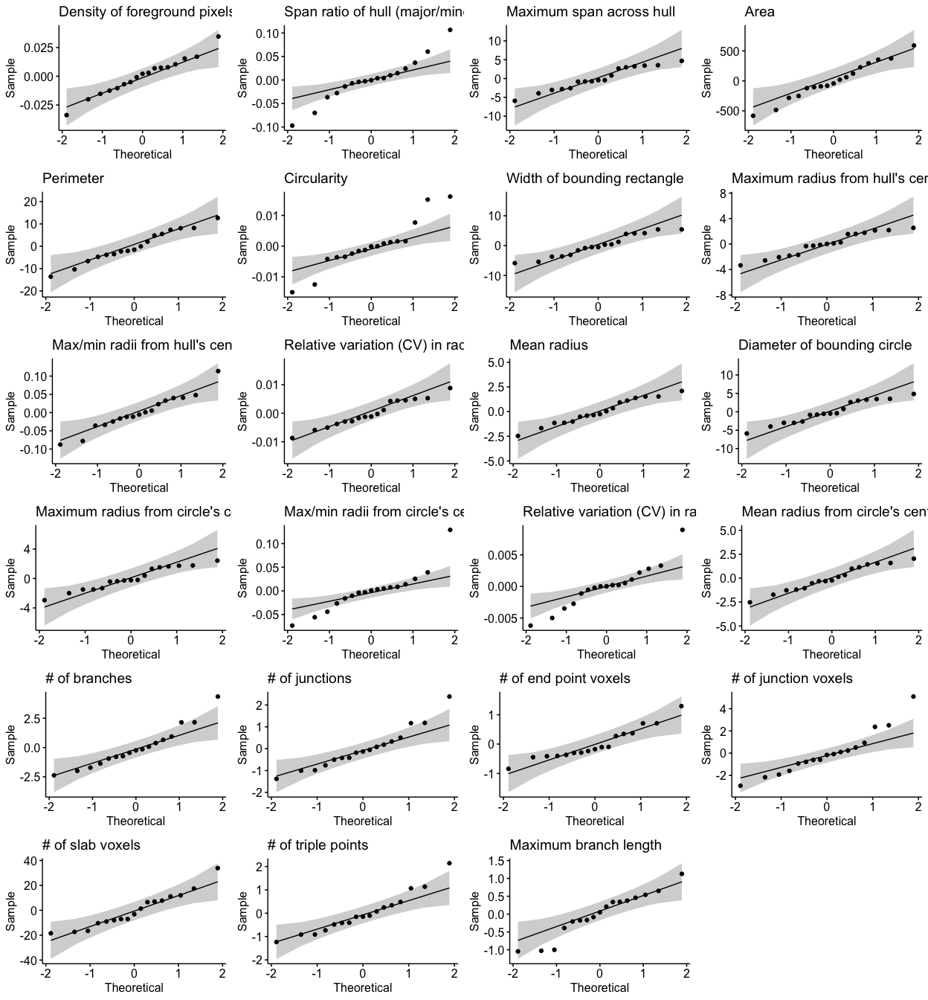<!-- -->

``` r
# shapiro test
stats.testing[[5]] %>% head(6)
```

    ##           variable statistic    p.value pass
    ## 1 residuals(model) 0.9874225 0.99589048 pass
    ## 2 residuals(model) 0.9518543 0.48650203 pass
    ## 3 residuals(model) 0.9481459 0.42786519 pass
    ## 4 residuals(model) 0.9832680 0.98095021 pass
    ## 5 residuals(model) 0.9770036 0.92501287 pass
    ## 6 residuals(model) 0.9079043 0.09221502 pass
    ##                                     measure
    ## 1 Density of foreground pixels in hull area
    ## 2     Span ratio of hull (major/minor axis)
    ## 3                  Maximum span across hull
    ## 4                                      Area
    ## 5                                 Perimeter
    ## 6                               Circularity

If you find that any individual morphology measures violate assumptions
of normality after checking the qqplots contained in
stats.input\[\[4\]\], you can filter your data for those measures,
transform your data in the suitable manner (i.e., using
MicrogliaMorphologyR functions like `transform_minmax` or
`transform_scale` or other data transformations), and rerun the stats
for those morphology features using the code above.

## Fuzzy K-means Clustering

To cluster your cells into morphological classes, you can use regular
k-means or fuzzy k-means clustering. We provide an example of using
fuzzy k-means, a ‘soft’ clustering method that is similar in concept and
algorithm to k-means clustering, which partitions data points within a
given dataset into defined numbers of clusters based on their proximity
to the nearest cluster’s centroid. In fuzzy k-means, data points are not
exclusively assigned to just one cluster, but rather given membership
scores to all clusters. This allows for additional characterization of
high-scoring cells within each cluster (i.e., quintessential ‘rod-like’,
‘ameboid’, ‘hypertrophic’, or ‘ramified’ cells), cells with more
ambiguous identities (e.g., a cell that is 5% rod-like, 5% ameboid, 45%
hypertrophic, and 45% ramified), and other cases that the user might be
interested in which might be informative for their specific dataset.
Fuzzy k-means also assigns a final hard cluster assignment based on the
class with the highest membership score, which can be used as input for
analysis as well. Here, we include an example of one use case of the
membership scores provided by fuzzy k-means.

### Example of additional analyses possible with fuzzy k-means (soft clustering) membership scores

Here, we will use a fuzzy k-means dataset that comes pre-loaded with the
package for demonstration purposes, as running the actual fuzzy
clustering step using the `fcm` function in the `ppclust`
[package](https://cran.r-project.org/web/packages/ppclust/vignettes/fcm.html)
is time-intensive and computationally-expensive.

Load in example dataset:

``` r
data_fuzzykmeans <- MicrogliaMorphologyR::data_2xLPS_mouse_fuzzykmeans
colnames(data_fuzzykmeans)
```

    ##  [1] "Antibody"                                                     
    ##  [2] "MouseID"                                                      
    ##  [3] "Sex"                                                          
    ##  [4] "Treatment"                                                    
    ##  [5] "BrainRegion"                                                  
    ##  [6] "Subregion"                                                    
    ##  [7] "ID"                                                           
    ##  [8] "UniqueID"                                                     
    ##  [9] "Foreground pixels"                                            
    ## [10] "Density of foreground pixels in hull area"                    
    ## [11] "Span ratio of hull (major/minor axis)"                        
    ## [12] "Maximum span across hull"                                     
    ## [13] "Area"                                                         
    ## [14] "Perimeter"                                                    
    ## [15] "Circularity"                                                  
    ## [16] "Width of bounding rectangle"                                  
    ## [17] "Height of bounding rectangle"                                 
    ## [18] "Maximum radius from hull's center of mass"                    
    ## [19] "Max/min radii from hull's center of mass"                     
    ## [20] "Relative variation (CV) in radii from hull's center of mass"  
    ## [21] "Mean radius"                                                  
    ## [22] "Diameter of bounding circle"                                  
    ## [23] "Maximum radius from circle's center of mass"                  
    ## [24] "Max/min radii from circle's center of mass"                   
    ## [25] "Relative variation (CV) in radii from circle's center of mass"
    ## [26] "Mean radius from circle's center of mass"                     
    ## [27] "# of branches"                                                
    ## [28] "# of junctions"                                               
    ## [29] "# of end point voxels"                                        
    ## [30] "# of junction voxels"                                         
    ## [31] "# of slab voxels"                                             
    ## [32] "Average branch length"                                        
    ## [33] "# of triple points"                                           
    ## [34] "# of quadruple points"                                        
    ## [35] "Maximum branch length"                                        
    ## [36] "PC1"                                                          
    ## [37] "PC2"                                                          
    ## [38] "PC3"                                                          
    ## [39] "Cluster 1"                                                    
    ## [40] "Cluster 2"                                                    
    ## [41] "Cluster 3"                                                    
    ## [42] "Cluster 4"                                                    
    ## [43] "Cluster"

``` r
# check cluster features to determine cluster labels
clusterfeatures(data_fuzzykmeans, featurestart=9, featureend=35)
```

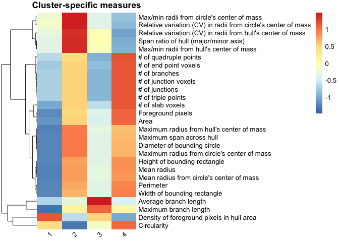<!-- -->

``` r
# update cluster labels
data_fuzzykmeans <- data_fuzzykmeans %>% mutate(Cluster = 
                      case_when(Cluster=="1" ~ "Ameboid",
                                Cluster=="2" ~ "Rod-like",
                                Cluster=="3" ~ "Hypertrophic",
                                Cluster=="4" ~ "Ramified"))
```

Example: Characterization of just the high-scoring cells within each
cluster (i.e., quintessential ‘rod-like’, ‘ameboid’, ‘hypertrophic’, or
‘ramified’ cells)

``` r
nrow(data_fuzzykmeans) # number of cells prior to filtering
```

    ## [1] 43332

``` r
# filter for high-scoring cells, defined as >70% membership score in one of the clusters
data <- data_fuzzykmeans %>% 
  filter(`Cluster 1` > 0.70|
         `Cluster 2` > 0.70|
         `Cluster 3` > 0.70|
         `Cluster 4` > 0.70)

nrow(data) # number of cells after filtering for just the high-scoring cells
```

    ## [1] 7525

``` r
# calculate cluster percentages across variables of interest
cp <- clusterpercentage(data, "Cluster", MouseID, Antibody, Treatment, Sex, BrainRegion)
cp$Treatment <- factor(cp$Treatment, levels=c("PBS","2xLPS"))

# example graph of data given variables of interest
cp %>% 
  filter(Antibody=="Iba1") %>%
  ggplot(aes(x=Cluster, y=percentage, group=interaction(Cluster, Treatment))) +
  facet_wrap(~BrainRegion) +
  geom_boxplot(aes(group=interaction(Cluster, Treatment), fill=Treatment)) +
  scale_fill_manual(values=c("#fde725","#482878")) +
  geom_point(position=position_dodge(width=0.8), size=0.75, aes(group=interaction(Cluster,Treatment), color=Sex)) +
  ggtitle("2xLPS mouse dataset: K-means clusters") +
  labs(fill="Treatment") +
  theme_bw(base_size=14) +
  theme(axis.text.x=element_text(angle=45, vjust=1, hjust=1))
```

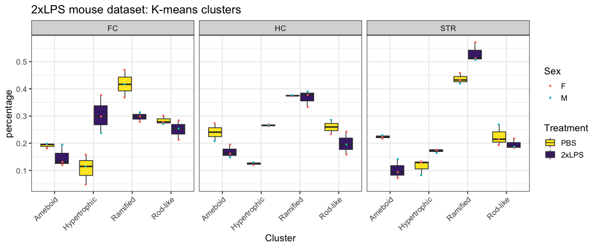<!-- -->
