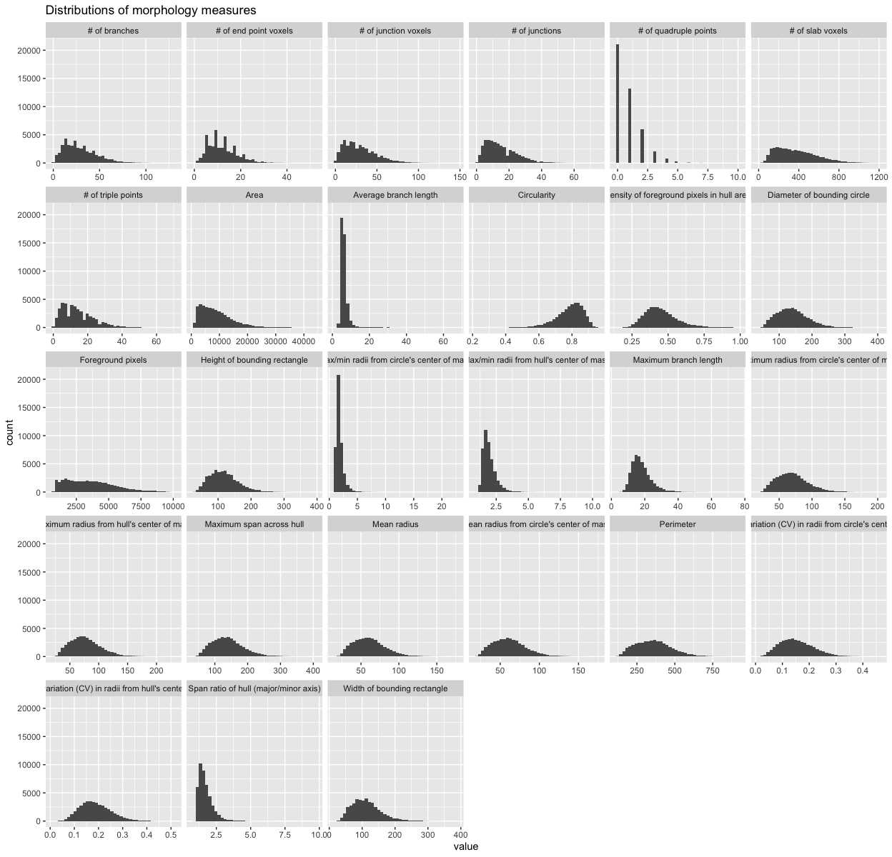
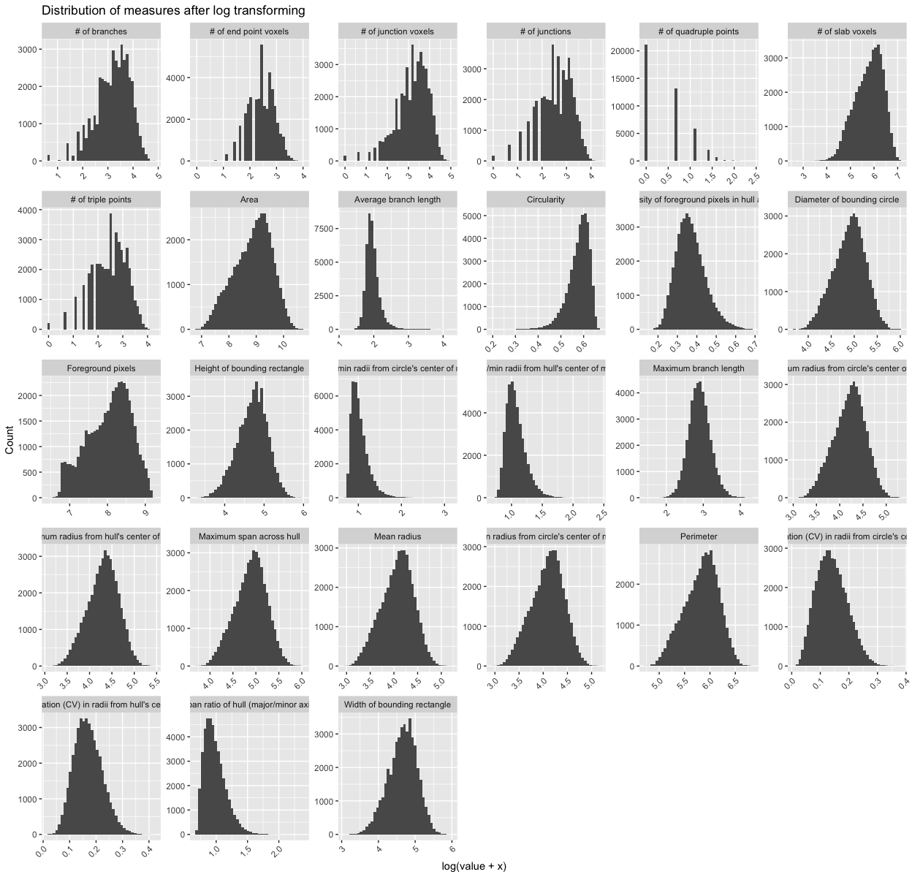
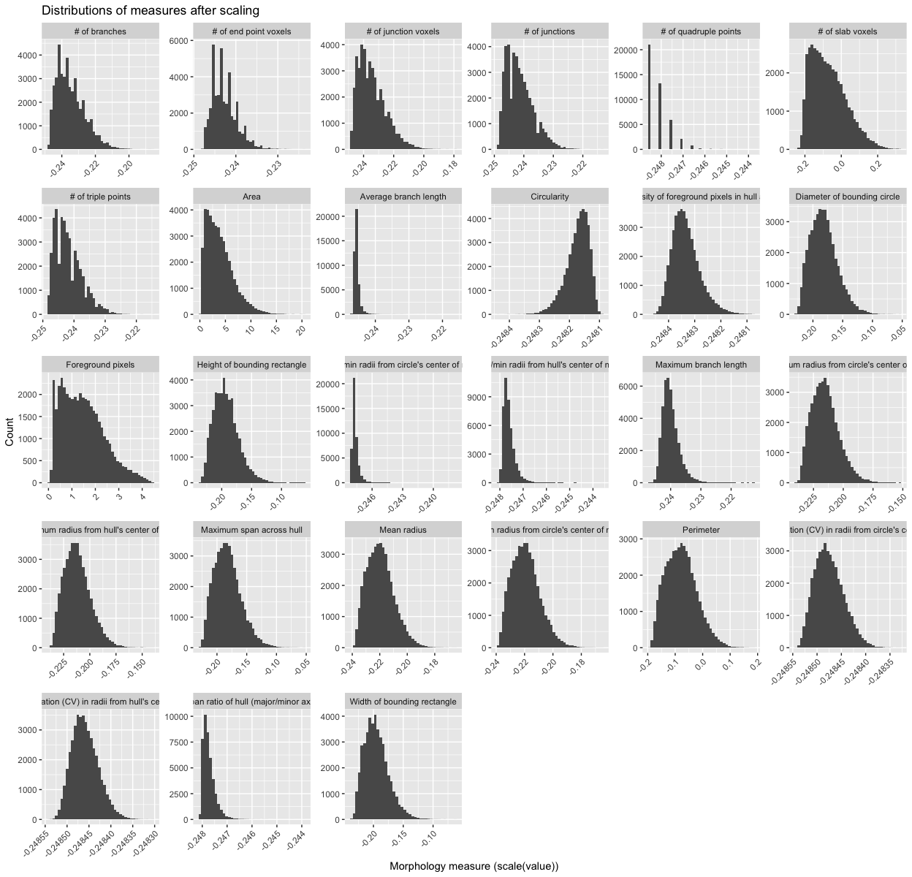

MicrogliaMorphologyR
================

**Created**: 26 June, 2023 by Jenn Kim  
**Last updated**: 05 October, 2023

## Welcome to MicrogliaMorphologyR!

MicrogliaMorphologyR is an R package for microglia morphology analysis,
that is complimentary to ImageJ macro
[MicrogliaMorphology](https://github.com/ciernialab/MicrogliaMorphology).
Using MicrogliaMorphologyR, you can perform exploratory data analysis
and visualization of 27 different morphology features and perform
dimensionality reduction, clustering, and statistical analysis of your
data.

You can read more about any of the MicrogliaMorphologyR functions
covered in this tutorial by calling to their respective help pages by
running ?function_name in the console.

#### If you are using this tool, please cite the following publications:

-   Insert manuscript link

## Instructions on how to use MicrogliaMorphologyR

### install and load package

``` r
BiocManager::install('ciernialab/MicrogliaMorphologyR')
```

``` r
devtools::load_all()
```

    ## ℹ Loading MicrogliaMorphologyR
    ## Loading required package: tidyverse
    ## 
    ## ── Attaching core tidyverse packages ──────────────────────── tidyverse 2.0.0 ──
    ## ✔ dplyr     1.1.2     ✔ readr     2.1.4
    ## ✔ forcats   1.0.0     ✔ stringr   1.5.0
    ## ✔ ggplot2   3.4.3     ✔ tibble    3.2.1
    ## ✔ lubridate 1.9.2     ✔ tidyr     1.3.0
    ## ✔ purrr     1.0.2     
    ## ── Conflicts ────────────────────────────────────────── tidyverse_conflicts() ──
    ## ✖ dplyr::filter() masks stats::filter()
    ## ✖ dplyr::lag()    masks stats::lag()
    ## ℹ Use the conflicted package (<http://conflicted.r-lib.org/>) to force all conflicts to become errors
    ## Loading required package: Hmisc
    ## 
    ## 
    ## Attaching package: 'Hmisc'
    ## 
    ## 
    ## The following objects are masked from 'package:dplyr':
    ## 
    ##     src, summarize
    ## 
    ## 
    ## The following objects are masked from 'package:base':
    ## 
    ##     format.pval, units
    ## 
    ## 
    ## Loading required package: pheatmap
    ## 
    ## Loading required package: factoextra
    ## 
    ## Welcome! Want to learn more? See two factoextra-related books at https://goo.gl/ve3WBa
    ## 
    ## Loading required package: lmerTest
    ## 
    ## Loading required package: lme4
    ## 
    ## Loading required package: Matrix
    ## 
    ## 
    ## Attaching package: 'Matrix'
    ## 
    ## 
    ## The following objects are masked from 'package:tidyr':
    ## 
    ##     expand, pack, unpack
    ## 
    ## 
    ## 
    ## Attaching package: 'lmerTest'
    ## 
    ## 
    ## The following object is masked from 'package:lme4':
    ## 
    ##     lmer
    ## 
    ## 
    ## The following object is masked from 'package:stats':
    ## 
    ##     step
    ## 
    ## 
    ## Loading required package: nlme
    ## 
    ## 
    ## Attaching package: 'nlme'
    ## 
    ## 
    ## The following object is masked from 'package:lme4':
    ## 
    ##     lmList
    ## 
    ## 
    ## The following object is masked from 'package:dplyr':
    ## 
    ##     collapse
    ## 
    ## 
    ## Loading required package: SciViews
    ## 
    ## Loading required package: ggpubr
    ## 
    ## Loading required package: glmmTMB
    ## 
    ## Loading required package: DHARMa
    ## 
    ## This is DHARMa 0.4.6. For overview type '?DHARMa'. For recent changes, type news(package = 'DHARMa')
    ## 
    ## Loading required package: ppclust

``` r
library(MicrogliaMorphologyR)
set.seed(1)
```

We will start by loading in your MicrogliaMorphology output (FracLac and
SkeletonAnalysis files) and formatting the data using the
`metadata_columns` function so that you have a final dataframe which
contains your cell-level data, with every row as a single cell and every
column as either a metadata descriptor or morphology measure. The
`metadata_columns` function relies on each piece of metadata to be
separated by a common deliminator such as “\_” or “-” in the “Name”
column. You can read more about the function by calling to its help page
using ?metadata_columns

### load in your fraclac and skeleton data, tidy, and merge into final data frame

``` r
fraclac.dir <- "insert path to fraclac directory"
skeleton.dir <- "insert path to skeleton analysis directory"

fraclac <- fraclac_tidying(fraclac.dir)
skeleton <- skeleton_tidying(skeleton.dir)

data <- merge_data(fraclac, skeleton)
finaldata <- metadata_columns(data,
                              c("Antibody","Paper","Cohort","MouseID","Sex","Treatment","BrainRegion","Subregion"),
                              sep="_")
```

For demonstration purposes, we will use one of the datasets that comes
packaged with MicrogliaMorphologyR. ‘data_2xLPS_mouse’ contains
morphology data collected from female and male 8 week-old Cx3cr1-eGFP
mice, which were given 2 i.p. injections of either PBS vehicle solution
or 0.5mg/kg lipopolysaccharides (LPS), spaced 24 hours apart. In this
genetic mouse line, Cx3cr1-expressing cells including microglia have an
endogenous reporter which makes them green when immunofluorescently
imaged. Brains were collected 3 hours after the final injections, and
brain sections were immunofluorescently stained and imaged for 2
additional, commonly used microglia markers: P2ry12, and Iba1.

### load in example dataset

``` r
data_2xLPS <- MicrogliaMorphologyR::data_2xLPS_mouse
```

### generate heatmap of correlations across features

We start by exploring the morphology features measured by
MicrogliaMorphology and how they relate to each other by generating a
heatmap of spearman’s correlations across the 27 different morphology
features. As expected, the features which describe similar aspects of
morphology are more highly correlated to each other than to other
features which do not. For example, the numbers of end point voxels,
junction voxels, triple points, branches, and junctions all explain cell
branching complexity and are highly correlated to each other.

``` r
featurecorrelations(data_2xLPS, featurestart=9, featureend=35, rthresh=0.8, pthresh=0.05, title="Correlations across features")
```

<!-- -->

MicrogliaMorphologyR comes with a number of functions which allow you to
explore which features have extreme outliers and how normalizing in
various ways changes your feature distributions. This allows you to
explore and transform your data in a dataset-appropriate manner for
downstream analyses. In later steps, we will be running Principal
Components Analysis (PCA) on our transformed data. PCA is a statistical
technique which identifies the most significant variables and
relationships in your data, and can be used as a pre-processing step to
reduce noise and remove irrelevant features to improve the efficiency
and accuracy of downstream analysis. PCA assumes that the variables in
your dataset follow a normal distribution, and violations of normality
can affect the accuracy of PCA results. Thus, it is important to
transform your data so that the distributions of the values for each
individual morphology measure approximate normality as much as possible.

The morphology features measured using MicrogliaMorphology are often
suitable for PCA after log transformation. Because many of the measures
contain zero values (e.g., numbers of junctions, numbers of branches,
etc.), we need to add a constant to our data prior to log transforming.

### exploratory data visualization and data transformation for downstream analyses

``` r
# gather your numerical morphology data into one column ('measure') which contains the feature name, and another column ('value') which contains measured values
data_2xLPS_gathered <- data_2xLPS %>% gather(measure, value, 9:ncol(data_2xLPS))

# check for outliers
outliers_boxplots(data_2xLPS_gathered)
```

<!-- -->

``` r
outliers_distributions(data_2xLPS_gathered)
```

<!-- -->

``` r
# checking different normalization features
normalize_logplots(data_2xLPS_gathered,1)
```

<!-- -->

``` r
normalize_minmax(data_2xLPS_gathered)
```

<!-- -->

``` r
normalize_scaled(data_2xLPS_gathered)
```

<!-- -->

``` r
# transform your data in appropriate manner for downstream analyses
data_2xLPS_logtransformed <- transform_log(data_2xLPS, 1, start=9, end=35) # we will use the logtransformed data as our PCA input
```

    ## Warning: `funs()` was deprecated in dplyr 0.8.0.
    ## ℹ Please use a list of either functions or lambdas:
    ## 
    ## # Simple named list: list(mean = mean, median = median)
    ## 
    ## # Auto named with `tibble::lst()`: tibble::lst(mean, median)
    ## 
    ## # Using lambdas list(~ mean(., trim = .2), ~ median(., na.rm = TRUE))
    ## ℹ The deprecated feature was likely used in the MicrogliaMorphologyR package.
    ##   Please report the issue to the authors.
    ## This warning is displayed once every 8 hours.
    ## Call `lifecycle::last_lifecycle_warnings()` to see where this warning was
    ## generated.

``` r
data_2xLPS_minmaxtransformed <- transform_minmax(data_2xLPS, start=9, end=35)
data_2xLPS_scaled <- transform_scale(data_2xLPS, start=9, end=35)

# get sample size of data based on factors of interest
samplesize(data_2xLPS, MouseID, Antibody)
```

    ## # A tibble: 18 × 3
    ## # Groups:   MouseID [6]
    ##    MouseID Antibody   num
    ##    <chr>   <chr>    <int>
    ##  1 1       Cx3cr1    1703
    ##  2 1       Iba1      1737
    ##  3 1       P2ry12    2105
    ##  4 2       Cx3cr1    2496
    ##  5 2       Iba1      2927
    ##  6 2       P2ry12    4341
    ##  7 3       Cx3cr1    1145
    ##  8 3       Iba1      1310
    ##  9 3       P2ry12    1978
    ## 10 4       Cx3cr1    1775
    ## 11 4       Iba1      2044
    ## 12 4       P2ry12    2372
    ## 13 5       Cx3cr1    2053
    ## 14 5       Iba1      2302
    ## 15 5       P2ry12    3513
    ## 16 6       Cx3cr1    2771
    ## 17 6       Iba1      3095
    ## 18 6       P2ry12    3665

``` r
samplesize(data_2xLPS, Sex, Treatment, Antibody)
```

    ## # A tibble: 12 × 4
    ## # Groups:   Sex, Treatment [4]
    ##    Sex   Treatment Antibody   num
    ##    <chr> <chr>     <chr>    <int>
    ##  1 F     2xLPS     Cx3cr1    3478
    ##  2 F     2xLPS     Iba1      3781
    ##  3 F     2xLPS     P2ry12    4477
    ##  4 F     PBS       Cx3cr1    3641
    ##  5 F     PBS       Iba1      4237
    ##  6 F     PBS       P2ry12    6319
    ##  7 M     2xLPS     Cx3cr1    2771
    ##  8 M     2xLPS     Iba1      3095
    ##  9 M     2xLPS     P2ry12    3665
    ## 10 M     PBS       Cx3cr1    2053
    ## 11 M     PBS       Iba1      2302
    ## 12 M     PBS       P2ry12    3513

Now, since we have gotten a better feel for our data and how to
transform it, we can proceed with PCA for dimensionality reduction and
downstream clustering. We can see here that the first 3 PCs describe
around \~85% of our data. We can also explore how each PC correlates to
the 27 different morphology features to get a better understanding of
how each PC describes the variability present in the data. This is
useful to inform which to include for downstream clustering steps.

## Dimensionality reduction using PCA

``` r
pcadata_elbow(data_2xLPS_logtransformed, featurestart=9, featureend=35)
```

<!-- -->

``` r
pca_data <- pcadata(data_2xLPS_logtransformed, featurestart=9, featureend=35,
                    pc.start=1, pc.end=10)
str(pca_data)
```

    ## 'data.frame':    43332 obs. of  45 variables:
    ##  $ PC1                                                          : num  -3.4084 -3.9724 -0.0521 -2.6969 -1.6742 ...
    ##  $ PC2                                                          : num  0.676 0.688 0.498 1.384 -0.156 ...
    ##  $ PC3                                                          : num  2.454 -0.159 1.111 2.354 2.442 ...
    ##  $ PC4                                                          : num  -0.701 -1.782 -1.71 0.689 -1.047 ...
    ##  $ PC5                                                          : num  0.5192 -0.3 0.0515 0.252 0.9873 ...
    ##  $ PC6                                                          : num  0.0984 -0.3944 -0.885 -0.0486 0.123 ...
    ##  $ PC7                                                          : num  -0.189 -0.491 -0.15 0.201 -0.525 ...
    ##  $ PC8                                                          : num  -0.222 -0.595 -0.195 -0.521 0.348 ...
    ##  $ PC9                                                          : num  -1.417 0.176 -0.674 1.452 -0.184 ...
    ##  $ PC10                                                         : num  0.7371 -0.2788 0.3673 0.485 -0.0569 ...
    ##  $ Antibody                                                     : chr  "Cx3cr1" "Cx3cr1" "Cx3cr1" "Cx3cr1" ...
    ##  $ MouseID                                                      : chr  "1" "1" "1" "1" ...
    ##  $ Sex                                                          : chr  "F" "F" "F" "F" ...
    ##  $ Treatment                                                    : chr  "2xLPS" "2xLPS" "2xLPS" "2xLPS" ...
    ##  $ BrainRegion                                                  : chr  "FC" "FC" "FC" "FC" ...
    ##  $ Subregion                                                    : chr  "ACC" "ACC" "ACC" "ACC" ...
    ##  $ ID                                                           : chr  "00002-01053" "00009-01153" "00015-01224" "00016-01229" ...
    ##  $ UniqueID                                                     : chr  "Cx3cr1_Paper1_2Hit_1_F_2xLPS_FC_ACC_00002-01053" "Cx3cr1_Paper1_2Hit_1_F_2xLPS_FC_ACC_00009-01153" "Cx3cr1_Paper1_2Hit_1_F_2xLPS_FC_ACC_00015-01224" "Cx3cr1_Paper1_2Hit_1_F_2xLPS_FC_ACC_00016-01229" ...
    ##  $ Foreground pixels                                            : num  7.84 7.84 8.52 7.88 8.22 ...
    ##  $ Density of foreground pixels in hull area                    : num  0.472 0.527 0.503 0.363 0.44 ...
    ##  $ Span ratio of hull (major/minor axis)                        : num  0.819 0.912 0.889 0.725 0.838 ...
    ##  $ Maximum span across hull                                     : num  4.52 4.51 4.87 4.68 4.8 ...
    ##  $ Area                                                         : num  8.34 8.2 8.94 8.71 8.81 ...
    ##  $ Perimeter                                                    : num  5.58 5.46 5.86 5.71 5.79 ...
    ##  $ Circularity                                                  : num  0.564 0.609 0.577 0.609 0.584 ...
    ##  $ Width of bounding rectangle                                  : num  4.41 4.22 4.68 4.53 4.51 ...
    ##  $ Height of bounding rectangle                                 : num  4.49 4.53 4.78 4.52 4.8 ...
    ##  $ Maximum radius from hull's center of mass                    : num  3.95 3.93 4.21 4.18 4.18 ...
    ##  $ Max/min radii from hull's center of mass                     : num  1.018 1.085 1.045 1.027 0.974 ...
    ##  $ Relative variation (CV) in radii from hull's center of mass  : num  0.103 0.172 0.126 0.172 0.142 ...
    ##  $ Mean radius                                                  : num  3.83 3.67 4.1 3.96 4.04 ...
    ##  $ Diameter of bounding circle                                  : num  4.6 4.51 4.88 4.69 4.82 ...
    ##  $ Maximum radius from circle's center of mass                  : num  3.92 3.83 4.2 4 4.14 ...
    ##  $ Max/min radii from circle's center of mass                   : num  0.99 0.96 0.998 0.77 1.048 ...
    ##  $ Relative variation (CV) in radii from circle's center of mass: num  0.1008 0.1573 0.1276 0.0544 0.1546 ...
    ##  $ Mean radius from circle's center of mass                     : num  3.83 3.65 4.1 3.96 4.03 ...
    ##  $ # of branches                                                : num  2.56 2.71 3.14 2.48 2.56 ...
    ##  $ # of junctions                                               : num  1.95 1.95 2.48 1.79 1.95 ...
    ##  $ # of end point voxels                                        : num  1.95 2.3 2.4 2.08 1.95 ...
    ##  $ # of junction voxels                                         : num  2.56 2.71 3.14 2.08 2.71 ...
    ##  $ # of slab voxels                                             : num  5.48 5.34 5.85 5.29 5.55 ...
    ##  $ Average branch length                                        : num  2.28 2.04 2.1 2.19 2.31 ...
    ##  $ # of triple points                                           : num  1.95 1.79 2.4 1.79 1.95 ...
    ##  $ # of quadruple points                                        : num  0 0.693 0.693 0 0 ...
    ##  $ Maximum branch length                                        : num  3.41 2.78 3.1 2.84 3.21 ...

### generate heatmap of correlations between PCs and features

Using the `pcfeaturecorrelations` function, we can investigate the
relationships of our 27 individual morphology measures to the principle
components to examine how each PC is differentially correlated to and
described by different sets of morphology features. For example, we can
see that PC1 is highly positively correlated to features describing
branching complexity and territory span, meaning that individual cells
with greater branching complexity or area have higher PC1 scores in our
dataset. Similarly, the variability in our dataset represented in PC2 is
described by cell shape: 1) *circularity* (circularity, max/min radii
from center, span ratio of hull) and 2) *branching homogeneity*
(relative variation (CV) from center of mass), and PC3 is described by
branch length-related measures. Generally, you will see the same types
of features describing the first four PCs after dimensionality
reduction, although the directionality of the correlations could be
inversed, which is normal as long as the sets of features that are
highly correlated (e.g., circularity and branching homogeneity for PC2)
are still maintained.

``` r
pcfeaturecorrelations(pca_data, pc.start=1, pc.end=3, 
                      feature.start=19, feature.end=45, 
                      rthresh=0.75, pthresh=0.05, 
                      title="Correlation between PCs and features")
```

<!-- -->

### visually explore different sources of variability in dataset

``` r
# gather your data by experimental variables (e.g., Treatment, Sex, MouseID, etc.)
gathered_expvariables <- pca_data %>% gather(variable, value, 11:16) 

plots_expvariable(gathered_expvariables, "PC1", "PC2")
```

<!-- -->

## K-means clustering on PCs

After performing dimensionality reduction, we can use our PCs as input
for downstream clustering methods. In this tutorial, we cluster our
cells into morphological classes using k-means clustering, which
partitions data points within a given dataset into defined numbers of
clusters based on their proximity to the nearest cluster’s centroid. We
provide an example at the end of the Github to depict a use case for
fuzzy k-means clustering, a soft clustering approach and another option
which allows for extended analyses such as characterization of the
‘most’ ameboid, hypertrophic, rod-like, or ramified cells or
characterization of cells with more ambiguous identities that lie
between these morphological states. (see ‘Fuzzy K-means clustering’
section at the end of Github for more details about the method) Because
our toolset is highly flexible, it can also be integrated with other
clustering approaches such as hierarchical clustering or gaussian
mixture models.

When running kmeans clustering, from the number of clusters (K) that you
specify to create, the algorithm will randomly select K initial cluster
centers. Each other data point’s euclidean distance will be calculated
from these initial centers so that they are assigned as belonging to the
cluster that they are closest to. The centroids for each of the clusters
will be updated by calculating the new means of all the points assigned
to each cluster. The process of randomly setting initial centers,
assigning data points to the clusters, and updating the cluster
centroids is iterated until the maximum number of iterations is reached.

Thus, 2 main dataset-specific parameters that you should specify and
troubleshoot for your dataset are: - **iter.max**, the maximum number of
iterations allowed, and the number of times kmeans algorithm is run
before results are returned. An iter.max between 10-20 is recommended -
**nstart**, how many random sets should be chosen. An nstart of atleast
25 initial configurations is recommended.

You can read more about kmeans clustering and optimizing these
parameters at the following links: -
<https://uc-r.github.io/kmeans_clustering> -
<https://andrea-grianti.medium.com/kmeans-parameters-in-rstudio-explained-c493ec5a05df>

### prepare data for clustering

``` r
## for k-means clustering: scale PCs 1-3, which together describe ~85% of variability
pca_data_scale <- transform_scale(pca_data, start=1, end=3) # scale pca data as input for k-means clustering
kmeans_input <- pca_data_scale[1:3]
```

### Cluster optimization prior to running fuzzy k-means

``` r
# check for optimal number of clusters using wss and silhouette methods
sampling <- kmeans_input[sample(nrow(kmeans_input), 5000),] #sample 5000 random rows for cluster optimization

fviz_nbclust(sampling, kmeans, method = 'wss', nstart=25, iter.max=50) # 4 clusters
```

<!-- -->

``` r
fviz_nbclust(sampling, kmeans, method = 'silhouette', nstart=25, iter.max=50) # 4 clusters
```

<!-- -->

From using the wss and silhouette methods to check the optimal numbers
of clusters for our dataset, it appears that our data would be optimally
clustered using k=4. There are many more [cluster optimization
methods](http://www.sthda.com/english/articles/29-cluster-validation-essentials/96-determiningthe-optimal-number-of-clusters-3-must-know-methods/)
that you can try out to explore your data.

Next, we proceed with the actual clustering. You can cluster using fuzzy
k-means or regular k-means at this step. After clustering, we will use
some built-in functions within MicrogliaMorphologyR to assess how a
parameter of k=4 influences how the clusters are defined by morphology
features (and if they make sense according to what we know about
microglia morphology). As this step may require some troubleshooting and
updating of clustering parameters, you may need to run your k-means
function multiple times. If you are planning to use fuzzy k-means, keep
in mind that the soft clustering approach is more time-intensive and
computationally expensive as it also calculates membership scores to
each cluster for every single cell. It might help to use regular k-means
as a first pass, verify that your clusters make sense using the
functions that follow, and run your fuzzy k-means function using the
final parameters that you determine to generate your final dataset for
downstream analysis.

For the analysis proceeding, we are working with the regular k-means
clustering output. We provide an example of a use case for fuzzy k-means
clustering and further description of this approach at the end of the
Github if you are interested.

### Fuzzy k-means (soft clustering)

``` r
# cluster and combine with original data
data_kmeans <- fcm(kmeans_input, centers=4, nstart=25)
pca_kmeans <- cbind(pca_data[1:5], data_kmeans)
str(pca_kmeans)
```

### Regular k-means (hard clustering)

``` r
# cluster and combine with original data
data_kmeans <- kmeans(kmeans_input, centers=4)

# Here, we are creating a new data frame that contains the first 2 PCs and original dataset, then renaming the data_kmeans$cluster column to simply say "Cluster". You can bind together as many of the PCs as you want. Binding the original, untransformed data is useful if you want to plot the raw values of any individual morphology measures downstream. 
pca_kmeans <- cbind(pca_data[1:2], data_2xLPS, as.data.frame(data_kmeans$cluster)) %>%
  rename(Cluster=`data_kmeans$cluster`) 
str(pca_kmeans)
```

    ## 'data.frame':    43332 obs. of  38 variables:
    ##  $ PC1                                                          : num  -3.4084 -3.9724 -0.0521 -2.6969 -1.6742 ...
    ##  $ PC2                                                          : num  0.676 0.688 0.498 1.384 -0.156 ...
    ##  $ Antibody                                                     : chr  "Cx3cr1" "Cx3cr1" "Cx3cr1" "Cx3cr1" ...
    ##  $ MouseID                                                      : chr  "1" "1" "1" "1" ...
    ##  $ Sex                                                          : chr  "F" "F" "F" "F" ...
    ##  $ Treatment                                                    : chr  "2xLPS" "2xLPS" "2xLPS" "2xLPS" ...
    ##  $ BrainRegion                                                  : chr  "FC" "FC" "FC" "FC" ...
    ##  $ Subregion                                                    : chr  "ACC" "ACC" "ACC" "ACC" ...
    ##  $ ID                                                           : chr  "00002-01053" "00009-01153" "00015-01224" "00016-01229" ...
    ##  $ UniqueID                                                     : chr  "Cx3cr1_Paper1_2Hit_1_F_2xLPS_FC_ACC_00002-01053" "Cx3cr1_Paper1_2Hit_1_F_2xLPS_FC_ACC_00009-01153" "Cx3cr1_Paper1_2Hit_1_F_2xLPS_FC_ACC_00015-01224" "Cx3cr1_Paper1_2Hit_1_F_2xLPS_FC_ACC_00016-01229" ...
    ##  $ Foreground pixels                                            : int  2535 2533 4996 2646 3713 2786 2518 3129 6119 3572 ...
    ##  $ Density of foreground pixels in hull area                    : num  0.604 0.694 0.653 0.438 0.553 ...
    ##  $ Span ratio of hull (major/minor axis)                        : num  1.27 1.49 1.43 1.06 1.31 ...
    ##  $ Maximum span across hull                                     : num  90.5 90.1 129 106.3 119.9 ...
    ##  $ Area                                                         : int  4200 3650 7648 6045 6709 6040 3675 5870 13061 7601 ...
    ##  $ Perimeter                                                    : num  264 234 351 301 326 ...
    ##  $ Circularity                                                  : num  0.758 0.839 0.781 0.839 0.794 ...
    ##  $ Width of bounding rectangle                                  : int  81 67 107 92 90 137 60 66 217 131 ...
    ##  $ Height of bounding rectangle                                 : int  88 92 118 91 121 74 99 127 97 113 ...
    ##  $ Maximum radius from hull's center of mass                    : num  50.7 49.8 66.6 64.2 64.3 ...
    ##  $ Max/min radii from hull's center of mass                     : num  1.77 1.96 1.84 1.79 1.65 ...
    ##  $ Relative variation (CV) in radii from hull's center of mass  : num  0.109 0.188 0.135 0.187 0.152 ...
    ##  $ Mean radius                                                  : num  45.2 38.1 59.3 51.3 55.7 ...
    ##  $ Diameter of bounding circle                                  : num  98.5 90.1 131.3 107.5 123.5 ...
    ##  $ Maximum radius from circle's center of mass                  : num  49.3 45.1 65.6 53.7 61.7 ...
    ##  $ Max/min radii from circle's center of mass                   : num  1.69 1.61 1.71 1.16 1.85 ...
    ##  $ Relative variation (CV) in radii from circle's center of mass: num  0.1061 0.1704 0.1361 0.0559 0.1672 ...
    ##  $ Mean radius from circle's center of mass                     : num  45 37.5 59.4 51.6 55 ...
    ##  $ # of branches                                                : int  12 14 22 11 12 13 13 11 26 9 ...
    ##  $ # of junctions                                               : int  6 6 11 5 6 6 7 5 12 4 ...
    ##  $ # of end point voxels                                        : int  6 9 10 7 6 8 5 6 13 6 ...
    ##  $ # of junction voxels                                         : int  12 14 22 7 14 10 13 14 30 8 ...
    ##  $ # of slab voxels                                             : int  240 208 345 197 255 244 189 224 538 183 ...
    ##  $ Average branch length                                        : num  8.73 6.72 7.17 7.92 9.11 ...
    ##  $ # of triple points                                           : int  6 5 10 5 6 6 7 4 10 4 ...
    ##  $ # of quadruple points                                        : int  0 1 1 0 0 0 0 1 1 0 ...
    ##  $ Maximum branch length                                        : num  29.2 15.1 21.3 16.2 23.8 ...
    ##  $ Cluster                                                      : int  4 2 3 4 4 4 2 4 1 4 ...

### Plot k-means clusters in PC space

``` r
plot <- clusterplots(pca_kmeans, "PC1", "PC2")
plot
```

<!-- -->

``` r
plot + scale_colour_viridis_d() # customizeable example: add color scheme of choice 
```

<!-- -->

### Cluster-specific measures on average for each morphology feature, relative to other clusters

``` r
clusterfeatures(pca_kmeans, featurestart=11, featureend=37)
```

<!-- -->

After comparing the individual features across clusters, we can
characterize the clusters as follows:

-   Cluster 1 = rod-like (greatest oblongness, lowest circularity)
-   Cluster 2 = ameboid (lowest territory span, high circularity,
    smallest branch lengths)
-   Cluster 3 = ramified (largest territory span and branching
    complexity)
-   Cluster 4 = hypertrophic (average territory span, high branch
    thickness as explained by pixel density in hull)

### ColorByCluster

Using the cluster classes assigned from our analyses using
MicrogliaMorphologyR, we can color each cell in the original image by
cluster using the MicrogliaMorphology ImageJ macro. In the following
example, we are isolating out the Cluster assignments for each microglia
in the Cx3cr1-stained ACC subregion image for Mouse 1. You can do this
for all of the images you are interested in applying ColorByCluster to.
This offers an additional method by which to visually assess and verify
your suspected cluster identities before deeming them ramifed,
hyper-ramified, rod-like, ameboid, or any other morphological form for
downstream analysis and interpretation.

#### Formatting data for ColorByCluster input (Color coding in ImageJ)

``` r
# isolate out all the cells for your specific image of interest
colorbycluster <- pca_kmeans %>% 
  filter(Antibody=="Cx3cr1",MouseID=="1", BrainRegion=="FC", Subregion=="ACC") %>% select(c(Cluster, ID))
head(colorbycluster)
```

    ##   Cluster          ID
    ## 1       4 00002-01053
    ## 2       2 00009-01153
    ## 3       3 00015-01224
    ## 4       4 00016-01229
    ## 5       4 00039-01394
    ## 6       4 00044-01397

#### Save .csv file to feed into ColorByCluster function in MicrogliaMorphology ImageJ macro

``` r
write.csv(colorbycluster, "filepath/Cxc3cr_Mouse1_FC_ACC_data.csv")
```

### Cluster characterization

``` r
# calculate cluster percentages across variables of interest
cp <- clusterpercentage(pca_kmeans, "Cluster", MouseID, Antibody, Treatment, Sex, BrainRegion)
cp$Treatment <- factor(cp$Treatment, levels=c("PBS","2xLPS"))

# update cluster labels
cp <- cp %>% mutate(Cluster = 
                      case_when(Cluster=="1" ~ "Rod-like",
                                Cluster=="2" ~ "Ameboid",
                                Cluster=="3" ~ "Ramified",
                                Cluster=="4" ~ "Hypertrophic"))

# Quick check of cluster proportions when considering experimental variables of interest
cp %>% 
  filter(BrainRegion=="STR") %>% # in this example, we filter for our brain region of interest
  clusterpercentage_boxplots(Antibody, Treatment) # grouping variables
```

<!-- -->

``` r
# example graph of data given variables of interest
cp %>% 
  filter(Antibody=="Iba1") %>%
  ggplot(aes(x=Cluster, y=percentage, group=interaction(Cluster, Treatment))) +
  facet_wrap(~BrainRegion) +
  geom_boxplot(aes(group=interaction(Cluster, Treatment), fill=Treatment)) +
  scale_fill_manual(values=c("#fde725","#482878")) +
  geom_point(position=position_dodge(width=0.8), size=0.75, aes(group=interaction(Cluster,Treatment), color=Sex)) +
  ggtitle("2xLPS mouse dataset: K-means clusters") +
  labs(fill="Treatment") +
  theme_bw(base_size=14) +
  theme(axis.text.x=element_text(angle=45, vjust=1, hjust=1))
```

<!-- -->

## Statistical analysis

MicrogliaMorphologyR includes a few functions to run stats on cluster
percentages as well as on individual morphology measures.

### Cluster percentage changes at animal level, in response to experimental variables

#### e.g., Across clusters - How does cluster membership change with LPS?

The stats_cluster.animal function fits a generalized linear mixed model
on your dataset to a beta distribution, which is suitable for values
like percentages or probabilities that are constrained to a range of
0-1, using the `glmmTMB` package. Part of the output includes a check of
the model fit using the `DHARMa` package, which “uses a simulation-based
approach to create readily interpretable scaled (quantile) residuals for
fitted (generalized) linear mixed models.” The function creates two
`DHARMa` plots, contained in output\[\[4\]\]. You can read more about
how to interpret model fit using `DHARMa` by reading the package
[vignette](https://cran.r-project.org/web/packages/DHARMa/vignettes/DHARMa.html).

In this example, we are fitting the generalized linear mixed model to
our Iba1-stained dataset to model the percentage of cluster membership
as a factor of Cluster identity, Treatment, and BrainRegion interactions
with MouseID as a repeated measure since the outcome variable (cluster
percentages) is represented multiple times per animal. In the first
posthoc correction, we are correcting for multiple tests between
treatments (PBS vs. 2xLPS) across Clusters and BrainRegions using the
Bonferroni method - since there are 4 clusters and 3 brain regions, we
should be correcting across 12 tests. In the second posthoc correction,
we are correcting for multiple tests between treatments (PBS vs. 2xLPS)
across Clusters using the Bonferroni method - since there are 4
clusters, we should be correcting across 4 tests.

``` r
# prepare percentages dataset for downstream analysis
stats.input <- cp 
stats.input$MouseID <- factor(stats.input$MouseID)
stats.input$Cluster <- factor(stats.input$Cluster)
stats.input$Treatment <- factor(stats.input$Treatment)

# run stats analysis for changes in cluster percentages, at the animal level
# you can specify up to two posthoc comparisons (posthoc1 and posthoc2 arguments) - if you only have one set of posthocs to run, specify the same comparison twice for both arguments. you will just get the same results in output[[2]] and output[[3]].
stats.testing <- stats_cluster.animal(stats.input %>% filter(Antibody=="Iba1"), 
                                      "percentage ~ Cluster*Treatment*BrainRegion + (1|MouseID)", 
                                      "~Treatment|Cluster|BrainRegion", "~Treatment|Cluster", "bonferroni")
```

<!-- -->

    ## NOTE: Results may be misleading due to involvement in interactions

    ## Formula:          
    ## percentage ~ Cluster * Treatment * BrainRegion + (1 | MouseID)
    ## Data: data
    ##       AIC       BIC    logLik  df.resid 
    ## -264.2217 -206.5145  158.1109        42 
    ## Random-effects (co)variances:
    ## 
    ## Conditional model:
    ##  Groups  Name        Std.Dev. 
    ##  MouseID (Intercept) 2.874e-06
    ## 
    ## Number of obs: 68 / Conditional model: MouseID, 6
    ## 
    ## Dispersion parameter for beta family ():  296 
    ## 
    ## Fixed Effects:
    ## 
    ## Conditional model:
    ##                      (Intercept)                          Cluster1  
    ##                        -1.190535                         -0.280517  
    ##                         Cluster2                          Cluster3  
    ##                        -0.530336                          0.729137  
    ##                       Treatment1                      BrainRegion1  
    ##                        -0.034300                         -0.001085  
    ##                     BrainRegion2               Cluster1:Treatment1  
    ##                         0.032280                          0.258393  
    ##              Cluster2:Treatment1               Cluster3:Treatment1  
    ##                        -0.571028                          0.123271  
    ##            Cluster1:BrainRegion1             Cluster2:BrainRegion1  
    ##                         0.038133                         -0.026514  
    ##            Cluster3:BrainRegion1             Cluster1:BrainRegion2  
    ##                        -0.093337                         -0.070106  
    ##            Cluster2:BrainRegion2             Cluster3:BrainRegion2  
    ##                         0.327990                         -0.213648  
    ##          Treatment1:BrainRegion1           Treatment1:BrainRegion2  
    ##                        -0.026359                          0.016676  
    ## Cluster1:Treatment1:BrainRegion1  Cluster2:Treatment1:BrainRegion1  
    ##                         0.040356                         -0.105077  
    ## Cluster3:Treatment1:BrainRegion1  Cluster1:Treatment1:BrainRegion2  
    ##                         0.146770                         -0.041974  
    ## Cluster2:Treatment1:BrainRegion2  Cluster3:Treatment1:BrainRegion2  
    ##                        -0.074843                          0.057942

``` r
stats.testing[[1]] # anova
```

    ## Analysis of Deviance Table (Type II Wald chisquare tests)
    ## 
    ## Response: percentage
    ##                                  Chisq Df Pr(>Chisq)    
    ## Cluster                       632.4489  3  < 2.2e-16 ***
    ## Treatment                       1.2604  1     0.2616    
    ## BrainRegion                     0.2084  2     0.9010    
    ## Cluster:Treatment             271.0010  3  < 2.2e-16 ***
    ## Cluster:BrainRegion           120.9206  6  < 2.2e-16 ***
    ## Treatment:BrainRegion           2.0685  2     0.3555    
    ## Cluster:Treatment:BrainRegion  38.4144  6  9.321e-07 ***
    ## ---
    ## Signif. codes:  0 '***' 0.001 '**' 0.01 '*' 0.05 '.' 0.1 ' ' 1

``` r
stats.testing[[2]] # posthoc 1
```

    ##  contrast    Cluster      BrainRegion   estimate         SE  df z.ratio p.value
    ##  PBS - 2xLPS Ameboid      FC           0.4761810 0.12097423 Inf   3.936  0.0010
    ##  PBS - 2xLPS Hypertrophic FC          -1.4735270 0.14575418 Inf -10.110  <.0001
    ##  PBS - 2xLPS Ramified     FC           0.4187652 0.09890623 Inf   4.234  0.0003
    ##  PBS - 2xLPS Rod-like     FC           0.0933096 0.10739883 Inf   0.869  1.0000
    ##  PBS - 2xLPS Ameboid      HC           0.3975890 0.13631864 Inf   2.917  0.0425
    ##  PBS - 2xLPS Hypertrophic HC          -1.3269896 0.14559103 Inf  -9.115  <.0001
    ##  PBS - 2xLPS Ramified     HC           0.3271790 0.11116900 Inf   2.943  0.0390
    ##  PBS - 2xLPS Rod-like     HC           0.4612288 0.12234620 Inf   3.770  0.0020
    ##  PBS - 2xLPS Ameboid      STR          0.4707876 0.12231266 Inf   3.849  0.0014
    ##  PBS - 2xLPS Hypertrophic STR         -0.8314491 0.15327901 Inf  -5.424  <.0001
    ##  PBS - 2xLPS Ramified     STR         -0.2121170 0.09521815 Inf  -2.228  0.3108
    ##  PBS - 2xLPS Rod-like     STR          0.3758423 0.11203993 Inf   3.355  0.0095
    ##  Significant
    ##  significant
    ##  significant
    ##  significant
    ##  ns         
    ##  significant
    ##  significant
    ##  significant
    ##  significant
    ##  significant
    ##  significant
    ##  ns         
    ##  significant
    ## 
    ## Results are given on the log odds ratio (not the response) scale. 
    ## P value adjustment: bonferroni method for 12 tests

``` r
stats.testing[[3]] # posthoc 2
```

    ##  contrast    Cluster        estimate         SE  df z.ratio p.value Significant
    ##  PBS - 2xLPS Ameboid       0.4481859 0.07316652 Inf   6.126  <.0001 significant
    ##  PBS - 2xLPS Hypertrophic -1.2106552 0.08561031 Inf -14.141  <.0001 significant
    ##  PBS - 2xLPS Ramified      0.1779424 0.05888547 Inf   3.022  0.0100 significant
    ##  PBS - 2xLPS Rod-like      0.3101269 0.06587576 Inf   4.708  <.0001 significant
    ## 
    ## Results are averaged over the levels of: BrainRegion 
    ## Results are given on the log odds ratio (not the response) scale. 
    ## P value adjustment: bonferroni method for 4 tests

``` r
stats.testing[[4]] # DHARMa model check
```

<!-- -->

``` r
stats.testing[[5]] # summary of model
```

    ## Formula:          
    ## percentage ~ Cluster * Treatment * BrainRegion + (1 | MouseID)
    ## Data: data
    ##       AIC       BIC    logLik  df.resid 
    ## -264.2217 -206.5145  158.1109        42 
    ## Random-effects (co)variances:
    ## 
    ## Conditional model:
    ##  Groups  Name        Std.Dev. 
    ##  MouseID (Intercept) 2.874e-06
    ## 
    ## Number of obs: 68 / Conditional model: MouseID, 6
    ## 
    ## Dispersion parameter for beta family ():  296 
    ## 
    ## Fixed Effects:
    ## 
    ## Conditional model:
    ##                      (Intercept)                          Cluster1  
    ##                        -1.190535                         -0.280517  
    ##                         Cluster2                          Cluster3  
    ##                        -0.530336                          0.729137  
    ##                       Treatment1                      BrainRegion1  
    ##                        -0.034300                         -0.001085  
    ##                     BrainRegion2               Cluster1:Treatment1  
    ##                         0.032280                          0.258393  
    ##              Cluster2:Treatment1               Cluster3:Treatment1  
    ##                        -0.571028                          0.123271  
    ##            Cluster1:BrainRegion1             Cluster2:BrainRegion1  
    ##                         0.038133                         -0.026514  
    ##            Cluster3:BrainRegion1             Cluster1:BrainRegion2  
    ##                        -0.093337                         -0.070106  
    ##            Cluster2:BrainRegion2             Cluster3:BrainRegion2  
    ##                         0.327990                         -0.213648  
    ##          Treatment1:BrainRegion1           Treatment1:BrainRegion2  
    ##                        -0.026359                          0.016676  
    ## Cluster1:Treatment1:BrainRegion1  Cluster2:Treatment1:BrainRegion1  
    ##                         0.040356                         -0.105077  
    ## Cluster3:Treatment1:BrainRegion1  Cluster1:Treatment1:BrainRegion2  
    ##                         0.146770                         -0.041974  
    ## Cluster2:Treatment1:BrainRegion2  Cluster3:Treatment1:BrainRegion2  
    ##                        -0.074843                          0.057942

### Individual morphology measures, at the animal level (averaged for each measure)

#### e.g., How does each individual morphology measure change with LPS treatment?

The stats_morphologymeasures.animal function fits a linear model using
the `lm` function for each morphology measure individually within your
dataset.

In this example, we are fitting the linear model to our Iba1-stained
dataset to model the values of each morphology measure as a factor of
Treatment and BrainRegion interactions. In the first posthoc correction,
we are correcting for multiple comparisons between treatments (PBS
vs. 2xLPS) across BrainRegions using the Bonferroni method - since there
are 3 brain regions, we should be correcting across 3 tests for each
morphology measure. In the second posthoc correction, we are only
considering one test between the two treatments (PBS vs. 2xLPS) and
considering each measure separately, so there is no multiple test
correction.

``` r
# prepare data for downstream analysis
data <- data_2xLPS %>% 
  group_by(MouseID, Sex, Treatment, BrainRegion, Antibody) %>% 
  summarise(across("Foreground pixels":"Maximum branch length", ~mean(.x))) %>% 
  gather(Measure, Value, "Foreground pixels":"Maximum branch length")
```

    ## `summarise()` has grouped output by 'MouseID', 'Sex', 'Treatment',
    ## 'BrainRegion'. You can override using the `.groups` argument.

``` r
# filter out data you want to run stats on and make sure to make any variables included in model into factors
stats.input <- data 
stats.input$Treatment <- factor(stats.input$Treatment)

# run stats analysis for changes in individual morphology measures
# you can specify up to two posthoc comparisons (posthoc1 and posthoc2 arguments) - if you only have one set of posthocs to run, specify the same comparison twice for both arguments. you will just get the same results in output[[2]] and output[[3]].
stats.testing <- stats_morphologymeasures.animal(stats.input %>% filter(Antibody=="Iba1"), "Value ~ Treatment*BrainRegion", 
                                                 "~Treatment|BrainRegion", "~Treatment", "bonferroni")
```

    ## [1] "Foreground pixels"

    ## NOTE: Results may be misleading due to involvement in interactions

    ## [1] "Density of foreground pixels in hull area"

    ## NOTE: Results may be misleading due to involvement in interactions

    ## [1] "Span ratio of hull (major/minor axis)"

    ## NOTE: Results may be misleading due to involvement in interactions

    ## [1] "Maximum span across hull"

    ## NOTE: Results may be misleading due to involvement in interactions

    ## [1] "Area"

    ## NOTE: Results may be misleading due to involvement in interactions

    ## [1] "Perimeter"

    ## NOTE: Results may be misleading due to involvement in interactions

    ## [1] "Circularity"

    ## NOTE: Results may be misleading due to involvement in interactions

    ## [1] "Width of bounding rectangle"

    ## NOTE: Results may be misleading due to involvement in interactions

    ## [1] "Height of bounding rectangle"

    ## NOTE: Results may be misleading due to involvement in interactions

    ## [1] "Maximum radius from hull's center of mass"

    ## NOTE: Results may be misleading due to involvement in interactions

    ## [1] "Max/min radii from hull's center of mass"

    ## NOTE: Results may be misleading due to involvement in interactions

    ## [1] "Relative variation (CV) in radii from hull's center of mass"

    ## NOTE: Results may be misleading due to involvement in interactions

    ## [1] "Mean radius"

    ## NOTE: Results may be misleading due to involvement in interactions

    ## [1] "Diameter of bounding circle"

    ## NOTE: Results may be misleading due to involvement in interactions

    ## [1] "Maximum radius from circle's center of mass"

    ## NOTE: Results may be misleading due to involvement in interactions

    ## [1] "Max/min radii from circle's center of mass"

    ## NOTE: Results may be misleading due to involvement in interactions

    ## [1] "Relative variation (CV) in radii from circle's center of mass"

    ## NOTE: Results may be misleading due to involvement in interactions

    ## [1] "Mean radius from circle's center of mass"

    ## NOTE: Results may be misleading due to involvement in interactions

    ## [1] "# of branches"

    ## NOTE: Results may be misleading due to involvement in interactions

    ## [1] "# of junctions"

    ## NOTE: Results may be misleading due to involvement in interactions

    ## [1] "# of end point voxels"

    ## NOTE: Results may be misleading due to involvement in interactions

    ## [1] "# of junction voxels"

    ## NOTE: Results may be misleading due to involvement in interactions

    ## [1] "# of slab voxels"

    ## NOTE: Results may be misleading due to involvement in interactions

    ## [1] "Average branch length"

    ## NOTE: Results may be misleading due to involvement in interactions

    ## [1] "# of triple points"

    ## NOTE: Results may be misleading due to involvement in interactions

    ## [1] "# of quadruple points"

    ## NOTE: Results may be misleading due to involvement in interactions

    ## [1] "Maximum branch length"

    ## NOTE: Results may be misleading due to involvement in interactions

    ## 
    ## Call:
    ## lm(formula = as.formula(paste(y.model)), data = tmp)
    ## 
    ## Coefficients:
    ##             (Intercept)               Treatment1             BrainRegion1  
    ##                 18.8678                   0.6961                  -0.2791  
    ##            BrainRegion2  Treatment1:BrainRegion1  Treatment1:BrainRegion2  
    ##                  0.6411                   0.1174                   0.0377

``` r
stats.testing[[1]] # anova
```

    ##                               Sum Sq Df    F value       Pr(>F)
    ## Treatment               6.875349e+05  1 65.0602795 6.040851e-06
    ## BrainRegion             6.273589e+04  2  2.9682961 9.313579e-02
    ## Treatment:BrainRegion   6.182606e+04  2  2.9252481 9.578334e-02
    ## Residuals               1.162443e+05 11         NA           NA
    ## Treatment1              2.318244e-02  1 61.7077864 7.765694e-06
    ## BrainRegion1            5.230256e-03  2  6.9610338 1.112878e-02
    ## Treatment:BrainRegion1  1.396941e-03  2  1.8592115 2.015685e-01
    ## Residuals1              4.132491e-03 11         NA           NA
    ## Treatment2              8.300607e-04  1  0.2688058 6.144032e-01
    ## BrainRegion2            4.374047e-02  2  7.0824290 1.055091e-02
    ## Treatment:BrainRegion2  2.236370e-02  2  3.6211164 6.190572e-02
    ## Residuals2              3.396752e-02 11         NA           NA
    ## Treatment3              2.317793e+01  1  1.7014563 2.187297e-01
    ## BrainRegion3            6.332084e+00  2  0.2324143 7.964127e-01
    ## Treatment:BrainRegion3  8.101584e+00  2  0.2973624 7.485612e-01
    ## Residuals3              1.498465e+02 11         NA           NA
    ## Treatment4              5.762132e+05  1  4.1382539 6.675893e-02
    ## BrainRegion4            9.320299e+05  2  3.3468311 7.322548e-02
    ## Treatment:BrainRegion4  6.105199e+05  2  2.1923190 1.580082e-01
    ## Residuals4              1.531647e+06 11         NA           NA
    ## Treatment5              1.774732e+02  1  2.4342238 1.470026e-01
    ## BrainRegion5            2.015497e+02  2  1.3822282 2.913969e-01
    ## Treatment:BrainRegion5  1.348439e+02  2  0.9247597 4.253847e-01
    ## Residuals5              8.019827e+02 11         NA           NA
    ## Treatment6              4.078196e-05  1  0.4524228 5.150677e-01
    ## BrainRegion6            1.147978e-03  2  6.3676618 1.455414e-02
    ## Treatment:BrainRegion6  7.386412e-04  2  4.0971315 4.679687e-02
    ## Residuals6              9.915539e-04 11         NA           NA
    ## Treatment7              3.575854e+01  1  1.8383003 2.023313e-01
    ## BrainRegion7            1.270633e+01  2  0.3266079 7.281283e-01
    ## Treatment:BrainRegion7  3.763544e+01  2  0.9673945 4.101884e-01
    ## Residuals7              2.139716e+02 11         NA           NA
    ## Treatment8              6.606558e+00  1  0.4202387 5.301173e-01
    ## BrainRegion8            9.752158e+01  2  3.1016407 8.546684e-02
    ## Treatment:BrainRegion8  3.226694e+01  2  1.0262390 3.902550e-01
    ## Residuals8              1.729306e+02 11         NA           NA
    ## Treatment9              4.419103e+00  1  0.9268552 3.563681e-01
    ## BrainRegion9            1.794626e+00  2  0.1882009 8.310606e-01
    ## Treatment:BrainRegion9  2.608635e+00  2  0.2735653 7.656889e-01
    ## Residuals9              5.244630e+01 11         NA           NA
    ## Treatment10             1.018279e-02  1  2.9883665 1.117914e-01
    ## BrainRegion10           3.413313e-02  2  5.0085640 2.841229e-02
    ## Treatment:BrainRegion10 1.919263e-02  2  2.8162535 1.028945e-01
    ## Residuals10             3.748224e-02 11         NA           NA
    ## Treatment11             1.296737e-04  1  3.9419181 7.259261e-02
    ## BrainRegion11           3.549255e-04  2  5.3946465 2.329821e-02
    ## Treatment:BrainRegion11 2.980623e-04  2  4.5303613 3.670740e-02
    ## Residuals11             3.618569e-04 11         NA           NA
    ## Treatment12             7.429685e+00  1  3.0980686 1.061257e-01
    ## BrainRegion12           2.395700e+00  2  0.4994856 6.199657e-01
    ## Treatment:BrainRegion12 2.316350e+00  2  0.4829419 6.294532e-01
    ## Residuals12             2.637983e+01 11         NA           NA
    ## Treatment13             2.355301e+01  1  1.6945533 2.196028e-01
    ## BrainRegion13           7.184861e+00  2  0.2584623 7.767994e-01
    ## Treatment:BrainRegion13 8.550399e+00  2  0.3075851 7.413428e-01
    ## Residuals13             1.528917e+02 11         NA           NA
    ## Treatment14             5.888260e+00  1  1.6945546 2.196027e-01
    ## BrainRegion14           1.796205e+00  2  0.2584606 7.768007e-01
    ## Treatment:BrainRegion14 2.137600e+00  2  0.3075849 7.413429e-01
    ## Residuals14             3.822294e+01 11         NA           NA
    ## Treatment15             9.081783e-03  1  3.2587980 9.845521e-02
    ## BrainRegion15           2.334306e-02  2  4.1880716 4.443134e-02
    ## Treatment:BrainRegion15 2.040752e-02  2  3.6613948 6.042352e-02
    ## Residuals15             3.065536e-02 11         NA           NA
    ## Treatment16             8.277343e-05  1  4.7982520 5.092456e-02
    ## BrainRegion16           1.411902e-04  2  4.0922928 4.692685e-02
    ## Treatment:BrainRegion16 1.555490e-04  2  4.5084721 3.715113e-02
    ## Residuals16             1.897582e-04 11         NA           NA
    ## Treatment17             6.926417e+00  1  2.7674943 1.243942e-01
    ## BrainRegion17           2.122986e+00  2  0.4241263 6.646012e-01
    ## Treatment:BrainRegion17 2.020117e+00  2  0.4035753 6.774257e-01
    ## Residuals17             2.753053e+01 11         NA           NA
    ## Treatment18             1.319688e+02  1 31.3371487 1.608011e-04
    ## BrainRegion18           7.146733e+01  2  8.4852686 5.899366e-03
    ## Treatment:BrainRegion18 2.546331e+01  2  3.0232425 8.988105e-02
    ## Residuals18             4.632385e+01 11         NA           NA
    ## Treatment19             3.764958e+01  1 29.6565276 2.021240e-04
    ## BrainRegion19           2.051785e+01  2  8.0809441 6.932342e-03
    ## Treatment:BrainRegion19 7.397030e+00  2  2.9133159 9.653287e-02
    ## Residuals19             1.396473e+01 11         NA           NA
    ## Treatment20             1.751455e+01  1 41.2090826 4.946074e-05
    ## BrainRegion20           9.505401e+00  2 11.1823826 2.236533e-03
    ## Treatment:BrainRegion20 2.913045e+00  2  3.4269761 6.968202e-02
    ## Residuals20             4.675185e+00 11         NA           NA
    ## Treatment21             1.414734e+02  1 25.6106341 3.658835e-04
    ## BrainRegion21           7.864851e+01  2  7.1187862 1.038480e-02
    ## Treatment:BrainRegion21 3.088703e+01  2  2.7957068 1.043040e-01
    ## Residuals21             6.076412e+01 11         NA           NA
    ## Treatment22             3.606027e+03  1 12.5934485 4.562268e-03
    ## BrainRegion22           5.262233e+03  2  9.1887362 4.503814e-03
    ## Treatment:BrainRegion22 2.460190e+03  2  4.2959022 4.180713e-02
    ## Residuals22             3.149756e+03 11         NA           NA
    ## Treatment23             5.887198e+00  1 44.1123978 3.651768e-05
    ## BrainRegion23           1.365883e+00  2  5.1172386 2.684919e-02
    ## Treatment:BrainRegion23 6.230953e-01  2  2.3344067 1.428766e-01
    ## Residuals23             1.468049e+00 11         NA           NA
    ## Treatment24             3.321611e+01  1 30.9626946 1.690685e-04
    ## BrainRegion24           1.824103e+01  2  8.5017690 5.861230e-03
    ## Treatment:BrainRegion24 6.273497e+00  2  2.9239481 9.586466e-02
    ## Residuals24             1.180056e+01 11         NA           NA
    ## Treatment25             1.314663e-01  1 13.7259022 3.472161e-03
    ## BrainRegion25           6.479044e-02  2  3.3822622 7.163331e-02
    ## Treatment:BrainRegion25 4.702209e-02  2  2.4546990 1.313906e-01
    ## Residuals25             1.053577e-01 11         NA           NA
    ## Treatment26             8.078421e+00  1 14.7335139 2.754005e-03
    ## BrainRegion26           3.312375e+00  2  3.0205730 9.003604e-02
    ## Treatment:BrainRegion26 2.338176e-01  2  0.2132196 8.112407e-01
    ## Residuals26             6.031326e+00 11         NA           NA
    ##                                                                               measure
    ## Treatment                                                           Foreground pixels
    ## BrainRegion                                                         Foreground pixels
    ## Treatment:BrainRegion                                               Foreground pixels
    ## Residuals                                                           Foreground pixels
    ## Treatment1                                  Density of foreground pixels in hull area
    ## BrainRegion1                                Density of foreground pixels in hull area
    ## Treatment:BrainRegion1                      Density of foreground pixels in hull area
    ## Residuals1                                  Density of foreground pixels in hull area
    ## Treatment2                                      Span ratio of hull (major/minor axis)
    ## BrainRegion2                                    Span ratio of hull (major/minor axis)
    ## Treatment:BrainRegion2                          Span ratio of hull (major/minor axis)
    ## Residuals2                                      Span ratio of hull (major/minor axis)
    ## Treatment3                                                   Maximum span across hull
    ## BrainRegion3                                                 Maximum span across hull
    ## Treatment:BrainRegion3                                       Maximum span across hull
    ## Residuals3                                                   Maximum span across hull
    ## Treatment4                                                                       Area
    ## BrainRegion4                                                                     Area
    ## Treatment:BrainRegion4                                                           Area
    ## Residuals4                                                                       Area
    ## Treatment5                                                                  Perimeter
    ## BrainRegion5                                                                Perimeter
    ## Treatment:BrainRegion5                                                      Perimeter
    ## Residuals5                                                                  Perimeter
    ## Treatment6                                                                Circularity
    ## BrainRegion6                                                              Circularity
    ## Treatment:BrainRegion6                                                    Circularity
    ## Residuals6                                                                Circularity
    ## Treatment7                                                Width of bounding rectangle
    ## BrainRegion7                                              Width of bounding rectangle
    ## Treatment:BrainRegion7                                    Width of bounding rectangle
    ## Residuals7                                                Width of bounding rectangle
    ## Treatment8                                               Height of bounding rectangle
    ## BrainRegion8                                             Height of bounding rectangle
    ## Treatment:BrainRegion8                                   Height of bounding rectangle
    ## Residuals8                                               Height of bounding rectangle
    ## Treatment9                                  Maximum radius from hull's center of mass
    ## BrainRegion9                                Maximum radius from hull's center of mass
    ## Treatment:BrainRegion9                      Maximum radius from hull's center of mass
    ## Residuals9                                  Maximum radius from hull's center of mass
    ## Treatment10                                  Max/min radii from hull's center of mass
    ## BrainRegion10                                Max/min radii from hull's center of mass
    ## Treatment:BrainRegion10                      Max/min radii from hull's center of mass
    ## Residuals10                                  Max/min radii from hull's center of mass
    ## Treatment11               Relative variation (CV) in radii from hull's center of mass
    ## BrainRegion11             Relative variation (CV) in radii from hull's center of mass
    ## Treatment:BrainRegion11   Relative variation (CV) in radii from hull's center of mass
    ## Residuals11               Relative variation (CV) in radii from hull's center of mass
    ## Treatment12                                                               Mean radius
    ## BrainRegion12                                                             Mean radius
    ## Treatment:BrainRegion12                                                   Mean radius
    ## Residuals12                                                               Mean radius
    ## Treatment13                                               Diameter of bounding circle
    ## BrainRegion13                                             Diameter of bounding circle
    ## Treatment:BrainRegion13                                   Diameter of bounding circle
    ## Residuals13                                               Diameter of bounding circle
    ## Treatment14                               Maximum radius from circle's center of mass
    ## BrainRegion14                             Maximum radius from circle's center of mass
    ## Treatment:BrainRegion14                   Maximum radius from circle's center of mass
    ## Residuals14                               Maximum radius from circle's center of mass
    ## Treatment15                                Max/min radii from circle's center of mass
    ## BrainRegion15                              Max/min radii from circle's center of mass
    ## Treatment:BrainRegion15                    Max/min radii from circle's center of mass
    ## Residuals15                                Max/min radii from circle's center of mass
    ## Treatment16             Relative variation (CV) in radii from circle's center of mass
    ## BrainRegion16           Relative variation (CV) in radii from circle's center of mass
    ## Treatment:BrainRegion16 Relative variation (CV) in radii from circle's center of mass
    ## Residuals16             Relative variation (CV) in radii from circle's center of mass
    ## Treatment17                                  Mean radius from circle's center of mass
    ## BrainRegion17                                Mean radius from circle's center of mass
    ## Treatment:BrainRegion17                      Mean radius from circle's center of mass
    ## Residuals17                                  Mean radius from circle's center of mass
    ## Treatment18                                                             # of branches
    ## BrainRegion18                                                           # of branches
    ## Treatment:BrainRegion18                                                 # of branches
    ## Residuals18                                                             # of branches
    ## Treatment19                                                            # of junctions
    ## BrainRegion19                                                          # of junctions
    ## Treatment:BrainRegion19                                                # of junctions
    ## Residuals19                                                            # of junctions
    ## Treatment20                                                     # of end point voxels
    ## BrainRegion20                                                   # of end point voxels
    ## Treatment:BrainRegion20                                         # of end point voxels
    ## Residuals20                                                     # of end point voxels
    ## Treatment21                                                      # of junction voxels
    ## BrainRegion21                                                    # of junction voxels
    ## Treatment:BrainRegion21                                          # of junction voxels
    ## Residuals21                                                      # of junction voxels
    ## Treatment22                                                          # of slab voxels
    ## BrainRegion22                                                        # of slab voxels
    ## Treatment:BrainRegion22                                              # of slab voxels
    ## Residuals22                                                          # of slab voxels
    ## Treatment23                                                     Average branch length
    ## BrainRegion23                                                   Average branch length
    ## Treatment:BrainRegion23                                         Average branch length
    ## Residuals23                                                     Average branch length
    ## Treatment24                                                        # of triple points
    ## BrainRegion24                                                      # of triple points
    ## Treatment:BrainRegion24                                            # of triple points
    ## Residuals24                                                        # of triple points
    ## Treatment25                                                     # of quadruple points
    ## BrainRegion25                                                   # of quadruple points
    ## Treatment:BrainRegion25                                         # of quadruple points
    ## Residuals25                                                     # of quadruple points
    ## Treatment26                                                     Maximum branch length
    ## BrainRegion26                                                   Maximum branch length
    ## Treatment:BrainRegion26                                         Maximum branch length
    ## Residuals26                                                     Maximum branch length
    ##                         Significant
    ## Treatment               significant
    ## BrainRegion                      ns
    ## Treatment:BrainRegion            ns
    ## Residuals                      <NA>
    ## Treatment1              significant
    ## BrainRegion1            significant
    ## Treatment:BrainRegion1           ns
    ## Residuals1                     <NA>
    ## Treatment2                       ns
    ## BrainRegion2            significant
    ## Treatment:BrainRegion2           ns
    ## Residuals2                     <NA>
    ## Treatment3                       ns
    ## BrainRegion3                     ns
    ## Treatment:BrainRegion3           ns
    ## Residuals3                     <NA>
    ## Treatment4                       ns
    ## BrainRegion4                     ns
    ## Treatment:BrainRegion4           ns
    ## Residuals4                     <NA>
    ## Treatment5                       ns
    ## BrainRegion5                     ns
    ## Treatment:BrainRegion5           ns
    ## Residuals5                     <NA>
    ## Treatment6                       ns
    ## BrainRegion6            significant
    ## Treatment:BrainRegion6  significant
    ## Residuals6                     <NA>
    ## Treatment7                       ns
    ## BrainRegion7                     ns
    ## Treatment:BrainRegion7           ns
    ## Residuals7                     <NA>
    ## Treatment8                       ns
    ## BrainRegion8                     ns
    ## Treatment:BrainRegion8           ns
    ## Residuals8                     <NA>
    ## Treatment9                       ns
    ## BrainRegion9                     ns
    ## Treatment:BrainRegion9           ns
    ## Residuals9                     <NA>
    ## Treatment10                      ns
    ## BrainRegion10           significant
    ## Treatment:BrainRegion10          ns
    ## Residuals10                    <NA>
    ## Treatment11                      ns
    ## BrainRegion11           significant
    ## Treatment:BrainRegion11 significant
    ## Residuals11                    <NA>
    ## Treatment12                      ns
    ## BrainRegion12                    ns
    ## Treatment:BrainRegion12          ns
    ## Residuals12                    <NA>
    ## Treatment13                      ns
    ## BrainRegion13                    ns
    ## Treatment:BrainRegion13          ns
    ## Residuals13                    <NA>
    ## Treatment14                      ns
    ## BrainRegion14                    ns
    ## Treatment:BrainRegion14          ns
    ## Residuals14                    <NA>
    ## Treatment15                      ns
    ## BrainRegion15           significant
    ## Treatment:BrainRegion15          ns
    ## Residuals15                    <NA>
    ## Treatment16                      ns
    ## BrainRegion16           significant
    ## Treatment:BrainRegion16 significant
    ## Residuals16                    <NA>
    ## Treatment17                      ns
    ## BrainRegion17                    ns
    ## Treatment:BrainRegion17          ns
    ## Residuals17                    <NA>
    ## Treatment18             significant
    ## BrainRegion18           significant
    ## Treatment:BrainRegion18          ns
    ## Residuals18                    <NA>
    ## Treatment19             significant
    ## BrainRegion19           significant
    ## Treatment:BrainRegion19          ns
    ## Residuals19                    <NA>
    ## Treatment20             significant
    ## BrainRegion20           significant
    ## Treatment:BrainRegion20          ns
    ## Residuals20                    <NA>
    ## Treatment21             significant
    ## BrainRegion21           significant
    ## Treatment:BrainRegion21          ns
    ## Residuals21                    <NA>
    ## Treatment22             significant
    ## BrainRegion22           significant
    ## Treatment:BrainRegion22 significant
    ## Residuals22                    <NA>
    ## Treatment23             significant
    ## BrainRegion23           significant
    ## Treatment:BrainRegion23          ns
    ## Residuals23                    <NA>
    ## Treatment24             significant
    ## BrainRegion24           significant
    ## Treatment:BrainRegion24          ns
    ## Residuals24                    <NA>
    ## Treatment25             significant
    ## BrainRegion25                    ns
    ## Treatment:BrainRegion25          ns
    ## Residuals25                    <NA>
    ## Treatment26             significant
    ## BrainRegion26                    ns
    ## Treatment:BrainRegion26          ns
    ## Residuals26                    <NA>

``` r
stats.testing[[2]] # posthoc 1
```

    ##  contrast    BrainRegion  estimate       SE df t.ratio p.value
    ##  2xLPS - PBS FC           244.1962  83.9351 11   2.909  0.0426
    ##  2xLPS - PBS HC           464.8970  93.8423 11   4.954  0.0013
    ##  2xLPS - PBS STR          516.7580  83.9351 11   6.157  0.0002
    ##  2xLPS - PBS FC             0.0730   0.0158 11   4.613  0.0022
    ##  2xLPS - PBS HC             0.1004   0.0177 11   5.675  0.0004
    ##  2xLPS - PBS STR            0.0547   0.0158 11   3.456  0.0161
    ##  2xLPS - PBS FC             0.0919   0.0454 11   2.026  0.2031
    ##  2xLPS - PBS HC             0.0325   0.0507 11   0.640  1.0000
    ##  2xLPS - PBS STR           -0.0785   0.0454 11  -1.731  0.3341
    ##  2xLPS - PBS FC            -1.6312   3.0136 11  -0.541  1.0000
    ##  2xLPS - PBS HC            -4.5352   3.3693 11  -1.346  0.6161
    ##  2xLPS - PBS STR           -1.3183   3.0136 11  -0.437  1.0000
    ##  2xLPS - PBS FC          -664.4959 304.6754 11  -2.181  0.1553
    ##  2xLPS - PBS HC          -641.9940 340.6375 11  -1.885  0.2585
    ##  2xLPS - PBS STR          140.9807 304.6754 11   0.463  1.0000
    ##  2xLPS - PBS FC            -9.0370   6.9717 11  -1.296  0.6643
    ##  2xLPS - PBS HC           -12.5395   7.7946 11  -1.609  0.4079
    ##  2xLPS - PBS STR            0.8674   6.9717 11   0.124  1.0000
    ##  2xLPS - PBS FC            -0.0173   0.0078 11  -2.232  0.1422
    ##  2xLPS - PBS HC            -0.0064   0.0087 11  -0.738  1.0000
    ##  2xLPS - PBS STR            0.0137   0.0078 11   1.767  0.3150
    ##  2xLPS - PBS FC            -0.9183   3.6011 11  -0.255  1.0000
    ##  2xLPS - PBS HC            -7.6488   4.0262 11  -1.900  0.2519
    ##  2xLPS - PBS STR           -1.1327   3.6011 11  -0.315  1.0000
    ##  2xLPS - PBS FC            -4.8245   3.2374 11  -1.490  0.4928
    ##  2xLPS - PBS HC            -0.3516   3.6195 11  -0.097  1.0000
    ##  2xLPS - PBS STR            1.5940   3.2374 11   0.492  1.0000
    ##  2xLPS - PBS FC            -0.4278   1.7829 11  -0.240  1.0000
    ##  2xLPS - PBS HC            -2.2643   1.9933 11  -1.136  0.8404
    ##  2xLPS - PBS STR           -0.6329   1.7829 11  -0.355  1.0000
    ##  2xLPS - PBS FC             0.1229   0.0477 11   2.578  0.0770
    ##  2xLPS - PBS HC             0.0634   0.0533 11   1.189  0.7784
    ##  2xLPS - PBS STR           -0.0357   0.0477 11  -0.749  1.0000
    ##  2xLPS - PBS FC             0.0152   0.0047 11   3.252  0.0231
    ##  2xLPS - PBS HC             0.0063   0.0052 11   1.195  0.7716
    ##  2xLPS - PBS STR           -0.0047   0.0047 11  -0.999  1.0000
    ##  2xLPS - PBS FC            -1.4843   1.2644 11  -1.174  0.7957
    ##  2xLPS - PBS HC            -2.2674   1.4137 11  -1.604  0.4111
    ##  2xLPS - PBS STR           -0.4259   1.2644 11  -0.337  1.0000
    ##  2xLPS - PBS FC            -1.7382   3.0440 11  -0.571  1.0000
    ##  2xLPS - PBS HC            -4.5968   3.4033 11  -1.351  0.6118
    ##  2xLPS - PBS STR           -1.2150   3.0440 11  -0.399  1.0000
    ##  2xLPS - PBS FC            -0.8691   1.5220 11  -0.571  1.0000
    ##  2xLPS - PBS HC            -2.2984   1.7017 11  -1.351  0.6118
    ##  2xLPS - PBS STR           -0.6075   1.5220 11  -0.399  1.0000
    ##  2xLPS - PBS FC             0.1294   0.0431 11   3.002  0.0361
    ##  2xLPS - PBS HC             0.0455   0.0482 11   0.944  1.0000
    ##  2xLPS - PBS STR           -0.0356   0.0431 11  -0.825  1.0000
    ##  2xLPS - PBS FC             0.0120   0.0034 11   3.542  0.0139
    ##  2xLPS - PBS HC             0.0034   0.0038 11   0.899  1.0000
    ##  2xLPS - PBS STR           -0.0023   0.0034 11  -0.681  1.0000
    ##  2xLPS - PBS FC            -1.3952   1.2917 11  -1.080  0.9097
    ##  2xLPS - PBS HC            -2.1827   1.4442 11  -1.511  0.4766
    ##  2xLPS - PBS STR           -0.4544   1.2917 11  -0.352  1.0000
    ##  2xLPS - PBS FC            -7.9429   1.6756 11  -4.740  0.0018
    ##  2xLPS - PBS HC            -6.7331   1.8733 11  -3.594  0.0126
    ##  2xLPS - PBS STR           -2.3659   1.6756 11  -1.412  0.5568
    ##  2xLPS - PBS FC            -4.2604   0.9200 11  -4.631  0.0022
    ##  2xLPS - PBS HC            -3.5913   1.0286 11  -3.492  0.0151
    ##  2xLPS - PBS STR           -1.2498   0.9200 11  -1.359  0.6045
    ##  2xLPS - PBS FC            -2.7806   0.5323 11  -5.224  0.0009
    ##  2xLPS - PBS HC            -2.5033   0.5951 11  -4.206  0.0044
    ##  2xLPS - PBS STR           -0.9346   0.5323 11  -1.756  0.3207
    ##  2xLPS - PBS FC            -8.3302   1.9190 11  -4.341  0.0035
    ##  2xLPS - PBS HC            -7.1214   2.1455 11  -3.319  0.0205
    ##  2xLPS - PBS STR           -2.2233   1.9190 11  -1.159  0.8135
    ##  2xLPS - PBS FC           -48.3360  13.8165 11  -3.498  0.0150
    ##  2xLPS - PBS HC           -46.0689  15.4473 11  -2.982  0.0374
    ##  2xLPS - PBS STR            3.1469  13.8165 11   0.228  1.0000
    ##  2xLPS - PBS FC             1.5148   0.2983 11   5.078  0.0011
    ##  2xLPS - PBS HC             1.4127   0.3335 11   4.236  0.0042
    ##  2xLPS - PBS STR            0.6701   0.2983 11   2.246  0.1385
    ##  2xLPS - PBS FC            -3.9444   0.8457 11  -4.664  0.0021
    ##  2xLPS - PBS HC            -3.4160   0.9455 11  -3.613  0.0122
    ##  2xLPS - PBS STR           -1.1970   0.8457 11  -1.415  0.5539
    ##  2xLPS - PBS FC            -0.3074   0.0799 11  -3.847  0.0081
    ##  2xLPS - PBS HC            -0.1626   0.0893 11  -1.820  0.2881
    ##  2xLPS - PBS STR           -0.0579   0.0799 11  -0.725  1.0000
    ##  2xLPS - PBS FC             1.6271   0.6046 11   2.691  0.0629
    ##  2xLPS - PBS HC             1.4677   0.6760 11   2.171  0.1580
    ##  2xLPS - PBS STR            1.0820   0.6046 11   1.790  0.3031
    ##  measure                                                       Significant
    ##  Foreground pixels                                             significant
    ##  Foreground pixels                                             significant
    ##  Foreground pixels                                             significant
    ##  Density of foreground pixels in hull area                     significant
    ##  Density of foreground pixels in hull area                     significant
    ##  Density of foreground pixels in hull area                     significant
    ##  Span ratio of hull (major/minor axis)                         ns         
    ##  Span ratio of hull (major/minor axis)                         ns         
    ##  Span ratio of hull (major/minor axis)                         ns         
    ##  Maximum span across hull                                      ns         
    ##  Maximum span across hull                                      ns         
    ##  Maximum span across hull                                      ns         
    ##  Area                                                          ns         
    ##  Area                                                          ns         
    ##  Area                                                          ns         
    ##  Perimeter                                                     ns         
    ##  Perimeter                                                     ns         
    ##  Perimeter                                                     ns         
    ##  Circularity                                                   ns         
    ##  Circularity                                                   ns         
    ##  Circularity                                                   ns         
    ##  Width of bounding rectangle                                   ns         
    ##  Width of bounding rectangle                                   ns         
    ##  Width of bounding rectangle                                   ns         
    ##  Height of bounding rectangle                                  ns         
    ##  Height of bounding rectangle                                  ns         
    ##  Height of bounding rectangle                                  ns         
    ##  Maximum radius from hull's center of mass                     ns         
    ##  Maximum radius from hull's center of mass                     ns         
    ##  Maximum radius from hull's center of mass                     ns         
    ##  Max/min radii from hull's center of mass                      ns         
    ##  Max/min radii from hull's center of mass                      ns         
    ##  Max/min radii from hull's center of mass                      ns         
    ##  Relative variation (CV) in radii from hull's center of mass   significant
    ##  Relative variation (CV) in radii from hull's center of mass   ns         
    ##  Relative variation (CV) in radii from hull's center of mass   ns         
    ##  Mean radius                                                   ns         
    ##  Mean radius                                                   ns         
    ##  Mean radius                                                   ns         
    ##  Diameter of bounding circle                                   ns         
    ##  Diameter of bounding circle                                   ns         
    ##  Diameter of bounding circle                                   ns         
    ##  Maximum radius from circle's center of mass                   ns         
    ##  Maximum radius from circle's center of mass                   ns         
    ##  Maximum radius from circle's center of mass                   ns         
    ##  Max/min radii from circle's center of mass                    significant
    ##  Max/min radii from circle's center of mass                    ns         
    ##  Max/min radii from circle's center of mass                    ns         
    ##  Relative variation (CV) in radii from circle's center of mass significant
    ##  Relative variation (CV) in radii from circle's center of mass ns         
    ##  Relative variation (CV) in radii from circle's center of mass ns         
    ##  Mean radius from circle's center of mass                      ns         
    ##  Mean radius from circle's center of mass                      ns         
    ##  Mean radius from circle's center of mass                      ns         
    ##  # of branches                                                 significant
    ##  # of branches                                                 significant
    ##  # of branches                                                 ns         
    ##  # of junctions                                                significant
    ##  # of junctions                                                significant
    ##  # of junctions                                                ns         
    ##  # of end point voxels                                         significant
    ##  # of end point voxels                                         significant
    ##  # of end point voxels                                         ns         
    ##  # of junction voxels                                          significant
    ##  # of junction voxels                                          significant
    ##  # of junction voxels                                          ns         
    ##  # of slab voxels                                              significant
    ##  # of slab voxels                                              significant
    ##  # of slab voxels                                              ns         
    ##  Average branch length                                         significant
    ##  Average branch length                                         significant
    ##  Average branch length                                         ns         
    ##  # of triple points                                            significant
    ##  # of triple points                                            significant
    ##  # of triple points                                            ns         
    ##  # of quadruple points                                         significant
    ##  # of quadruple points                                         ns         
    ##  # of quadruple points                                         ns         
    ##  Maximum branch length                                         ns         
    ##  Maximum branch length                                         ns         
    ##  Maximum branch length                                         ns         
    ## 
    ## P value adjustment: bonferroni method for 3 tests

``` r
stats.testing[[3]] # posthoc 2
```

    ##  contrast     estimate        SE df t.ratio p.value
    ##  2xLPS - PBS  408.6171  50.43874 11   8.101  <.0001
    ##  2xLPS - PBS    0.0760   0.00951 11   7.995  <.0001
    ##  2xLPS - PBS    0.0153   0.02727 11   0.561  0.5863
    ##  2xLPS - PBS   -2.4949   1.81093 11  -1.378  0.1957
    ##  2xLPS - PBS -388.5031 183.08714 11  -2.122  0.0574
    ##  2xLPS - PBS   -6.9030   4.18949 11  -1.648  0.1277
    ##  2xLPS - PBS   -0.0033   0.00466 11  -0.716  0.4890
    ##  2xLPS - PBS   -3.2333   2.16400 11  -1.494  0.1633
    ##  2xLPS - PBS   -1.1940   1.94542 11  -0.614  0.5519
    ##  2xLPS - PBS   -1.1083   1.07136 11  -1.034  0.3231
    ##  2xLPS - PBS    0.0502   0.02864 11   1.752  0.1076
    ##  2xLPS - PBS    0.0056   0.00281 11   1.991  0.0719
    ##  2xLPS - PBS   -1.3925   0.75983 11  -1.833  0.0940
    ##  2xLPS - PBS   -2.5167   1.82924 11  -1.376  0.1962
    ##  2xLPS - PBS   -1.2583   0.91462 11  -1.376  0.1962
    ##  2xLPS - PBS    0.0464   0.02590 11   1.793  0.1005
    ##  2xLPS - PBS    0.0044   0.00204 11   2.145  0.0552
    ##  2xLPS - PBS   -1.3441   0.77622 11  -1.732  0.1113
    ##  2xLPS - PBS   -5.6806   1.00689 11  -5.642  0.0002
    ##  2xLPS - PBS   -3.0338   0.55283 11  -5.488  0.0002
    ##  2xLPS - PBS   -2.0728   0.31987 11  -6.480  <.0001
    ##  2xLPS - PBS   -5.8916   1.15319 11  -5.109  0.0003
    ##  2xLPS - PBS  -30.4193   8.30265 11  -3.664  0.0037
    ##  2xLPS - PBS    1.1992   0.17925 11   6.690  <.0001
    ##  2xLPS - PBS   -2.8525   0.50819 11  -5.613  0.0002
    ##  2xLPS - PBS   -0.1760   0.04802 11  -3.665  0.0037
    ##  2xLPS - PBS    1.3923   0.36332 11   3.832  0.0028
    ##  measure                                                       Significant
    ##  Foreground pixels                                             significant
    ##  Density of foreground pixels in hull area                     significant
    ##  Span ratio of hull (major/minor axis)                         ns         
    ##  Maximum span across hull                                      ns         
    ##  Area                                                          ns         
    ##  Perimeter                                                     ns         
    ##  Circularity                                                   ns         
    ##  Width of bounding rectangle                                   ns         
    ##  Height of bounding rectangle                                  ns         
    ##  Maximum radius from hull's center of mass                     ns         
    ##  Max/min radii from hull's center of mass                      ns         
    ##  Relative variation (CV) in radii from hull's center of mass   ns         
    ##  Mean radius                                                   ns         
    ##  Diameter of bounding circle                                   ns         
    ##  Maximum radius from circle's center of mass                   ns         
    ##  Max/min radii from circle's center of mass                    ns         
    ##  Relative variation (CV) in radii from circle's center of mass ns         
    ##  Mean radius from circle's center of mass                      ns         
    ##  # of branches                                                 significant
    ##  # of junctions                                                significant
    ##  # of end point voxels                                         significant
    ##  # of junction voxels                                          significant
    ##  # of slab voxels                                              significant
    ##  Average branch length                                         significant
    ##  # of triple points                                            significant
    ##  # of quadruple points                                         significant
    ##  Maximum branch length                                         significant
    ## 
    ## Results are averaged over the levels of: BrainRegion

``` r
do.call("grid.arrange", c(stats.testing[[4]], ncol=4)) # qqplots to check normality assumptions
```

<!-- -->

``` r
stats.testing[[5]] # summary of model
```

    ## 
    ## Call:
    ## lm(formula = as.formula(paste(y.model)), data = tmp)
    ## 
    ## Coefficients:
    ##             (Intercept)               Treatment1             BrainRegion1  
    ##                 18.8678                   0.6961                  -0.2791  
    ##            BrainRegion2  Treatment1:BrainRegion1  Treatment1:BrainRegion2  
    ##                  0.6411                   0.1174                   0.0377

If you are not interested in running stats for all 27 morphology
measures, you can also filter for those that you are interested in (or
filter out those that you’re not interested in) prior to running the
`stats_morphologymeasures.animal` function. In this example, we filter
out 4 morphology measures so that we only run this function on the other
23 measures.

``` r
# run stats analysis for changes in individual morphology measures
# you can specify up to two posthoc comparisons (posthoc1 and posthoc2 arguments) - if you only have one set of posthocs to run, specify the same comparison twice for both arguments. you will just get the same results in output[[2]] and output[[3]].
stats.testing <- stats_morphologymeasures.animal(stats.input %>% 
                                                   filter(Antibody=="Iba1") %>%
                                                   filter(!Measure %in% c("Foreground pixels",
                                                                          "Average branch length",
                                                                          "# of quadruple points",
                                                                          "Height of bounding rectangle")), 
                                                 "Value ~ Treatment*BrainRegion", 
                                                 "~Treatment|BrainRegion", "~Treatment", "bonferroni")
```

    ## [1] "Density of foreground pixels in hull area"

    ## NOTE: Results may be misleading due to involvement in interactions

    ## [1] "Span ratio of hull (major/minor axis)"

    ## NOTE: Results may be misleading due to involvement in interactions

    ## [1] "Maximum span across hull"

    ## NOTE: Results may be misleading due to involvement in interactions

    ## [1] "Area"

    ## NOTE: Results may be misleading due to involvement in interactions

    ## [1] "Perimeter"

    ## NOTE: Results may be misleading due to involvement in interactions

    ## [1] "Circularity"

    ## NOTE: Results may be misleading due to involvement in interactions

    ## [1] "Width of bounding rectangle"

    ## NOTE: Results may be misleading due to involvement in interactions

    ## [1] "Maximum radius from hull's center of mass"

    ## NOTE: Results may be misleading due to involvement in interactions

    ## [1] "Max/min radii from hull's center of mass"

    ## NOTE: Results may be misleading due to involvement in interactions

    ## [1] "Relative variation (CV) in radii from hull's center of mass"

    ## NOTE: Results may be misleading due to involvement in interactions

    ## [1] "Mean radius"

    ## NOTE: Results may be misleading due to involvement in interactions

    ## [1] "Diameter of bounding circle"

    ## NOTE: Results may be misleading due to involvement in interactions

    ## [1] "Maximum radius from circle's center of mass"

    ## NOTE: Results may be misleading due to involvement in interactions

    ## [1] "Max/min radii from circle's center of mass"

    ## NOTE: Results may be misleading due to involvement in interactions

    ## [1] "Relative variation (CV) in radii from circle's center of mass"

    ## NOTE: Results may be misleading due to involvement in interactions

    ## [1] "Mean radius from circle's center of mass"

    ## NOTE: Results may be misleading due to involvement in interactions

    ## [1] "# of branches"

    ## NOTE: Results may be misleading due to involvement in interactions

    ## [1] "# of junctions"

    ## NOTE: Results may be misleading due to involvement in interactions

    ## [1] "# of end point voxels"

    ## NOTE: Results may be misleading due to involvement in interactions

    ## [1] "# of junction voxels"

    ## NOTE: Results may be misleading due to involvement in interactions

    ## [1] "# of slab voxels"

    ## NOTE: Results may be misleading due to involvement in interactions

    ## [1] "# of triple points"

    ## NOTE: Results may be misleading due to involvement in interactions

    ## [1] "Maximum branch length"

    ## NOTE: Results may be misleading due to involvement in interactions

    ## 
    ## Call:
    ## lm(formula = as.formula(paste(y.model)), data = tmp)
    ## 
    ## Coefficients:
    ##             (Intercept)               Treatment1             BrainRegion1  
    ##                 18.8678                   0.6961                  -0.2791  
    ##            BrainRegion2  Treatment1:BrainRegion1  Treatment1:BrainRegion2  
    ##                  0.6411                   0.1174                   0.0377

``` r
stats.testing[[1]] # anova
```

    ##                               Sum Sq Df    F value       Pr(>F)
    ## Treatment               2.318244e-02  1 61.7077864 7.765694e-06
    ## BrainRegion             5.230256e-03  2  6.9610338 1.112878e-02
    ## Treatment:BrainRegion   1.396941e-03  2  1.8592115 2.015685e-01
    ## Residuals               4.132491e-03 11         NA           NA
    ## Treatment1              8.300607e-04  1  0.2688058 6.144032e-01
    ## BrainRegion1            4.374047e-02  2  7.0824290 1.055091e-02
    ## Treatment:BrainRegion1  2.236370e-02  2  3.6211164 6.190572e-02
    ## Residuals1              3.396752e-02 11         NA           NA
    ## Treatment2              2.317793e+01  1  1.7014563 2.187297e-01
    ## BrainRegion2            6.332084e+00  2  0.2324143 7.964127e-01
    ## Treatment:BrainRegion2  8.101584e+00  2  0.2973624 7.485612e-01
    ## Residuals2              1.498465e+02 11         NA           NA
    ## Treatment3              5.762132e+05  1  4.1382539 6.675893e-02
    ## BrainRegion3            9.320299e+05  2  3.3468311 7.322548e-02
    ## Treatment:BrainRegion3  6.105199e+05  2  2.1923190 1.580082e-01
    ## Residuals3              1.531647e+06 11         NA           NA
    ## Treatment4              1.774732e+02  1  2.4342238 1.470026e-01
    ## BrainRegion4            2.015497e+02  2  1.3822282 2.913969e-01
    ## Treatment:BrainRegion4  1.348439e+02  2  0.9247597 4.253847e-01
    ## Residuals4              8.019827e+02 11         NA           NA
    ## Treatment5              4.078196e-05  1  0.4524228 5.150677e-01
    ## BrainRegion5            1.147978e-03  2  6.3676618 1.455414e-02
    ## Treatment:BrainRegion5  7.386412e-04  2  4.0971315 4.679687e-02
    ## Residuals5              9.915539e-04 11         NA           NA
    ## Treatment6              3.575854e+01  1  1.8383003 2.023313e-01
    ## BrainRegion6            1.270633e+01  2  0.3266079 7.281283e-01
    ## Treatment:BrainRegion6  3.763544e+01  2  0.9673945 4.101884e-01
    ## Residuals6              2.139716e+02 11         NA           NA
    ## Treatment7              4.419103e+00  1  0.9268552 3.563681e-01
    ## BrainRegion7            1.794626e+00  2  0.1882009 8.310606e-01
    ## Treatment:BrainRegion7  2.608635e+00  2  0.2735653 7.656889e-01
    ## Residuals7              5.244630e+01 11         NA           NA
    ## Treatment8              1.018279e-02  1  2.9883665 1.117914e-01
    ## BrainRegion8            3.413313e-02  2  5.0085640 2.841229e-02
    ## Treatment:BrainRegion8  1.919263e-02  2  2.8162535 1.028945e-01
    ## Residuals8              3.748224e-02 11         NA           NA
    ## Treatment9              1.296737e-04  1  3.9419181 7.259261e-02
    ## BrainRegion9            3.549255e-04  2  5.3946465 2.329821e-02
    ## Treatment:BrainRegion9  2.980623e-04  2  4.5303613 3.670740e-02
    ## Residuals9              3.618569e-04 11         NA           NA
    ## Treatment10             7.429685e+00  1  3.0980686 1.061257e-01
    ## BrainRegion10           2.395700e+00  2  0.4994856 6.199657e-01
    ## Treatment:BrainRegion10 2.316350e+00  2  0.4829419 6.294532e-01
    ## Residuals10             2.637983e+01 11         NA           NA
    ## Treatment11             2.355301e+01  1  1.6945533 2.196028e-01
    ## BrainRegion11           7.184861e+00  2  0.2584623 7.767994e-01
    ## Treatment:BrainRegion11 8.550399e+00  2  0.3075851 7.413428e-01
    ## Residuals11             1.528917e+02 11         NA           NA
    ## Treatment12             5.888260e+00  1  1.6945546 2.196027e-01
    ## BrainRegion12           1.796205e+00  2  0.2584606 7.768007e-01
    ## Treatment:BrainRegion12 2.137600e+00  2  0.3075849 7.413429e-01
    ## Residuals12             3.822294e+01 11         NA           NA
    ## Treatment13             9.081783e-03  1  3.2587980 9.845521e-02
    ## BrainRegion13           2.334306e-02  2  4.1880716 4.443134e-02
    ## Treatment:BrainRegion13 2.040752e-02  2  3.6613948 6.042352e-02
    ## Residuals13             3.065536e-02 11         NA           NA
    ## Treatment14             8.277343e-05  1  4.7982520 5.092456e-02
    ## BrainRegion14           1.411902e-04  2  4.0922928 4.692685e-02
    ## Treatment:BrainRegion14 1.555490e-04  2  4.5084721 3.715113e-02
    ## Residuals14             1.897582e-04 11         NA           NA
    ## Treatment15             6.926417e+00  1  2.7674943 1.243942e-01
    ## BrainRegion15           2.122986e+00  2  0.4241263 6.646012e-01
    ## Treatment:BrainRegion15 2.020117e+00  2  0.4035753 6.774257e-01
    ## Residuals15             2.753053e+01 11         NA           NA
    ## Treatment16             1.319688e+02  1 31.3371487 1.608011e-04
    ## BrainRegion16           7.146733e+01  2  8.4852686 5.899366e-03
    ## Treatment:BrainRegion16 2.546331e+01  2  3.0232425 8.988105e-02
    ## Residuals16             4.632385e+01 11         NA           NA
    ## Treatment17             3.764958e+01  1 29.6565276 2.021240e-04
    ## BrainRegion17           2.051785e+01  2  8.0809441 6.932342e-03
    ## Treatment:BrainRegion17 7.397030e+00  2  2.9133159 9.653287e-02
    ## Residuals17             1.396473e+01 11         NA           NA
    ## Treatment18             1.751455e+01  1 41.2090826 4.946074e-05
    ## BrainRegion18           9.505401e+00  2 11.1823826 2.236533e-03
    ## Treatment:BrainRegion18 2.913045e+00  2  3.4269761 6.968202e-02
    ## Residuals18             4.675185e+00 11         NA           NA
    ## Treatment19             1.414734e+02  1 25.6106341 3.658835e-04
    ## BrainRegion19           7.864851e+01  2  7.1187862 1.038480e-02
    ## Treatment:BrainRegion19 3.088703e+01  2  2.7957068 1.043040e-01
    ## Residuals19             6.076412e+01 11         NA           NA
    ## Treatment20             3.606027e+03  1 12.5934485 4.562268e-03
    ## BrainRegion20           5.262233e+03  2  9.1887362 4.503814e-03
    ## Treatment:BrainRegion20 2.460190e+03  2  4.2959022 4.180713e-02
    ## Residuals20             3.149756e+03 11         NA           NA
    ## Treatment21             3.321611e+01  1 30.9626946 1.690685e-04
    ## BrainRegion21           1.824103e+01  2  8.5017690 5.861230e-03
    ## Treatment:BrainRegion21 6.273497e+00  2  2.9239481 9.586466e-02
    ## Residuals21             1.180056e+01 11         NA           NA
    ## Treatment22             8.078421e+00  1 14.7335139 2.754005e-03
    ## BrainRegion22           3.312375e+00  2  3.0205730 9.003604e-02
    ## Treatment:BrainRegion22 2.338176e-01  2  0.2132196 8.112407e-01
    ## Residuals22             6.031326e+00 11         NA           NA
    ##                                                                               measure
    ## Treatment                                   Density of foreground pixels in hull area
    ## BrainRegion                                 Density of foreground pixels in hull area
    ## Treatment:BrainRegion                       Density of foreground pixels in hull area
    ## Residuals                                   Density of foreground pixels in hull area
    ## Treatment1                                      Span ratio of hull (major/minor axis)
    ## BrainRegion1                                    Span ratio of hull (major/minor axis)
    ## Treatment:BrainRegion1                          Span ratio of hull (major/minor axis)
    ## Residuals1                                      Span ratio of hull (major/minor axis)
    ## Treatment2                                                   Maximum span across hull
    ## BrainRegion2                                                 Maximum span across hull
    ## Treatment:BrainRegion2                                       Maximum span across hull
    ## Residuals2                                                   Maximum span across hull
    ## Treatment3                                                                       Area
    ## BrainRegion3                                                                     Area
    ## Treatment:BrainRegion3                                                           Area
    ## Residuals3                                                                       Area
    ## Treatment4                                                                  Perimeter
    ## BrainRegion4                                                                Perimeter
    ## Treatment:BrainRegion4                                                      Perimeter
    ## Residuals4                                                                  Perimeter
    ## Treatment5                                                                Circularity
    ## BrainRegion5                                                              Circularity
    ## Treatment:BrainRegion5                                                    Circularity
    ## Residuals5                                                                Circularity
    ## Treatment6                                                Width of bounding rectangle
    ## BrainRegion6                                              Width of bounding rectangle
    ## Treatment:BrainRegion6                                    Width of bounding rectangle
    ## Residuals6                                                Width of bounding rectangle
    ## Treatment7                                  Maximum radius from hull's center of mass
    ## BrainRegion7                                Maximum radius from hull's center of mass
    ## Treatment:BrainRegion7                      Maximum radius from hull's center of mass
    ## Residuals7                                  Maximum radius from hull's center of mass
    ## Treatment8                                   Max/min radii from hull's center of mass
    ## BrainRegion8                                 Max/min radii from hull's center of mass
    ## Treatment:BrainRegion8                       Max/min radii from hull's center of mass
    ## Residuals8                                   Max/min radii from hull's center of mass
    ## Treatment9                Relative variation (CV) in radii from hull's center of mass
    ## BrainRegion9              Relative variation (CV) in radii from hull's center of mass
    ## Treatment:BrainRegion9    Relative variation (CV) in radii from hull's center of mass
    ## Residuals9                Relative variation (CV) in radii from hull's center of mass
    ## Treatment10                                                               Mean radius
    ## BrainRegion10                                                             Mean radius
    ## Treatment:BrainRegion10                                                   Mean radius
    ## Residuals10                                                               Mean radius
    ## Treatment11                                               Diameter of bounding circle
    ## BrainRegion11                                             Diameter of bounding circle
    ## Treatment:BrainRegion11                                   Diameter of bounding circle
    ## Residuals11                                               Diameter of bounding circle
    ## Treatment12                               Maximum radius from circle's center of mass
    ## BrainRegion12                             Maximum radius from circle's center of mass
    ## Treatment:BrainRegion12                   Maximum radius from circle's center of mass
    ## Residuals12                               Maximum radius from circle's center of mass
    ## Treatment13                                Max/min radii from circle's center of mass
    ## BrainRegion13                              Max/min radii from circle's center of mass
    ## Treatment:BrainRegion13                    Max/min radii from circle's center of mass
    ## Residuals13                                Max/min radii from circle's center of mass
    ## Treatment14             Relative variation (CV) in radii from circle's center of mass
    ## BrainRegion14           Relative variation (CV) in radii from circle's center of mass
    ## Treatment:BrainRegion14 Relative variation (CV) in radii from circle's center of mass
    ## Residuals14             Relative variation (CV) in radii from circle's center of mass
    ## Treatment15                                  Mean radius from circle's center of mass
    ## BrainRegion15                                Mean radius from circle's center of mass
    ## Treatment:BrainRegion15                      Mean radius from circle's center of mass
    ## Residuals15                                  Mean radius from circle's center of mass
    ## Treatment16                                                             # of branches
    ## BrainRegion16                                                           # of branches
    ## Treatment:BrainRegion16                                                 # of branches
    ## Residuals16                                                             # of branches
    ## Treatment17                                                            # of junctions
    ## BrainRegion17                                                          # of junctions
    ## Treatment:BrainRegion17                                                # of junctions
    ## Residuals17                                                            # of junctions
    ## Treatment18                                                     # of end point voxels
    ## BrainRegion18                                                   # of end point voxels
    ## Treatment:BrainRegion18                                         # of end point voxels
    ## Residuals18                                                     # of end point voxels
    ## Treatment19                                                      # of junction voxels
    ## BrainRegion19                                                    # of junction voxels
    ## Treatment:BrainRegion19                                          # of junction voxels
    ## Residuals19                                                      # of junction voxels
    ## Treatment20                                                          # of slab voxels
    ## BrainRegion20                                                        # of slab voxels
    ## Treatment:BrainRegion20                                              # of slab voxels
    ## Residuals20                                                          # of slab voxels
    ## Treatment21                                                        # of triple points
    ## BrainRegion21                                                      # of triple points
    ## Treatment:BrainRegion21                                            # of triple points
    ## Residuals21                                                        # of triple points
    ## Treatment22                                                     Maximum branch length
    ## BrainRegion22                                                   Maximum branch length
    ## Treatment:BrainRegion22                                         Maximum branch length
    ## Residuals22                                                     Maximum branch length
    ##                         Significant
    ## Treatment               significant
    ## BrainRegion             significant
    ## Treatment:BrainRegion            ns
    ## Residuals                      <NA>
    ## Treatment1                       ns
    ## BrainRegion1            significant
    ## Treatment:BrainRegion1           ns
    ## Residuals1                     <NA>
    ## Treatment2                       ns
    ## BrainRegion2                     ns
    ## Treatment:BrainRegion2           ns
    ## Residuals2                     <NA>
    ## Treatment3                       ns
    ## BrainRegion3                     ns
    ## Treatment:BrainRegion3           ns
    ## Residuals3                     <NA>
    ## Treatment4                       ns
    ## BrainRegion4                     ns
    ## Treatment:BrainRegion4           ns
    ## Residuals4                     <NA>
    ## Treatment5                       ns
    ## BrainRegion5            significant
    ## Treatment:BrainRegion5  significant
    ## Residuals5                     <NA>
    ## Treatment6                       ns
    ## BrainRegion6                     ns
    ## Treatment:BrainRegion6           ns
    ## Residuals6                     <NA>
    ## Treatment7                       ns
    ## BrainRegion7                     ns
    ## Treatment:BrainRegion7           ns
    ## Residuals7                     <NA>
    ## Treatment8                       ns
    ## BrainRegion8            significant
    ## Treatment:BrainRegion8           ns
    ## Residuals8                     <NA>
    ## Treatment9                       ns
    ## BrainRegion9            significant
    ## Treatment:BrainRegion9  significant
    ## Residuals9                     <NA>
    ## Treatment10                      ns
    ## BrainRegion10                    ns
    ## Treatment:BrainRegion10          ns
    ## Residuals10                    <NA>
    ## Treatment11                      ns
    ## BrainRegion11                    ns
    ## Treatment:BrainRegion11          ns
    ## Residuals11                    <NA>
    ## Treatment12                      ns
    ## BrainRegion12                    ns
    ## Treatment:BrainRegion12          ns
    ## Residuals12                    <NA>
    ## Treatment13                      ns
    ## BrainRegion13           significant
    ## Treatment:BrainRegion13          ns
    ## Residuals13                    <NA>
    ## Treatment14                      ns
    ## BrainRegion14           significant
    ## Treatment:BrainRegion14 significant
    ## Residuals14                    <NA>
    ## Treatment15                      ns
    ## BrainRegion15                    ns
    ## Treatment:BrainRegion15          ns
    ## Residuals15                    <NA>
    ## Treatment16             significant
    ## BrainRegion16           significant
    ## Treatment:BrainRegion16          ns
    ## Residuals16                    <NA>
    ## Treatment17             significant
    ## BrainRegion17           significant
    ## Treatment:BrainRegion17          ns
    ## Residuals17                    <NA>
    ## Treatment18             significant
    ## BrainRegion18           significant
    ## Treatment:BrainRegion18          ns
    ## Residuals18                    <NA>
    ## Treatment19             significant
    ## BrainRegion19           significant
    ## Treatment:BrainRegion19          ns
    ## Residuals19                    <NA>
    ## Treatment20             significant
    ## BrainRegion20           significant
    ## Treatment:BrainRegion20 significant
    ## Residuals20                    <NA>
    ## Treatment21             significant
    ## BrainRegion21           significant
    ## Treatment:BrainRegion21          ns
    ## Residuals21                    <NA>
    ## Treatment22             significant
    ## BrainRegion22                    ns
    ## Treatment:BrainRegion22          ns
    ## Residuals22                    <NA>

``` r
stats.testing[[2]] # posthoc 1
```

    ##  contrast    BrainRegion  estimate       SE df t.ratio p.value
    ##  2xLPS - PBS FC             0.0730   0.0158 11   4.613  0.0022
    ##  2xLPS - PBS HC             0.1004   0.0177 11   5.675  0.0004
    ##  2xLPS - PBS STR            0.0547   0.0158 11   3.456  0.0161
    ##  2xLPS - PBS FC             0.0919   0.0454 11   2.026  0.2031
    ##  2xLPS - PBS HC             0.0325   0.0507 11   0.640  1.0000
    ##  2xLPS - PBS STR           -0.0785   0.0454 11  -1.731  0.3341
    ##  2xLPS - PBS FC            -1.6312   3.0136 11  -0.541  1.0000
    ##  2xLPS - PBS HC            -4.5352   3.3693 11  -1.346  0.6161
    ##  2xLPS - PBS STR           -1.3183   3.0136 11  -0.437  1.0000
    ##  2xLPS - PBS FC          -664.4959 304.6754 11  -2.181  0.1553
    ##  2xLPS - PBS HC          -641.9940 340.6375 11  -1.885  0.2585
    ##  2xLPS - PBS STR          140.9807 304.6754 11   0.463  1.0000
    ##  2xLPS - PBS FC            -9.0370   6.9717 11  -1.296  0.6643
    ##  2xLPS - PBS HC           -12.5395   7.7946 11  -1.609  0.4079
    ##  2xLPS - PBS STR            0.8674   6.9717 11   0.124  1.0000
    ##  2xLPS - PBS FC            -0.0173   0.0078 11  -2.232  0.1422
    ##  2xLPS - PBS HC            -0.0064   0.0087 11  -0.738  1.0000
    ##  2xLPS - PBS STR            0.0137   0.0078 11   1.767  0.3150
    ##  2xLPS - PBS FC            -0.9183   3.6011 11  -0.255  1.0000
    ##  2xLPS - PBS HC            -7.6488   4.0262 11  -1.900  0.2519
    ##  2xLPS - PBS STR           -1.1327   3.6011 11  -0.315  1.0000
    ##  2xLPS - PBS FC            -0.4278   1.7829 11  -0.240  1.0000
    ##  2xLPS - PBS HC            -2.2643   1.9933 11  -1.136  0.8404
    ##  2xLPS - PBS STR           -0.6329   1.7829 11  -0.355  1.0000
    ##  2xLPS - PBS FC             0.1229   0.0477 11   2.578  0.0770
    ##  2xLPS - PBS HC             0.0634   0.0533 11   1.189  0.7784
    ##  2xLPS - PBS STR           -0.0357   0.0477 11  -0.749  1.0000
    ##  2xLPS - PBS FC             0.0152   0.0047 11   3.252  0.0231
    ##  2xLPS - PBS HC             0.0063   0.0052 11   1.195  0.7716
    ##  2xLPS - PBS STR           -0.0047   0.0047 11  -0.999  1.0000
    ##  2xLPS - PBS FC            -1.4843   1.2644 11  -1.174  0.7957
    ##  2xLPS - PBS HC            -2.2674   1.4137 11  -1.604  0.4111
    ##  2xLPS - PBS STR           -0.4259   1.2644 11  -0.337  1.0000
    ##  2xLPS - PBS FC            -1.7382   3.0440 11  -0.571  1.0000
    ##  2xLPS - PBS HC            -4.5968   3.4033 11  -1.351  0.6118
    ##  2xLPS - PBS STR           -1.2150   3.0440 11  -0.399  1.0000
    ##  2xLPS - PBS FC            -0.8691   1.5220 11  -0.571  1.0000
    ##  2xLPS - PBS HC            -2.2984   1.7017 11  -1.351  0.6118
    ##  2xLPS - PBS STR           -0.6075   1.5220 11  -0.399  1.0000
    ##  2xLPS - PBS FC             0.1294   0.0431 11   3.002  0.0361
    ##  2xLPS - PBS HC             0.0455   0.0482 11   0.944  1.0000
    ##  2xLPS - PBS STR           -0.0356   0.0431 11  -0.825  1.0000
    ##  2xLPS - PBS FC             0.0120   0.0034 11   3.542  0.0139
    ##  2xLPS - PBS HC             0.0034   0.0038 11   0.899  1.0000
    ##  2xLPS - PBS STR           -0.0023   0.0034 11  -0.681  1.0000
    ##  2xLPS - PBS FC            -1.3952   1.2917 11  -1.080  0.9097
    ##  2xLPS - PBS HC            -2.1827   1.4442 11  -1.511  0.4766
    ##  2xLPS - PBS STR           -0.4544   1.2917 11  -0.352  1.0000
    ##  2xLPS - PBS FC            -7.9429   1.6756 11  -4.740  0.0018
    ##  2xLPS - PBS HC            -6.7331   1.8733 11  -3.594  0.0126
    ##  2xLPS - PBS STR           -2.3659   1.6756 11  -1.412  0.5568
    ##  2xLPS - PBS FC            -4.2604   0.9200 11  -4.631  0.0022
    ##  2xLPS - PBS HC            -3.5913   1.0286 11  -3.492  0.0151
    ##  2xLPS - PBS STR           -1.2498   0.9200 11  -1.359  0.6045
    ##  2xLPS - PBS FC            -2.7806   0.5323 11  -5.224  0.0009
    ##  2xLPS - PBS HC            -2.5033   0.5951 11  -4.206  0.0044
    ##  2xLPS - PBS STR           -0.9346   0.5323 11  -1.756  0.3207
    ##  2xLPS - PBS FC            -8.3302   1.9190 11  -4.341  0.0035
    ##  2xLPS - PBS HC            -7.1214   2.1455 11  -3.319  0.0205
    ##  2xLPS - PBS STR           -2.2233   1.9190 11  -1.159  0.8135
    ##  2xLPS - PBS FC           -48.3360  13.8165 11  -3.498  0.0150
    ##  2xLPS - PBS HC           -46.0689  15.4473 11  -2.982  0.0374
    ##  2xLPS - PBS STR            3.1469  13.8165 11   0.228  1.0000
    ##  2xLPS - PBS FC            -3.9444   0.8457 11  -4.664  0.0021
    ##  2xLPS - PBS HC            -3.4160   0.9455 11  -3.613  0.0122
    ##  2xLPS - PBS STR           -1.1970   0.8457 11  -1.415  0.5539
    ##  2xLPS - PBS FC             1.6271   0.6046 11   2.691  0.0629
    ##  2xLPS - PBS HC             1.4677   0.6760 11   2.171  0.1580
    ##  2xLPS - PBS STR            1.0820   0.6046 11   1.790  0.3031
    ##  measure                                                       Significant
    ##  Density of foreground pixels in hull area                     significant
    ##  Density of foreground pixels in hull area                     significant
    ##  Density of foreground pixels in hull area                     significant
    ##  Span ratio of hull (major/minor axis)                         ns         
    ##  Span ratio of hull (major/minor axis)                         ns         
    ##  Span ratio of hull (major/minor axis)                         ns         
    ##  Maximum span across hull                                      ns         
    ##  Maximum span across hull                                      ns         
    ##  Maximum span across hull                                      ns         
    ##  Area                                                          ns         
    ##  Area                                                          ns         
    ##  Area                                                          ns         
    ##  Perimeter                                                     ns         
    ##  Perimeter                                                     ns         
    ##  Perimeter                                                     ns         
    ##  Circularity                                                   ns         
    ##  Circularity                                                   ns         
    ##  Circularity                                                   ns         
    ##  Width of bounding rectangle                                   ns         
    ##  Width of bounding rectangle                                   ns         
    ##  Width of bounding rectangle                                   ns         
    ##  Maximum radius from hull's center of mass                     ns         
    ##  Maximum radius from hull's center of mass                     ns         
    ##  Maximum radius from hull's center of mass                     ns         
    ##  Max/min radii from hull's center of mass                      ns         
    ##  Max/min radii from hull's center of mass                      ns         
    ##  Max/min radii from hull's center of mass                      ns         
    ##  Relative variation (CV) in radii from hull's center of mass   significant
    ##  Relative variation (CV) in radii from hull's center of mass   ns         
    ##  Relative variation (CV) in radii from hull's center of mass   ns         
    ##  Mean radius                                                   ns         
    ##  Mean radius                                                   ns         
    ##  Mean radius                                                   ns         
    ##  Diameter of bounding circle                                   ns         
    ##  Diameter of bounding circle                                   ns         
    ##  Diameter of bounding circle                                   ns         
    ##  Maximum radius from circle's center of mass                   ns         
    ##  Maximum radius from circle's center of mass                   ns         
    ##  Maximum radius from circle's center of mass                   ns         
    ##  Max/min radii from circle's center of mass                    significant
    ##  Max/min radii from circle's center of mass                    ns         
    ##  Max/min radii from circle's center of mass                    ns         
    ##  Relative variation (CV) in radii from circle's center of mass significant
    ##  Relative variation (CV) in radii from circle's center of mass ns         
    ##  Relative variation (CV) in radii from circle's center of mass ns         
    ##  Mean radius from circle's center of mass                      ns         
    ##  Mean radius from circle's center of mass                      ns         
    ##  Mean radius from circle's center of mass                      ns         
    ##  # of branches                                                 significant
    ##  # of branches                                                 significant
    ##  # of branches                                                 ns         
    ##  # of junctions                                                significant
    ##  # of junctions                                                significant
    ##  # of junctions                                                ns         
    ##  # of end point voxels                                         significant
    ##  # of end point voxels                                         significant
    ##  # of end point voxels                                         ns         
    ##  # of junction voxels                                          significant
    ##  # of junction voxels                                          significant
    ##  # of junction voxels                                          ns         
    ##  # of slab voxels                                              significant
    ##  # of slab voxels                                              significant
    ##  # of slab voxels                                              ns         
    ##  # of triple points                                            significant
    ##  # of triple points                                            significant
    ##  # of triple points                                            ns         
    ##  Maximum branch length                                         ns         
    ##  Maximum branch length                                         ns         
    ##  Maximum branch length                                         ns         
    ## 
    ## P value adjustment: bonferroni method for 3 tests

``` r
stats.testing[[3]] # posthoc 2
```

    ##  contrast     estimate        SE df t.ratio p.value
    ##  2xLPS - PBS    0.0760   0.00951 11   7.995  <.0001
    ##  2xLPS - PBS    0.0153   0.02727 11   0.561  0.5863
    ##  2xLPS - PBS   -2.4949   1.81093 11  -1.378  0.1957
    ##  2xLPS - PBS -388.5031 183.08714 11  -2.122  0.0574
    ##  2xLPS - PBS   -6.9030   4.18949 11  -1.648  0.1277
    ##  2xLPS - PBS   -0.0033   0.00466 11  -0.716  0.4890
    ##  2xLPS - PBS   -3.2333   2.16400 11  -1.494  0.1633
    ##  2xLPS - PBS   -1.1083   1.07136 11  -1.034  0.3231
    ##  2xLPS - PBS    0.0502   0.02864 11   1.752  0.1076
    ##  2xLPS - PBS    0.0056   0.00281 11   1.991  0.0719
    ##  2xLPS - PBS   -1.3925   0.75983 11  -1.833  0.0940
    ##  2xLPS - PBS   -2.5167   1.82924 11  -1.376  0.1962
    ##  2xLPS - PBS   -1.2583   0.91462 11  -1.376  0.1962
    ##  2xLPS - PBS    0.0464   0.02590 11   1.793  0.1005
    ##  2xLPS - PBS    0.0044   0.00204 11   2.145  0.0552
    ##  2xLPS - PBS   -1.3441   0.77622 11  -1.732  0.1113
    ##  2xLPS - PBS   -5.6806   1.00689 11  -5.642  0.0002
    ##  2xLPS - PBS   -3.0338   0.55283 11  -5.488  0.0002
    ##  2xLPS - PBS   -2.0728   0.31987 11  -6.480  <.0001
    ##  2xLPS - PBS   -5.8916   1.15319 11  -5.109  0.0003
    ##  2xLPS - PBS  -30.4193   8.30265 11  -3.664  0.0037
    ##  2xLPS - PBS   -2.8525   0.50819 11  -5.613  0.0002
    ##  2xLPS - PBS    1.3923   0.36332 11   3.832  0.0028
    ##  measure                                                       Significant
    ##  Density of foreground pixels in hull area                     significant
    ##  Span ratio of hull (major/minor axis)                         ns         
    ##  Maximum span across hull                                      ns         
    ##  Area                                                          ns         
    ##  Perimeter                                                     ns         
    ##  Circularity                                                   ns         
    ##  Width of bounding rectangle                                   ns         
    ##  Maximum radius from hull's center of mass                     ns         
    ##  Max/min radii from hull's center of mass                      ns         
    ##  Relative variation (CV) in radii from hull's center of mass   ns         
    ##  Mean radius                                                   ns         
    ##  Diameter of bounding circle                                   ns         
    ##  Maximum radius from circle's center of mass                   ns         
    ##  Max/min radii from circle's center of mass                    ns         
    ##  Relative variation (CV) in radii from circle's center of mass ns         
    ##  Mean radius from circle's center of mass                      ns         
    ##  # of branches                                                 significant
    ##  # of junctions                                                significant
    ##  # of end point voxels                                         significant
    ##  # of junction voxels                                          significant
    ##  # of slab voxels                                              significant
    ##  # of triple points                                            significant
    ##  Maximum branch length                                         significant
    ## 
    ## Results are averaged over the levels of: BrainRegion

``` r
do.call("grid.arrange", c(stats.testing[[4]], ncol=4)) # qqplots to check normality assumptions
```

<!-- -->

``` r
stats.testing[[5]] # summary of model
```

    ## 
    ## Call:
    ## lm(formula = as.formula(paste(y.model)), data = tmp)
    ## 
    ## Coefficients:
    ##             (Intercept)               Treatment1             BrainRegion1  
    ##                 18.8678                   0.6961                  -0.2791  
    ##            BrainRegion2  Treatment1:BrainRegion1  Treatment1:BrainRegion2  
    ##                  0.6411                   0.1174                   0.0377

If you find that any individual morphology measures violate assumptions
of normality after checking the qqplots contained in
stats.input\[\[4\]\], you can filter your data for those measures,
transform your data in the suitable manner (i.e., using
MicrogliaMorphologyR functions like `transform_minmax` or
`transform_scale` or other data transformations), and rerun the stats
for those morphology features using the code above.

## Fuzzy K-means Clustering

To cluster your cells into morphological classes, you can use regular
k-means or fuzzy k-means clustering. We provide an example of using
fuzzy k-means, a ‘soft’ clustering method that is similar in concept and
algorithm to k-means clustering, which partitions data points within a
given dataset into defined numbers of clusters based on their proximity
to the nearest cluster’s centroid. In fuzzy k-means, data points are not
exclusively assigned to just one cluster, but rather given membership
scores to all clusters. This allows for additional characterization of
high-scoring cells within each cluster (i.e., quintessential ‘rod-like’,
‘ameboid’, ‘hypertrophic’, or ‘ramified’ cells), cells with more
ambiguous identities (e.g., a cell that is 5% rod-like, 5% ameboid, 45%
hypertrophic, and 45% ramified), and other cases that the user might be
interested in which might be informative for their specific dataset.
Fuzzy k-means also assigns a final hard cluster assignment based on the
class with the highest membership score, which can be used as input for
analysis as well. Here, we include an example of one use case of the
membership scores provided by fuzzy k-means.

### Example of additional analyses possible with fuzzy k-means (soft clustering) membership scores

Here, we will use a fuzzy k-means dataset that comes pre-loaded with the
package for demonstration purposes, as running the actual fuzzy
clustering step using the `fcm` function in the `ppclust`
[package](https://cran.r-project.org/web/packages/ppclust/vignettes/fcm.html)
is time-intensive and computationally-expensive.

Load in example dataset:

``` r
data_fuzzykmeans <- MicrogliaMorphologyR::data_2xLPS_mouse_fuzzykmeans
colnames(data_fuzzykmeans)
```

    ##  [1] "Antibody"                                                     
    ##  [2] "MouseID"                                                      
    ##  [3] "Sex"                                                          
    ##  [4] "Treatment"                                                    
    ##  [5] "BrainRegion"                                                  
    ##  [6] "Subregion"                                                    
    ##  [7] "ID"                                                           
    ##  [8] "UniqueID"                                                     
    ##  [9] "Foreground pixels"                                            
    ## [10] "Density of foreground pixels in hull area"                    
    ## [11] "Span ratio of hull (major/minor axis)"                        
    ## [12] "Maximum span across hull"                                     
    ## [13] "Area"                                                         
    ## [14] "Perimeter"                                                    
    ## [15] "Circularity"                                                  
    ## [16] "Width of bounding rectangle"                                  
    ## [17] "Height of bounding rectangle"                                 
    ## [18] "Maximum radius from hull's center of mass"                    
    ## [19] "Max/min radii from hull's center of mass"                     
    ## [20] "Relative variation (CV) in radii from hull's center of mass"  
    ## [21] "Mean radius"                                                  
    ## [22] "Diameter of bounding circle"                                  
    ## [23] "Maximum radius from circle's center of mass"                  
    ## [24] "Max/min radii from circle's center of mass"                   
    ## [25] "Relative variation (CV) in radii from circle's center of mass"
    ## [26] "Mean radius from circle's center of mass"                     
    ## [27] "# of branches"                                                
    ## [28] "# of junctions"                                               
    ## [29] "# of end point voxels"                                        
    ## [30] "# of junction voxels"                                         
    ## [31] "# of slab voxels"                                             
    ## [32] "Average branch length"                                        
    ## [33] "# of triple points"                                           
    ## [34] "# of quadruple points"                                        
    ## [35] "Maximum branch length"                                        
    ## [36] "PC1"                                                          
    ## [37] "PC2"                                                          
    ## [38] "PC3"                                                          
    ## [39] "Cluster 1"                                                    
    ## [40] "Cluster 2"                                                    
    ## [41] "Cluster 3"                                                    
    ## [42] "Cluster 4"                                                    
    ## [43] "Cluster"

``` r
# check cluster features to determine cluster labels
clusterfeatures(data_fuzzykmeans, featurestart=9, featureend=35)
```

<!-- -->

``` r
# update cluster labels
data_fuzzykmeans <- data_fuzzykmeans %>% mutate(Cluster = 
                      case_when(Cluster=="1" ~ "Ramified",
                                Cluster=="2" ~ "Ameboid",
                                Cluster=="3" ~ "Hypertrophic",
                                Cluster=="4" ~ "Rod-like"))
```

#### Example: Characterization of just the high-scoring cells within each cluster (i.e., quintessential ‘rod-like’, ‘ameboid’, ‘hypertrophic’, or ‘ramified’ cells)

``` r
nrow(data_fuzzykmeans) # 43332 cells
```

    ## [1] 43332

``` r
data <- data_fuzzykmeans %>% 
  filter(`Cluster 1` > 0.70|
         `Cluster 2` > 0.70|
         `Cluster 3` > 0.70|
         `Cluster 4` > 0.70)
nrow(data) # 7965 cells
```

    ## [1] 7525

``` r
# calculate cluster percentages across variables of interest
cp <- clusterpercentage(data, "Cluster", MouseID, Antibody, Treatment, Sex, BrainRegion)
cp$Treatment <- factor(cp$Treatment, levels=c("PBS","2xLPS"))

# example graph of data given variables of interest
cp %>% 
  filter(Antibody=="Iba1") %>%
  ggplot(aes(x=Cluster, y=percentage, group=interaction(Cluster, Treatment))) +
  facet_wrap(~BrainRegion) +
  geom_boxplot(aes(group=interaction(Cluster, Treatment), fill=Treatment)) +
  scale_fill_manual(values=c("#fde725","#482878")) +
  geom_point(position=position_dodge(width=0.8), size=0.75, aes(group=interaction(Cluster,Treatment), color=Sex)) +
  ggtitle("2xLPS mouse dataset: K-means clusters") +
  labs(fill="Treatment") +
  theme_bw(base_size=14) +
  theme(axis.text.x=element_text(angle=45, vjust=1, hjust=1))
```

<!-- -->
