MicrogliaMorphologyR
================

**Created**: 26 June, 2023 by Jenn Kim  
**Last updated**: 16 September, 2023

## Welcome to MicrogliaMorphologyR!

MicrogliaMorphologyR is an R package for microglia morphology analysis,
that is complimentary to ImageJ macro
[MicrogliaMorphology](https://github.com/ciernialab/MicrogliaMorphology).
Using MicrogliaMorphologyR, you can perform exploratory data analysis
and visualization of 27 different morphology features and perform
dimensionality reduction, clustering, and statistical analysis of your
data.

#### If you are using this tool, please cite the following publications:

-   Insert manuscript link

## Instructions on how to use MicrogliaMorphologyR

### install and load package

``` r
BiocManager::install('ciernialab/MicrogliaMorphologyR')
```

``` r
devtools::load_all()
```

    ## ℹ Loading MicrogliaMorphologyR
    ## Loading required package: tidyverse
    ## 
    ## ── Attaching core tidyverse packages ──────────────────────── tidyverse 2.0.0 ──
    ## ✔ dplyr     1.1.2     ✔ readr     2.1.4
    ## ✔ forcats   1.0.0     ✔ stringr   1.5.0
    ## ✔ ggplot2   3.4.3     ✔ tibble    3.2.1
    ## ✔ lubridate 1.9.2     ✔ tidyr     1.3.0
    ## ✔ purrr     1.0.2     
    ## ── Conflicts ────────────────────────────────────────── tidyverse_conflicts() ──
    ## ✖ dplyr::filter() masks stats::filter()
    ## ✖ dplyr::lag()    masks stats::lag()
    ## ℹ Use the conflicted package (<http://conflicted.r-lib.org/>) to force all conflicts to become errors
    ## Loading required package: Hmisc
    ## 
    ## 
    ## Attaching package: 'Hmisc'
    ## 
    ## 
    ## The following objects are masked from 'package:dplyr':
    ## 
    ##     src, summarize
    ## 
    ## 
    ## The following objects are masked from 'package:base':
    ## 
    ##     format.pval, units
    ## 
    ## 
    ## Loading required package: pheatmap
    ## 
    ## Loading required package: factoextra
    ## 
    ## Welcome! Want to learn more? See two factoextra-related books at https://goo.gl/ve3WBa
    ## 
    ## Loading required package: lmerTest
    ## 
    ## Loading required package: lme4
    ## 
    ## Loading required package: Matrix
    ## 
    ## 
    ## Attaching package: 'Matrix'
    ## 
    ## 
    ## The following objects are masked from 'package:tidyr':
    ## 
    ##     expand, pack, unpack
    ## 
    ## 
    ## 
    ## Attaching package: 'lmerTest'
    ## 
    ## 
    ## The following object is masked from 'package:lme4':
    ## 
    ##     lmer
    ## 
    ## 
    ## The following object is masked from 'package:stats':
    ## 
    ##     step
    ## 
    ## 
    ## Loading required package: nlme
    ## 
    ## 
    ## Attaching package: 'nlme'
    ## 
    ## 
    ## The following object is masked from 'package:lme4':
    ## 
    ##     lmList
    ## 
    ## 
    ## The following object is masked from 'package:dplyr':
    ## 
    ##     collapse
    ## 
    ## 
    ## Loading required package: SciViews
    ## 
    ## Loading required package: ggpubr
    ## 
    ## Loading required package: glmmTMB
    ## 
    ## Loading required package: DHARMa
    ## 
    ## This is DHARMa 0.4.6. For overview type '?DHARMa'. For recent changes, type news(package = 'DHARMa')
    ## 
    ## Loading required package: ppclust

``` r
library(MicrogliaMorphologyR)
set.seed(1)
```

We will start by loading in your MicrogliaMorphology output (FracLac and
SkeletonAnalysis files) and formatting the data so that you have a final
dataframe which contains your cell-level data, with every row as a
single cell and every column as either a metadata descriptor or
morphology measure.

### load in your fraclac and skeleton data, tidy, and merge into final data frame

``` r
fraclac.dir <- "insert path to fraclac directory"
skeleton.dir <- "insert path to skeleton analysis directory"

fraclac <- fraclac_tidying(fraclac.dir)
skeleton <- skeleton_tidying(skeleton.dir)

data <- merge_data(fraclac, skeleton)
finaldata <- metadata_columns(data,
                              c("Antibody","Paper","Cohort","MouseID","Sex","Treatment","BrainRegion","Subregion"),
                              sep="_")
```

For demonstration purposes, we will use one of the datasets that comes
packaged with MicrogliaMorphologyR. ‘data_2xLPS_mouse’ contains
morphology data collected from female and male 8 week-old Cx3cr1-eGFP
mice, which were given 2 i.p. injections of either PBS vehicle solution
or 0.5mg/kg lipopolysaccharides (LPS), spaced 24 hours apart. In this
genetic mouse line, Cx3cr1-expressing cells including microglia have an
endogenous reporter which makes them yellow when immunofluorescently
imaged. Brains were collected 3 hours after the final injections, and
brain sections were immunofluorescently stained and imaged for 2
additional, commonly used microglia markers: P2ry12, and Iba1.

### load in example dataset

``` r
data_2xLPS <- MicrogliaMorphologyR::data_2xLPS_mouse
```

MicrogliaMorphologyR comes with a number of functions which allow you to
explore which features have extreme outliers and how normalizing in
various ways changes your feature distributions. This allows you to
explore and transform your data in a dataset-appropriate manner for
downstream analyses.

### exploratory data visualization and data transformation for downstream analyses

``` r
# gather your numerical morphology data into one column ('measure') which contains the feature name, and another column ('value') which contains measured values
data_2xLPS_gathered <- data_2xLPS %>% gather(measure, value, 9:ncol(data_2xLPS))

# check for outliers
outliers_boxplots(data_2xLPS_gathered)
```

<!-- -->

``` r
outliers_distributions(data_2xLPS_gathered)
```

<!-- -->

``` r
# checking different normalization features
normalize_logplots(data_2xLPS_gathered,1)
```

<!-- -->

``` r
normalize_minmax(data_2xLPS_gathered)
```

<!-- -->

``` r
normalize_scaled(data_2xLPS_gathered)
```

<!-- -->

``` r
# transform your data in appropriate manner for downstream analyses
data_2xLPS_logtransformed <- transform_log(data_2xLPS, 1, start=9, end=35) # we will use the logtransformed data as our PCA input
```

    ## Warning: `funs()` was deprecated in dplyr 0.8.0.
    ## ℹ Please use a list of either functions or lambdas:
    ## 
    ## # Simple named list: list(mean = mean, median = median)
    ## 
    ## # Auto named with `tibble::lst()`: tibble::lst(mean, median)
    ## 
    ## # Using lambdas list(~ mean(., trim = .2), ~ median(., na.rm = TRUE))
    ## ℹ The deprecated feature was likely used in the MicrogliaMorphologyR package.
    ##   Please report the issue to the authors.
    ## This warning is displayed once every 8 hours.
    ## Call `lifecycle::last_lifecycle_warnings()` to see where this warning was
    ## generated.

``` r
data_2xLPS_minmaxtransformed <- transform_minmax(data_2xLPS, start=9, end=35)
data_2xLPS_scaled <- transform_scale(data_2xLPS, start=9, end=35)

# get sample size of data based on factors of interest
samplesize(data_2xLPS, MouseID, Antibody)
```

    ## # A tibble: 18 × 3
    ## # Groups:   MouseID [6]
    ##    MouseID Antibody   num
    ##    <chr>   <chr>    <int>
    ##  1 1       Cx3cr1    1703
    ##  2 1       Iba1      1737
    ##  3 1       P2ry12    2105
    ##  4 2       Cx3cr1    2496
    ##  5 2       Iba1      2927
    ##  6 2       P2ry12    4341
    ##  7 3       Cx3cr1    1145
    ##  8 3       Iba1      1310
    ##  9 3       P2ry12    1978
    ## 10 4       Cx3cr1    1775
    ## 11 4       Iba1      2044
    ## 12 4       P2ry12    2372
    ## 13 5       Cx3cr1    2053
    ## 14 5       Iba1      2302
    ## 15 5       P2ry12    3513
    ## 16 6       Cx3cr1    2771
    ## 17 6       Iba1      3095
    ## 18 6       P2ry12    3665

``` r
samplesize(data_2xLPS, Sex, Treatment, Antibody)
```

    ## # A tibble: 12 × 4
    ## # Groups:   Sex, Treatment [4]
    ##    Sex   Treatment Antibody   num
    ##    <chr> <chr>     <chr>    <int>
    ##  1 F     2xLPS     Cx3cr1    3478
    ##  2 F     2xLPS     Iba1      3781
    ##  3 F     2xLPS     P2ry12    4477
    ##  4 F     PBS       Cx3cr1    3641
    ##  5 F     PBS       Iba1      4237
    ##  6 F     PBS       P2ry12    6319
    ##  7 M     2xLPS     Cx3cr1    2771
    ##  8 M     2xLPS     Iba1      3095
    ##  9 M     2xLPS     P2ry12    3665
    ## 10 M     PBS       Cx3cr1    2053
    ## 11 M     PBS       Iba1      2302
    ## 12 M     PBS       P2ry12    3513

### generate heatmap of correlations across features

``` r
featurecorrelations(data_2xLPS, start=9, end=35, rthresh=0.8, pthresh=0.05, title="Correlations across features")
```

<!-- -->

Now, since we have gotten a better feel for our data and how to
transform it if needed, we can proceed with PCA for dimensionality
reduction and downstream clustering. We can see here that the first 4
PCs describe around \~90% of our data. We can also explore how each PC
correlates to the 27 different morphology features to get a better
understanding of how each PC describes the variability captured by the
data. This is useful to inform which to include for downstream
clustering steps.

## Dimensionality reduction using PCA

``` r
pcadata_elbow(data_2xLPS_logtransformed, start=9, end=35)
```

<!-- -->

``` r
pca_data <- pcadata(data_2xLPS_logtransformed, start=9, end=35,
                    pc.start=1, pc.end=10)
str(pca_data)
```

    ## 'data.frame':    43332 obs. of  45 variables:
    ##  $ PC1                                                          : num  -3.4084 -3.9724 -0.0521 -2.6969 -1.6742 ...
    ##  $ PC2                                                          : num  0.676 0.688 0.498 1.384 -0.156 ...
    ##  $ PC3                                                          : num  2.454 -0.159 1.111 2.354 2.442 ...
    ##  $ PC4                                                          : num  -0.701 -1.782 -1.71 0.689 -1.047 ...
    ##  $ PC5                                                          : num  0.5192 -0.3 0.0515 0.252 0.9873 ...
    ##  $ PC6                                                          : num  0.0984 -0.3944 -0.885 -0.0486 0.123 ...
    ##  $ PC7                                                          : num  -0.189 -0.491 -0.15 0.201 -0.525 ...
    ##  $ PC8                                                          : num  -0.222 -0.595 -0.195 -0.521 0.348 ...
    ##  $ PC9                                                          : num  -1.417 0.176 -0.674 1.452 -0.184 ...
    ##  $ PC10                                                         : num  0.7371 -0.2788 0.3673 0.485 -0.0569 ...
    ##  $ Antibody                                                     : chr  "Cx3cr1" "Cx3cr1" "Cx3cr1" "Cx3cr1" ...
    ##  $ MouseID                                                      : chr  "1" "1" "1" "1" ...
    ##  $ Sex                                                          : chr  "F" "F" "F" "F" ...
    ##  $ Treatment                                                    : chr  "2xLPS" "2xLPS" "2xLPS" "2xLPS" ...
    ##  $ BrainRegion                                                  : chr  "FC" "FC" "FC" "FC" ...
    ##  $ Subregion                                                    : chr  "ACC" "ACC" "ACC" "ACC" ...
    ##  $ ID                                                           : chr  "00002-01053" "00009-01153" "00015-01224" "00016-01229" ...
    ##  $ UniqueID                                                     : chr  "Cx3cr1_Paper1_2Hit_1_F_2xLPS_FC_ACC_00002-01053" "Cx3cr1_Paper1_2Hit_1_F_2xLPS_FC_ACC_00009-01153" "Cx3cr1_Paper1_2Hit_1_F_2xLPS_FC_ACC_00015-01224" "Cx3cr1_Paper1_2Hit_1_F_2xLPS_FC_ACC_00016-01229" ...
    ##  $ Foreground pixels                                            : num  7.84 7.84 8.52 7.88 8.22 ...
    ##  $ Density of foreground pixels in hull area                    : num  0.472 0.527 0.503 0.363 0.44 ...
    ##  $ Span ratio of hull (major/minor axis)                        : num  0.819 0.912 0.889 0.725 0.838 ...
    ##  $ Maximum span across hull                                     : num  4.52 4.51 4.87 4.68 4.8 ...
    ##  $ Area                                                         : num  8.34 8.2 8.94 8.71 8.81 ...
    ##  $ Perimeter                                                    : num  5.58 5.46 5.86 5.71 5.79 ...
    ##  $ Circularity                                                  : num  0.564 0.609 0.577 0.609 0.584 ...
    ##  $ Width of bounding rectangle                                  : num  4.41 4.22 4.68 4.53 4.51 ...
    ##  $ Height of bounding rectangle                                 : num  4.49 4.53 4.78 4.52 4.8 ...
    ##  $ Maximum radius from hull's center of mass                    : num  3.95 3.93 4.21 4.18 4.18 ...
    ##  $ Max/min radii from hull's center of mass                     : num  1.018 1.085 1.045 1.027 0.974 ...
    ##  $ Relative variation (CV) in radii from hull's center of mass  : num  0.103 0.172 0.126 0.172 0.142 ...
    ##  $ Mean radius                                                  : num  3.83 3.67 4.1 3.96 4.04 ...
    ##  $ Diameter of bounding circle                                  : num  4.6 4.51 4.88 4.69 4.82 ...
    ##  $ Maximum radius from circle's center of mass                  : num  3.92 3.83 4.2 4 4.14 ...
    ##  $ Max/min radii from circle's center of mass                   : num  0.99 0.96 0.998 0.77 1.048 ...
    ##  $ Relative variation (CV) in radii from circle's center of mass: num  0.1008 0.1573 0.1276 0.0544 0.1546 ...
    ##  $ Mean radius from circle's center of mass                     : num  3.83 3.65 4.1 3.96 4.03 ...
    ##  $ # of branches                                                : num  2.56 2.71 3.14 2.48 2.56 ...
    ##  $ # of junctions                                               : num  1.95 1.95 2.48 1.79 1.95 ...
    ##  $ # of end point voxels                                        : num  1.95 2.3 2.4 2.08 1.95 ...
    ##  $ # of junction voxels                                         : num  2.56 2.71 3.14 2.08 2.71 ...
    ##  $ # of slab voxels                                             : num  5.48 5.34 5.85 5.29 5.55 ...
    ##  $ Average branch length                                        : num  2.28 2.04 2.1 2.19 2.31 ...
    ##  $ # of triple points                                           : num  1.95 1.79 2.4 1.79 1.95 ...
    ##  $ # of quadruple points                                        : num  0 0.693 0.693 0 0 ...
    ##  $ Maximum branch length                                        : num  3.41 2.78 3.1 2.84 3.21 ...

### generate heatmap of correlations between PCs and features

You can generate a heatmap of correlations across the 27 different
morphology features to investigate how they relate to each other. You
can use this function to verify that features which explain similar
aspects of cell morphology are more related to each other (e.g, features
which describe cell area/territory span should all be highly correlated
to each other compared to other features which do not).

``` r
pcfeaturecorrelations(pca_data, pc.start=1, pc.end=3, 
                      feature.start=19, feature.end=45, 
                      rthresh=0.75, pthresh=0.05, 
                      title="Correlation between PCs and features")
```

<!-- -->

### visually explore different sources of variability in dataset

``` r
# gather your data by experimental variables (e.g., Treatment, Sex, MouseID, etc.)
gathered_expvariables <- pca_data %>% gather(variable, value, 11:16) 

plots_expvariable(gathered_expvariables, "PC1", "PC2")
```

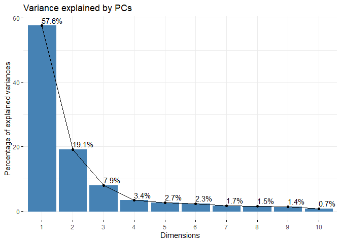<!-- -->

## Soft clustering using Fuzzy K-means

After performing dimensionality reduction, we can use our PCs as input
for downstream clustering methods. Here, we use fuzzy k-means, a ‘soft’
clustering method that is similar in concept and algorithm to k-means
clustering, which partitions data points within a given dataset into
defined numbers of clusters based on their proximity to the nearest
cluster’s centroid. In fuzzy k-means, data points are not exclusively
assigned to just one cluster, but rather given membership scores to all
clusters. This allows for additional characterization of high-scoring
cells within each cluster (i.e., quintessential ‘rod-like’, ‘ameboid’,
‘hypertrophic’, or ‘ramified’ cells), cells with more ambiguous
identities (e.g., a cell that is 5% rod-like, 5% ameboid, 45%
hypertrophic, and 45% ramified), and other cases that the user might be
interested in which might be informative for their specific dataset.
Fuzzy k-means also assigns a final hard cluster assignment based on the
class with the highest membership score, so you can also use these final
assignments as your input for downstream analysis.

### prepare data for clustering

``` r
## for k-means clustering: scale PCs 1-3, which together describe ~85% of variability
pca_data_scale <- transform_scale(pca_data, start=1, end=3) # scale pca data as input for k-means clustering
kmeans_input <- pca_data_scale[1:3]
```

### Cluster optimization prior to running fuzzy k-means

``` r
# check for optimal number of clusters using wss and silhouette methods
sampling <- kmeans_input[sample(nrow(kmeans_input), 5000),] #sample 5000 random rows for cluster optimization

fviz_nbclust(sampling, kmeans, method = 'wss', nstart=25, iter.max=50) # 4 clusters
```

<!-- -->

``` r
fviz_nbclust(sampling, kmeans, method = 'silhouette', nstart=25, iter.max=50) # 4 clusters
```

<!-- -->

From using the wss and silhouette methods to check the optimal numbers
of clusters for our dataset, it appears that our data would be optimally
clustered using k=4. There are many more cluster optimization methods
that you can try out to explore your data (insert link).

Next, we proceed with clustering. You can cluster using fuzzy k-means or
regular k-means at this step. After clustering, we will use some
built-in functions within MicrogliaMorphologyR to assess how a parameter
of k=4 influences how the clusters are defined by morphology features
(and if they make sense according to what we know about microglia
morphology). As this step may require some troubleshooting and updating
of clustering parameters, you may need to run your k-means function
multiple times. Fuzzy k-means is more time-intensive and computationally
expensive so it might help to use regular k-means as a first pass,
verify that your clusters make sense using the functions that follow,
and run your fuzzy k-means function using the final parameters that you
determine to generate your final dataset for downstream analysis.

## Clustering

### Fuzzy k-means (soft clustering)

``` r
# cluster and combine with original data
data_kmeans <- fcm(kmeans_input, centers=4, nstart=25)
pca_kmeans <- cbind(pca_data[1:5], data_kmeans)
str(pca_kmeans)
```

### Regular k-means (hard clustering)

``` r
# cluster and combine with original data
data_kmeans <- kmeans(kmeans_input, centers=4)
pca_kmeans <- cbind(pca_data[1:2], data_2xLPS, as.data.frame(data_kmeans$cluster)) %>%
  rename(Cluster=`data_kmeans$cluster`)
str(pca_kmeans)
```

    ## 'data.frame':    43332 obs. of  38 variables:
    ##  $ PC1                                                          : num  -3.4084 -3.9724 -0.0521 -2.6969 -1.6742 ...
    ##  $ PC2                                                          : num  0.676 0.688 0.498 1.384 -0.156 ...
    ##  $ Antibody                                                     : chr  "Cx3cr1" "Cx3cr1" "Cx3cr1" "Cx3cr1" ...
    ##  $ MouseID                                                      : chr  "1" "1" "1" "1" ...
    ##  $ Sex                                                          : chr  "F" "F" "F" "F" ...
    ##  $ Treatment                                                    : chr  "2xLPS" "2xLPS" "2xLPS" "2xLPS" ...
    ##  $ BrainRegion                                                  : chr  "FC" "FC" "FC" "FC" ...
    ##  $ Subregion                                                    : chr  "ACC" "ACC" "ACC" "ACC" ...
    ##  $ ID                                                           : chr  "00002-01053" "00009-01153" "00015-01224" "00016-01229" ...
    ##  $ UniqueID                                                     : chr  "Cx3cr1_Paper1_2Hit_1_F_2xLPS_FC_ACC_00002-01053" "Cx3cr1_Paper1_2Hit_1_F_2xLPS_FC_ACC_00009-01153" "Cx3cr1_Paper1_2Hit_1_F_2xLPS_FC_ACC_00015-01224" "Cx3cr1_Paper1_2Hit_1_F_2xLPS_FC_ACC_00016-01229" ...
    ##  $ Foreground pixels                                            : int  2535 2533 4996 2646 3713 2786 2518 3129 6119 3572 ...
    ##  $ Density of foreground pixels in hull area                    : num  0.604 0.694 0.653 0.438 0.553 ...
    ##  $ Span ratio of hull (major/minor axis)                        : num  1.27 1.49 1.43 1.06 1.31 ...
    ##  $ Maximum span across hull                                     : num  90.5 90.1 129 106.3 119.9 ...
    ##  $ Area                                                         : int  4200 3650 7648 6045 6709 6040 3675 5870 13061 7601 ...
    ##  $ Perimeter                                                    : num  264 234 351 301 326 ...
    ##  $ Circularity                                                  : num  0.758 0.839 0.781 0.839 0.794 ...
    ##  $ Width of bounding rectangle                                  : int  81 67 107 92 90 137 60 66 217 131 ...
    ##  $ Height of bounding rectangle                                 : int  88 92 118 91 121 74 99 127 97 113 ...
    ##  $ Maximum radius from hull's center of mass                    : num  50.7 49.8 66.6 64.2 64.3 ...
    ##  $ Max/min radii from hull's center of mass                     : num  1.77 1.96 1.84 1.79 1.65 ...
    ##  $ Relative variation (CV) in radii from hull's center of mass  : num  0.109 0.188 0.135 0.187 0.152 ...
    ##  $ Mean radius                                                  : num  45.2 38.1 59.3 51.3 55.7 ...
    ##  $ Diameter of bounding circle                                  : num  98.5 90.1 131.3 107.5 123.5 ...
    ##  $ Maximum radius from circle's center of mass                  : num  49.3 45.1 65.6 53.7 61.7 ...
    ##  $ Max/min radii from circle's center of mass                   : num  1.69 1.61 1.71 1.16 1.85 ...
    ##  $ Relative variation (CV) in radii from circle's center of mass: num  0.1061 0.1704 0.1361 0.0559 0.1672 ...
    ##  $ Mean radius from circle's center of mass                     : num  45 37.5 59.4 51.6 55 ...
    ##  $ # of branches                                                : int  12 14 22 11 12 13 13 11 26 9 ...
    ##  $ # of junctions                                               : int  6 6 11 5 6 6 7 5 12 4 ...
    ##  $ # of end point voxels                                        : int  6 9 10 7 6 8 5 6 13 6 ...
    ##  $ # of junction voxels                                         : int  12 14 22 7 14 10 13 14 30 8 ...
    ##  $ # of slab voxels                                             : int  240 208 345 197 255 244 189 224 538 183 ...
    ##  $ Average branch length                                        : num  8.73 6.72 7.17 7.92 9.11 ...
    ##  $ # of triple points                                           : int  6 5 10 5 6 6 7 4 10 4 ...
    ##  $ # of quadruple points                                        : int  0 1 1 0 0 0 0 1 1 0 ...
    ##  $ Maximum branch length                                        : num  29.2 15.1 21.3 16.2 23.8 ...
    ##  $ Cluster                                                      : int  4 2 3 4 4 4 2 4 1 4 ...

### Plot k-means clusters in PC space

``` r
plot <- clusterplots(pca_kmeans, "PC1", "PC2")
plot
```

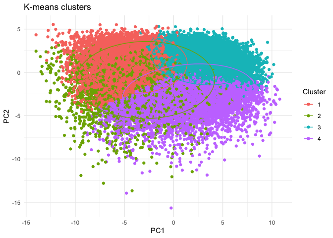<!-- -->

``` r
plot + scale_colour_viridis_d() # customizeable example: add color scheme of choice 
```

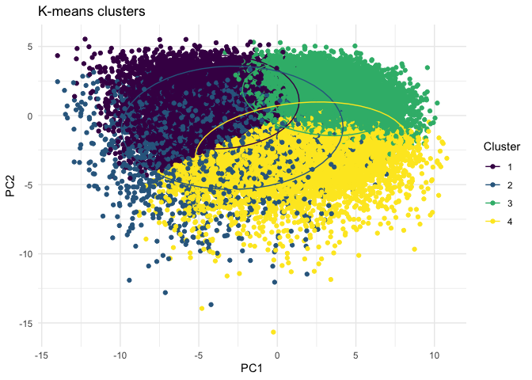<!-- -->

### Cluster-specific measures on average for each morphology feature, relative to other clusters

``` r
clusterfeatures(pca_kmeans, start=11, end=37)
```

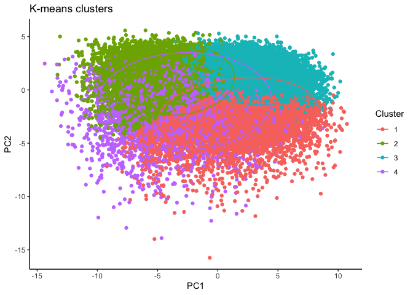<!-- -->

After comparing the individual features across clusters, we can
characterize the clusters as follows:

-   Cluster 1 = rod-like (greatest oblongness, lowest circularity)
-   Cluster 2 = ameboid (lowest territory span, high circularity,
    smallest branch lengths)
-   Cluster 3 = ramified (largest territory span and branching
    complexity)
-   Cluster 4 = hypertrophic (average territory span, high branch
    thickness as explained by pixel density in hull)

### ColorByCluster

Using the cluster classes assigned from our analyses using
MicrogliaMorphologyR, we can color each cell in the original image by
cluster using the MicrogliaMorphology ImageJ macro. In the following
example, we are isolating out the Cluster assignments for each microglia
in the Cx3cr1-stained ACC subregion image for Mouse 1. You can do this
for all of the images you are interested in applying ColorByCluster to.
This offers an additional method by which to visually assess and verify
your suspected cluster identities before deeming them ramifed,
hyper-ramified, rod-like, ameboid, or any other morphological form for
downstream analysis and interpretation.

#### Formatting data for ColorByCluster input (Color coding in ImageJ)

``` r
# isolate out all the cells for your specific image of interest
colorbycluster <- pca_kmeans %>% 
  filter(Antibody=="Cx3cr1",MouseID=="1", BrainRegion=="FC", Subregion=="ACC") %>% select(c(Cluster, ID))
head(colorbycluster)
```

    ##   Cluster          ID
    ## 1       4 00002-01053
    ## 2       2 00009-01153
    ## 3       3 00015-01224
    ## 4       4 00016-01229
    ## 5       4 00039-01394
    ## 6       4 00044-01397

#### Save .csv file to feed into ColorByCluster function in MicrogliaMorphology ImageJ macro

``` r
write.csv(colorbycluster, "filepath/Cxc3cr_Mouse1_FC_ACC_data.csv")
```

### Cluster characterization

``` r
# calculate cluster percentages across variables of interest
cp <- clusterpercentage(pca_kmeans, "Cluster", MouseID, Antibody, Treatment, Sex, BrainRegion)
cp$Treatment <- factor(cp$Treatment, levels=c("PBS","2xLPS"))

# update cluster labels
cp <- cp %>% mutate(Cluster = 
                      case_when(Cluster=="1" ~ "Rod-like",
                                Cluster=="2" ~ "Ameboid",
                                Cluster=="3" ~ "Ramified",
                                Cluster=="4" ~ "Hypertrophic"))

# Quick check of cluster proportions when considering experimental variables of interest
cp %>% 
  filter(BrainRegion=="STR") %>% # in this example, we filter for our brain region of interest
  clusterpercentage_boxplots(Antibody, Treatment) # grouping variables
```

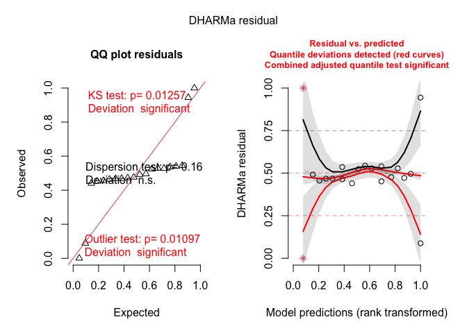<!-- -->

``` r
# example graph of data given variables of interest
cp %>% 
  filter(Antibody=="Iba1") %>%
  ggplot(aes(x=Cluster, y=percentage, group=interaction(Cluster, Treatment))) +
  facet_wrap(~BrainRegion) +
  geom_boxplot(aes(group=interaction(Cluster, Treatment), fill=Treatment)) +
  scale_fill_manual(values=c("#fde725","#482878")) +
  geom_point(position=position_dodge(width=0.8), size=0.75, aes(group=interaction(Cluster,Treatment), color=Sex)) +
  ggtitle("2xLPS mouse dataset: K-means clusters") +
  labs(fill="Treatment") +
  theme_bw(base_size=14) +
  theme(axis.text.x=element_text(angle=45, vjust=1, hjust=1))
```

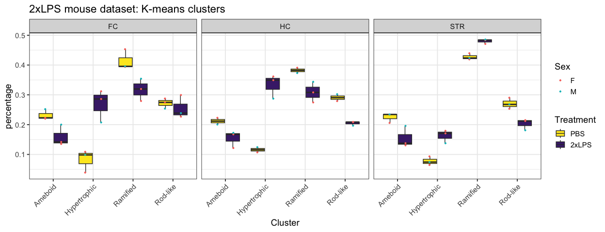<!-- -->

## Statistical analysis

MicrogliaMorphologyR includes a few functions to run stats on cluster
percentages as well as on individual morphology measures.

### Cluster percentage changes at animal level, in response to experimental variables

#### e.g., Across clusters - How does cluster membership change with LPS?

The stats_cluster.animal function fits a generalized linear mixed model
on your dataset to a beta distribution, which is suitable for values
like percentages or probabilities that are constrained to a range of
0-1, using the `glmmTMB` package. Part of the output includes a check of
the model fit using the `DHARMa` package, which “uses a simulation-based
approach to create readily interpretable scaled (quantile) residuals for
fitted (generalized) linear mixed models.” The function creates two
`DHARMa` plots, contained in output\[\[4\]\]. You can read more about
how to interpret model fit using `DHARMa` by reading the package
[vignette](https://cran.r-project.org/web/packages/DHARMa/vignettes/DHARMa.html).

``` r
# prepare percentages dataset for downstream analysis
stats.input <- cp %>% filter(BrainRegion=="FC", Antibody=="Iba1")
stats.input$MouseID <- factor(stats.input$MouseID)
stats.input$Cluster <- factor(stats.input$Cluster)
stats.input$Treatment <- factor(stats.input$Treatment)

# run stats analysis for changes in cluster percentages, at the animal level
# you can specify up to two posthoc comparisons (posthoc1 and posthoc2 arguments) - if you only have one set of posthocs to run, specify the same comparison twice for both arguments. you will just get the same results in output[[2]] and output[[3]].
stats.testing <- stats_cluster.animal(stats.input, "percentage ~ Cluster*Treatment + (1|MouseID)", 
                                      "~Cluster*Treatment", "~Treatment|Cluster", "bonferroni")
```

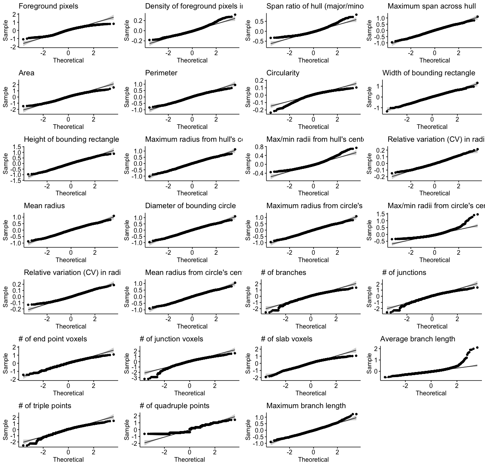<!-- -->

    ## Formula:          percentage ~ Cluster * Treatment + (1 | MouseID)
    ## Data: data
    ##       AIC       BIC    logLik  df.resid 
    ## -78.28956 -66.50903  49.14478        14 
    ## Random-effects (co)variances:
    ## 
    ## Conditional model:
    ##  Groups  Name        Std.Dev. 
    ##  MouseID (Intercept) 3.514e-06
    ## 
    ## Number of obs: 24 / Conditional model: MouseID, 6
    ## 
    ## Dispersion parameter for beta family ():  171 
    ## 
    ## Fixed Effects:
    ## 
    ## Conditional model:
    ##         (Intercept)             Cluster1             Cluster2  
    ##            -1.18704             -0.24193             -0.55266  
    ##            Cluster3           Treatment1  Cluster1:Treatment1  
    ##             0.63270             -0.05973              0.29651  
    ## Cluster2:Treatment1  Cluster3:Treatment1  
    ##            -0.67122              0.26851

``` r
stats.testing[[1]] # anova
```

    ## Analysis of Deviance Table (Type II Wald chisquare tests)
    ## 
    ## Response: percentage
    ##                     Chisq Df Pr(>Chisq)    
    ## Cluster           96.0328  3     <2e-16 ***
    ## Treatment          0.3341  1     0.5633    
    ## Cluster:Treatment 78.3763  3     <2e-16 ***
    ## ---
    ## Signif. codes:  0 '***' 0.001 '**' 0.01 '*' 0.05 '.' 0.1 ' ' 1

``` r
stats.testing[[2]] # posthoc 1
```

    ##  contrast                                estimate        SE  df z.ratio p.value
    ##  Ameboid PBS - Hypertrophic PBS         1.2784511 0.1925746 Inf   6.639  <.0001
    ##  Ameboid PBS - Ramified PBS            -0.8466319 0.1371397 Inf  -6.173  <.0001
    ##  Ameboid PBS - (Rod-like PBS)          -0.2135047 0.1433691 Inf  -1.489  1.0000
    ##  Ameboid PBS - Ameboid 2xLPS            0.4735579 0.1586746 Inf   2.984  0.0795
    ##  Ameboid PBS - Hypertrophic 2xLPS      -0.1834427 0.1438338 Inf  -1.275  1.0000
    ##  Ameboid PBS - Ramified 2xLPS          -0.4290788 0.1405113 Inf  -3.054  0.0633
    ##  Ameboid PBS - (Rod-like 2xLPS)        -0.1205588 0.1448605 Inf  -0.832  1.0000
    ##  Hypertrophic PBS - Ramified PBS       -2.1250830 0.1851987 Inf -11.475  <.0001
    ##  Hypertrophic PBS - (Rod-like PBS)     -1.4919558 0.1898065 Inf  -7.860  <.0001
    ##  Hypertrophic PBS - Ameboid 2xLPS      -0.8048932 0.2015312 Inf  -3.994  0.0018
    ##  Hypertrophic PBS - Hypertrophic 2xLPS -1.4618938 0.1901547 Inf  -7.688  <.0001
    ##  Hypertrophic PBS - Ramified 2xLPS     -1.7075299 0.1876771 Inf  -9.098  <.0001
    ##  Hypertrophic PBS - (Rod-like 2xLPS)   -1.3990099 0.1909261 Inf  -7.327  <.0001
    ##  Ramified PBS - (Rod-like PBS)          0.6331272 0.1331835 Inf   4.754  0.0001
    ##  Ramified PBS - Ameboid 2xLPS           1.3201898 0.1495656 Inf   8.827  <.0001
    ##  Ramified PBS - Hypertrophic 2xLPS      0.6631892 0.1336846 Inf   4.961  <.0001
    ##  Ramified PBS - Ramified 2xLPS          0.4175531 0.1300945 Inf   3.210  0.0372
    ##  Ramified PBS - (Rod-like 2xLPS)        0.7260731 0.1347911 Inf   5.387  <.0001
    ##  (Rod-like PBS) - Ameboid 2xLPS         0.6870626 0.1552822 Inf   4.425  0.0003
    ##  (Rod-like PBS) - Hypertrophic 2xLPS    0.0300620 0.1400727 Inf   0.215  1.0000
    ##  (Rod-like PBS) - Ramified 2xLPS       -0.2155741 0.1366563 Inf  -1.577  1.0000
    ##  (Rod-like PBS) - (Rod-like 2xLPS)      0.0929459 0.1411275 Inf   0.659  1.0000
    ##  Ameboid 2xLPS - Hypertrophic 2xLPS    -0.6570006 0.1557104 Inf  -4.219  0.0007
    ##  Ameboid 2xLPS - Ramified 2xLPS        -0.9026367 0.1526535 Inf  -5.913  <.0001
    ##  Ameboid 2xLPS - (Rod-like 2xLPS)      -0.5941167 0.1566574 Inf  -3.792  0.0042
    ##  Hypertrophic 2xLPS - Ramified 2xLPS   -0.2456361 0.1371443 Inf  -1.791  1.0000
    ##  Hypertrophic 2xLPS - (Rod-like 2xLPS)  0.0628839 0.1415997 Inf   0.444  1.0000
    ##  Ramified 2xLPS - (Rod-like 2xLPS)      0.3085200 0.1382221 Inf   2.232  0.7171
    ##  Significant
    ##  significant
    ##  significant
    ##  ns         
    ##  ns         
    ##  ns         
    ##  ns         
    ##  ns         
    ##  significant
    ##  significant
    ##  significant
    ##  significant
    ##  significant
    ##  significant
    ##  significant
    ##  significant
    ##  significant
    ##  significant
    ##  significant
    ##  significant
    ##  ns         
    ##  ns         
    ##  ns         
    ##  significant
    ##  significant
    ##  significant
    ##  ns         
    ##  ns         
    ##  ns         
    ## 
    ## Results are given on the log odds ratio (not the response) scale. 
    ## P value adjustment: bonferroni method for 28 tests

``` r
stats.testing[[3]] # posthoc 2
```

    ## Cluster = Ameboid:
    ##  contrast      estimate        SE  df z.ratio p.value Significant
    ##  PBS - 2xLPS  0.4735579 0.1586746 Inf   2.984  0.0028 significant
    ## 
    ## Cluster = Hypertrophic:
    ##  contrast      estimate        SE  df z.ratio p.value Significant
    ##  PBS - 2xLPS -1.4618938 0.1901547 Inf  -7.688  <.0001 significant
    ## 
    ## Cluster = Ramified:
    ##  contrast      estimate        SE  df z.ratio p.value Significant
    ##  PBS - 2xLPS  0.4175531 0.1300945 Inf   3.210  0.0013 significant
    ## 
    ## Cluster = Rod-like:
    ##  contrast      estimate        SE  df z.ratio p.value Significant
    ##  PBS - 2xLPS  0.0929459 0.1411275 Inf   0.659  0.5102 ns         
    ## 
    ## Results are given on the log odds ratio (not the response) scale.

``` r
stats.testing[[4]] # DHARMa model check
```

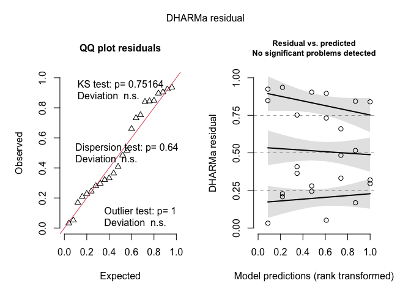<!-- -->

``` r
stats.testing[[5]] # summary of model
```

    ## Formula:          percentage ~ Cluster * Treatment + (1 | MouseID)
    ## Data: data
    ##       AIC       BIC    logLik  df.resid 
    ## -78.28956 -66.50903  49.14478        14 
    ## Random-effects (co)variances:
    ## 
    ## Conditional model:
    ##  Groups  Name        Std.Dev. 
    ##  MouseID (Intercept) 3.514e-06
    ## 
    ## Number of obs: 24 / Conditional model: MouseID, 6
    ## 
    ## Dispersion parameter for beta family ():  171 
    ## 
    ## Fixed Effects:
    ## 
    ## Conditional model:
    ##         (Intercept)             Cluster1             Cluster2  
    ##            -1.18704             -0.24193             -0.55266  
    ##            Cluster3           Treatment1  Cluster1:Treatment1  
    ##             0.63270             -0.05973              0.29651  
    ## Cluster2:Treatment1  Cluster3:Treatment1  
    ##            -0.67122              0.26851

### Individual morphology measures, at the animal level (averaged for each measure)

#### e.g., How does each individual morphology measure change with LPS treatment?

The stats_morphologymeasures.animal function fits a linear model using
the `lm` function for each morphology measure individually within your
dataset.

``` r
# prepare data for downstream analysis
data <- data_2xLPS %>% 
  group_by(MouseID, Sex, Treatment, BrainRegion, Antibody) %>% 
  summarise(across("Foreground pixels":"Maximum branch length", ~mean(.x))) %>% 
  gather(Measure, Value, "Foreground pixels":"Maximum branch length")
```

    ## `summarise()` has grouped output by 'MouseID', 'Sex', 'Treatment',
    ## 'BrainRegion'. You can override using the `.groups` argument.

``` r
# filter out data you want to run stats on and make sure to make any variables included in model into factors
stats.input <- data %>% filter(BrainRegion=="FC", Antibody=="Iba1") 
stats.input$Treatment <- factor(stats.input$Treatment)

# run stats analysis for changes in individual morphology measures
# you can specify up to two posthoc comparisons (posthoc1 and posthoc2 arguments) - if you only have one set of posthocs to run, specify the same comparison twice for both arguments. you will just get the same results in output[[2]] and output[[3]].
stats.testing <- stats_morphologymeasures.animal(stats.input, "Value ~ Treatment", 
                                                 "~Treatment", "~Treatment", "bonferroni")
```

    ## [1] "Foreground pixels"
    ## [1] "Density of foreground pixels in hull area"
    ## [1] "Span ratio of hull (major/minor axis)"
    ## [1] "Maximum span across hull"
    ## [1] "Area"
    ## [1] "Perimeter"
    ## [1] "Circularity"
    ## [1] "Width of bounding rectangle"
    ## [1] "Height of bounding rectangle"
    ## [1] "Maximum radius from hull's center of mass"
    ## [1] "Max/min radii from hull's center of mass"
    ## [1] "Relative variation (CV) in radii from hull's center of mass"
    ## [1] "Mean radius"
    ## [1] "Diameter of bounding circle"
    ## [1] "Maximum radius from circle's center of mass"
    ## [1] "Max/min radii from circle's center of mass"
    ## [1] "Relative variation (CV) in radii from circle's center of mass"
    ## [1] "Mean radius from circle's center of mass"
    ## [1] "# of branches"
    ## [1] "# of junctions"
    ## [1] "# of end point voxels"
    ## [1] "# of junction voxels"
    ## [1] "# of slab voxels"
    ## [1] "Average branch length"
    ## [1] "# of triple points"
    ## [1] "# of quadruple points"
    ## [1] "Maximum branch length"
    ## 
    ## Call:
    ## lm(formula = as.formula(paste(y.model)), data = tmp)
    ## 
    ## Coefficients:
    ## (Intercept)   Treatment1  
    ##     18.5887       0.8136

``` r
stats.testing[[1]] # anova
```

    ## Analysis of Variance Table
    ## 
    ## Response: Value
    ##             Df Sum Sq Mean Sq F value  Pr(>F) measure Significant
    ## Treatment    1  89448   89448  4.9907 0.08922      13           1
    ## Residuals    4  71692   17923                      13            
    ## Treatment1   1      0       0 44.3032 0.00265      11           2
    ## Residuals1   4      0       0                      11            
    ## Treatment2   1      0       0  2.8170 0.16857      26           1
    ## Residuals2   4      0       0                      26            
    ## Treatment3   1      4       4  0.2709 0.63023      20           1
    ## Residuals3   4     59      15                      20            
    ## Treatment4   1 662332  662332  4.3751 0.10463       8           1
    ## Residuals4   4 605544  151386                       8            
    ## Treatment5   1    123     123  1.5384 0.28264      23           1
    ## Residuals5   4    319      80                      23            
    ## Treatment6   1      0       0  3.8684 0.12061      10           1
    ## Residuals6   4      0       0                      10            
    ## Treatment7   1      1       1  0.0742 0.79878      27           1
    ## Residuals7   4     68      17                      27            
    ## Treatment8   1     35      35  4.4467 0.10264      14           1
    ## Residuals8   4     31       8                      14            
    ## Treatment9   1      0       0  0.0496 0.83461      19           1
    ## Residuals9   4     22       6                      19            
    ## Treatment10  1      0       0  3.9645 0.11730      16           1
    ## Residuals10  4      0       0                      16            
    ## Treatment11  1      0       0  8.5949 0.04274      25           2
    ## Residuals11  4      0       0                      25            
    ## Treatment12  1      3       3  1.3312 0.31283      21           1
    ## Residuals12  4     10       2                      21            
    ## Treatment13  1      5       5  0.2928 0.61717      12           1
    ## Residuals13  4     62      15                      12            
    ## Treatment14  1      1       1  0.2928 0.61717      18           1
    ## Residuals14  4     15       4                      18            
    ## Treatment15  1      0       0  3.9421 0.11806      15           1
    ## Residuals15  4      0       0                      15            
    ## Treatment16  1      0       0  6.8378 0.05911      24           1
    ## Residuals16  4      0       0                      24            
    ## Treatment17  1      3       3  1.1510 0.34375      22           1
    ## Residuals17  4     10       3                      22            
    ## Treatment18  1     95      95 10.6483 0.03099       1           2
    ## Residuals18  4     36       9                       1            
    ## Treatment19  1     27      27 10.1322 0.03344       4           2
    ## Residuals19  4     11       3                       4            
    ## Treatment20  1     12      12 13.8497 0.02045       2           2
    ## Residuals20  4      3       1                       2            
    ## Treatment21  1    104     104  8.6805 0.04213       3           2
    ## Residuals21  4     48      12                       3            
    ## Treatment22  1   3505    3505  7.3093 0.05389       6           1
    ## Residuals22  4   1918     479                       6            
    ## Treatment23  1      3       3 13.5254 0.02125       9           2
    ## Residuals23  4      1       0                       9            
    ## Treatment24  1     23      23 10.4407 0.03194       7           2
    ## Residuals24  4      9       2                       7            
    ## Treatment25  1      0       0  6.8687 0.05875       5           1
    ## Residuals25  4      0       0                       5            
    ## Treatment26  1      4       4  8.9637 0.04018      17           2
    ## Residuals26  4      2       0                      17

``` r
stats.testing[[2]] # posthoc 1
```

    ##  contrast     estimate       SE df   lower.CL upper.CL t.ratio p.value
    ##  2xLPS - PBS  244.1962 109.3098  4   -59.2965 547.6889   2.234  0.0892
    ##  2xLPS - PBS    0.0730   0.0110  4     0.0426   0.1035   6.656  0.0026
    ##  2xLPS - PBS    0.0919   0.0548  4    -0.0601   0.2440   1.678  0.1686
    ##  2xLPS - PBS   -1.6312   3.1343  4   -10.3334   7.0710  -0.520  0.6302
    ##  2xLPS - PBS -664.4959 317.6855  4 -1546.5322 217.5404  -2.092  0.1046
    ##  2xLPS - PBS   -9.0370   7.2859  4   -29.2660  11.1920  -1.240  0.2826
    ##  2xLPS - PBS   -0.0173   0.0088  4    -0.0417   0.0071  -1.967  0.1206
    ##  2xLPS - PBS   -0.9183   3.3709  4   -10.2773   8.4407  -0.272  0.7988
    ##  2xLPS - PBS   -4.8245   2.2879  4   -11.1767   1.5276  -2.109  0.1026
    ##  2xLPS - PBS   -0.4278   1.9202  4    -5.7592   4.9036  -0.223  0.8346
    ##  2xLPS - PBS    0.1229   0.0617  4    -0.0485   0.2942   1.991  0.1173
    ##  2xLPS - PBS    0.0152   0.0052  4     0.0008   0.0297   2.932  0.0427
    ##  2xLPS - PBS   -1.4843   1.2864  4    -5.0560   2.0875  -1.154  0.3128
    ##  2xLPS - PBS   -1.7382   3.2124  4   -10.6572   7.1808  -0.541  0.6172
    ##  2xLPS - PBS   -0.8691   1.6062  4    -5.3286   3.5904  -0.541  0.6172
    ##  2xLPS - PBS    0.1294   0.0652  4    -0.0515   0.3103   1.985  0.1181
    ##  2xLPS - PBS    0.0120   0.0046  4    -0.0007   0.0248   2.615  0.0591
    ##  2xLPS - PBS   -1.3952   1.3004  4    -5.0057   2.2154  -1.073  0.3438
    ##  2xLPS - PBS   -7.9429   2.4341  4   -14.7010  -1.1847  -3.263  0.0310
    ##  2xLPS - PBS   -4.2604   1.3384  4    -7.9765  -0.5443  -3.183  0.0334
    ##  2xLPS - PBS   -2.7806   0.7472  4    -4.8551  -0.7061  -3.722  0.0204
    ##  2xLPS - PBS   -8.3302   2.8274  4   -16.1803  -0.4802  -2.946  0.0421
    ##  2xLPS - PBS  -48.3360  17.8786  4   -97.9749   1.3029  -2.704  0.0539
    ##  2xLPS - PBS    1.5148   0.4119  4     0.3712   2.6584   3.678  0.0212
    ##  2xLPS - PBS   -3.9444   1.2207  4    -7.3336  -0.5551  -3.231  0.0319
    ##  2xLPS - PBS   -0.3074   0.1173  4    -0.6330   0.0183  -2.621  0.0587
    ##  2xLPS - PBS    1.6271   0.5435  4     0.1182   3.1360   2.994  0.0402
    ##  measure                                                       Significant
    ##  Foreground pixels                                             ns         
    ##  Density of foreground pixels in hull area                     significant
    ##  Span ratio of hull (major/minor axis)                         ns         
    ##  Maximum span across hull                                      ns         
    ##  Area                                                          ns         
    ##  Perimeter                                                     ns         
    ##  Circularity                                                   ns         
    ##  Width of bounding rectangle                                   ns         
    ##  Height of bounding rectangle                                  ns         
    ##  Maximum radius from hull's center of mass                     ns         
    ##  Max/min radii from hull's center of mass                      ns         
    ##  Relative variation (CV) in radii from hull's center of mass   significant
    ##  Mean radius                                                   ns         
    ##  Diameter of bounding circle                                   ns         
    ##  Maximum radius from circle's center of mass                   ns         
    ##  Max/min radii from circle's center of mass                    ns         
    ##  Relative variation (CV) in radii from circle's center of mass ns         
    ##  Mean radius from circle's center of mass                      ns         
    ##  # of branches                                                 significant
    ##  # of junctions                                                significant
    ##  # of end point voxels                                         significant
    ##  # of junction voxels                                          significant
    ##  # of slab voxels                                              ns         
    ##  Average branch length                                         significant
    ##  # of triple points                                            significant
    ##  # of quadruple points                                         ns         
    ##  Maximum branch length                                         significant
    ## 
    ## Confidence level used: 0.95

``` r
stats.testing[[3]] # posthoc 2
```

    ##  contrast     estimate       SE df   lower.CL upper.CL t.ratio p.value
    ##  2xLPS - PBS  244.1962 109.3098  4   -59.2965 547.6889   2.234  0.0892
    ##  2xLPS - PBS    0.0730   0.0110  4     0.0426   0.1035   6.656  0.0026
    ##  2xLPS - PBS    0.0919   0.0548  4    -0.0601   0.2440   1.678  0.1686
    ##  2xLPS - PBS   -1.6312   3.1343  4   -10.3334   7.0710  -0.520  0.6302
    ##  2xLPS - PBS -664.4959 317.6855  4 -1546.5322 217.5404  -2.092  0.1046
    ##  2xLPS - PBS   -9.0370   7.2859  4   -29.2660  11.1920  -1.240  0.2826
    ##  2xLPS - PBS   -0.0173   0.0088  4    -0.0417   0.0071  -1.967  0.1206
    ##  2xLPS - PBS   -0.9183   3.3709  4   -10.2773   8.4407  -0.272  0.7988
    ##  2xLPS - PBS   -4.8245   2.2879  4   -11.1767   1.5276  -2.109  0.1026
    ##  2xLPS - PBS   -0.4278   1.9202  4    -5.7592   4.9036  -0.223  0.8346
    ##  2xLPS - PBS    0.1229   0.0617  4    -0.0485   0.2942   1.991  0.1173
    ##  2xLPS - PBS    0.0152   0.0052  4     0.0008   0.0297   2.932  0.0427
    ##  2xLPS - PBS   -1.4843   1.2864  4    -5.0560   2.0875  -1.154  0.3128
    ##  2xLPS - PBS   -1.7382   3.2124  4   -10.6572   7.1808  -0.541  0.6172
    ##  2xLPS - PBS   -0.8691   1.6062  4    -5.3286   3.5904  -0.541  0.6172
    ##  2xLPS - PBS    0.1294   0.0652  4    -0.0515   0.3103   1.985  0.1181
    ##  2xLPS - PBS    0.0120   0.0046  4    -0.0007   0.0248   2.615  0.0591
    ##  2xLPS - PBS   -1.3952   1.3004  4    -5.0057   2.2154  -1.073  0.3438
    ##  2xLPS - PBS   -7.9429   2.4341  4   -14.7010  -1.1847  -3.263  0.0310
    ##  2xLPS - PBS   -4.2604   1.3384  4    -7.9765  -0.5443  -3.183  0.0334
    ##  2xLPS - PBS   -2.7806   0.7472  4    -4.8551  -0.7061  -3.722  0.0204
    ##  2xLPS - PBS   -8.3302   2.8274  4   -16.1803  -0.4802  -2.946  0.0421
    ##  2xLPS - PBS  -48.3360  17.8786  4   -97.9749   1.3029  -2.704  0.0539
    ##  2xLPS - PBS    1.5148   0.4119  4     0.3712   2.6584   3.678  0.0212
    ##  2xLPS - PBS   -3.9444   1.2207  4    -7.3336  -0.5551  -3.231  0.0319
    ##  2xLPS - PBS   -0.3074   0.1173  4    -0.6330   0.0183  -2.621  0.0587
    ##  2xLPS - PBS    1.6271   0.5435  4     0.1182   3.1360   2.994  0.0402
    ##  measure                                                       Significant
    ##  Foreground pixels                                             ns         
    ##  Density of foreground pixels in hull area                     significant
    ##  Span ratio of hull (major/minor axis)                         ns         
    ##  Maximum span across hull                                      ns         
    ##  Area                                                          ns         
    ##  Perimeter                                                     ns         
    ##  Circularity                                                   ns         
    ##  Width of bounding rectangle                                   ns         
    ##  Height of bounding rectangle                                  ns         
    ##  Maximum radius from hull's center of mass                     ns         
    ##  Max/min radii from hull's center of mass                      ns         
    ##  Relative variation (CV) in radii from hull's center of mass   significant
    ##  Mean radius                                                   ns         
    ##  Diameter of bounding circle                                   ns         
    ##  Maximum radius from circle's center of mass                   ns         
    ##  Max/min radii from circle's center of mass                    ns         
    ##  Relative variation (CV) in radii from circle's center of mass ns         
    ##  Mean radius from circle's center of mass                      ns         
    ##  # of branches                                                 significant
    ##  # of junctions                                                significant
    ##  # of end point voxels                                         significant
    ##  # of junction voxels                                          significant
    ##  # of slab voxels                                              ns         
    ##  Average branch length                                         significant
    ##  # of triple points                                            significant
    ##  # of quadruple points                                         ns         
    ##  Maximum branch length                                         significant
    ## 
    ## Confidence level used: 0.95

``` r
do.call("grid.arrange", c(stats.testing[[4]], ncol=4)) # qqplots to check normality assumptions
```

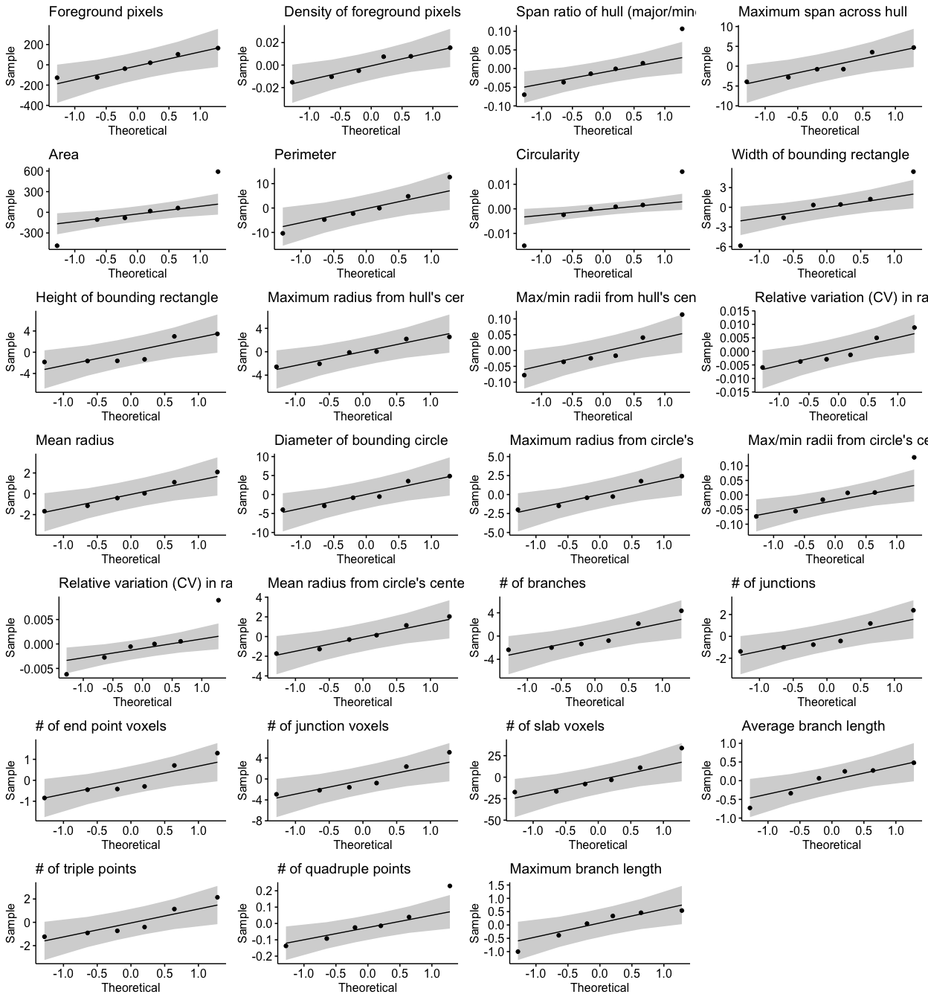<!-- -->

``` r
stats.testing[[5]] # summary of model
```

    ## 
    ## Call:
    ## lm(formula = as.formula(paste(y.model)), data = tmp)
    ## 
    ## Coefficients:
    ## (Intercept)   Treatment1  
    ##     18.5887       0.8136

### Individual morphology measures, at the cell level

#### e.g., How does each individual morphology measure change with LPS treatment?

The stats_morphologymeasures.cell function fits a linear mixed effects
model considering MouseID as a repeated measure using the `lmerTest`
package, for each morphology measure individually within your dataset.
The `lmerTest` package “provides p-values in type I, II or III anova and
summary tables for linear mixed models…via Satterthwaite’s degrees of
freedom method.” You can learn more about the package by reading the
`lmerTest` [reference
manual](https://cran.r-project.org/web/packages/lmerTest/lmerTest.pdf)

``` r
# prepare data for downstream analysis
data <- data_2xLPS_logtransformed %>% 
  group_by(MouseID, Sex, Treatment) %>% 
  gather(Measure, Value, "Foreground pixels":"Maximum branch length")

# filter out data you want to run stats on and make sure to make any variables included in model into factors
stats.input <- data %>% filter(BrainRegion=="FC", Antibody=="Iba1") 
stats.input$Treatment <- factor(stats.input$Treatment)
stats.input$MouseID <- factor(stats.input$MouseID)

# run stats analysis for changes in individual morphology measures
# you can specify up to two posthoc comparisons (posthoc1 and posthoc2 arguments) - if you only have one set of posthocs to run, specify the same comparison twice for both arguments. you will just get the same results in output[[2]] and output[[3]].
stats <- stats_morphologymeasures.cell(stats.input, "Value ~ Treatment + (1|MouseID)", 
                                  "~Treatment", "~Treatment", "bonferroni")
```

    ## [1] "Foreground pixels"
    ## [1] "Density of foreground pixels in hull area"
    ## [1] "Span ratio of hull (major/minor axis)"
    ## [1] "Maximum span across hull"
    ## [1] "Area"
    ## [1] "Perimeter"
    ## [1] "Circularity"
    ## [1] "Width of bounding rectangle"
    ## [1] "Height of bounding rectangle"
    ## [1] "Maximum radius from hull's center of mass"
    ## [1] "Max/min radii from hull's center of mass"
    ## [1] "Relative variation (CV) in radii from hull's center of mass"
    ## [1] "Mean radius"
    ## [1] "Diameter of bounding circle"
    ## [1] "Maximum radius from circle's center of mass"
    ## [1] "Max/min radii from circle's center of mass"
    ## [1] "Relative variation (CV) in radii from circle's center of mass"
    ## [1] "Mean radius from circle's center of mass"
    ## [1] "# of branches"
    ## [1] "# of junctions"
    ## [1] "# of end point voxels"
    ## [1] "# of junction voxels"
    ## [1] "# of slab voxels"
    ## [1] "Average branch length"
    ## [1] "# of triple points"
    ## [1] "# of quadruple points"
    ## [1] "Maximum branch length"
    ## Linear mixed model fit by REML ['lmerModLmerTest']
    ## Formula: as.formula(paste(y.model))
    ##    Data: tmp
    ## REML criterion at convergence: 818.6555
    ## Random effects:
    ##  Groups   Name        Std.Dev.
    ##  MouseID  (Intercept) 0.02886 
    ##  Residual             0.27717 
    ## Number of obs: 2930, groups:  MouseID, 6
    ## Fixed Effects:
    ## (Intercept)   Treatment1  
    ##     2.93346      0.03625

``` r
stats[[1]] # anova
```

    ## Type III Analysis of Variance Table with Satterthwaite's method
    ##             Sum Sq Mean Sq NumDF  DenDF F value  Pr(>F) measure Significant
    ## Treatment   1.0004  1.0004     1 3.9833  6.3314 0.06588      13           1
    ## Treatment1  0.2202  0.2202     1 3.9604 40.4440 0.00324      11           2
    ## Treatment2  0.0837  0.0837     1 3.9673  2.6753 0.17784      26           1
    ## Treatment3  0.0224  0.0224     1 3.9787  0.2723 0.62948      20           1
    ## Treatment4  0.9566  0.9566     1 3.9787  3.3352 0.14223       8           1
    ## Treatment5  0.1001  0.1001     1 3.9843  1.3684 0.30727      23           1
    ## Treatment6  0.0091  0.0091     1 4.0246  3.8811 0.11973      10           1
    ## Treatment7  0.0118  0.0118     1 4.0060  0.1040 0.76320      27           1
    ## Treatment8  0.4372  0.4372     1 3.9337  4.3527 0.10644      14           1
    ## Treatment9  0.0043  0.0043     1 4.0067  0.0519 0.83088      19           1
    ## Treatment10 0.1111  0.1111     1 3.9971  4.0780 0.11363      16           1
    ## Treatment11 0.0243  0.0243     1 4.0197  8.1698 0.04574      25           2
    ## Treatment12 0.1004  0.1004     1 3.9887  1.2925 0.31924      21           1
    ## Treatment13 0.0239  0.0239     1 3.9855  0.2941 0.61651      12           1
    ## Treatment14 0.0235  0.0235     1 3.9856  0.2938 0.61668      18           1
    ## Treatment15 0.1819  0.1819     1 3.8887  4.0933 0.11509      15           1
    ## Treatment16 0.0218  0.0218     1 3.7535  7.0399 0.06067      24           1
    ## Treatment17 0.0828  0.0828     1 3.9951  1.0732 0.35881      22           1
    ## Treatment18 4.0881  4.0881     1 4.0066 13.0920 0.02233       1           2
    ## Treatment19 4.1851  4.1851     1 4.0077 12.6546 0.02357       4           2
    ## Treatment20 2.5907  2.5907     1 4.0025 14.7053 0.01852       2           2
    ## Treatment21 4.8162  4.8162     1 4.0082 11.6162 0.02698       3           2
    ## Treatment22 1.8712  1.8712     1 4.0093  8.5146 0.04321       6           2
    ## Treatment23 0.7570  0.7570     1 4.0068 17.5127 0.01382       9           2
    ## Treatment24 4.1344  4.1344     1 4.0084 12.4466 0.02419       7           2
    ## Treatment25 2.0078  2.0078     1 4.0104  8.7225 0.04169       5           2
    ## Treatment26 0.6102  0.6102     1 4.0415  7.9426 0.04735      17           2

``` r
stats[[2]] # posthoc 1
```

    ##  contrast      estimate         SE   df t.ratio p.value
    ##  2xLPS - PBS  0.0834128 0.03315946 4.00   2.516  0.0657
    ##  2xLPS - PBS  0.0491561 0.00773037 4.00   6.359  0.0031
    ##  2xLPS - PBS  0.0266657 0.01630603 4.00   1.635  0.1774
    ##  2xLPS - PBS -0.0109156 0.02092766 3.99  -0.522  0.6295
    ##  2xLPS - PBS -0.0727282 0.03984162 3.99  -1.825  0.1421
    ##  2xLPS - PBS -0.0236627 0.02023734 3.99  -1.169  0.3073
    ##  2xLPS - PBS -0.0102133 0.00518482 4.00  -1.970  0.1202
    ##  2xLPS - PBS -0.0095440 0.02960095 4.00  -0.322  0.7633
    ##  2xLPS - PBS -0.0418529 0.02007795 3.99  -2.085  0.1057
    ##  2xLPS - PBS -0.0053288 0.02338982 4.00  -0.228  0.8310
    ##  2xLPS - PBS  0.0351866 0.01742625 4.00   2.019  0.1136
    ##  2xLPS - PBS  0.0122244 0.00427840 3.99   2.857  0.0461
    ##  2xLPS - PBS -0.0232038 0.02042003 3.99  -1.136  0.3194
    ##  2xLPS - PBS -0.0116260 0.02144729 3.99  -0.542  0.6166
    ##  2xLPS - PBS -0.0115397 0.02129871 3.99  -0.542  0.6168
    ##  2xLPS - PBS  0.0356102 0.01760600 4.00   2.023  0.1132
    ##  2xLPS - PBS  0.0101526 0.00382877 3.99   2.652  0.0570
    ##  2xLPS - PBS -0.0211061 0.02038353 3.99  -1.035  0.3590
    ##  2xLPS - PBS -0.3405137 0.09411074 4.00  -3.618  0.0224
    ##  2xLPS - PBS -0.3474417 0.09767071 4.00  -3.557  0.0236
    ##  2xLPS - PBS -0.2369813 0.06180024 4.00  -3.835  0.0185
    ##  2xLPS - PBS -0.3777789 0.11084401 4.00  -3.408  0.0271
    ##  2xLPS - PBS -0.1547910 0.05305194 4.00  -2.918  0.0434
    ##  2xLPS - PBS  0.1676091 0.04005217 4.00   4.185  0.0139
    ##  2xLPS - PBS -0.3365390 0.09539351 4.00  -3.528  0.0243
    ##  2xLPS - PBS -0.1583623 0.05362542 4.00  -2.953  0.0419
    ##  2xLPS - PBS  0.0724966 0.02572870 4.00   2.818  0.0480
    ##  measure                                                       Significant
    ##  Foreground pixels                                             ns         
    ##  Density of foreground pixels in hull area                     significant
    ##  Span ratio of hull (major/minor axis)                         ns         
    ##  Maximum span across hull                                      ns         
    ##  Area                                                          ns         
    ##  Perimeter                                                     ns         
    ##  Circularity                                                   ns         
    ##  Width of bounding rectangle                                   ns         
    ##  Height of bounding rectangle                                  ns         
    ##  Maximum radius from hull's center of mass                     ns         
    ##  Max/min radii from hull's center of mass                      ns         
    ##  Relative variation (CV) in radii from hull's center of mass   significant
    ##  Mean radius                                                   ns         
    ##  Diameter of bounding circle                                   ns         
    ##  Maximum radius from circle's center of mass                   ns         
    ##  Max/min radii from circle's center of mass                    ns         
    ##  Relative variation (CV) in radii from circle's center of mass ns         
    ##  Mean radius from circle's center of mass                      ns         
    ##  # of branches                                                 significant
    ##  # of junctions                                                significant
    ##  # of end point voxels                                         significant
    ##  # of junction voxels                                          significant
    ##  # of slab voxels                                              significant
    ##  Average branch length                                         significant
    ##  # of triple points                                            significant
    ##  # of quadruple points                                         significant
    ##  Maximum branch length                                         significant
    ## 
    ## Degrees-of-freedom method: kenward-roger

``` r
stats[[3]] # posthoc 2
```

    ##  contrast      estimate         SE   df t.ratio p.value
    ##  2xLPS - PBS  0.0834128 0.03315946 4.00   2.516  0.0657
    ##  2xLPS - PBS  0.0491561 0.00773037 4.00   6.359  0.0031
    ##  2xLPS - PBS  0.0266657 0.01630603 4.00   1.635  0.1774
    ##  2xLPS - PBS -0.0109156 0.02092766 3.99  -0.522  0.6295
    ##  2xLPS - PBS -0.0727282 0.03984162 3.99  -1.825  0.1421
    ##  2xLPS - PBS -0.0236627 0.02023734 3.99  -1.169  0.3073
    ##  2xLPS - PBS -0.0102133 0.00518482 4.00  -1.970  0.1202
    ##  2xLPS - PBS -0.0095440 0.02960095 4.00  -0.322  0.7633
    ##  2xLPS - PBS -0.0418529 0.02007795 3.99  -2.085  0.1057
    ##  2xLPS - PBS -0.0053288 0.02338982 4.00  -0.228  0.8310
    ##  2xLPS - PBS  0.0351866 0.01742625 4.00   2.019  0.1136
    ##  2xLPS - PBS  0.0122244 0.00427840 3.99   2.857  0.0461
    ##  2xLPS - PBS -0.0232038 0.02042003 3.99  -1.136  0.3194
    ##  2xLPS - PBS -0.0116260 0.02144729 3.99  -0.542  0.6166
    ##  2xLPS - PBS -0.0115397 0.02129871 3.99  -0.542  0.6168
    ##  2xLPS - PBS  0.0356102 0.01760600 4.00   2.023  0.1132
    ##  2xLPS - PBS  0.0101526 0.00382877 3.99   2.652  0.0570
    ##  2xLPS - PBS -0.0211061 0.02038353 3.99  -1.035  0.3590
    ##  2xLPS - PBS -0.3405137 0.09411074 4.00  -3.618  0.0224
    ##  2xLPS - PBS -0.3474417 0.09767071 4.00  -3.557  0.0236
    ##  2xLPS - PBS -0.2369813 0.06180024 4.00  -3.835  0.0185
    ##  2xLPS - PBS -0.3777789 0.11084401 4.00  -3.408  0.0271
    ##  2xLPS - PBS -0.1547910 0.05305194 4.00  -2.918  0.0434
    ##  2xLPS - PBS  0.1676091 0.04005217 4.00   4.185  0.0139
    ##  2xLPS - PBS -0.3365390 0.09539351 4.00  -3.528  0.0243
    ##  2xLPS - PBS -0.1583623 0.05362542 4.00  -2.953  0.0419
    ##  2xLPS - PBS  0.0724966 0.02572870 4.00   2.818  0.0480
    ##  measure                                                       Significant
    ##  Foreground pixels                                             ns         
    ##  Density of foreground pixels in hull area                     significant
    ##  Span ratio of hull (major/minor axis)                         ns         
    ##  Maximum span across hull                                      ns         
    ##  Area                                                          ns         
    ##  Perimeter                                                     ns         
    ##  Circularity                                                   ns         
    ##  Width of bounding rectangle                                   ns         
    ##  Height of bounding rectangle                                  ns         
    ##  Maximum radius from hull's center of mass                     ns         
    ##  Max/min radii from hull's center of mass                      ns         
    ##  Relative variation (CV) in radii from hull's center of mass   significant
    ##  Mean radius                                                   ns         
    ##  Diameter of bounding circle                                   ns         
    ##  Maximum radius from circle's center of mass                   ns         
    ##  Max/min radii from circle's center of mass                    ns         
    ##  Relative variation (CV) in radii from circle's center of mass ns         
    ##  Mean radius from circle's center of mass                      ns         
    ##  # of branches                                                 significant
    ##  # of junctions                                                significant
    ##  # of end point voxels                                         significant
    ##  # of junction voxels                                          significant
    ##  # of slab voxels                                              significant
    ##  Average branch length                                         significant
    ##  # of triple points                                            significant
    ##  # of quadruple points                                         significant
    ##  Maximum branch length                                         significant
    ## 
    ## Degrees-of-freedom method: kenward-roger

``` r
do.call("grid.arrange", c(stats[[4]], ncol=4)) # qqplots to check normality assumptions
```

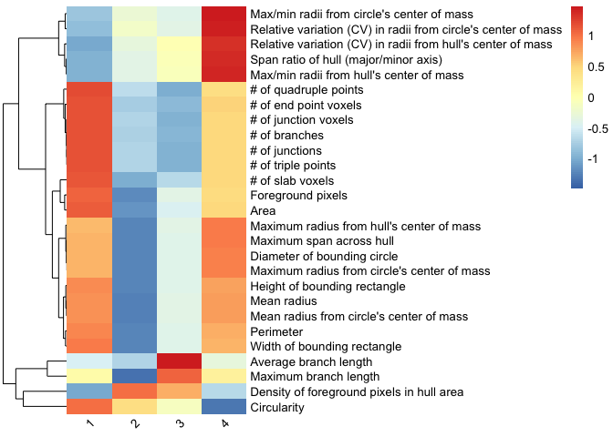<!-- -->

``` r
stats[[5]] # summary of model
```

    ## Linear mixed model fit by REML ['lmerModLmerTest']
    ## Formula: as.formula(paste(y.model))
    ##    Data: tmp
    ## REML criterion at convergence: 818.6555
    ## Random effects:
    ##  Groups   Name        Std.Dev.
    ##  MouseID  (Intercept) 0.02886 
    ##  Residual             0.27717 
    ## Number of obs: 2930, groups:  MouseID, 6
    ## Fixed Effects:
    ## (Intercept)   Treatment1  
    ##     2.93346      0.03625

If you find that any individual morphology measures violate assumptions
of normality after checking the qqplots contained in
stats.input\[\[4\]\], you can filter your data for those measures,
transform your data in the suitable manner (i.e., using
MicrogliaMorphologyR functions like `transform_minmax` or
`transform_scale` or other data transformations), and rerun the stats
for those morphology features using the code above.

### Example of additional analyses possible with fuzzy k-means (soft clustering) membership scores

Here, we will use a fuzzy k-means dataset that comes pre-loaded with the
package for demonstration purposes, as running the actual fuzzy
clustering step using the `fcm` function in the `ppclust`
[package](https://cran.r-project.org/web/packages/ppclust/vignettes/fcm.html)
is time-intensive and computationally-expensive.

Load in example dataset:

``` r
data_fuzzykmeans <- MicrogliaMorphologyR::data_2xLPS_fuzzykmeans
colnames(data_fuzzykmeans)
```

    ##  [1] "Antibody"                                                     
    ##  [2] "MouseID"                                                      
    ##  [3] "Sex"                                                          
    ##  [4] "Treatment"                                                    
    ##  [5] "BrainRegion"                                                  
    ##  [6] "Subregion"                                                    
    ##  [7] "ID"                                                           
    ##  [8] "UniqueID"                                                     
    ##  [9] "Foreground pixels"                                            
    ## [10] "Density of foreground pixels in hull area"                    
    ## [11] "Span ratio of hull (major/minor axis)"                        
    ## [12] "Maximum span across hull"                                     
    ## [13] "Area"                                                         
    ## [14] "Perimeter"                                                    
    ## [15] "Circularity"                                                  
    ## [16] "Width of bounding rectangle"                                  
    ## [17] "Height of bounding rectangle"                                 
    ## [18] "Maximum radius from hull's center of mass"                    
    ## [19] "Max/min radii from hull's center of mass"                     
    ## [20] "Relative variation (CV) in radii from hull's center of mass"  
    ## [21] "Mean radius"                                                  
    ## [22] "Diameter of bounding circle"                                  
    ## [23] "Maximum radius from circle's center of mass"                  
    ## [24] "Max/min radii from circle's center of mass"                   
    ## [25] "Relative variation (CV) in radii from circle's center of mass"
    ## [26] "Mean radius from circle's center of mass"                     
    ## [27] "# of branches"                                                
    ## [28] "# of junctions"                                               
    ## [29] "# of end point voxels"                                        
    ## [30] "# of junction voxels"                                         
    ## [31] "# of slab voxels"                                             
    ## [32] "Average branch length"                                        
    ## [33] "# of triple points"                                           
    ## [34] "# of quadruple points"                                        
    ## [35] "Maximum branch length"                                        
    ## [36] "Cluster 1"                                                    
    ## [37] "Cluster 2"                                                    
    ## [38] "Cluster 3"                                                    
    ## [39] "Cluster 4"                                                    
    ## [40] "Cluster"

``` r
# check cluster features to determine cluster labels
clusterfeatures(data_fuzzykmeans, start=9, end=35)
```

<!-- -->

``` r
# update cluster labels
data_fuzzykmeans <- data_fuzzykmeans %>% mutate(Cluster = 
                      case_when(Cluster=="1" ~ "Ramified",
                                Cluster=="2" ~ "Ameboid",
                                Cluster=="3" ~ "Hypertrophic",
                                Cluster=="4" ~ "Rod-like"))
```

#### Example: Characterization of just the high-scoring cells within each cluster (i.e., quintessential ‘rod-like’, ‘ameboid’, ‘hypertrophic’, or ‘ramified’ cells)

``` r
nrow(data_fuzzykmeans) # 43332 cells
```

    ## [1] 43332

``` r
data <- data_fuzzykmeans %>% 
  filter(`Cluster 1` > 0.70|
         `Cluster 2` > 0.70|
         `Cluster 3` > 0.70|
         `Cluster 4` > 0.70)
nrow(data) # 7965 cells
```

    ## [1] 7965

``` r
# calculate cluster percentages across variables of interest
cp <- clusterpercentage(data, "Cluster", MouseID, Antibody, Treatment, Sex, BrainRegion)
cp$Treatment <- factor(cp$Treatment, levels=c("PBS","2xLPS"))

# example graph of data given variables of interest
cp %>% 
  filter(Antibody=="Iba1") %>%
  ggplot(aes(x=Cluster, y=percentage, group=interaction(Cluster, Treatment))) +
  facet_wrap(~BrainRegion) +
  geom_boxplot(aes(group=interaction(Cluster, Treatment), fill=Treatment)) +
  scale_fill_manual(values=c("#fde725","#482878")) +
  geom_point(position=position_dodge(width=0.8), size=0.75, aes(group=interaction(Cluster,Treatment), color=Sex)) +
  ggtitle("2xLPS mouse dataset: K-means clusters") +
  labs(fill="Treatment") +
  theme_bw(base_size=14) +
  theme(axis.text.x=element_text(angle=45, vjust=1, hjust=1))
```

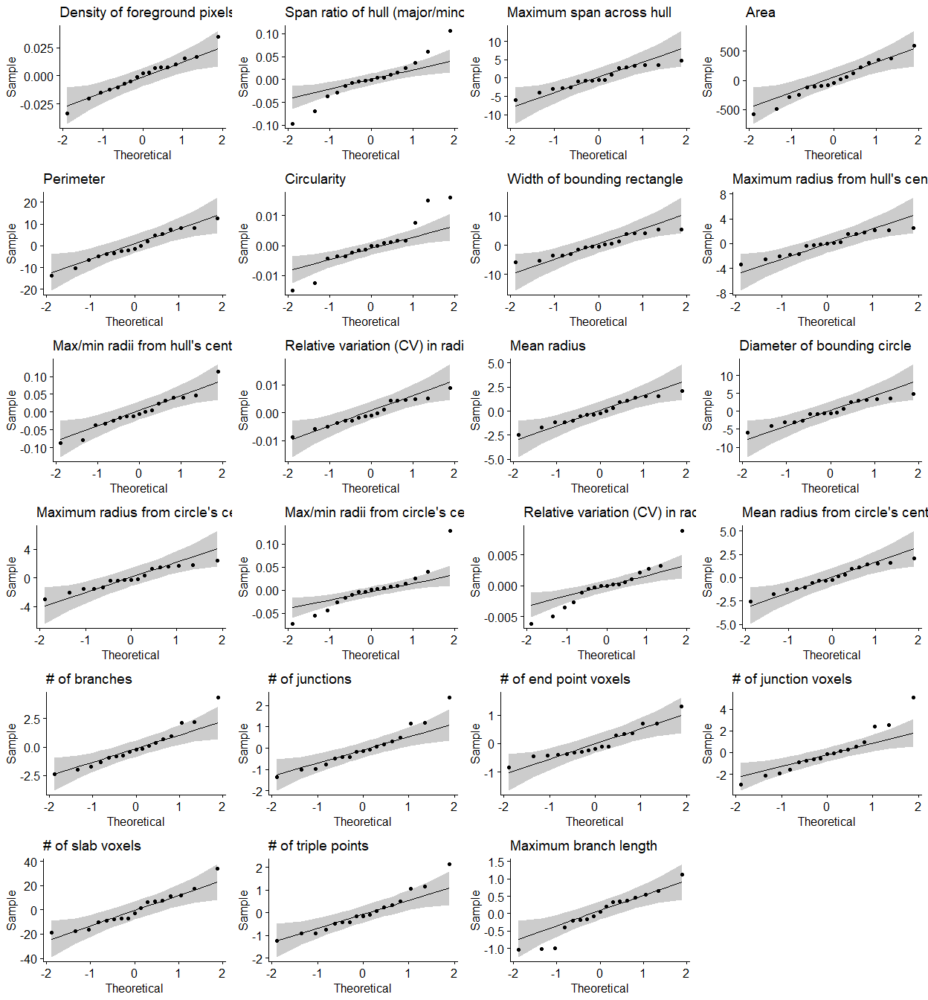<!-- -->
