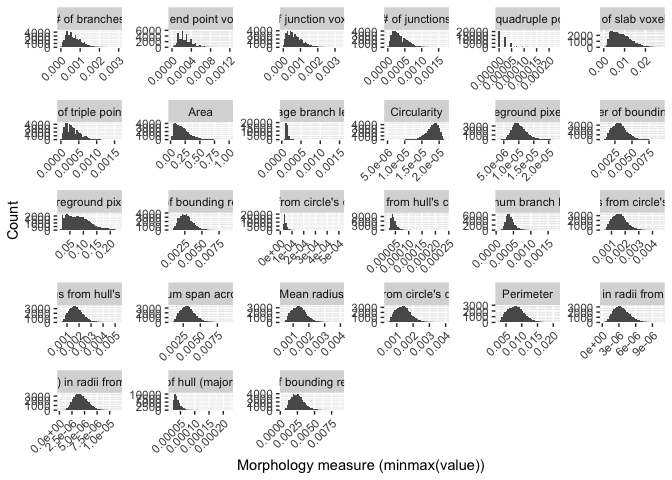

MicrogliaMorphologyR
================

**Created**: 26 June, 2023 by Jenn Kim  
**Last updated**: 16 September, 2023

## Welcome to MicrogliaMorphologyR!

MicrogliaMorphologyR is an R package for microglia morphology analysis,
that is complimentary to ImageJ macro
[MicrogliaMorphology](https://github.com/ciernialab/MicrogliaMorphology).
Using MicrogliaMorphologyR, you can perform exploratory data analysis
and visualization of 27 different morphology features and perform
dimensionality reduction, clustering, and statistical analysis of your
data.

#### If you are using this tool, please cite the following publications:

-   Insert manuscript link

## Instructions on how to use MicrogliaMorphologyR

### install and load package

``` r
BiocManager::install('ciernialab/MicrogliaMorphologyR')
```

``` r
devtools::load_all()
```

    ## ℹ Loading MicrogliaMorphologyR
    ## Loading required package: tidyverse
    ## 
    ## ── Attaching core tidyverse packages ──────────────────────── tidyverse 2.0.0 ──
    ## ✔ dplyr     1.1.2     ✔ readr     2.1.4
    ## ✔ forcats   1.0.0     ✔ stringr   1.5.0
    ## ✔ ggplot2   3.4.3     ✔ tibble    3.2.1
    ## ✔ lubridate 1.9.2     ✔ tidyr     1.3.0
    ## ✔ purrr     1.0.2     
    ## ── Conflicts ────────────────────────────────────────── tidyverse_conflicts() ──
    ## ✖ dplyr::filter() masks stats::filter()
    ## ✖ dplyr::lag()    masks stats::lag()
    ## ℹ Use the conflicted package (<http://conflicted.r-lib.org/>) to force all conflicts to become errors
    ## Loading required package: Hmisc
    ## 
    ## 
    ## Attaching package: 'Hmisc'
    ## 
    ## 
    ## The following objects are masked from 'package:dplyr':
    ## 
    ##     src, summarize
    ## 
    ## 
    ## The following objects are masked from 'package:base':
    ## 
    ##     format.pval, units
    ## 
    ## 
    ## Loading required package: pheatmap
    ## 
    ## Loading required package: factoextra
    ## 
    ## Welcome! Want to learn more? See two factoextra-related books at https://goo.gl/ve3WBa
    ## 
    ## Loading required package: lmerTest
    ## 
    ## Loading required package: lme4
    ## 
    ## Loading required package: Matrix
    ## 
    ## 
    ## Attaching package: 'Matrix'
    ## 
    ## 
    ## The following objects are masked from 'package:tidyr':
    ## 
    ##     expand, pack, unpack
    ## 
    ## 
    ## 
    ## Attaching package: 'lmerTest'
    ## 
    ## 
    ## The following object is masked from 'package:lme4':
    ## 
    ##     lmer
    ## 
    ## 
    ## The following object is masked from 'package:stats':
    ## 
    ##     step
    ## 
    ## 
    ## Loading required package: nlme
    ## 
    ## 
    ## Attaching package: 'nlme'
    ## 
    ## 
    ## The following object is masked from 'package:lme4':
    ## 
    ##     lmList
    ## 
    ## 
    ## The following object is masked from 'package:dplyr':
    ## 
    ##     collapse
    ## 
    ## 
    ## Loading required package: SciViews
    ## 
    ## Loading required package: ggpubr
    ## 
    ## Loading required package: glmmTMB
    ## 
    ## Loading required package: DHARMa
    ## 
    ## This is DHARMa 0.4.6. For overview type '?DHARMa'. For recent changes, type news(package = 'DHARMa')
    ## 
    ## Loading required package: ppclust

``` r
library(MicrogliaMorphologyR)
```

We will start by loading in your MicrogliaMorphology output (FracLac and
SkeletonAnalysis files) and formatting the data so that you have a final
dataframe which contains your cell-level data, with every row as a
single cell and every column as either a metadata descriptor or
morphology measure.

### load in your fraclac and skeleton data, tidy, and merge into final data frame

``` r
fraclac.dir <- "insert path to fraclac directory"
skeleton.dir <- "insert path to skeleton analysis directory"

fraclac <- fraclac_tidying(fraclac.dir)
skeleton <- skeleton_tidying(skeleton.dir)

data <- merge_data(fraclac, skeleton)
finaldata <- metadata_columns(data,
                              c("Antibody","Paper","Cohort","MouseID","Sex","Treatment","BrainRegion","Subregion"),
                              sep="_")
```

For demonstration purposes, we will use one of the datasets that comes
packaged with MicrogliaMorphologyR. ‘data_2xLPS’ contains morphology
data collected from female and male 8 week-old Cx3cr1-eGFP mice, which
were given 2 i.p. injections of either PBS vehicle solution or 0.5mg/kg
lipopolysaccharides (LPS), spaced 24 hours apart. In this genetic mouse
line, Cx3cr1-expressing cells including microglia have an endogenous
reporter which makes them yellow when immunofluorescently imaged. Brains
were collected 24 hours after the final injections, and brain sections
were immunofluorescently stained and imaged for 2 additional, commonly
used microglia markers: P2ry12, and Iba1.

### load in example dataset

``` r
data_2xLPS <- MicrogliaMorphologyR::data_2xLPS_mouse
```

MicrogliaMorphologyR comes with a number of functions which allow you to
explore which features have extreme outliers and how normalizing in
various ways changes your feature distributions. This allows you to
explore and transform your data in a dataset-appropriate manner for
downstream analyses. You can also generate a heatmap of correlations
across the 27 different morphology features to investigate how they
relate to each other. You can use this function to verify that features
which explain similar aspects of cell morphology are more related to
each other (e.g, features which describe cell area/territory span should
all be highly correlated to each other compared to other features which
do not).

### exploratory data visualization and data transformation for downstream analyses

``` r
# gather your numerical morphology data into one column ('measure') which contains the feature name, and another column ('value') which contains measured values
data_2xLPS_gathered <- data_2xLPS %>% gather(measure, value, 9:ncol(data_2xLPS))

# check for outliers
outliers_boxplots(data_2xLPS_gathered)
```

<!-- -->

``` r
outliers_distributions(data_2xLPS_gathered)
```

<!-- -->

``` r
# checking different normalization features
normalize_logplots(data_2xLPS_gathered,1)
```

<!-- -->

``` r
normalize_minmax(data_2xLPS_gathered)
```

<!-- -->

``` r
normalize_scaled(data_2xLPS_gathered)
```

<!-- -->

``` r
# transform your data in appropriate manner for downstream analyses
data_2xLPS_logtransformed <- transform_log(data_2xLPS, 1, start=9, end=35) # we will use the logtransformed data as our PCA input
```

    ## Warning: `funs()` was deprecated in dplyr 0.8.0.
    ## ℹ Please use a list of either functions or lambdas:
    ## 
    ## # Simple named list: list(mean = mean, median = median)
    ## 
    ## # Auto named with `tibble::lst()`: tibble::lst(mean, median)
    ## 
    ## # Using lambdas list(~ mean(., trim = .2), ~ median(., na.rm = TRUE))
    ## ℹ The deprecated feature was likely used in the MicrogliaMorphologyR package.
    ##   Please report the issue to the authors.
    ## This warning is displayed once every 8 hours.
    ## Call `lifecycle::last_lifecycle_warnings()` to see where this warning was
    ## generated.

``` r
data_2xLPS_minmaxtransformed <- transform_minmax(data_2xLPS, start=9, end=35)
data_2xLPS_scaled <- transform_scale(data_2xLPS, start=9, end=35)

# get sample size of data based on factors of interest
samplesize(data_2xLPS, MouseID, Antibody)
```

    ## # A tibble: 18 × 3
    ## # Groups:   MouseID [6]
    ##    MouseID Antibody   num
    ##    <chr>   <chr>    <int>
    ##  1 1       Cx3cr1    1703
    ##  2 1       Iba1      1737
    ##  3 1       P2ry12    2105
    ##  4 2       Cx3cr1    2496
    ##  5 2       Iba1      2927
    ##  6 2       P2ry12    4341
    ##  7 3       Cx3cr1    1968
    ##  8 3       Iba1      2118
    ##  9 3       P2ry12    3119
    ## 10 4       Cx3cr1    1775
    ## 11 4       Iba1      2044
    ## 12 4       P2ry12    2372
    ## 13 5       Cx3cr1    2053
    ## 14 5       Iba1      2302
    ## 15 5       P2ry12    3513
    ## 16 6       Cx3cr1    2771
    ## 17 6       Iba1      3095
    ## 18 6       P2ry12    3665

``` r
samplesize(data_2xLPS, Sex, Treatment, Antibody)
```

    ## # A tibble: 12 × 4
    ## # Groups:   Sex, Treatment [4]
    ##    Sex   Treatment Antibody   num
    ##    <chr> <chr>     <chr>    <int>
    ##  1 F     2xLPS     Cx3cr1    3478
    ##  2 F     2xLPS     Iba1      3781
    ##  3 F     2xLPS     P2ry12    4477
    ##  4 F     PBS       Cx3cr1    4464
    ##  5 F     PBS       Iba1      5045
    ##  6 F     PBS       P2ry12    7460
    ##  7 M     2xLPS     Cx3cr1    2771
    ##  8 M     2xLPS     Iba1      3095
    ##  9 M     2xLPS     P2ry12    3665
    ## 10 M     PBS       Cx3cr1    2053
    ## 11 M     PBS       Iba1      2302
    ## 12 M     PBS       P2ry12    3513

### generate heatmap of correlations across features

``` r
featurecorrelations(data_2xLPS, start=9, end=35, rthresh=0.8, pthresh=0.05, title="Correlations across features")
```

<!-- -->

Now, since we have gotten a better feel for our data and how to
transform it if needed, we can proceed with PCA for dimensionality
reduction and downstream clustering. We can see here that the first 4
PCs describe around \~90% of our data. We can also explore how each PC
correlates to the 27 different morphology features to get a better
understanding of how each PC describes the variability captured by the
data. This is useful to inform which to include for downstream
clustering steps.

## Dimensionality reduction using PCA

``` r
set.seed(1)
pcadata_elbow(data_2xLPS_logtransformed, start=9, end=35)
```

<!-- -->

``` r
pca_data <- pcadata(data_2xLPS_logtransformed, start=9, end=35,
                    pc.start=1, pc.end=10)
str(pca_data)
```

    ## 'data.frame':    46104 obs. of  45 variables:
    ##  $ PC1                                                          : num  -3.195 -3.738 0.129 -2.498 -1.472 ...
    ##  $ PC2                                                          : num  0.705 0.667 0.53 1.433 -0.101 ...
    ##  $ PC3                                                          : num  2.298 -0.144 1.175 2.139 2.372 ...
    ##  $ PC4                                                          : num  -0.253 -1.562 -1.429 0.888 -0.761 ...
    ##  $ PC5                                                          : num  0.279 -0.469 -0.103 0.27 0.771 ...
    ##  $ PC6                                                          : num  0.4783 -0.2311 -0.6197 0.0147 0.4442 ...
    ##  $ PC7                                                          : num  0.178 0.505 0.166 -0.196 0.537 ...
    ##  $ PC8                                                          : num  -0.047 -0.642 -0.148 -0.654 0.36 ...
    ##  $ PC9                                                          : num  1.471 -0.0422 0.7785 -1.3843 0.2157 ...
    ##  $ PC10                                                         : num  0.743 -0.278 0.372 0.484 -0.05 ...
    ##  $ Antibody                                                     : chr  "Cx3cr1" "Cx3cr1" "Cx3cr1" "Cx3cr1" ...
    ##  $ MouseID                                                      : chr  "1" "1" "1" "1" ...
    ##  $ Sex                                                          : chr  "F" "F" "F" "F" ...
    ##  $ Treatment                                                    : chr  "2xLPS" "2xLPS" "2xLPS" "2xLPS" ...
    ##  $ BrainRegion                                                  : chr  "FC" "FC" "FC" "FC" ...
    ##  $ Subregion                                                    : chr  "ACC" "ACC" "ACC" "ACC" ...
    ##  $ ID                                                           : chr  "00002-01053" "00009-01153" "00015-01224" "00016-01229" ...
    ##  $ UniqueID                                                     : chr  "Cx3cr1_Paper1_2Hit_1_F_2xLPS_FC_ACC_00002-01053" "Cx3cr1_Paper1_2Hit_1_F_2xLPS_FC_ACC_00009-01153" "Cx3cr1_Paper1_2Hit_1_F_2xLPS_FC_ACC_00015-01224" "Cx3cr1_Paper1_2Hit_1_F_2xLPS_FC_ACC_00016-01229" ...
    ##  $ Foreground pixels                                            : num  7.84 7.84 8.52 7.88 8.22 ...
    ##  $ Density of foreground pixels in hull area                    : num  0.472 0.527 0.503 0.363 0.44 ...
    ##  $ Span ratio of hull (major/minor axis)                        : num  0.819 0.912 0.889 0.725 0.838 ...
    ##  $ Maximum span across hull                                     : num  4.52 4.51 4.87 4.68 4.8 ...
    ##  $ Area                                                         : num  8.34 8.2 8.94 8.71 8.81 ...
    ##  $ Perimeter                                                    : num  5.58 5.46 5.86 5.71 5.79 ...
    ##  $ Circularity                                                  : num  0.564 0.609 0.577 0.609 0.584 ...
    ##  $ Width of bounding rectangle                                  : num  4.41 4.22 4.68 4.53 4.51 ...
    ##  $ Height of bounding rectangle                                 : num  4.49 4.53 4.78 4.52 4.8 ...
    ##  $ Maximum radius from hull's center of mass                    : num  3.95 3.93 4.21 4.18 4.18 ...
    ##  $ Max/min radii from hull's center of mass                     : num  1.018 1.085 1.045 1.027 0.974 ...
    ##  $ Relative variation (CV) in radii from hull's center of mass  : num  0.103 0.172 0.126 0.172 0.142 ...
    ##  $ Mean radius                                                  : num  3.83 3.67 4.1 3.96 4.04 ...
    ##  $ Diameter of bounding circle                                  : num  4.6 4.51 4.88 4.69 4.82 ...
    ##  $ Maximum radius from circle's center of mass                  : num  3.92 3.83 4.2 4 4.14 ...
    ##  $ Max/min radii from circle's center of mass                   : num  0.99 0.96 0.998 0.77 1.048 ...
    ##  $ Relative variation (CV) in radii from circle's center of mass: num  0.1008 0.1573 0.1276 0.0544 0.1546 ...
    ##  $ Mean radius from circle's center of mass                     : num  3.83 3.65 4.1 3.96 4.03 ...
    ##  $ # of branches                                                : num  2.56 2.71 3.14 2.48 2.56 ...
    ##  $ # of junctions                                               : num  1.95 1.95 2.48 1.79 1.95 ...
    ##  $ # of end point voxels                                        : num  1.95 2.3 2.4 2.08 1.95 ...
    ##  $ # of junction voxels                                         : num  2.56 2.71 3.14 2.08 2.71 ...
    ##  $ # of slab voxels                                             : num  5.48 5.34 5.85 5.29 5.55 ...
    ##  $ Average branch length                                        : num  2.28 2.04 2.1 2.19 2.31 ...
    ##  $ # of triple points                                           : num  1.95 1.79 2.4 1.79 1.95 ...
    ##  $ # of quadruple points                                        : num  0 0.693 0.693 0 0 ...
    ##  $ Maximum branch length                                        : num  3.41 2.78 3.1 2.84 3.21 ...

### generate heatmap of correlations between PCs and features

``` r
pcfeaturecorrelations(pca_data, pc.start=1, pc.end=3, 
                      feature.start=19, feature.end=45, 
                      rthresh=0.75, pthresh=0.05, 
                      title="Correlation between PCs and features")
```

<!-- -->

### visually explore different sources of variability in dataset

``` r
# gather your data by experimental variables (e.g., Treatment, Sex, MouseID, etc.)
gathered_expvariables <- pca_data %>% gather(variable, value, 11:16) 

plots_expvariable(gathered_expvariables, "PC1", "PC2")
```

<!-- -->

## Soft clustering using Fuzzy K-means

After performing dimensionality reduction, we can use our PCs as input
for downstream clustering methods. Here, we use fuzzy k-means, a ‘soft’
clustering method that is similar in concept and algorithm to k-means
clustering, which partitions data points within a given dataset into
defined numbers of clusters based on their proximity to the nearest
cluster’s centroid. In fuzzy k-means, data points are not exclusively
assigned to just one cluster, but rather given membership scores to all
clusters. This allows for additional characterization of high-scoring
cells within each cluster (i.e., quintessential ‘rod-like’, ‘ameboid’,
‘hypertrophic’, or ‘ramified’ cells), cells with more ambiguous
identities (e.g., a cell that is 5% rod-like, 5% ameboid, 45%
hypertrophic, and 45% ramified), and other cases that the user might be
interested in which might be informative for their specific dataset.
Fuzzy k-means also assigns a final hard cluster assignment based on the
class with the highest membership score, so you can also use these final
assignments as your input for downstream analysis.

### prepare data for clustering

``` r
## for k-means clustering: scale PCs 1-3, which together describe ~85% of variability
pca_data_scale <- transform_scale(pca_data, start=1, end=3) # scale pca data as input for k-means clustering
kmeans_input <- pca_data_scale[1:3]
```

### Cluster optimization prior to running fuzzy k-means

``` r
# check for optimal number of clusters using wss and silhouette methods
set.seed(2)
sampling <- kmeans_input[sample(nrow(kmeans_input), 5000),] #sample 5000 random rows for cluster optimization

fviz_nbclust(sampling, kmeans, method = 'wss', nstart=25, iter.max=50) # 4 clusters
```

<!-- -->

``` r
fviz_nbclust(sampling, kmeans, method = 'silhouette', nstart=25, iter.max=50) # 4 clusters
```

<!-- -->

From using the wss and silhouette methods to check the optimal numbers
of clusters for our dataset, it appears that our data would be optimally
clustered using k=4. There are many more cluster optimization methods
that you can try out to explore your data (insert link).

Next, we proceed with clustering. You can cluster using fuzzy k-means or
regular k-means at this step. After clustering, we will use some
built-in functions within MicrogliaMorphologyR to assess how a parameter
of k=4 influences how the clusters are defined by morphology features
(and if they make sense according to what we know about microglia
morphology). As this step may require some troubleshooting and updating
of clustering parameters, you may need to run your k-means function
multiple times. Fuzzy k-means is more time-intensive and computationally
expensive so it might help to use regular k-means as a first pass,
verify that your clusters make sense using the functions that follow,
and run your fuzzy k-means function using the final parameters that you
determine to generate your final dataset for downstream analysis.

## Clustering

### Fuzzy k-means (soft clustering)

``` r
# cluster and combine with original data
library(ppclust)
set.seed(3)
data_kmeans <- fcm(kmeans_input, centers=4, nstart=25)
pca_kmeans <- cbind(pca_data[1:5], data_kmeans)
str(pca_kmeans)
```

### Regular k-means (hard clustering)

``` r
# cluster and combine with original data
data_kmeans <- kmeans(kmeans_input, centers=4)
pca_kmeans <- cbind(pca_data[1:2], data_2xLPS, as.data.frame(data_kmeans$cluster)) %>%
  rename(Cluster=`data_kmeans$cluster`)
str(pca_kmeans)
```

    ## 'data.frame':    46104 obs. of  38 variables:
    ##  $ PC1                                                          : num  -3.195 -3.738 0.129 -2.498 -1.472 ...
    ##  $ PC2                                                          : num  0.705 0.667 0.53 1.433 -0.101 ...
    ##  $ Antibody                                                     : chr  "Cx3cr1" "Cx3cr1" "Cx3cr1" "Cx3cr1" ...
    ##  $ MouseID                                                      : chr  "1" "1" "1" "1" ...
    ##  $ Sex                                                          : chr  "F" "F" "F" "F" ...
    ##  $ Treatment                                                    : chr  "2xLPS" "2xLPS" "2xLPS" "2xLPS" ...
    ##  $ BrainRegion                                                  : chr  "FC" "FC" "FC" "FC" ...
    ##  $ Subregion                                                    : chr  "ACC" "ACC" "ACC" "ACC" ...
    ##  $ ID                                                           : chr  "00002-01053" "00009-01153" "00015-01224" "00016-01229" ...
    ##  $ UniqueID                                                     : chr  "Cx3cr1_Paper1_2Hit_1_F_2xLPS_FC_ACC_00002-01053" "Cx3cr1_Paper1_2Hit_1_F_2xLPS_FC_ACC_00009-01153" "Cx3cr1_Paper1_2Hit_1_F_2xLPS_FC_ACC_00015-01224" "Cx3cr1_Paper1_2Hit_1_F_2xLPS_FC_ACC_00016-01229" ...
    ##  $ Foreground pixels                                            : int  2535 2533 4996 2646 3713 2786 2518 3129 6119 3572 ...
    ##  $ Density of foreground pixels in hull area                    : num  0.604 0.694 0.653 0.438 0.553 ...
    ##  $ Span ratio of hull (major/minor axis)                        : num  1.27 1.49 1.43 1.06 1.31 ...
    ##  $ Maximum span across hull                                     : num  90.5 90.1 129 106.3 119.9 ...
    ##  $ Area                                                         : int  4200 3650 7648 6045 6709 6040 3675 5870 13061 7601 ...
    ##  $ Perimeter                                                    : num  264 234 351 301 326 ...
    ##  $ Circularity                                                  : num  0.758 0.839 0.781 0.839 0.794 ...
    ##  $ Width of bounding rectangle                                  : int  81 67 107 92 90 137 60 66 217 131 ...
    ##  $ Height of bounding rectangle                                 : int  88 92 118 91 121 74 99 127 97 113 ...
    ##  $ Maximum radius from hull's center of mass                    : num  50.7 49.8 66.6 64.2 64.3 ...
    ##  $ Max/min radii from hull's center of mass                     : num  1.77 1.96 1.84 1.79 1.65 ...
    ##  $ Relative variation (CV) in radii from hull's center of mass  : num  0.109 0.188 0.135 0.187 0.152 ...
    ##  $ Mean radius                                                  : num  45.2 38.1 59.3 51.3 55.7 ...
    ##  $ Diameter of bounding circle                                  : num  98.5 90.1 131.3 107.5 123.5 ...
    ##  $ Maximum radius from circle's center of mass                  : num  49.3 45.1 65.6 53.7 61.7 ...
    ##  $ Max/min radii from circle's center of mass                   : num  1.69 1.61 1.71 1.16 1.85 ...
    ##  $ Relative variation (CV) in radii from circle's center of mass: num  0.1061 0.1704 0.1361 0.0559 0.1672 ...
    ##  $ Mean radius from circle's center of mass                     : num  45 37.5 59.4 51.6 55 ...
    ##  $ # of branches                                                : int  12 14 22 11 12 13 13 11 26 9 ...
    ##  $ # of junctions                                               : int  6 6 11 5 6 6 7 5 12 4 ...
    ##  $ # of end point voxels                                        : int  6 9 10 7 6 8 5 6 13 6 ...
    ##  $ # of junction voxels                                         : int  12 14 22 7 14 10 13 14 30 8 ...
    ##  $ # of slab voxels                                             : int  240 208 345 197 255 244 189 224 538 183 ...
    ##  $ Average branch length                                        : num  8.73 6.72 7.17 7.92 9.11 ...
    ##  $ # of triple points                                           : int  6 5 10 5 6 6 7 4 10 4 ...
    ##  $ # of quadruple points                                        : int  0 1 1 0 0 0 0 1 1 0 ...
    ##  $ Maximum branch length                                        : num  29.2 15.1 21.3 16.2 23.8 ...
    ##  $ Cluster                                                      : int  2 1 3 2 2 2 4 2 4 2 ...

### Plot k-means clusters in PC space

``` r
plot <- clusterplots(pca_kmeans, "PC1", "PC2")
plot
```

<!-- -->

``` r
plot + scale_colour_viridis_d() # customizeable example: add color scheme of choice 
```

<!-- -->

### Cluster-specific measures on average for each morphology feature, relative to other clusters

``` r
clusterfeatures(pca_kmeans, start=11, end=37)
```

<!-- -->

### Cluster characterization

``` r
# calculate cluster percentages across variables of interest
cp <- clusterpercentage(pca_kmeans, "Cluster", MouseID, Antibody, Treatment, Sex, BrainRegion)
cp$Treatment <- factor(cp$Treatment, levels=c("PBS","2xLPS"))

# Quick check of cluster proportions when considering experimental variables of interest
cp %>% 
  filter(BrainRegion=="STR") %>% # in this example, we filter for our brain region of interest
  clusterpercentage_boxplots(Antibody, Treatment, Sex) # grouping variables
```

<!-- -->

``` r
# example graph of data given variables of interest
cp %>% 
  filter(Antibody=="Iba1") %>%
  ggplot(aes(x=Cluster, y=percentage, group=interaction(Cluster, Treatment))) +
  facet_wrap(~BrainRegion) +
  geom_boxplot(aes(group=interaction(Cluster, Treatment), fill=Treatment)) +
  scale_fill_manual(values=c("#fde725","#482878")) +
  geom_point(position=position_dodge(width=0.8), size=0.75, aes(group=interaction(Cluster,Treatment), color=Sex)) +
  ggtitle("2xLPS mouse dataset: K-means clusters") +
  labs(fill="Treatment") +
  theme_bw(base_size=10) +
  theme(axis.text.x=element_text(angle=45, vjust=1, hjust=1))
```

<!-- -->

## Statistical analysis

MicrogliaMorphologyR includes a few functions to run stats on cluster
percentages as well as on individual morphology measures.

### Cluster percentage changes at animal level, in response to experimental variables

#### e.g., Across clusters - How does cluster membership change with LPS?

The stats_cluster.animal function fits a generalized linear mixed model
on your dataset to a beta distribution, which is suitable for values
like percentages or probabilities that are constrained to a range of
0-1, using the `glmmTMB` package. Part of the output includes a check of
the model fit using the `DHARMa` package, which “uses a simulation-based
approach to create readily interpretable scaled (quantile) residuals for
fitted (generalized) linear mixed models.” The function creates two
`DHARMa` plots, contained in output\[\[4\]\]. You can read more about
how to interpret model fit using `DHARMa` by reading the package
[vignette](https://cran.r-project.org/web/packages/DHARMa/vignettes/DHARMa.html).

``` r
# prepare percentages dataset for downstream analysis
stats.input <- cp %>% filter(BrainRegion=="FC", Antibody=="Iba1")
stats.input$MouseID <- factor(stats.input$MouseID)
stats.input$Cluster <- factor(stats.input$Cluster)
stats.input$Treatment <- factor(stats.input$Treatment)

# run stats analysis for changes in cluster percentages, at the animal level
# you can specify up to two posthoc comparisons (posthoc1 and posthoc2 arguments) - if you only have one set of posthocs to run, specify the same comparison twice for both arguments. you will just get the same results in output[[2]] and output[[3]].
stats.testing <- stats_cluster.animal(stats.input, "percentage ~ Cluster*Treatment*Sex + (1|MouseID)", 
                                      "yes", "~Cluster*Treatment|Sex", "~Cluster|Sex*Treatment", "bonferroni")
```

    ## qu = 0.75, log(sigma) = -2.709683 : outer Newton did not converge fully.

    ## qu = 0.75, log(sigma) = -2.911941 : outer Newton did not converge fully.

    ## qu = 0.75, log(sigma) = -3.036943 : outer Newton did not converge fully.

    ## qu = 0.75, log(sigma) = -3.114198 : outer Newton did not converge fully.

    ## qu = 0.75, log(sigma) = -3.161945 : outer Newton did not converge fully.

    ## qu = 0.75, log(sigma) = -3.191454 : outer Newton did not converge fully.

    ## qu = 0.75, log(sigma) = -3.418712 : outer Newton did not converge fully.

    ## qu = 0.75, log(sigma) = -3.014197 : outer Newton did not converge fully.

    ## qu = 0.75, log(sigma) = -3.303483 : outer Newton did not converge fully.

    ## qu = 0.75, log(sigma) = -3.333562 : outer Newton did not converge fully.

    ## qu = 0.75, log(sigma) = -3.339858 : outer Newton did not converge fully.

    ## qu = 0.75, log(sigma) = -3.341914 : outer Newton did not converge fully.

    ## qu = 0.75, log(sigma) = -3.340457 : outer Newton did not converge fully.

    ## qu = 0.75, log(sigma) = -3.337453 : outer Newton did not converge fully.

    ## qu = 0.75, log(sigma) = -3.338939 : outer Newton did not converge fully.

    ## qu = 0.75, log(sigma) = -3.339507 : outer Newton did not converge fully.

    ## qu = 0.75, log(sigma) = -3.339724 : outer Newton did not converge fully.

    ## Warning in newton(lsp = lsp, X = G$X, y = G$y, Eb = G$Eb, UrS = G$UrS, L = G$L,
    ## : Fitting terminated with step failure - check results carefully

<!-- -->

    ## Formula:          percentage ~ Cluster * Treatment * Sex + (1 | MouseID)
    ## Data: data
    ##       AIC       BIC    logLik  df.resid 
    ## -61.45332 -43.53013  48.72666         2 
    ## Random-effects (co)variances:
    ## 
    ## Conditional model:
    ##  Groups  Name        Std.Dev. 
    ##  MouseID (Intercept) 2.677e-06
    ## 
    ## Number of obs: 20 / Conditional model: MouseID, 5
    ## 
    ## Dispersion parameter for beta family ():  351 
    ## 
    ## Fixed Effects:
    ## 
    ## Conditional model:
    ##              (Intercept)                  Cluster1                  Cluster2  
    ##                 -1.21765                  -0.17644                  -0.78612  
    ##                 Cluster3                Treatment1                      Sex1  
    ##                  0.77672                  -0.07914                  -0.02194  
    ##      Cluster1:Treatment1       Cluster2:Treatment1       Cluster3:Treatment1  
    ##                  0.29962                  -0.64944                   0.23786  
    ##            Cluster1:Sex1             Cluster2:Sex1             Cluster3:Sex1  
    ##                 -0.12219                   0.10252                   0.00771  
    ##          Treatment1:Sex1  Cluster1:Treatment1:Sex1  Cluster2:Treatment1:Sex1  
    ##                 -0.02199                   0.07691                  -0.23583  
    ## Cluster3:Treatment1:Sex1  
    ##                  0.10298

``` r
stats.testing[[1]] # anova
```

    ## Analysis of Deviance Table (Type II Wald chisquare tests)
    ## 
    ## Response: percentage
    ##                          Chisq Df Pr(>Chisq)    
    ## Cluster               277.5490  3  < 2.2e-16 ***
    ## Treatment               0.0593  1   0.807564    
    ## Sex                     0.0409  1   0.839652    
    ## Cluster:Treatment     119.4864  3  < 2.2e-16 ***
    ## Cluster:Sex             9.5327  3   0.022986 *  
    ## Treatment:Sex           0.2147  1   0.643141    
    ## Cluster:Treatment:Sex  13.5355  3   0.003611 ** 
    ## ---
    ## Signif. codes:  0 '***' 0.001 '**' 0.01 '*' 0.05 '.' 0.1 ' ' 1

``` r
stats.testing[[2]] # posthoc 1
```

    ## Sex = F:
    ##  contrast                          estimate        SE  df z.ratio p.value
    ##  Cluster1 PBS - Cluster2 PBS      1.6467797 0.1913236 Inf   8.607  <.0001
    ##  Cluster1 PBS - Cluster3 PBS     -1.0473601 0.1183006 Inf  -8.853  <.0001
    ##  Cluster1 PBS - Cluster4 PBS     -0.2877816 0.1240098 Inf  -2.321  0.5686
    ##  Cluster1 PBS - Cluster1 2xLPS    0.5508112 0.1779713 Inf   3.095  0.0551
    ##  Cluster1 PBS - Cluster2 2xLPS   -0.3260276 0.1492421 Inf  -2.185  0.8098
    ##  Cluster1 PBS - Cluster3 2xLPS   -0.5679391 0.1450175 Inf  -3.916  0.0025
    ##  Cluster1 PBS - Cluster4 2xLPS   -0.1542579 0.1531191 Inf  -1.007  1.0000
    ##  Cluster2 PBS - Cluster3 PBS     -2.6941398 0.1847361 Inf -14.584  <.0001
    ##  Cluster2 PBS - Cluster4 PBS     -1.9345613 0.1884136 Inf -10.268  <.0001
    ##  Cluster2 PBS - Cluster1 2xLPS   -1.0959685 0.2275363 Inf  -4.817  <.0001
    ##  Cluster2 PBS - Cluster2 2xLPS   -1.9728073 0.2059008 Inf  -9.581  <.0001
    ##  Cluster2 PBS - Cluster3 2xLPS   -2.2147188 0.2028694 Inf -10.917  <.0001
    ##  Cluster2 PBS - Cluster4 2xLPS   -1.8010376 0.2087203 Inf  -8.629  <.0001
    ##  Cluster3 PBS - Cluster4 PBS      0.7595784 0.1135034 Inf   6.692  <.0001
    ##  Cluster3 PBS - Cluster1 2xLPS    1.5981713 0.1708291 Inf   9.355  <.0001
    ##  Cluster3 PBS - Cluster2 2xLPS    0.7213325 0.1406330 Inf   5.129  <.0001
    ##  Cluster3 PBS - Cluster3 2xLPS    0.4794209 0.1361388 Inf   3.522  0.0120
    ##  Cluster3 PBS - Cluster4 2xLPS    0.8931022 0.1447429 Inf   6.170  <.0001
    ##  Cluster4 PBS - Cluster1 2xLPS    0.8385929 0.1748254 Inf   4.797  <.0001
    ##  Cluster4 PBS - Cluster2 2xLPS   -0.0382459 0.1454711 Inf  -0.263  1.0000
    ##  Cluster4 PBS - Cluster3 2xLPS   -0.2801575 0.1411328 Inf  -1.985  1.0000
    ##  Cluster4 PBS - Cluster4 2xLPS    0.1335237 0.1494467 Inf   0.893  1.0000
    ##  Cluster1 2xLPS - Cluster2 2xLPS -0.8768388 0.1935428 Inf  -4.530  0.0002
    ##  Cluster1 2xLPS - Cluster3 2xLPS -1.1187504 0.1903061 Inf  -5.879  <.0001
    ##  Cluster1 2xLPS - Cluster4 2xLPS -0.7050691 0.1965464 Inf  -3.587  0.0094
    ##  Cluster2 2xLPS - Cluster3 2xLPS -0.2419116 0.1637472 Inf  -1.477  1.0000
    ##  Cluster2 2xLPS - Cluster4 2xLPS  0.1717697 0.1709651 Inf   1.005  1.0000
    ##  Cluster3 2xLPS - Cluster4 2xLPS  0.4136812 0.1672895 Inf   2.473  0.3753
    ##  Significant
    ##  significant
    ##  significant
    ##  ns         
    ##  ns         
    ##  ns         
    ##  significant
    ##  ns         
    ##  significant
    ##  significant
    ##  significant
    ##  significant
    ##  significant
    ##  significant
    ##  significant
    ##  significant
    ##  significant
    ##  significant
    ##  significant
    ##  significant
    ##  ns         
    ##  ns         
    ##  ns         
    ##  significant
    ##  significant
    ##  significant
    ##  ns         
    ##  ns         
    ##  ns         
    ## 
    ## Sex = M:
    ##  contrast                          estimate        SE  df z.ratio p.value
    ##  Cluster1 PBS - Cluster2 PBS      1.4707013 0.2384554 Inf   6.168  <.0001
    ##  Cluster1 PBS - Cluster3 PBS     -0.7354300 0.1635055 Inf  -4.498  0.0002
    ##  Cluster1 PBS - Cluster4 PBS     -0.0614424 0.1720581 Inf  -0.357  1.0000
    ##  Cluster1 PBS - Cluster1 2xLPS    0.3311221 0.1817559 Inf   1.822  1.0000
    ##  Cluster1 PBS - Cluster2 2xLPS    0.5291951 0.1882609 Inf   2.811  0.1383
    ##  Cluster1 PBS - Cluster3 2xLPS   -0.5799659 0.1646825 Inf  -3.522  0.0120
    ##  Cluster1 PBS - Cluster4 2xLPS   -0.0637001 0.1720134 Inf  -0.370  1.0000
    ##  Cluster2 PBS - Cluster3 PBS     -2.2061313 0.2314368 Inf  -9.532  <.0001
    ##  Cluster2 PBS - Cluster4 PBS     -1.5321436 0.2375413 Inf  -6.450  <.0001
    ##  Cluster2 PBS - Cluster1 2xLPS   -1.1395792 0.2446450 Inf  -4.658  0.0001
    ##  Cluster2 PBS - Cluster2 2xLPS   -0.9415062 0.2495080 Inf  -3.773  0.0045
    ##  Cluster2 PBS - Cluster3 2xLPS   -2.0506671 0.2322667 Inf  -8.829  <.0001
    ##  Cluster2 PBS - Cluster4 2xLPS   -1.5344014 0.2375090 Inf  -6.460  <.0001
    ##  Cluster3 PBS - Cluster4 PBS      0.6739877 0.1621666 Inf   4.156  0.0009
    ##  Cluster3 PBS - Cluster1 2xLPS    1.0665521 0.1724249 Inf   6.186  <.0001
    ##  Cluster3 PBS - Cluster2 2xLPS    1.2646251 0.1792709 Inf   7.054  <.0001
    ##  Cluster3 PBS - Cluster3 2xLPS    0.1554642 0.1543155 Inf   1.007  1.0000
    ##  Cluster3 PBS - Cluster4 2xLPS    0.6717299 0.1621192 Inf   4.143  0.0010
    ##  Cluster4 PBS - Cluster1 2xLPS    0.3925645 0.1805531 Inf   2.174  0.8313
    ##  Cluster4 PBS - Cluster2 2xLPS    0.5906375 0.1871001 Inf   3.157  0.0447
    ##  Cluster4 PBS - Cluster3 2xLPS   -0.5185235 0.1633533 Inf  -3.174  0.0421
    ##  Cluster4 PBS - Cluster4 2xLPS   -0.0022577 0.1707416 Inf  -0.013  1.0000
    ##  Cluster1 2xLPS - Cluster2 2xLPS  0.1980730 0.1960520 Inf   1.010  1.0000
    ##  Cluster1 2xLPS - Cluster3 2xLPS -0.9110879 0.1735409 Inf  -5.250  <.0001
    ##  Cluster1 2xLPS - Cluster4 2xLPS -0.3948222 0.1805105 Inf  -2.187  0.8043
    ##  Cluster2 2xLPS - Cluster3 2xLPS -1.1091609 0.1803441 Inf  -6.150  <.0001
    ##  Cluster2 2xLPS - Cluster4 2xLPS -0.5928952 0.1870590 Inf  -3.170  0.0427
    ##  Cluster3 2xLPS - Cluster4 2xLPS  0.5162657 0.1633062 Inf   3.161  0.0440
    ##  Significant
    ##  significant
    ##  significant
    ##  ns         
    ##  ns         
    ##  ns         
    ##  significant
    ##  ns         
    ##  significant
    ##  significant
    ##  significant
    ##  significant
    ##  significant
    ##  significant
    ##  significant
    ##  significant
    ##  significant
    ##  ns         
    ##  significant
    ##  ns         
    ##  significant
    ##  significant
    ##  ns         
    ##  ns         
    ##  significant
    ##  ns         
    ##  significant
    ##  significant
    ##  significant
    ## 
    ## Results are given on the log odds ratio (not the response) scale. 
    ## P value adjustment: bonferroni method for 28 tests

``` r
stats.testing[[3]] # posthoc 2
```

    ## Sex = F, Treatment = PBS:
    ##  contrast              estimate        SE  df z.ratio p.value Significant
    ##  Cluster1 - Cluster2  1.6467797 0.1913236 Inf   8.607  <.0001 significant
    ##  Cluster1 - Cluster3 -1.0473601 0.1183006 Inf  -8.853  <.0001 significant
    ##  Cluster1 - Cluster4 -0.2877816 0.1240098 Inf  -2.321  0.1218 ns         
    ##  Cluster2 - Cluster3 -2.6941398 0.1847361 Inf -14.584  <.0001 significant
    ##  Cluster2 - Cluster4 -1.9345613 0.1884136 Inf -10.268  <.0001 significant
    ##  Cluster3 - Cluster4  0.7595784 0.1135034 Inf   6.692  <.0001 significant
    ## 
    ## Sex = M, Treatment = PBS:
    ##  contrast              estimate        SE  df z.ratio p.value Significant
    ##  Cluster1 - Cluster2  1.4707013 0.2384554 Inf   6.168  <.0001 significant
    ##  Cluster1 - Cluster3 -0.7354300 0.1635055 Inf  -4.498  <.0001 significant
    ##  Cluster1 - Cluster4 -0.0614424 0.1720581 Inf  -0.357  1.0000 ns         
    ##  Cluster2 - Cluster3 -2.2061313 0.2314368 Inf  -9.532  <.0001 significant
    ##  Cluster2 - Cluster4 -1.5321436 0.2375413 Inf  -6.450  <.0001 significant
    ##  Cluster3 - Cluster4  0.6739877 0.1621666 Inf   4.156  0.0002 significant
    ## 
    ## Sex = F, Treatment = 2xLPS:
    ##  contrast              estimate        SE  df z.ratio p.value Significant
    ##  Cluster1 - Cluster2 -0.8768388 0.1935428 Inf  -4.530  <.0001 significant
    ##  Cluster1 - Cluster3 -1.1187504 0.1903061 Inf  -5.879  <.0001 significant
    ##  Cluster1 - Cluster4 -0.7050691 0.1965464 Inf  -3.587  0.0020 significant
    ##  Cluster2 - Cluster3 -0.2419116 0.1637472 Inf  -1.477  0.8375 ns         
    ##  Cluster2 - Cluster4  0.1717697 0.1709651 Inf   1.005  1.0000 ns         
    ##  Cluster3 - Cluster4  0.4136812 0.1672895 Inf   2.473  0.0804 ns         
    ## 
    ## Sex = M, Treatment = 2xLPS:
    ##  contrast              estimate        SE  df z.ratio p.value Significant
    ##  Cluster1 - Cluster2  0.1980730 0.1960520 Inf   1.010  1.0000 ns         
    ##  Cluster1 - Cluster3 -0.9110879 0.1735409 Inf  -5.250  <.0001 significant
    ##  Cluster1 - Cluster4 -0.3948222 0.1805105 Inf  -2.187  0.1723 ns         
    ##  Cluster2 - Cluster3 -1.1091609 0.1803441 Inf  -6.150  <.0001 significant
    ##  Cluster2 - Cluster4 -0.5928952 0.1870590 Inf  -3.170  0.0092 significant
    ##  Cluster3 - Cluster4  0.5162657 0.1633062 Inf   3.161  0.0094 significant
    ## 
    ## Results are given on the log odds ratio (not the response) scale. 
    ## P value adjustment: bonferroni method for 6 tests

``` r
stats.testing[[4]] # DHARMa model check
```

<!-- -->

``` r
stats.testing[[5]] # summary of model
```

    ## Formula:          percentage ~ Cluster * Treatment * Sex + (1 | MouseID)
    ## Data: data
    ##       AIC       BIC    logLik  df.resid 
    ## -61.45332 -43.53013  48.72666         2 
    ## Random-effects (co)variances:
    ## 
    ## Conditional model:
    ##  Groups  Name        Std.Dev. 
    ##  MouseID (Intercept) 2.677e-06
    ## 
    ## Number of obs: 20 / Conditional model: MouseID, 5
    ## 
    ## Dispersion parameter for beta family ():  351 
    ## 
    ## Fixed Effects:
    ## 
    ## Conditional model:
    ##              (Intercept)                  Cluster1                  Cluster2  
    ##                 -1.21765                  -0.17644                  -0.78612  
    ##                 Cluster3                Treatment1                      Sex1  
    ##                  0.77672                  -0.07914                  -0.02194  
    ##      Cluster1:Treatment1       Cluster2:Treatment1       Cluster3:Treatment1  
    ##                  0.29962                  -0.64944                   0.23786  
    ##            Cluster1:Sex1             Cluster2:Sex1             Cluster3:Sex1  
    ##                 -0.12219                   0.10252                   0.00771  
    ##          Treatment1:Sex1  Cluster1:Treatment1:Sex1  Cluster2:Treatment1:Sex1  
    ##                 -0.02199                   0.07691                  -0.23583  
    ## Cluster3:Treatment1:Sex1  
    ##                  0.10298

``` r
# filterable data tables of posthoc outputs: 
stats.testing[[2]] %>% DT::datatable(., options=list(autoWidth=TRUE, scrollX=TRUE, scrollCollapse=TRUE))
```

<div class="datatables html-widget html-fill-item-overflow-hidden html-fill-item" id="htmlwidget-5be27de076132534988b" style="width:100%;height:auto;"></div>
<script type="application/json" data-for="htmlwidget-5be27de076132534988b">{"x":{"filter":"none","vertical":false,"data":[["1","2","3","4","5","6","7","8","9","10","11","12","13","14","15","16","17","18","19","20","21","22","23","24","25","26","27","28","29","30","31","32","33","34","35","36","37","38","39","40","41","42","43","44","45","46","47","48","49","50","51","52","53","54","55","56"],["Cluster1 PBS - Cluster2 PBS","Cluster1 PBS - Cluster3 PBS","Cluster1 PBS - Cluster4 PBS","Cluster1 PBS - Cluster1 2xLPS","Cluster1 PBS - Cluster2 2xLPS","Cluster1 PBS - Cluster3 2xLPS","Cluster1 PBS - Cluster4 2xLPS","Cluster2 PBS - Cluster3 PBS","Cluster2 PBS - Cluster4 PBS","Cluster2 PBS - Cluster1 2xLPS","Cluster2 PBS - Cluster2 2xLPS","Cluster2 PBS - Cluster3 2xLPS","Cluster2 PBS - Cluster4 2xLPS","Cluster3 PBS - Cluster4 PBS","Cluster3 PBS - Cluster1 2xLPS","Cluster3 PBS - Cluster2 2xLPS","Cluster3 PBS - Cluster3 2xLPS","Cluster3 PBS - Cluster4 2xLPS","Cluster4 PBS - Cluster1 2xLPS","Cluster4 PBS - Cluster2 2xLPS","Cluster4 PBS - Cluster3 2xLPS","Cluster4 PBS - Cluster4 2xLPS","Cluster1 2xLPS - Cluster2 2xLPS","Cluster1 2xLPS - Cluster3 2xLPS","Cluster1 2xLPS - Cluster4 2xLPS","Cluster2 2xLPS - Cluster3 2xLPS","Cluster2 2xLPS - Cluster4 2xLPS","Cluster3 2xLPS - Cluster4 2xLPS","Cluster1 PBS - Cluster2 PBS","Cluster1 PBS - Cluster3 PBS","Cluster1 PBS - Cluster4 PBS","Cluster1 PBS - Cluster1 2xLPS","Cluster1 PBS - Cluster2 2xLPS","Cluster1 PBS - Cluster3 2xLPS","Cluster1 PBS - Cluster4 2xLPS","Cluster2 PBS - Cluster3 PBS","Cluster2 PBS - Cluster4 PBS","Cluster2 PBS - Cluster1 2xLPS","Cluster2 PBS - Cluster2 2xLPS","Cluster2 PBS - Cluster3 2xLPS","Cluster2 PBS - Cluster4 2xLPS","Cluster3 PBS - Cluster4 PBS","Cluster3 PBS - Cluster1 2xLPS","Cluster3 PBS - Cluster2 2xLPS","Cluster3 PBS - Cluster3 2xLPS","Cluster3 PBS - Cluster4 2xLPS","Cluster4 PBS - Cluster1 2xLPS","Cluster4 PBS - Cluster2 2xLPS","Cluster4 PBS - Cluster3 2xLPS","Cluster4 PBS - Cluster4 2xLPS","Cluster1 2xLPS - Cluster2 2xLPS","Cluster1 2xLPS - Cluster3 2xLPS","Cluster1 2xLPS - Cluster4 2xLPS","Cluster2 2xLPS - Cluster3 2xLPS","Cluster2 2xLPS - Cluster4 2xLPS","Cluster3 2xLPS - Cluster4 2xLPS"],["F","F","F","F","F","F","F","F","F","F","F","F","F","F","F","F","F","F","F","F","F","F","F","F","F","F","F","F","M","M","M","M","M","M","M","M","M","M","M","M","M","M","M","M","M","M","M","M","M","M","M","M","M","M","M","M"],[1.64677968553228,-1.047360081856269,-0.2877816370890969,0.5508112264714777,-0.3260275648825592,-0.5679391328752353,-0.1542578965995365,-2.69413976738855,-1.934561322621377,-1.095968459060803,-1.97280725041484,-2.214718818407516,-1.801037582131817,0.7595784447671724,1.598171308327747,0.72133251697371,0.479420948981034,0.8931021852567328,0.8385928635605747,-0.03824592779346234,-0.2801574957861384,0.1335237404895604,-0.876838791354037,-1.118750359346713,-0.7050691230710143,-0.2419115679926761,0.1717696682830227,0.4136812362756988,1.470701256033359,-0.7354300431296438,-0.06144238687444242,0.3311220921375371,0.5291950646536887,-0.5799658534009459,-0.06370011545205502,-2.206131299163003,-1.532143642907802,-1.139579163895822,-0.9415061913796704,-2.050667109434305,-1.534401371485414,0.6739876562552013,1.066552135267181,1.264625107783333,0.1554641897286979,0.6717299276775888,0.3925644790119796,0.5906374515281312,-0.5185234665265035,-0.002257728577612611,0.1980729725161516,-0.911087945538483,-0.3948222075895921,-1.109160918054635,-0.5928951801057438,0.5162657379488909],[0.1913235527192592,0.1183006300792719,0.1240097868922667,0.1779712748157844,0.1492420653607785,0.1450174806823749,0.1531190663780136,0.1847361447085434,0.1884136474988924,0.2275362647330284,0.205900849049996,0.2028694143385633,0.2087202676471178,0.1135033534981077,0.1708290748192772,0.1406330246907571,0.1361388045624038,0.1447429407538236,0.1748254511896984,0.1454711332997189,0.1411327969147708,0.1494467096631069,0.1935428392855575,0.1903061394267794,0.1965464114509367,0.1637472207003841,0.1709650849859018,0.167289536957842,0.2384553999998109,0.1635055516636244,0.1720581083368064,0.1817559283846264,0.188260909050921,0.1646824715049368,0.1720134237197455,0.231436769369048,0.2375413421217154,0.244644958171869,0.2495079884561018,0.2322667285139896,0.2375090389952919,0.1621666225453919,0.172424945137069,0.1792708677129248,0.1543155133246437,0.1621191946633753,0.1805530915796267,0.1871000984677494,0.1633532727609524,0.1707416247056197,0.1960519754945835,0.1735408872783976,0.1805105197854782,0.1803440924094484,0.1870590239310837,0.1633061924174207],[null,null,null,null,null,null,null,null,null,null,null,null,null,null,null,null,null,null,null,null,null,null,null,null,null,null,null,null,null,null,null,null,null,null,null,null,null,null,null,null,null,null,null,null,null,null,null,null,null,null,null,null,null,null,null,null],[8.6073024576786,-8.85337703742106,-2.320636494110797,3.094944546762475,-2.184555434115835,-3.91634946492531,-1.007437546795847,-14.58371761324277,-10.26762842448952,-4.816675971835603,-9.581345873594776,-10.91696757556282,-8.628953969994043,6.692123372194777,9.355382331833606,5.129182982161362,3.521559855928332,6.170264198070332,4.796743596849867,-0.2629107708583188,-1.985063018026375,0.8934538658666947,-4.530463615139638,-5.878687690877961,-3.58729074657778,-1.477347627385462,1.004706126383567,2.47284584438744,6.167615646508847,-4.497890350797532,-0.357102536279011,1.821795278318661,2.810966266558032,-3.521721820792324,-0.3703206068140301,-9.532328441921498,-6.450008361587585,-4.658093804227269,-3.77345109150811,-8.8289318171147,-6.460391478051622,4.156142895968288,6.18560228869046,7.05427002120857,1.00744368715307,4.143432423732244,2.174232939339356,3.156799255399322,-3.174245962523808,-0.01322307071579776,1.010308475680848,-5.249990131011019,-2.187253175376181,-6.150248135305843,-3.169562032592335,3.161335956136211],[2.094397147326671e-16,2.377486170193768e-17,0.5685811834454084,0.05511791512862506,0.809800840346067,0.002517197380375854,1,9.983656200168755e-47,2.760762940833779e-23,4.087144249095487e-05,2.682076797124078e-20,2.677799263701387e-26,1.73363684171571e-16,6.158748372857196e-10,2.332341244566712e-19,8.148066625220371e-06,0.01201244247297945,1.908927398868745e-08,4.515442725301727e-05,1,1,1,0.0001647922934639745,1.157888865740619e-07,0.009355687171955694,1,1,0.3753174555132773,1.941167393782645e-08,0.0001921670101916492,1,1,0.1383002996849293,0.0120051063133419,1,4.306241431816427e-20,3.131631457131703e-09,8.936222117925193e-05,0.004508134235530688,2.95904328168919e-17,2.924108961974382e-09,0.0009062632082695614,1.73224249679633e-08,4.858256428575206e-11,1,0.000958008583025701,0.8312540821611694,0.04466311310635673,0.04206337219055695,1,1,4.259006060618942e-06,0.80427331432598,2.166130920608778e-08,0.04274728245799979,0.04397323004547844],["significant","significant","ns","ns","ns","significant","ns","significant","significant","significant","significant","significant","significant","significant","significant","significant","significant","significant","significant","ns","ns","ns","significant","significant","significant","ns","ns","ns","significant","significant","ns","ns","ns","significant","ns","significant","significant","significant","significant","significant","significant","significant","significant","significant","ns","significant","ns","significant","significant","ns","ns","significant","ns","significant","significant","significant"]],"container":"<table class=\"display\">\n  <thead>\n    <tr>\n      <th> <\/th>\n      <th>contrast<\/th>\n      <th>Sex<\/th>\n      <th>estimate<\/th>\n      <th>SE<\/th>\n      <th>df<\/th>\n      <th>z.ratio<\/th>\n      <th>p.value<\/th>\n      <th>Significant<\/th>\n    <\/tr>\n  <\/thead>\n<\/table>","options":{"autoWidth":true,"scrollX":true,"scrollCollapse":true,"columnDefs":[{"className":"dt-right","targets":[3,4,5,6,7]},{"orderable":false,"targets":0}],"order":[],"orderClasses":false},"selection":{"mode":"multiple","selected":null,"target":"row","selectable":null}},"evals":[],"jsHooks":[]}</script>

``` r
stats.testing[[3]] %>% DT::datatable(., options=list(autoWidth=TRUE, scrollX=TRUE, scrollCollapse=TRUE))
```

<div class="datatables html-widget html-fill-item-overflow-hidden html-fill-item" id="htmlwidget-6450ad625a6e7cb77d9c" style="width:100%;height:auto;"></div>
<script type="application/json" data-for="htmlwidget-6450ad625a6e7cb77d9c">{"x":{"filter":"none","vertical":false,"data":[["1","2","3","4","5","6","7","8","9","10","11","12","13","14","15","16","17","18","19","20","21","22","23","24"],["Cluster1 - Cluster2","Cluster1 - Cluster3","Cluster1 - Cluster4","Cluster2 - Cluster3","Cluster2 - Cluster4","Cluster3 - Cluster4","Cluster1 - Cluster2","Cluster1 - Cluster3","Cluster1 - Cluster4","Cluster2 - Cluster3","Cluster2 - Cluster4","Cluster3 - Cluster4","Cluster1 - Cluster2","Cluster1 - Cluster3","Cluster1 - Cluster4","Cluster2 - Cluster3","Cluster2 - Cluster4","Cluster3 - Cluster4","Cluster1 - Cluster2","Cluster1 - Cluster3","Cluster1 - Cluster4","Cluster2 - Cluster3","Cluster2 - Cluster4","Cluster3 - Cluster4"],["F","F","F","F","F","F","M","M","M","M","M","M","F","F","F","F","F","F","M","M","M","M","M","M"],["PBS","PBS","PBS","PBS","PBS","PBS","PBS","PBS","PBS","PBS","PBS","PBS","2xLPS","2xLPS","2xLPS","2xLPS","2xLPS","2xLPS","2xLPS","2xLPS","2xLPS","2xLPS","2xLPS","2xLPS"],[1.64677968553228,-1.047360081856269,-0.2877816370890969,-2.69413976738855,-1.934561322621377,0.7595784447671724,1.470701256033359,-0.7354300431296438,-0.06144238687444242,-2.206131299163003,-1.532143642907802,0.6739876562552013,-0.876838791354037,-1.118750359346713,-0.7050691230710143,-0.2419115679926761,0.1717696682830227,0.4136812362756988,0.1980729725161516,-0.911087945538483,-0.3948222075895921,-1.109160918054635,-0.5928951801057438,0.5162657379488909],[0.1913235527192592,0.1183006300792719,0.1240097868922667,0.1847361447085434,0.1884136474988924,0.1135033534981077,0.2384553999998109,0.1635055516636244,0.1720581083368064,0.231436769369048,0.2375413421217154,0.1621666225453919,0.1935428392855575,0.1903061394267794,0.1965464114509367,0.1637472207003841,0.1709650849859018,0.167289536957842,0.1960519754945835,0.1735408872783976,0.1805105197854782,0.1803440924094484,0.1870590239310837,0.1633061924174207],[null,null,null,null,null,null,null,null,null,null,null,null,null,null,null,null,null,null,null,null,null,null,null,null],[8.6073024576786,-8.85337703742106,-2.320636494110797,-14.58371761324277,-10.26762842448952,6.692123372194777,6.167615646508847,-4.497890350797532,-0.357102536279011,-9.532328441921498,-6.450008361587585,4.156142895968288,-4.530463615139638,-5.878687690877961,-3.58729074657778,-1.477347627385462,1.004706126383567,2.47284584438744,1.010308475680848,-5.249990131011019,-2.187253175376181,-6.150248135305843,-3.169562032592335,3.161335956136211],[4.487993887128581e-17,5.094613221843789e-18,0.1218388250240161,2.139354900036162e-47,5.915920587500956e-24,1.319731794183685e-10,4.159644415248524e-09,4.117864504106768e-05,1,9.227660211035199e-21,6.710638836710792e-10,0.000194199258914906,3.531263431370883e-05,2.481190426587041e-08,0.00200479010827622,0.8374948635815662,1,0.08042516903855942,1,9.126441558469161e-07,0.1723442816412814,4.641709115590239e-09,0.009160131955285668,0.009422835009745379],["significant","significant","ns","significant","significant","significant","significant","significant","ns","significant","significant","significant","significant","significant","significant","ns","ns","ns","ns","significant","ns","significant","significant","significant"]],"container":"<table class=\"display\">\n  <thead>\n    <tr>\n      <th> <\/th>\n      <th>contrast<\/th>\n      <th>Sex<\/th>\n      <th>Treatment<\/th>\n      <th>estimate<\/th>\n      <th>SE<\/th>\n      <th>df<\/th>\n      <th>z.ratio<\/th>\n      <th>p.value<\/th>\n      <th>Significant<\/th>\n    <\/tr>\n  <\/thead>\n<\/table>","options":{"autoWidth":true,"scrollX":true,"scrollCollapse":true,"columnDefs":[{"className":"dt-right","targets":[4,5,6,7,8]},{"orderable":false,"targets":0}],"order":[],"orderClasses":false},"selection":{"mode":"multiple","selected":null,"target":"row","selectable":null}},"evals":[],"jsHooks":[]}</script>

### Individual morphology measures

``` r
# at the cell-level
DF <- data_pca_fuzzykmeans %>% group_by(MouseID, Sex, Treatment) %>% gather(Measure, Value, 14:40)
stats <- stats_morphologymeasures(DF %>% filter(BrainRegion=="FC", Antibody=="Iba1"), "Value ~ Treatment + (1|MouseID)", "~Treatment", "~Treatment", "holm")

stats[[1]]
stats[[2]]
stats[[3]]
do.call("grid.arrange", c(stats[[4]], ncol=4))
stats[[5]]

stats[[1]] %>% DT::datatable(., options=list(autoWidth=TRUE, scrollX=TRUE, scrollCollapse=TRUE))
stats[[2]] %>% DT::datatable(., options=list(autoWidth=TRUE, scrollX=TRUE, scrollCollapse=TRUE))
stats[[3]] %>% DT::datatable(., options=list(autoWidth=TRUE, scrollX=TRUE, scrollCollapse=TRUE))

# at the animal-level (averaged for each measure)
DF <- data_pca_fuzzykmeans %>% group_by(MouseID, Sex, Treatment, BrainRegion, Antibody) %>% summarise(across("Foreground pixels":"Maximum branch length", ~mean(.x))) %>% gather(Measure, Value, "Foreground pixels":"Maximum branch length")
stats <- stats_morphologymeasures_lm(DF %>% filter(BrainRegion=="FC", Antibody=="Iba1"), "Value ~ Treatment", "~Treatment", "~Treatment", "holm")

stats[[1]]
stats[[2]]
stats[[3]]
do.call("grid.arrange", c(stats[[4]], ncol=4))
stats[[5]]

stats[[1]] %>% DT::datatable(., options=list(autoWidth=TRUE, scrollX=TRUE, scrollCollapse=TRUE))
stats[[2]] %>% DT::datatable(., options=list(autoWidth=TRUE, scrollX=TRUE, scrollCollapse=TRUE))
stats[[3]] %>% DT::datatable(., options=list(autoWidth=TRUE, scrollX=TRUE, scrollCollapse=TRUE))
```

### testing

``` r
data <- MicrogliaMorphologyR::data_2xLPS_fuzzykmeans
hist(data_2xLPS_fuzzykmeans$`Cluster 3`)

data <- data_2xLPS_fuzzykmeans %>% 
  filter(`Cluster 1` > 0.70|
         `Cluster 2` > 0.70|
         `Cluster 3` > 0.70|
         `Cluster 4` > 0.70)
```
