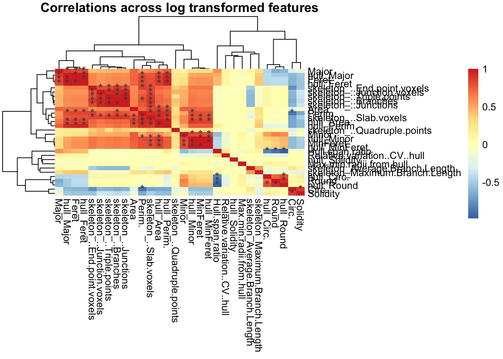
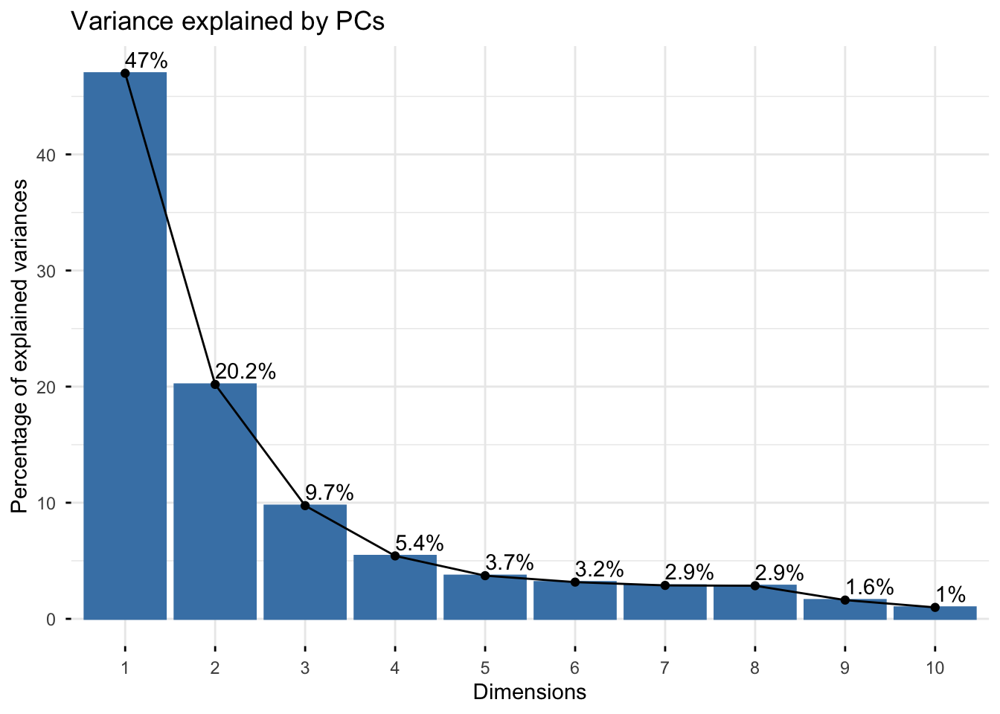
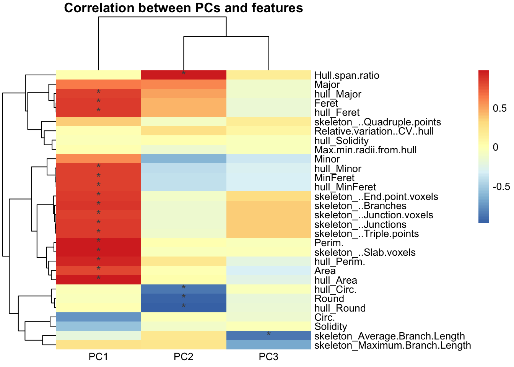
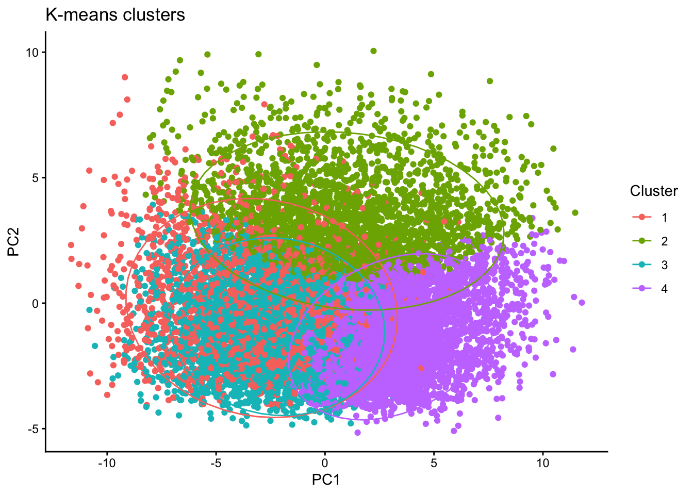
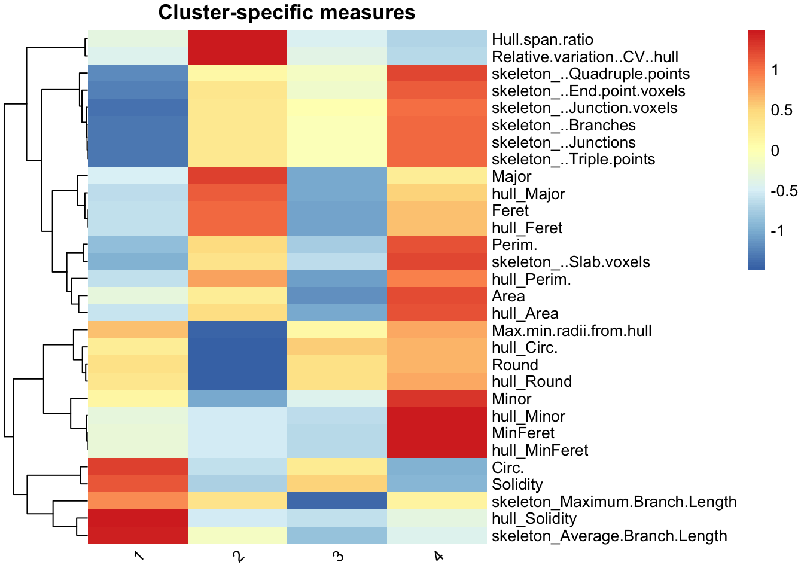
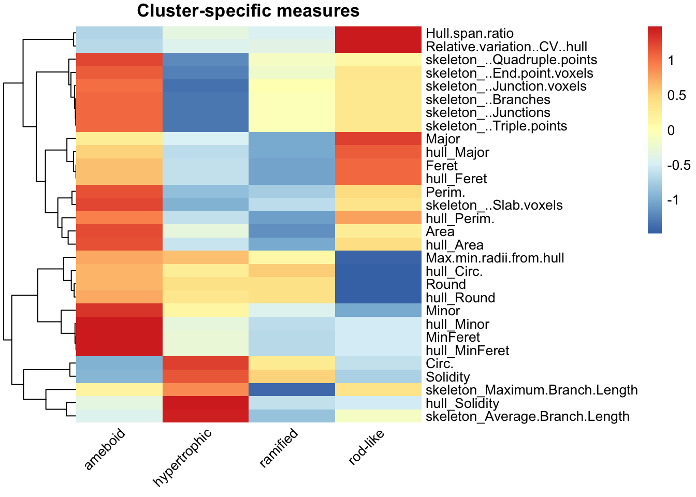
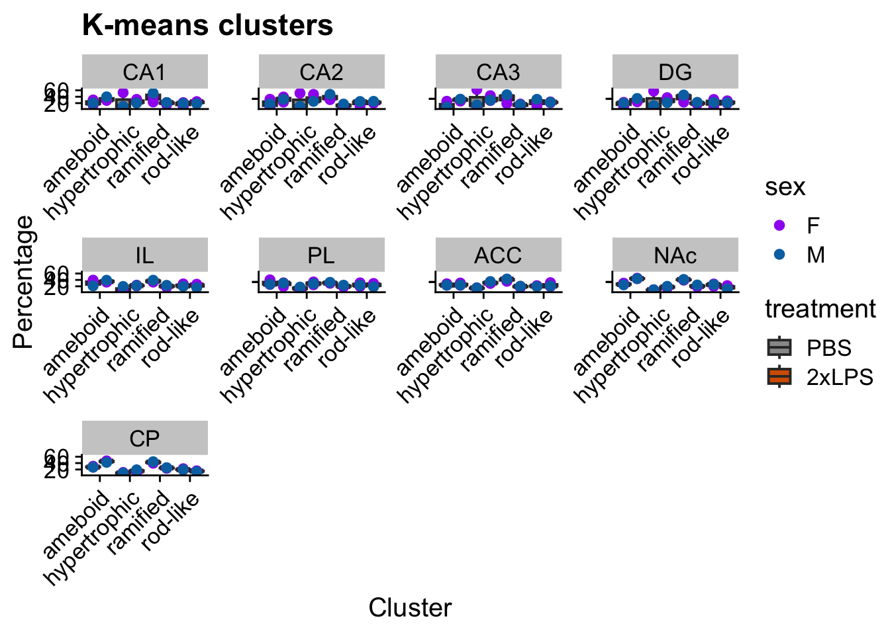
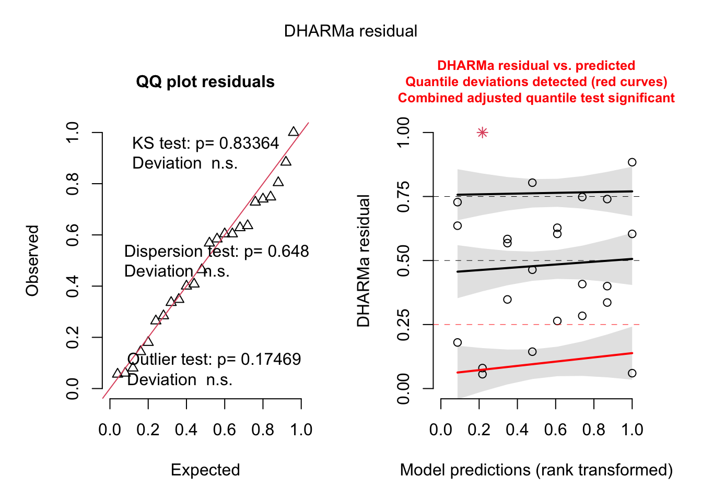
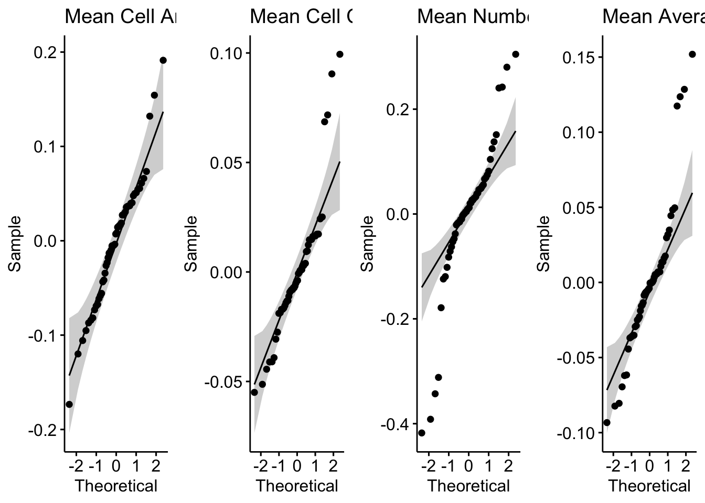

```{r setup, include=FALSE}
# All code in this article is displayed but NOT run during the pkgdown build,
# because it reads ImageJ output files that live on a local computer.
# Figures were generated from a real dataset and are included as images.
knitr::opts_chunk$set(echo = TRUE, eval = FALSE, message = FALSE, warning = FALSE,
                      out.width = "100%")
```

# Overview

This tutorial shows how to analyze output from the **MicrogliaMorphology ImageJ macro (Pipeline 2)** with MicrogliaMorphologyR. The example dataset is from Cx3cr1-GFP male and female mice collected 24 hrs after repeated 0.5 mg/kg LPS injections (separated by 24 hrs) or PBS (vehicle). Three brain regions were imaged: hippocampus (HC), striatum (STR) and frontal cortex (FC), with several subregions analyzed per region (CA1, CA2, CA3, DG, IL, PL, ACC, NAc, CP). 

> **Note:** If you have multiple brain regions in an experiment, we recommend running the clustering on all regions together and then splitting by region for statistical analysis. That way, a ramified microglia in one region is comparable to a ramified microglia in another.

Paths, column positions and cluster labels are specific to this example dataset, so adjust them for your own data. For a tutorial that runs on the example dataset included with the package, see the [first tutorial](MicrogliaMorphologyR.html).

# Load libraries

```{r load libraries}
library(cowplot)
library(stringr)
library(ggplot2)
library(tidyverse)
library(plotrix)
library(rstatix)
library(ggpubr)
library(gridExtra)
library(nlme)
library(emmeans)
library(lemon)
library(factoextra)   # fviz_nbclust()

library(MicrogliaMorphologyR)
set.seed(1)
```

# Set file paths

Set the working directory where you want to save your output files, and set the path to the folder containing the ImageJ morphology results (one .csv per image).

```{r paths}
setwd("path/to/your/output/folder")

# folder with the ImageJ morphology results
folder <- "path/to/your/output/folder/MeasurementResults"
```

# Load the ImageJ output

Read all csv files from the ImageJ output folder into one data frame.

```{r load data}
files <- list.files(folder, pattern = "\\.csv$", full.names = TRUE)

all_data <- do.call(
  rbind,
  lapply(files, function(f) {
    df <- read.csv(f, stringsAsFactors = FALSE)
    df$filename <- basename(f)
    df
  })
)
```

# Add experimental metadata

How you do this depends on how your image files were named. In this example, files are named like this:

`Cx3cr1_Paper1_2Hit_1_F_2xLPS_FC_MergedACCILPL_thresholded`

that is, `antibody_project_experiment_animalID_sex_treatment_section_image_thresholded`. An underscore separator is preferred over `-` or `.` in R.

```{r parse metadata}
# make metadata columns from the file name
all_data_parsed <- all_data %>%
  separate(Image,
           into = c("antibody", "project", "experiment", "AnimalID",
                    "sex", "treatment", "section"),
           sep = "_", remove = FALSE)

# put all metadata first
finaldata <- all_data_parsed %>%
  select(filename, Label:Region, Area:skeleton_Maximum.Branch.Length)

# check
dim(all_data_parsed)
dim(finaldata)

# save
save(finaldata, file = "InputData_morphology2pipeline.Rdata")
```

Alternatively, if your file names do not contain the metadata, read the metadata in separately and merge it into the `all_data` data frame.

Check your variables of interest:

```{r check variables}
unique(finaldata$AnimalID)
unique(finaldata$sex)
unique(finaldata$treatment)
unique(finaldata$Region)

# In this experiment the nucleus accumbens was named "NA", which R reads as
# missing data. Replace with "NAc" (specific to this dataset).
finaldata$Region[is.na(finaldata$Region)] <- "NAc"
unique(finaldata$Region)
```

# Transform the data

Convert the morphology measures (columns 12 to 41 here) to numeric, then transform them. Log transformation is typical.

```{r transform}
finaldata[, c(12:41)] <- mutate_all(finaldata[, c(12:41)],
                                    function(x) as.numeric(as.character(x)))

head(finaldata[, c(12:41)])

data_logtransformed <- transform_log(finaldata, 1, start = 12, end = ncol(finaldata))

head(data_logtransformed[, c(12:41)])
```

# Remove extreme outliers

Rows containing extreme outliers are removed using the 3 x interquartile range (IQR) rule applied to each morphology feature.

```{r outliers}
cols_to_check <- 12:41
outlier_indices <- list()

for (col in cols_to_check) {
  x <- data_logtransformed[[col]]
  if (!is.numeric(x)) next

  Q1 <- quantile(x, 0.25, na.rm = TRUE)
  Q3 <- quantile(x, 0.75, na.rm = TRUE)
  IQR_val <- Q3 - Q1

  lower_bound <- Q1 - 3 * IQR_val
  upper_bound <- Q3 + 3 * IQR_val

  outlier_indices[[col]] <- which(x < lower_bound | x > upper_bound)
}

all_outliers <- unique(unlist(outlier_indices))
df_filtered <- data_logtransformed[-all_outliers, ]

dim(data_logtransformed)
dim(df_filtered)
```

# Count mice and cells per condition

```{r cells per condition}
# number of cells per mouse per region
t <- table(df_filtered$Region, df_filtered$AnimalID)
t
write.csv(t, "Microglia_PerMousePerRegion.csv")

# number of mice per region, treatment and sex
samples <- df_filtered %>% ungroup() %>% select(7:11) %>% unique()
t <- table(samples$Region, samples$treatment, samples$sex)
t
write.csv(t, "Mice_per_Region_condition.csv")
```

# Correlations across features

We start by exploring the morphology features and how they relate to each other with a heatmap of Spearman correlations. Features that describe similar aspects of morphology are more highly correlated with each other than with other features. For example, the numbers of end point voxels, junction voxels, triple points, branches and junctions all describe branching complexity and are highly correlated.

```{r feature correlations}
featurecorrelations(df_filtered, featurestart = 12, featureend = 41,
                    rthresh = 0.8, pthresh = 0.05,
                    title = "Correlations across log transformed features")
```

```{r, echo=FALSE, eval=TRUE}

```

# Dimensionality reduction with PCA

We proceed with PCA for dimensionality reduction and downstream clustering. In this dataset the first 3 PCs describe about 85% of the variance.

```{r elbow plot}
pcadata_elbow(df_filtered, featurestart = 12, featureend = 41)
```

```{r, echo=FALSE, eval=TRUE}

```

Generate the PCA data:

```{r pca data}
pca_data <- pcadata(df_filtered, featurestart = 12, featureend = 41,
                    pc.start = 1, pc.end = 10)

names(pca_data)
```

## Correlations between PCs and features

With `pcfeaturecorrelations()` we can see how each PC is described by different sets of morphology features. Here, PC1 is highly positively correlated with features describing branching complexity and territory span, so cells with greater branching complexity or area have higher PC1 scores. Variability in PC2 is described by cell shape (Hull_Circ., Round, Hull.span.ratio) and PC3 by branch length related measures. You will generally see the same types of features describing the first four PCs, although the sign of the correlations can be inverted. This is normal as long as the sets of highly correlated features are maintained.

```{r pc feature correlations}
pcfeaturecorrelations(pca_data, pc.start = 1, pc.end = 3,
                      feature.start = 22, feature.end = 51,
                      rthresh = 0.75, pthresh = 0.05,
                      title = "Correlation between PCs and features")
```

```{r, echo=FALSE, eval=TRUE}

```

To get the statistics underlying the heatmap:

```{r pc feature stats}
correlationstats <- pcfeaturecorrelations_stats(pca_data, pc.start = 1, pc.end = 3,
                                                feature.start = 22, feature.end = 51,
                                                rthresh = 0.75, pthresh = 0.05)
head(correlationstats)
```

# K-means clustering on PCs

After dimensionality reduction, we use the PCs as input for clustering. Here we cluster cells into morphological classes with k-means, which partitions cells into K clusters based on their proximity to the nearest cluster centroid. The [first tutorial](MicrogliaMorphologyR.html#fuzzy-k-means-soft-clustering) shows fuzzy k-means, a soft clustering approach that allows extended analyses such as characterizing the "most" ameboid, hypertrophic, rod-like or ramified cells, or cells with ambiguous identities between morphological states. The toolset is flexible and can also be combined with other approaches such as hierarchical clustering or Gaussian mixture models.

K-means randomly selects K initial cluster centers, assigns each cell to the nearest center by Euclidean distance, recalculates each centroid as the mean of its assigned cells, and iterates until the maximum number of iterations is reached. Two dataset-specific parameters to check:

- `iter.max`: the maximum number of iterations allowed. 10 to 20 is recommended.
- `nstart`: the number of random starting sets. At least 25 is recommended.

More on k-means and these parameters: [K-means Cluster Analysis](https://uc-r.github.io/kmeans_clustering) and [K Means parameters and results](https://andrea-grianti.medium.com/kmeans-parameters-in-rstudio-explained-c493ec5a05df).

## Prepare data for clustering

Scale PCs 1 to 3, which together describe about 85% of the variability, and use them as input.

```{r cluster input}
pca_data_scale <- transform_scale(pca_data, start = 1, end = 3)
kmeans_input <- pca_data_scale[1:3]
```

## Choose the number of clusters

Check for the optimal number of clusters using the within-cluster sum of squares (elbow) and silhouette methods on a random sample of cells.

```{r nbclust}
sampling <- kmeans_input[sample(nrow(kmeans_input), 2000), ]  # random 2000 cells

fviz_nbclust(sampling, kmeans, method = "wss", nstart = 25, iter.max = 50)
fviz_nbclust(sampling, kmeans, method = "silhouette", nstart = 25, iter.max = 50)
```

```{r, echo=FALSE, eval=TRUE, out.width="49%", fig.show="hold"}
knitr::include_graphics(c("pipeline2/figures/nbclust_wss.png", "pipeline2/figures/nbclust_silhouette.png"))
```

## Run k-means (hard clustering)

```{r kmeans}
data_kmeans <- kmeans(kmeans_input, centers = 4, nstart = 25, iter.max = 50)

pca_kmeans <- cbind(pca_data[1:3], df_filtered,
                    as.data.frame(data_kmeans$cluster)) %>%
  rename(Cluster = `data_kmeans$cluster`)

# plot PC1 vs PC2 (and PC2 vs PC3)
plot <- clusterplots(pca_kmeans, "PC1", "PC2")
plot + scale_colour_viridis_d()

clusterplots(pca_kmeans, "PC2", "PC3") + scale_colour_viridis_d()
```

```{r, echo=FALSE, eval=TRUE}

```

## Interactive 3D plot of PC1, PC2 and PC3

```{r 3d plot}
library(plotly)
library(htmlwidgets)

pca_kmeans$Cluster <- as.factor(pca_kmeans$Cluster)
cluster_colors <- RColorBrewer::brewer.pal(n = length(unique(pca_kmeans$Cluster)),
                                           name = "Set2")

fig <- plot_ly(
  data = pca_kmeans,
  x = ~PC1, y = ~PC2, z = ~PC3,
  color = ~Cluster, colors = cluster_colors,
  type = "scatter3d", mode = "markers",
  marker = list(size = 5, opacity = 0.8)
)

saveWidget(fig, file = "3D_PCA_plot.html", selfcontained = TRUE)
```

# Characterize the clusters

Compare the average value of each morphology feature in each cluster relative to the other clusters:

```{r cluster features}
clusterfeatures(pca_kmeans, featurestart = 15, featureend = 44)
```

```{r, echo=FALSE, eval=TRUE}

```

This is the main output that differs bewteen the original Microglia Morphology v1 ImageJ macro and the v2 ImageJ macro. The version 2 pipline has 40 measures instead of the original 27 and hence the heatmap looks slightly different. Cluster identities are assigned using the same type of logic where we compare the individual features across clusters to assigne identities. We characterize the clusters in this dataset as:

- Cluster 1: hypertrophic (circular, high average branch length)
- Cluster 2: rod-like (greatest hull span ratio, lowest circularity)
- Cluster 3: ameboid (circular but low average branch length)
- Cluster 4: ramified (largest territory span and branching complexity)

Cluster numbers are arbitrary and change with each dataset and random seed, so always re-check which cluster has which features before naming it.

# Verify clusters with ColorByCluster

Using the cluster classes from MicrogliaMorphologyR, we can color each cell in the original image by cluster with the MicrogliaMorphology ImageJ macro **ColorByCluster**. This lets you visually assess and verify your suspected cluster identities before deeming them ramified, hyper-ramified, rod-like, ameboid or any other morphological form for downstream analysis.

ColorByCluster needs one .csv file per image:

- named with the name of the original image as a starting string (the .tif extension is not needed), and all files must share this starting string;
- a first column with an empty header and ascending numbers;
- a column named `Cluster`;
- a column named `ID` matching the single-cell ROI labels;
- a column named `Region` with the names of the analyzed regions, or `full_brain` if no regions were provided.

```{r colorbycluster files}
out_dir <- "ColorByCluster_csvs"
dir.create(out_dir, showWarnings = FALSE, recursive = TRUE)

cbc <- pca_kmeans %>%
  mutate(
    # original image name: drop the .tif extension and the "_thresholded" suffix
    OrigImage = sub("_thresholded$", "", sub("\\.tif$", "", Image)),
    # single-cell ROI label: the part after the colon,
    # e.g. "region_image_00001-01047:00001-01047" -> "00001-01047"
    ID = sub("^.*:", "", Label),
    # "full_brain" when no region was provided
    Region = ifelse(is.na(Region) | Region == "", "full_brain", as.character(Region))
  ) %>%
  select(OrigImage, Cluster, ID, Region)

# one CSV per image, all starting with the image name
for (img in unique(cbc$OrigImage)) {
  df <- cbc %>%
    filter(OrigImage == img) %>%
    select(Cluster, ID, Region) %>%
    as.data.frame()

  rownames(df) <- seq_len(nrow(df))  # ascending numbers, restarting at 1 per file

  write.csv(df,
            file = file.path(out_dir, paste0(img, "_ClusterID.csv")),
            row.names = TRUE, quote = FALSE)
}
```

Look at the ColorByCluster images and verify that the cluster labels still make sense.

## Make a legend for the ColorByCluster images

Colors here assume you did not change the default colors in the ImageJ ColorByCluster macro. If you did, change them accordingly.

```{r cbc legend}
library(tibble)

legend_df <- tibble::tibble(
  Cluster = factor(paste("Cluster", 1:4), levels = paste("Cluster", 1:4)),
  Color   = c("#BBCC33", "#44BB99", "#EEDD88", "#EE8866"),
  Label   = c("Cluster 1 hypertrophic",
              "Cluster 2 rod-like",
              "Cluster 3 ameboid",
              "Cluster 4 ramified")
)

ggplot(legend_df, aes(x = Cluster, y = 1, fill = Cluster)) +
  geom_tile(color = "black") +
  scale_fill_manual(values = legend_df$Color) +
  theme_void() +
  theme(legend.position = "none") +
  geom_text(aes(label = Label), color = "black", hjust = 0.5, vjust = 0.5, size = 5) +
  coord_fixed(ratio = 0.2) +
  ggtitle("Microglial Morphology Clusters Legend") +
  theme(plot.title = element_text(hjust = 0.5, size = 12))
```

## Name the clusters

After verifying with ColorByCluster, label the clusters and re-draw the heatmap:

```{r name clusters}
data_pca_kmeans <- pca_kmeans %>%
  mutate(Cluster = case_when(Cluster == "1" ~ "hypertrophic",
                             Cluster == "2" ~ "rod-like",
                             Cluster == "3" ~ "ameboid",
                             Cluster == "4" ~ "ramified"))

clusterfeatures(data_pca_kmeans, featurestart = 15, featureend = 44)
```

```{r, echo=FALSE, eval=TRUE}

```

# Proportion of microglia in each cluster per brain region

Boxplots show the median (line), 25th and 75th percentiles (box) and 5th and 95th percentiles (whiskers). Individual points are animals.

```{r cluster percentage}
cp <- clusterpercentage(pca_kmeans, "Cluster", AnimalID, Region, treatment, sex)

cp <- cp %>%
  mutate(Cluster = case_when(Cluster == "1" ~ "hypertrophic",
                             Cluster == "2" ~ "rod-like",
                             Cluster == "3" ~ "ameboid",
                             Cluster == "4" ~ "ramified"))

# set factors
cp$treatment <- factor(cp$treatment, levels = c("PBS", "2xLPS"))
cp$Region <- factor(cp$Region,
                    levels = c("CA1", "CA2", "CA3", "DG", "IL", "PL", "ACC", "NAc", "CP"))
cp$sex <- factor(cp$sex)

cbPalette <- c("#999999", "#D55E00")

p <- cp %>%
  ggplot(aes(x = Cluster, y = percentage * 100,
             group = interaction(Cluster, treatment))) +
  facet_rep_wrap(~Region, repeat.tick.labels = "bottom", ncol = 4) +
  stat_summary(
    geom = "boxplot",
    fun.data = function(x)
      setNames(quantile(x, c(0.05, 0.25, 0.5, 0.75, 0.95)),
               c("ymin", "lower", "middle", "upper", "ymax")),
    position = "dodge",
    aes(fill = treatment)
  ) +
  geom_point(aes(colour = sex), position = position_dodge(width = 0.90), size = 2) +
  scale_fill_manual(values = cbPalette) +
  scale_colour_manual(values = c("M" = "#0072B2", "F" = "purple")) +
  theme_cowplot(font_size = 15) +
  theme(axis.text.x = element_text(angle = 45, hjust = 1)) +
  scale_x_discrete(name = "Cluster") +
  scale_y_continuous(name = "Percentage") +
  ggtitle("K-means clusters")

p

# write out the data for this graph
write.csv(cp, "Mean_Cluster_data.csv")
```

```{r, echo=FALSE, eval=TRUE}

```

# Statistical analysis

## Cluster percentages at the animal level

The animal is the biological replicate. Example question: across clusters, how does cluster membership change with 2xLPS?

`stats_cluster.animal()` fits a generalized linear mixed model with a beta distribution (suitable for percentages and proportions bounded between 0 and 1) using the glmmTMB package. The output includes a model fit check with the DHARMa package, which uses simulation to create scaled (quantile) residuals; the two DHARMa plots are in `output[[4]]`. See the DHARMa [vignette](https://cran.r-project.org/web/packages/DHARMa/vignettes/DHARMa.html) for how to interpret them.

Here we model cluster percentage as a function of Cluster and Treatment within one brain region (CA1). AnimalID is a random effect because each animal contributes several cluster percentages. The first post hoc compares treatments (PBS vs. 2xLPS) within each cluster using a Sidak correction. The second tests the treatment effect collapsing across clusters. Repeat for each brain region, or include region as a factor in the model.

```{r CA1 stats}
cp_CA1 <- cp %>% filter(Region == "CA1")

stats.testing <- stats_cluster.animal(
  cp_CA1,
  "percentage ~ Cluster * treatment + (1|AnimalID)",
  "~treatment|Cluster",
  "~treatment",
  "sidak"
)

# check the model
stats.testing[[4]]  # DHARMa model check
```

```{r, echo=FALSE, eval=TRUE}

```

Extract the ANOVA and post hoc results and save to csv:

```{r CA1 results}
anova <- stats.testing[[1]]
anova$Region <- "CA1"
write.csv(anova, "CA1_ANOVA_kmeansclusters.csv")

# post hoc 1: PBS vs. LPS within each cluster
posthoc1 <- stats.testing[[2]]
posthoc1$correction <- "sidak"
posthoc1$Region <- "CA1"
write.csv(posthoc1, "CA1_PBSvsLPS_posthoc_Sidak_kmeansclusters.csv")

# post hoc 2: treatment effect across clusters
posthoc2 <- stats.testing[[3]]
posthoc2$correction <- "sidak"
posthoc2$Region <- "CA1"
write.csv(posthoc2, "CA1_treatment_posthoc_Sidak.csv")
```

## Individual morphology measures at the animal level

Example question: how does each individual morphology measure change with LPS treatment? Measures are averaged across cells for each animal. `stats_morphologymeasures.animal()` fits a linear model (`lm`) for each morphology measure separately.

```{r mean data}
Mean_Data <- df_filtered %>%
  group_by(AnimalID, sex, treatment, Region) %>%
  summarise(across("Area":"skeleton_Maximum.Branch.Length", ~mean(.x))) %>%
  gather(Measure, Value, "Area":"skeleton_Maximum.Branch.Length")

write.csv(Mean_Data, "Average_PerRawMeasure.csv")
head(Mean_Data)
```

If you are not interested in all morphology measures, filter for the ones you want before running the stats. Here we keep four as examples.

```{r filter measures}
stats.input_filtered <- Mean_Data %>%
  filter(Measure %in% c("Area", "Circ.",
                        "skeleton_Average.Branch.Length",
                        "skeleton_..Branches")) %>%
  mutate(Measure = case_when(
    Measure == "Area" ~ "Mean Cell Area",
    Measure == "Circ." ~ "Mean Cell Circularity",
    Measure == "skeleton_Average.Branch.Length" ~ "Mean Average Branch Length",
    Measure == "skeleton_..Branches" ~ "Mean Number of Branches"))

stats.input_filtered$treatment <- factor(stats.input_filtered$treatment,
                                         levels = c("PBS", "2xLPS"))
stats.input_filtered <- as.data.frame(stats.input_filtered)

stats.testing <- stats_morphologymeasures.animal(
  data = stats.input_filtered,
  model = "Value ~ Region * treatment",
  type = "lm",
  posthoc1 = "~treatment|Region",
  posthoc2 = "~treatment",
  adjust = "sidak"
)
```

View the results:

```{r view results}
stats.testing[[1]] %>% head(8)  # ANOVA
stats.testing[[2]] %>% head(6)  # post hoc 1
stats.testing[[3]] %>% head(6)  # post hoc 2
```

Check normality with QQ plots and a Shapiro test:

```{r check normality}
do.call("grid.arrange", c(stats.testing[[4]], ncol = 4))

stats.testing[[5]] %>% head(6)  # Shapiro test
```

```{r, echo=FALSE, eval=TRUE}

```

If any individual morphology measures violate the normality assumption after checking the QQ plots in `stats.testing[[4]]`, filter your data for those measures, transform them appropriately (for example with `transform_minmax()` or `transform_scale()`, or another transformation), and rerun the stats for those measures using the code above.

# Save the workspace

```{r save workspace}
save.image(file = "morphology2pipeline_workspace.RData")
```
